# 网页抓取工具和软件的终极列表

> 原文：<https://medium.datadriveninvestor.com/the-ultimate-list-of-web-scraping-tools-and-software-46b32ab6d1c2?source=collection_archive---------3----------------------->

**由** [**伊达杰西**](https://in.linkedin.com/in/ida-jessie-sagina-77776014a)**[**刮刀加工**](https://scrape.works/) 。**

****

**Get exploring with web scraping tools**

**如果说我在过去一年的内容创作中学到了什么，那就是无论你的内容有多好，如果没有战略推广和营销，它都不会给任何人增加预期的价值，无论是读者还是我工作的公司。**

**尽管在社交媒体和公司网站上推广很重要，但如果我的博客或白皮书能吸引到一批高素质的读者，他们会发现这些内容确实有用，那么你就找不到比我更满意的作者了！那么，我该如何为我开发的每一个内容建立黄金列表呢？网络是一个由不同的人表达的思想和兴趣的巨大宝库，从这些丰富的信息中收集数据可以帮助我找到合适的受众——这个过程被俗称为网络搜集。**

**嗯，我可以将整个搜集工作外包给一家托管服务公司，但我在一家领先的软件开发公司担任网络技术人员的 3 年时间里，培养了自己的编码和工具探索本能。我决定亲自体验一下网络搜集的来龙去脉，以及我发现的众多选项。**

**凭借我对网络抓取领域的研究，我已经对我能找到的所有可用选项进行了分类，并对市场上吸引不同受众的流行网络抓取工具的独特功能进行了分类。**

**在直接跳到网络抓取工具之前，确定你将如何获取网络数据是很重要的，这取决于你的目的、你的好奇心和你手头的资源。**

# ****首先，选择正确的网页抓取方法****

**根据我的观点，网络抓取主要通过以下方式完成-**

1.  ****从头开始打造你自己的刮刀****

**这是为热爱试验站点布局和解决阻塞问题，并且精通 Python、R 或 Perl 等任何编程语言的精通代码的人准备的。就像他们对任何数据科学项目的例行编程一样，学生或研究人员可以使用开源框架轻松构建他们的抓取解决方案，如基于 Python 的 Scrapy 或 r 中的 rvest 包 RCrawler。**

****2。开发人员友好的工具来托管高效的刮刀****

**Web 抓取工具最适合开发人员，他们可以用可视化的方式用编程逻辑构造自定义的抓取代理。您可以将这些工具等同于 Eclipse IDE for Java EE 应用程序。在此范围内，可以为个性化提供轮换 IP、主机代理和解析数据的资源调配。**

****3。为无编码者提供的 DIY 点击式网页抓取工具****

**对于自称没有编码知识的非技术人员来说，有一堆视觉上吸引人的点击工具可以帮助你建立销售列表或填充目录中的产品信息，而无需手动编写脚本。**

****4。外包整个网页抓取项目****

**对于那些寻找[大规模抓取](https://www.mobiusservices.com/)或时间紧迫项目的企业来说，你没有一个开发团队来整合抓取解决方案，网络抓取服务就来了。**

**如果你使用这些工具，那么下面是第二类和第三类流行的网络抓取工具的优点和缺点。**

# ****无编码者 DIY 点击式网页抓取工具****

**[**Import.io**](https://www.import.io/)**

**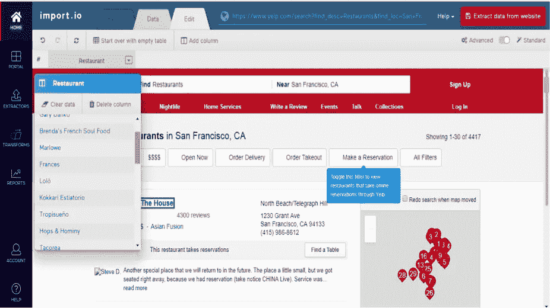**

**Import.io 确实是 DIY 工具类别中的杀手，它为任何有 web 数据需求的人提供了一个非常用户友好、直观和交互式的界面来提取信息。基于云的抓取平台可以结构化图像、登录屏幕和数百个网页背后的数据，完全不需要编码。监控网站变化以及与许多报告工具和应用程序集成的能力，使其成为具有紧迫收集需求的企业的绝佳选择。**

****优点:****

1.  **一个简单的轻量级 UI，非常适合非编码人员构建他们的潜在客户列表或跟踪价格变化。**
2.  **这是一个可行的选择，可以同时以合理的速度高效地从不同的网站上抓取信息。**

****缺点:****

**如果这听起来像你的 Aha 产品，那么只有一件事会阻止你尝试它——价格！虽然他们早些时候采用了免费增值模式，但现在已经不再可用了(基本计划每月 299 美元起)，抓取更多的页面就等于从你的口袋里刮出更多的钱。**

**[**Dexi.io**](https://dexi.io/)**

**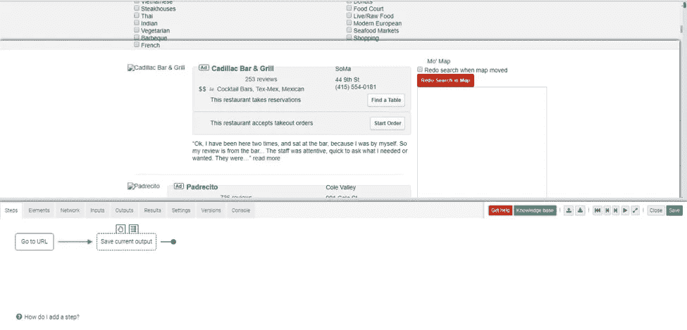**

**Dexi.io 早期名为 CloudScrape，是另一个视觉上令人惊叹的提取自动化工具，定位于商业目的，作为一个无障碍的浏览器应用程序提供。席德规定要创造机器人，这些机器人可以作为提取器或爬虫工作，或者以席德管道的形式在提取后执行 ETL 数据清理任务。强大的抓取工具在网页上的数据选择后给出智能提取功能的建议，该功能解决了分页问题，在循环中执行提取，并对网页进行截图。**

****优点:****

1.  **没有你必须遵循的艰难的设置程序。注册后，浏览器应用程序就会打开，让你创建你的机器人。他们令人敬畏的支持团队将在你遇到障碍时帮助你创建机器人。**
2.  **对于一个商业工具来说，每月 119 美元的标准计划(对于小项目)是非常合理的，而专业计划将适合更大的业务需求。**

****缺点:****

1.  **Dexi.io 中附加组件的概念虽然一开始很有吸引力，但随着附加组件的增加以及商店中任何附加组件的成本增加，维护起来变得很困难。**
2.  **关于产品文档有轻微的杂音和咕哝声，我相信席德的人可以很容易地解决。**

**[**八分音符**](https://www.octoparse.com/)**

**蓝色 Octo 承诺数据唾手可得，无需任何编程，他们真的做到了。在推出的短短两年内，Octoparse 已经经历了 7 次修改，根据用户的反馈调整了他们的抓取工作流程。它有一个直观的点击式界面，支持无限滚动，登录认证，多格式数据导出，并在其免费计划中支持无限的每次抓取页面(是的，你没听错！).**

**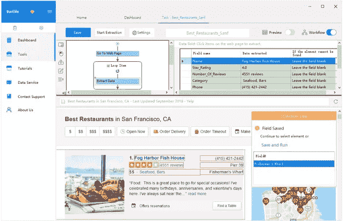**

****优点:****

1.  **预定抓取功能和每次抓取无限网页的规定使其成为价格监控场景的理想选择。**
2.  **如果您正在寻找一个有效的一次性、现成的解决方案，并且有良好的用户指南文档，那么他们的免费计划中提供的功能已经足够了。此外，可以使用内置的 XPath 和 Regex 工具实现数据的精确提取。**

****缺点:****

1.  **Octoparse 还没有添加 pdf 数据提取和图像提取功能(只提取图像 URL ),所以称它为完整的 web 数据提取工具是一个很高的要求。**
2.  **客户对产品的支持并不多，也不能指望及时的响应。**

**[parse hub](https://www.parsehub.com/)**

**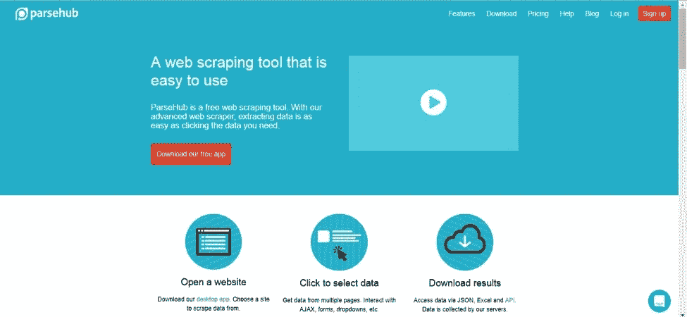**

**一个桌面应用程序，它提供了一个图形界面，可以从 Javascript 和 AJAX 页面中选择和提取数据，并且受 Windows、Mac OS X 和 Linux 支持。它还可以浏览嵌套的评论、地图、图像、日历和弹出窗口。他们也有一个基于浏览器的扩展来立即启动你的 scrape，那里的教程很有帮助。**

****优点:****

1.  **与其他抓取器不同，ParseHub 有一个丰富的用户界面，可以从网站的许多棘手区域提取数据。**
2.  **开发人员在对一次性抓取满意后，可以使用 ParseHub 的 RestfulAPI 进行良好的数据访问。**

****缺点:****

1.  **ParseHub 声称的免费计划看起来很痛苦，因为它将抓取的页面数量限制在 200 个，总共只有 5 个项目。此外，他们的付费版本起价高达每月 149 美元，这听起来太离谱了，尤其是对于一次性的困境。**
2.  **进行刮擦的速度需要大大提高，这也降低了进行大体积刮擦的速度。**

**[**智胜**](https://www.outwit.com/)**

**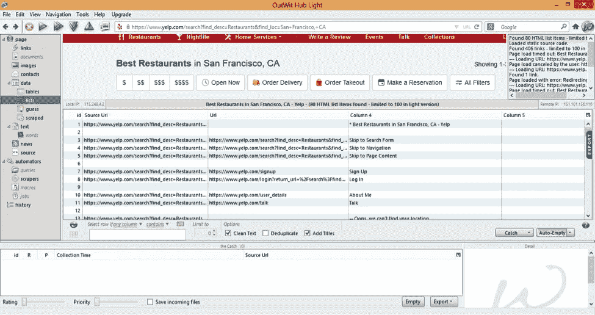**

**Outwit technologies 提供了一个简单、不花哨的 GUI，最初是作为 Firefox 的插件提供的(传统版本仍然可用，但没有功能更新)，现在是一个免费下载的软件，可以升级到轻量级和专业版。没有编程技能，Outwit Hub 可以提取和导出链接，电子邮件地址，RSS 新闻和数据表到 CSV，HTML，Excel 或 SQL 数据库。他们的其他产品，如 Outwit Images 和 documents，可以将网站上的图片和文档下载到你的本地硬盘上。**

****优点:****

1.  **对于寻找联系人的人来说，这是一个灵活而强大的选择，基本的一次性独立应用程序购买价格为 69 美元起。**
2.  **“快速抓取”功能是一个很好的补充，可以快速从你提供的 URL 列表中抓取数据。**

****缺点:****

1.  **Outwit 对于重复的、高容量的刮擦的适应性是有问题的，他们的文档和教程肯定需要提升。**
2.  **该产品缺乏点击式界面，因此首次用户可能需要在冒险之前浏览随机的 Youtube 教程。**

**[**财务经理**](http://www.fminer.com/)**

**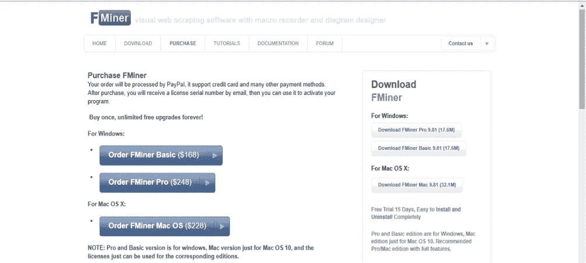**

**一个可视化的网页抓取软件，带有一个宏设计器组件，通过在同一个屏幕上查看网站来开发一个抓取项目流程图。基于 Python 的工具可以在 Windows 和 Mac OS 机器上运行，并具有良好的正则表达式支持。FMiner 具有高级数据提取功能，如验证码求解、提取后数据提炼选项，并允许您嵌入 python 代码以在目标网站上运行任务。**

****优点:****

**FMiner 是一个多平台的软件，对于无代码和开发者社区都是可行的，它对于从复杂的站点布局中获取数据是非常强大的。**

****缺点:****

1.  **视觉界面不是很吸引人，需要努力构建一个合适的抓取工作流程(想想流程图和连接器)。您需要知道如何用 XPath 表达式定义数据元素**
2.  **经过 15 天的试用，你不得不至少购买基本软件版本，价格为 168 美元，没有日程安排、电子邮件报告或 JS 支持。顺便问一下，他们在保持产品更新方面有多积极？不太确定，因为没有关于 FMiner 最近改进的消息。**

**接下来，我们研究开发人员友好的 Web 抓取工具。**

# ****开发者友好的网页抓取工具****

**[T5 80 legs](http://80legs.com/)**

**托管在云上和常见的刮擦问题，如速率限制和轮流在多个 IP 地址照顾了(所有在免费版本！)，80Legs 是一个网络爬行奇观！上传你的网址列表，设置抓取限制，从多功能的 80Legs 应用程序中选择一个预建的应用程序，你就可以开始了。80Legs 应用程序的一个例子是 Keyword 应用程序，它计算搜索词在所有列出的 URL 中单独出现的次数。用户可以自由构建他们自己的应用程序和代码，这些程序和代码可以被放入 80 条腿中，使得这个工具更加可定制和强大。**

**哦！他们最近发布了新版本的门户网站。[来看看](https://blog.datafiniti.co/new-80legs-portal-6215545c2221)。**

****优点:****

1.  **每月无限制的抓取，一次抓取多达 10000 个网址，这使得 80Legs 的定价计划令人大饱眼福。**
2.  **80 个分类中列出的应用程序让用户有机会分析提取的网络内容，也让这个工具成为低代码技术人员的可行选择。**

****缺点:****

1.  **虽然提供了对巨大网络爬行的支持，但是没有提供在完成这种大规模爬行时需要的基本数据处理选项。**
2.  **80Legs 平台没有提供编码人员可能感兴趣的高级抓取功能，他们的支持团队也发现速度很慢。**

**[**内容抓取器**](http://www.contentgrabber.com/)**

**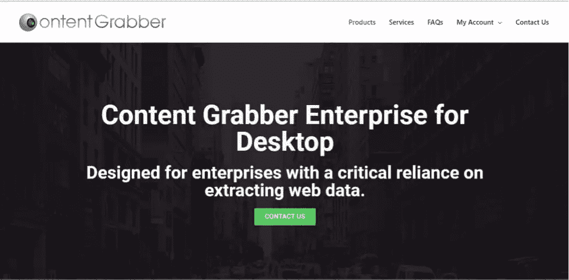**

**虽然被吹捧为一个非编码人员的可视化点击式 web 抓取工具，但这个工具的全部潜力可以被具有优秀编程技能的人挖掘，从而实现有效的 web 抓取。脚本模板是现成的，可以定制你的脚本，你可以添加自己的 C#或 Visual Basic 代码。代理资源管理器和 XPath 编辑器提供了根据需要对多个命令进行分组和编辑 XPath 的选项。**

****优点:****

1.  **开发人员可以自由调试抓取脚本，记录和处理内嵌命令支持的错误。**
2.  **寻找 web 抓取基础架构的大公司可以相信 Content Grabber，因为它的强大和高度灵活的抓取界面使该工具中的许多高级功能成为可能。**

****缺点:****

1.  **该软件仅适用于 Windows 和 Linux，建议 Mac OS 用户在虚拟环境中运行该软件。**
2.  **一次性购买该软件的价格定为 995 美元，这使得它无法用于简单和小型的刮擦项目。**

**[莫曾达 ](https://www.mozenda.com/)**

**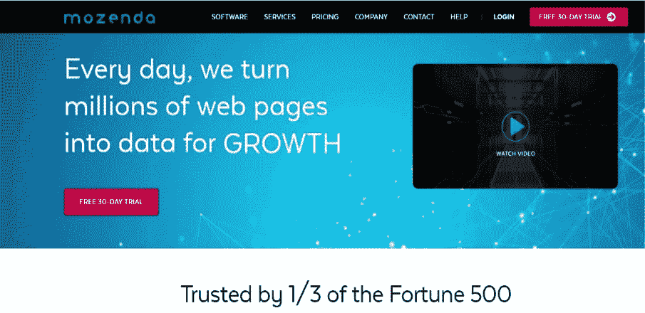**

**Mozenda 主要面向商业和企业，它允许你创建抓取代理，这些代理可以托管在 Mozenda 自己的服务器上，也可以运行在你的系统中。同意它有一个很好的用户界面来点击，但要开发抓取代理，你需要花时间在教程上，并经常得到他们的支持团队的帮助来构建代理。这就是为什么将它归类为非技术人员的 DIY 工具会产生误导。这个健壮的工具可以理解列表和复杂的网站布局，并兼容 XPath。**

****优点:****

1.  **Mozenda 的代理可以快速抓取预定的和并发的网页，并支持不同的网站布局。**
2.  **您可以提取 excel、word、PDF 文件中的数据，并使用 Mozenda 将其与来自互联网的数据相结合。**

****缺点:****

**完全是一个 Windows 应用程序，2 次同时运行和 10 个代理每月的价格高达令人难以置信的 300 美元。**

**[**内涵**](https://www.connotate.com/)**

**Connotate 是一个专门为企业的 web 数据需求而构建的数据提取平台。虽然点击是 Connotate 采用的数据采集方法，但 UI 和定价显然不适合有一次性抓取需求的人。处理模式和维护抓取代理需要训练有素的人员，如果您的公司正在寻找从成千上万的 URL 中收集信息的方法，那么 Connotate 就是一个不错的选择。**

****优点:****

**Connotate 处理大量动态网站的能力及其文档提取能力使该平台成为经常使用 web 数据的大型企业的可行选择。**

****缺点:****

**大规模抓取过程中的错误处理并不顺利，这可能会在您正在进行的抓取项目中引起一点小问题。**

**[**阿皮亚菲**](https://www.apify.com/)**

**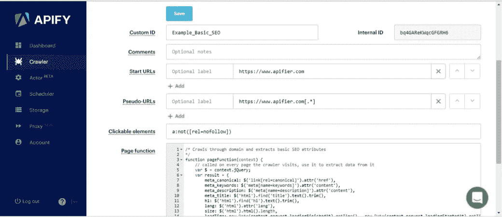**

**Apify，顾名思义，是一个网页抓取平台，面向那些想把网站变成 API 的程序员。Apify 支持类似 Cron 的作业调度和支持大型网站抓取的高级网络爬虫功能。他们可以选择由个人程序员到企业来开发和维护他们的 API。**

****优点:****

1.  **Apify 有一个活跃的论坛和社区支持，使开发人员能够重用 GitHub 上的源代码，并有一个开放的特定抓取工具库，如 SEO 审计工具、电子邮件提取器等..**
2.  **API 集成了大量的应用程序，可以处理复杂的分页和网站布局问题。**

****缺点:****

**尽管开发人员编写几行 Javascript 很容易，但处理 IP 轮换和代理将是他们的主要挑战，这在 Apify 中没有得到直接解决。**

**[diff bot](https://www.diffbot.com/)**

**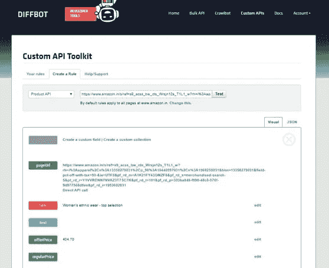**

**Diffbot 是另一个 web 抓取软件，采用 API 途径访问 web 数据，它结合了 ML 和 NLP 技术来识别和分类 web 内容。开发人员可以创建他们的自定义 API 来分析博客、评论和活动页面上的内容。Diffbot 扩展了这些 API 的库，使得选择和集成您选择的 API 变得容易。**

****优点:****

**他们基于 ML 的识别和分类网络内容类型的算法提供了数据的精确提取。**

****缺点:****

**类似人类的对文档的理解还没有被引入，Diffbot 在抓取网页方面也很昂贵。**

**[**Diggernaut**](https://www.diggernaut.com/)**

**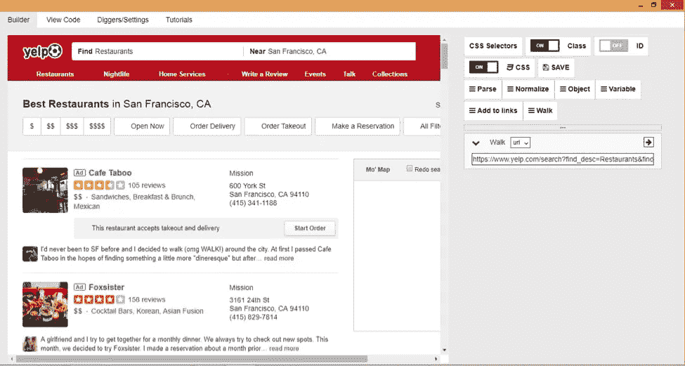**

**Diggernaut 主页上的声明是“将网站内容转化为数据集”,并附有“不需要编程技能”的标签。但作为 chrome 扩展和独立桌面应用程序提供的基于云的提取工具具有元语言功能，允许编码人员用自己的代码自动完成困难的抓取任务。配置他们的挖掘器需要理解 HTML、CSS/JQuery 和 YAML 标记语言。**

****优点:****

1.  **Diggernaut 附带了一个非常酷的 OCR 模块，可以帮助你从图像中提取数据。**
2.  **开发人员也可以选择构建 restful APIs 来轻松访问 web 数据，所有这些都以非常低廉的价格提供——他们的免费版本支持 3 个 diggers 和 5K 页面请求。**

****缺点:****

**在点击式流派中，Diggernaut 一开始有点难以理解。此外，当图像提取功能非常灵活时，看不到文档提取模块会让人很难受。**

****收尾****

**网络抓取工具有很多，它们对一次性抓取、小规模抓取爱好和日常抓取很有吸引力，这些工具有一个内部专业团队专门负责维护，尽管你总是要花费精力清理和丰富输出数据。**

**我错过了你最喜欢的网络抓取工具了吗？在评论区写下你自己的评价。**

***最初发表于*[*【www.kdnuggets.com】*](https://www.kdnuggets.com/2018/07/ultimate-list-web-scraping-tools-software.html)*。***