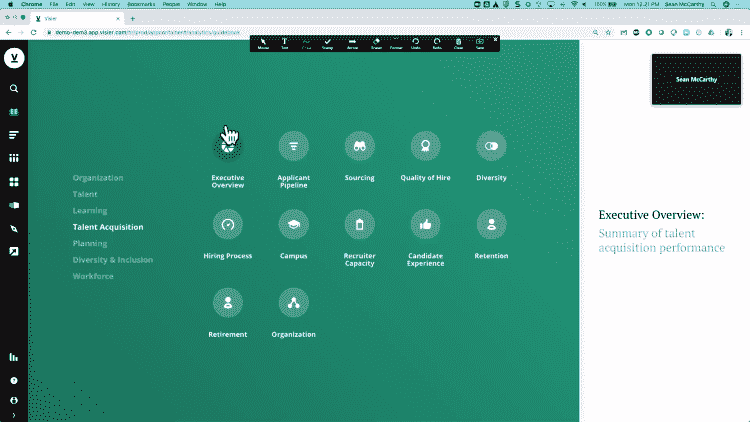
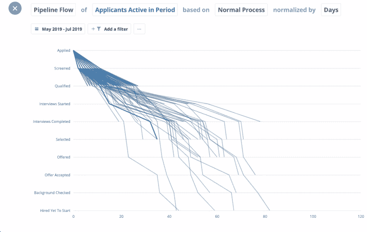
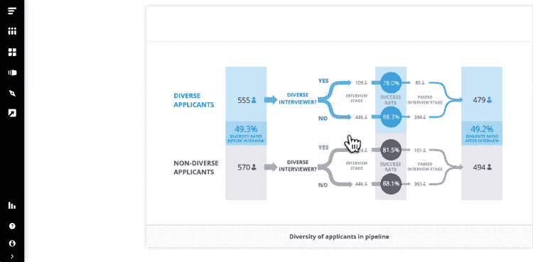
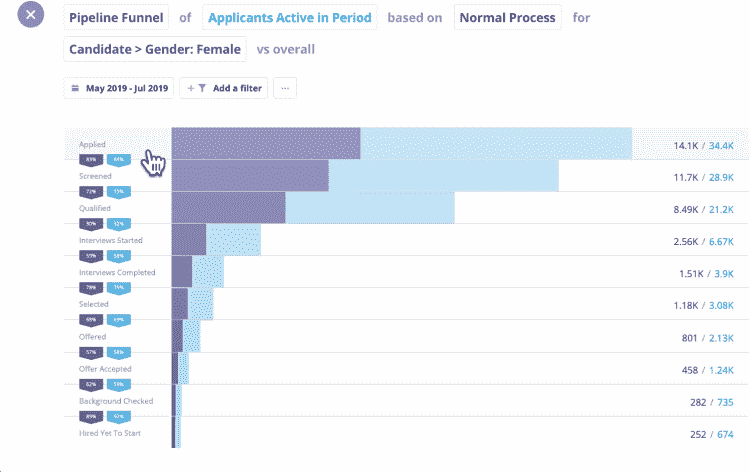
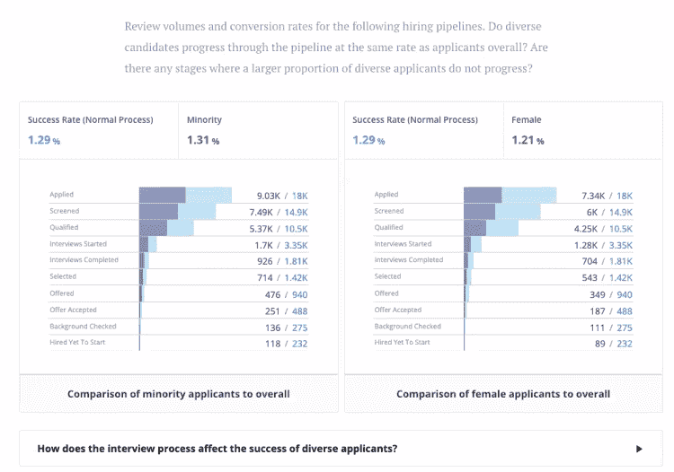
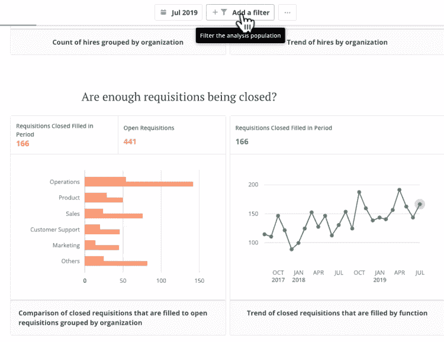
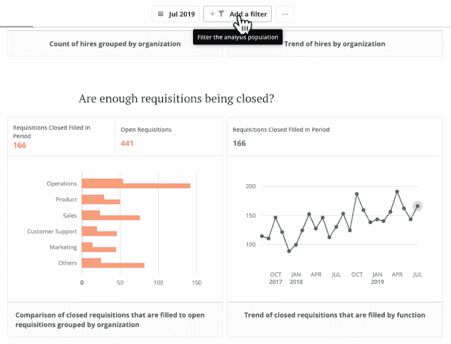
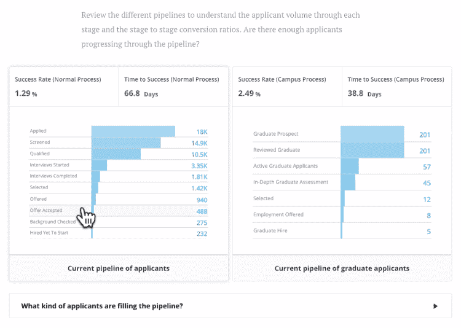
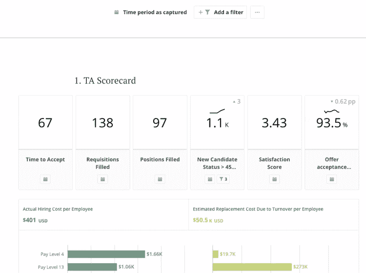
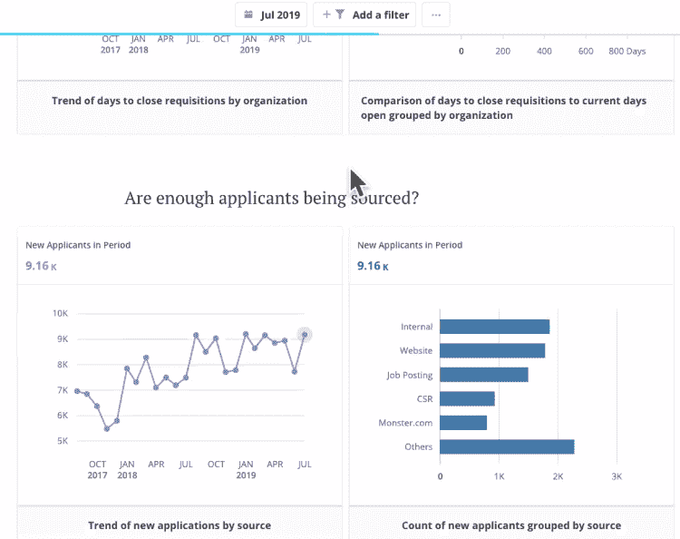

# 终极招聘指标仪表板 Visier 人才分析插件回顾

> 原文：<https://medium.datadriveninvestor.com/the-ultimate-recruiting-metrics-dashboard-a-review-of-visiers-talent-analytics-add-on-d2b12bc5067e?source=collection_archive---------9----------------------->

我在以前的帖子中已经承认了我对这个网站上的分析的痴迷，所以我写另一篇关于这个主题的文章也就不足为奇了。根据我使用 Visier 平台的经验，我在最近的一篇文章中分享了[数据分析和招聘](https://sprintrecruiting.com/2019/08/03/data-analytics-recruiting/)的融合。我有机会参加了 Visier 的 Talent add-on 演示，所以我想分享一下我对终极招聘指标仪表板的看法。

# 简单，一切触手可及

首先吸引我的是仪表盘的简洁。这是 Visier 平台设计的一个标志。

 [## 技术颠覆和就业的未来|数据驱动的投资者

### 随着技术颠覆和自动化与日俱增，关于……问题的争论也越来越激烈

www.datadriveninvestor.com](https://www.datadriveninvestor.com/2018/10/23/technological-disruption-and-the-future-of-jobs/) 

我喜欢访问者提出问题并在你点击图标后提供答案的方式。例如，平台不会试图利用平台深入了解你的营业额，而是会问这样的问题:我的最高营业额在哪里？是什么让一个人留下或辞职？

从这个简单而强大的仪表板，您可以开始挖掘人才获取的关键杠杆。所以让我给你看一些我最喜欢的功能。

# 候选人的旅程是什么样的？

去年 8 月，我花了大约一整个周末的时间追踪我们的候选人旅程。我不得不将申请人跟踪系统(ATS)中的信息下载到 excel 工作表中，删除重复数据并确保准确性，然后花费数小时构建复杂的 if/then 公式。

一旦我有了这些信息，我就必须通过图表和其他图形来寻找两个基本问题的答案:

1.  候选人的旅程有多长？
2.  在这个过程中，我们的障碍在哪里？

因此，当我在演示过程中看到这个屏幕时，我有点生气，因为有一个程序可以如此轻松地为我完成这项工作。如果我有一个这样的工具，我生命中的整个周末都可以回到我身边。

这个特殊的屏幕允许您为您的求职者旅程设置参数或停留点，具体到您的公司。根据这些信息，Visier 分析候选人流程并跟踪候选人下车的位置。你不仅可以分析每个阶段所花费的时间，还可以分析谁退出了，为什么退出。

Visier 的内置过滤功能允许您更深入地了解这些信息。可以按职务、职务类别、层代和多样性检查此信息。这对我来说很重要，因为我真的想了解我的组织对多元化的承诺程度。现在，只需点击三次，我就可以查看关键职位，并回答多元化招聘中的两个重要问题:

1.  我们是否为我们的空缺职位吸引和招聘了足够多的多元化人才？
2.  在整个过程中，我们人才库中的不同候选人是否得到了平等对待？

此外，此屏幕将让您更好地了解流程中的障碍。

你的招聘人员审查和面试候选人的时间太长了吗？您的经理是否提供了及时的反馈？候选人会因为你的招聘过程的长度而感到沮丧或脱离吗？

这些问题对任何招聘策略都至关重要。不用说，这是我最喜欢的演示功能之一。

# 激光聚焦多样性

公司吹嘘他们对多元化和包容性的承诺，然而，很少有人知道多元化的候选人是如何进入组织的。Visier 的平台让我们深入了解招聘流程中的几个不同层面。

首先是进入漏斗的不同候选人的数量。当然，有很多 ATS 平台可以告诉你有多少不同的候选人申请，但很少有人能告诉你这些候选人是否经过了不同小组的面试。

这个特别的模块对于像我这样真正想了解我们多元化人才库中候选人经历的人来说至关重要。上面的快照已经内置到平台中，所以我不必浪费时间来尝试构建一些东西。只要指出，点击和分析。

如果您的组织真的想了解他们的多元化招聘工作，Visier 的产品可以让您花更多的时间寻找和解决任何差距，而不是花更少的时间尝试将所有信息放在一起。

# 你是成功了还是只踩水？

我最近试图在谷歌的数据工作室建立一个报告，向我展示我们招聘活动的趋势线。我知道不是只有我一个人会在几周内关闭一大堆工作，却只能看到空缺职位总数移动了一两个位置。

有了这个模块，我可以从组织层面向下钻取，并分析哪些业务部门在我平静的招聘花园中制造了最大的混乱。过滤选项还允许我查看年与年之间的趋势，并将范围限制在职务组或业务线。

sprint 招聘的一个主要好处是能够根据 Sprint 的优先级和工作量每两周分配一次资源。在过去的一年里，我一直在利用 Google Data Studio 手动完成这个过程。我很想知道如何使用这个简单的界面来更好地分配资源，预测我们服务的业务线的趋势，并与我的人力资源合作伙伴密切合作，以了解为什么某些群体比其他群体更不稳定。

# 最后——一个漏斗！

这个漏斗正是我一直在寻找的。对我来说，Visier 的漏斗在一个简单的模块中包含了雇佣成本和其他关键指标。当然，有一些申请人跟踪系统吹嘘他们创造漏斗的能力，但我很少使用。我是一名销售/关系管理人员，招聘是一项销售/关系管理业务。那么，为什么我不想要一个漏斗来帮助我了解我应该寻找多少候选人来找到我的摇滚明星呢？

这张特别的快照显示了大学招聘的进展。这个演示让我可以使用他们的数据来挖掘特定的工作、候选人的细分市场，以及我能想到的任何其他品质。这种类型的界面将花费我几个小时在 ATS 中重新创建。Visier 的平台在宏观层面上预建了这份报告，但也提供了聚焦我内心渴望的任何主题的能力。

# 我们进展如何？

我很想知道团队的生产力数据在哪里。我希望能够快速看到我们作为一个团队的表现，并找出服务水平或候选流程中的任何潜在差距。

Visier 的 TA 记分卡正好给了我这个。

虽然记分卡是可编辑的，但演示模块向我展示了许多我手动跟踪的信息。唯一的区别是，我不能像 Visier 那样深入研究时间段或其他关键指标。

您将在这张快照上看到的另一个关键特征是更换成本。许多招聘人员只考虑雇佣成本，却没有考虑到一个空缺职位会造成的生产力损失。我发现招聘经理和招聘人员在职位优先顺序上有明显的脱节，因为招聘人员只关注招聘过程中的一个成本杠杆。

Visier 的 TA 记分卡帮助招聘人员和招聘经理简单、轻松地掌握他们的业务脉搏。

# 申请人和雇用分析

当然，我可以从我的 ATS 中提取招聘数据，但 Visier 的平台使其具有交互性。我可以从宏观层面查看申请人流量，也可以通过简单地将鼠标悬停在趋势线数据中的某个点上来深入了解细节。

我喜欢这张幻灯片的另一个特点是能够看到我们的申请人在哪里找到我们的工作。目前，我们使用的 ATS 不允许我们跟踪这一重要信息，因此招聘团队必须手动更新谷歌表单，指明他们在哪里找到每一名员工。该模块帮助我快速了解我的候选人来自哪里，以便我可以在这些平台上花费更多时间和投资。

我没有得到的一个截图是申请人来自哪里的趋势分析。这将有助于我们在 LinkedIn 和我们合作的一些职业论坛上 A/B 测试各种营销想法。只需一个点和一次点击，我就可以很容易地看到营销活动对候选人流量的影响。

Visier 的人才模块中有一些我喜欢的更强大的功能，但这些是我的主要快照。这个演示似乎回答了我作为招聘经理最关心的三个问题:

1.  我的天赋来自哪里，他们的旅程是什么样的？
2.  我所在组织的招聘趋势是什么，以便我可以在团队中计划和分配资源？
3.  我们多元化招聘和入职的真实情况是什么？

对于贵公司的招聘策略，您可能有不同的问题需要回答。根据我参与的演示，我敢打赌 Visier 的人才模块不仅能够快速回答这些问题，而且有一个界面，你真的会上瘾！

*原载于*【http://sprintrecruiting.com】