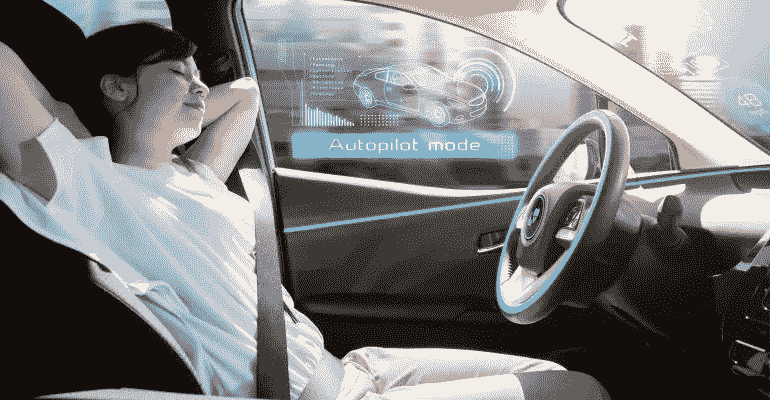

# 无人驾驶汽车不确定的未来

> 原文：<https://medium.datadriveninvestor.com/the-uncertain-future-of-self-driving-cars-a7b077c9800a?source=collection_archive---------43----------------------->

我们不断听到越来越多关于奇妙的自动驾驶汽车以及它是如何成为未来的消息。特斯拉、谷歌、通用汽车、Waymo 和 ZMP 等公司都宣布了生产全自动驾驶汽车的计划。乍一看，这些目标似乎比以往任何时候都更加接近。然而，许多人工智能专家表示怀疑。我们已经看到了多起涉及自动驾驶汽车的致命事故的报道，最引人注目的是在亚利桑那州发生的优步汽车事故。自我训练的系统需要能够适应现实世界的混乱，可能需要数年才能持续避免事故。

深度学习需要大量的数据，必须能够预测每一种可能的场景，无论这种可能性有多大。迄今记录的大多数事故都是由不可预见的情况造成的。一些人工智能专家将自动驾驶汽车的推动比作聊天机器人。这种技术还不存在。然而，一些公司高管认为，这与其说是技术问题，不如说是行人问题。他们建议行人学会预测自动驾驶汽车的行为，并遵守交通法规。

一些公司已经决定从深度学习转向替代的人工智能技术，但这些技术受到严格保护，并处于起步阶段。尽管困难重重，优步、Waymo、ZMP 和通用汽车仍在充满信心地推进完全自动驾驶汽车的开发。丰田紧跟潮流，向优步的自动驾驶项目投资了 5 亿美元。Waymo 已经开始在亚利桑那州的公共道路上测试他们的车辆。日本公司 ZMP 似乎走在了同行的前面，在繁华的东京首次推出了无人驾驶出租车，并取得了很大成功。ZMP 的目标是让这项服务在 2020 年夏季奥运会前全面投入使用。最令人惊讶的是，通用汽车将在 2019 年开始生产没有方向盘的全自动汽车。

自动驾驶技术还有很长的路要走，就目前而言，我们将不得不满足于仍然需要一些人工干预的半自动汽车。人工智能技术很有可能在未来几十年内发展和改进，但在不久的将来，公司可能会面临业内所谓的“人工智能冬天”以及随之而来的财务困难。