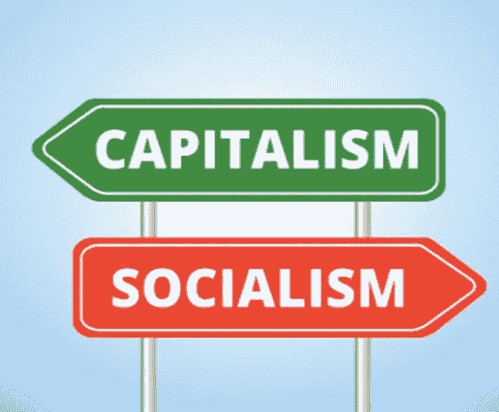
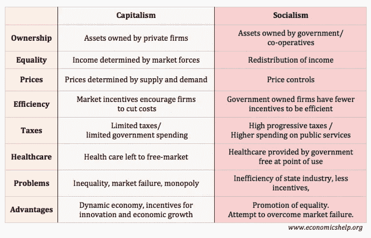
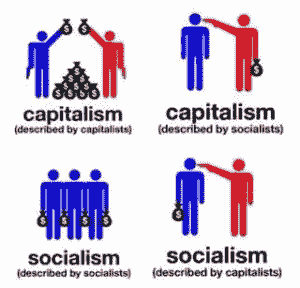

# 美国，社会主义恶魔和解决方案走进酒吧

> 原文：<https://medium.datadriveninvestor.com/the-united-states-the-socialist-boogeyman-and-a-solution-walk-into-a-bar-ca0f1a5c9a8a?source=collection_archive---------5----------------------->

最近一段时间，社会主义和资本主义之间的争论一直在美国激烈进行。资本家歌颂美国过去的成就和经济优势。他们经常把任何向有需要的人提供额外政府帮助的努力比作成为“像社会主义的委内瑞拉”的途径。其他人声称支持社会主义议程，追求共同利益，平衡不平等的规模。社会主义的倡导者正在丑化富裕的上层阶级，让他们为美国生活中的一切错误负责。

作为一名加拿大未来学家，我想我应该在讨论中加入一些定义、一些事实和一两个建议。

首先，我们真的需要解决一个词汇问题。美国人很清楚资本主义是怎么回事。我想在他们的公民课上有一大部分是关于这个的。然而，美国人对社会主义以及它在世界上大多数发达国家是如何实施的感到非常困惑。

我找到了一篇很棒的文章，解释了这两者之间的利弊和差异，题为“ [*社会主义与资本主义*](https://www.economicshelp.org/blog/glossary/capitalism-v-socialism/) ”，作者是牛津大学格林斯学院的一位经济学老师，名叫 Tejvan Pettinger。佩廷格还在《Economicshelp.org》上制作并发表了下图，总结了两种经济体系之间的差异。

当我们想到美国时，我们马上会想到资本主义。美国几乎完全是资本主义，包括它的问题。众所周知，资本主义经济体利用供给、需求和私营企业来推动动力和创新，从而带来了惊人的经济增长。资本主义鼓励思想竞争和自由市场，消费者可以选择哪家公司或哪种产品赢，哪家输。在这种类型的经济中，消费者是最大的赢家，因为所有这些竞争保持了产品的高质量、低价格，工人们忙于思考如何享受额外的现金流。

社会主义的本意是取代资本主义，资本主义最初是由德国哲学家和经济学家卡尔·马克思在 20 世纪初提出的。根据这位革命思想家的观点，社会主义的核心意识形态是，一个国家的工人将不可避免地联合起来，控制主导市场的资产阶级所有者，从而宣告资本主义的灭亡。因此，马克思认为，在一个经济体系中，人们将通过一个有组织的合作社或政府来控制商品的生产和分配。根据马克的理论，不久之后出现的最突出的社会主义国家是苏维埃社会主义共和国联盟(苏联)和共产主义中国。当时，这两个国家都有严重的阶级不平等，他们的人民希望缓解。这导致了革命和普遍采用共产主义和社会主义，为全体人民创造平等的机会。

与苏联和中国一起，人们寻求一种进步的方式来解决他们感知的集体问题。除了马克思相当不受欢迎的理论之外，没有新的模式，所以这些国家的工人和士兵通过一场剧烈的变革，确保他们可以把面包放在桌子上。我们都看到了苏联和中国后来发生的事情，不管是好是坏。

# 两种经济体系的失败

值得称赞的是，理论上，社会主义带来了巨大的好处。免费医疗、免费教育、有保证的资源再分配和阶级平等。对于那些为生存而挣扎的不幸人群来说，这听起来很神奇。但就像资本主义一样，它也有自身的问题，那就是缺乏来自工人的个人动力，以任何热情去做任何事情。随之而来的生产效率低下对整个经济造成了更糟糕的影响……人们又开始挨饿了。

我们已经看到这两种截然相反的体系都失败得很惨。由于领导层的权力斗争，这两个系统都辜负了人们的期望。腐败存在于世界上每一个资本主义和社会主义国家。

今天，美利坚合众国的收入不平等问题日益严重。根据经济政策研究所(Economic Policy Institute)的一篇论文，2015 年，美国收入最高的 1%人群的平均收入是收入最低的 99%人群的 26.3 倍。自 2013 年以来，这一数字有所增加。此外，大公司主导市场，竞争空间变小。事实上，在过去的 20 年里，[股票市场上一半的公司已经通过关闭、合并和收购而消失了。竞争的世界越来越小，这对资本主义和消费者都不利。](https://www.bloomberg.com/opinion/articles/2018-02-22/big-companies-gaining-monopoly-power-pose-risk-to-u-s-economy)

防止垄断及其不受欢迎的市场驱动因素的传统解决方案是政府介入，以防止大公司主宰任何细分市场。极端资本主义倡导者强烈反对任何政府介入来纠正自由市场。大公司通常在政治上有钱，这使得政客们更容易忽视可能威胁经济的市场动向，以保住他们的职位。

与此同时，就像 1917 年布尔什维克革命之前一样，美国各地的工人都对既定的精英政府、丑闻、腐败和金钱感到不安。与苏联革命前的俄罗斯君主制不同，美国是一个民主国家，因此美国的愤怒似乎表现为政治候选人使用社会主义一词，而不是彻底的工人革命。然而，这似乎引起了保守派和资本家的大量报复性批评和谩骂。“社会主义者”这个词让人们脑海中浮现出老对手的形象，以及像委内瑞拉这样有着明确而广泛的社会主义计划的国家最近的一些国际斗争。

事实是，双方都专注于社会主义和资本主义这两个词，而没有考虑如何解决当今美利坚合众国的经济和人道主义问题。

# 一点这个，一点那个…

在经济合作与发展组织(OECD)的 34 个成员国中，都在他们的管理和经济体系中融入了一点社会主义。经合组织国家包括欧洲大部分地区、日本、韩国、北美、澳大利亚和其他大洲的一些国家。俄罗斯、中国和委内瑞拉不是成员。所有经合组织成员都是世界舞台上强大的经济力量。成员国实施了社会主义计划，帮助公民获得一定程度的安慰和支持，让公民有更公平的机会自立自强。所有经合组织国家都有强烈的资本主义倾向，成为竞争激烈的全球经济格局的一部分，这对每个人都有利。

国与国之间的区别似乎在于政府如何实施这些社会支持计划的细节。丹麦采用的策略是征收巨额所得税来支付社会服务费用。但是根据 2014 年[盖洛普的一项调查，90%的丹麦人赞成 45%以上的所得税税率。为什么？因为他们的政府把钱花得很好。丹麦是世界上最适合居住和经营企业的地方之一。在加拿大，所得税率与美国相似，但政府严格控制医疗和教育成本，以确保民众享有免费医疗和教育。私立教育和医疗保健仍然可以作为一种选择，作为任何希望获得这种服务的人的自付费用。加拿大人花费了很大一部分税收来维持政府这些昂贵的公共系统的运转。然而，更健康、受教育程度更高的人口(53%的加拿大成年人至少拥有大学学位，而美国只有 33%)为经济节省了大量资金，通过更高的购买力和卓越的可出口专业知识支付了额外的支出。贫穷和健康不佳对一个国家来说代价高昂。](https://www.usnews.com/news/best-countries/articles/2016-01-20/why-danes-happily-pay-high-rates-of-taxes)

因此，成功地处于经济游戏顶端的国家拥有资本主义经济和坚实的社会主义计划。最近，甚至中国和俄罗斯也觉醒了，并为他们的社会主义经济增加了大量的资本主义，带来了巨大的利益。中国是一颗冉冉升起的新星，尽管政府仍然控制着这个国家最重要的产业。预计到 2030 年，中国的经济实力将超过美国，因为他们已经明白，像经合组织国家一样，行之有效的办法是吸取资本主义和社会主义的精华。

总之，社会主义在确保国家人口健康、受良好教育、有饭吃、有房住和安全方面做得更好。一旦这些基本需求得到满足，作为消费者，个人需要资本主义经济来获得巨大的价格，在那里他们可以创新，充满激情，满怀热情地追逐自己的梦想。资本主义经济最擅长的就是这个。

# 自动化拯救世界

社会制度的问题在于它们必须是公正的。因此，代表公民负责其实施和部署就成了政府的职责。然而，我们从自己的历史中知道，政府及其雇员是低效的，但这就是代价。由于人工智能能力的不断增长，机器人技术和区块链技术的良好发展，将有可能实现资源再分配的自动化和分散化，以使我们社会中的每个人都得到支持。自动化可以不带偏见地照顾我们，确保我们的基本需求得到满足，免费医疗和教育。

借助区块链技术，我们可以创建一个分散的、分布式的、公正的系统来保存我们的教育、医疗和收入记录。我们可以使用同样的系统，根据对国民生产的衡量，自动分配基本收入。这可以通过阿拉斯加州重新分配各州石油收入的方式来实现(阿拉斯加永久基金)。另一个更进步的基本收入资助策略可以包括碳税和股息，就像特鲁多政府正在讨论的加拿大那样。结合土地增值税，这将足以给家庭贫困线金额，使他们能够支付他们生存所需的费用。

我们可以在没有政府参与的情况下，利用人工智能来管理分散的区块链。政府只需要建立它，然后监督系统，以防需要调整、更新或改变。可以部署人工智能机器人，以确保这种系统的低成本。我们不需要雇员去执行经常与政府工作相关的重复性任务。自动化系统可以将国家资源从 A 点运输到 B 点，并建造专门的政府住房(想想自动化的 3D 打印房屋)。转移到国民身上的维护成本可能是最小的，这让保守派和自由派都松了一口气。我们还可以通过大规模公共教育和医疗保健的自动化来降低成本。

有了这样的社会体系，这个国家的公民就没有压力了。根据之前的基本收入试点，公民将在学校呆更长时间，他们将等待更长时间来找到合适的工作，更多的公民将开始创业。这些都是现代衡量的所有基本收入试点的伟大成果。此外，由于人口没有生存压力，犯罪率可以下降 40%以上([纳米比亚实验](https://www.centreforpublicimpact.org/case-study/basic-income-grant-big-namibia/))，医疗费用可以下降 8%以上([明康实验](https://en.wikipedia.org/wiki/Mincome#Results))。

对于渴望缓解长期经济压力、希望自己能够挑战自我但却做不到的人来说，这是一个很好的跳板。最好的一点是，基本收入意味着经济中会有更多的现金流，这对商业和就业机会也很有好处。根据基于加拿大经济的计算，一个全国性的基本收入可以支付它自己——甚至不需要增加一点税收。

# 坐下来面对事实

我们现在需要的是每个人都冷静下来的言论。社会主义和资本主义都有好的方面。那些只是文字和概念。在全球范围内，我们在这两方面都有丰富的经验。大多数拥有顶级经济实力的国家在整合两种经济体系方面都做得很好，取得了巨大的成果。我们现在有了很棒的技术，可以用来设计更好的东西。我们可以通过建设一个购买力更强的经济来满足资本家，我们可以通过消除贫困和缩小收入差距来满足社会主义的支持者。

谁在乎你称之为结果系统？我们两者都需要。资本主义的竞争，创新，兴奋和经济现金流惠及每个人。社会主义为人民提供基本需求和福利，让他们参与自由市场，而不是成为一个流失。

我们可以通过做出明智、进步、基于事实的选择，利用现代思想和技术，解决资本主义的不平等问题以及社会主义缺乏效率和热情的问题。

害怕一个带有历史意义的词是不实际的，也是没有帮助的。

我们需要有勇气用全新的眼光看待我们所学到的东西，并消除说“我们这里更好”的自我意识。

我们不需要“让美国再次伟大”。我们应该说，“让我们让美国变得伟大！”

我的问题是:哪个国家和领导人会有胆量在我们已知的基础上继续发展？爱沙尼亚是我们将追随的创新领袖吗？还是世界上最强大的国家会找到勇气搁置分歧，思考什么对自己的国家最有利？