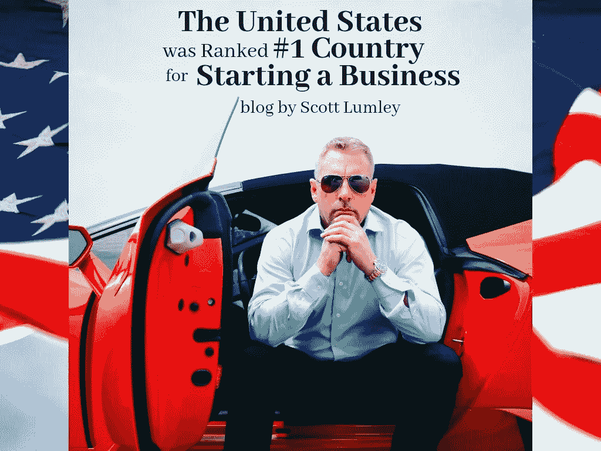

# 美国被评为创业最多的国家！

> 原文：<https://medium.datadriveninvestor.com/the-united-states-was-ranked-1-country-for-starting-a-business-bd13b6add8b6?source=collection_archive---------57----------------------->

在这件事上，你们都要容忍我。这篇文章比我通常写的要密集一点，但是有一些非常重要的见解，我想和我所有的企业家朋友分享。

如果你是美国的企业家，你很幸运。根据世界经济论坛的 [2018 年全球竞争力报告](http://www3.weforum.org/docs/GCR2018/05FullReport/TheGlobalCompetitivenessReport2018.pdf)，美国是创业的最佳地点。

在 100 分制中，85.6 分的得分证实了我国作为世界上最具竞争力的经济体的地位。

所以你可能想知道为什么我们的国家排名第一。是人民吗？政策呢？其他因素？

**商业活力**

一个很大的原因是美国的“商业活力”，在这一类别中，我们获得了高达 94.1/100 的分数。这一类别的一部分衡量了创业的成本和速度，但还有其他因素。

这在很大程度上与充满活力的创业文化本身有关。美国企业非常敏捷，能够适应变化。创办公司的企业家乐于承担风险，尝试新想法，跳出框框思考。由于商业领袖的态度和灵活性，美国公司通常更能适应主要的行业变化。

商业活力的另一部分是管理层授权的能力。看看美国的企业结构，我们可以看到这是另一个强项。

此外，美国作为一个整体在“为未来做好准备”方面排名第三，仅次于新加坡和卢森堡。我们接受风险和颠覆性商业理念的能力是其中的一部分。这也意味着我们的国家作为一个整体，包括劳动力，拥有先进的技能组合，可以导致经济转型。这是从技术娴熟到职业技能的任何东西。

**创新能力**

创新能力是大多数国家都面临的一个问题。创新意味着风险，这是一些商业领袖不愿意看到的。相反，创新是美国的强项。这里的企业家对任何新的和改进的事物都有更积极的态度。在许多美国公司，员工被鼓励在日常生活中发挥创造力，尝试和挑战自我。在某些圈子里，这是期望多于鼓励。

如果你有一个奇妙的新想法，最糟糕的事情就是它失败了。但是我们成长的态度是，如果你从自行车上摔下来，你可以站起来再试一次。我相信没有风险就没有回报。你只需要跳进去，抱最好的希望。

> 失败并不是世界末日。这是道路上的一次颠簸，给了你下次的教训。

总的来说，这是在美国被广泛接受的思维方式。在其他国家，人们对失败有不同的看法，这导致创新较少。

促成我国蓬勃发展的创新生态系统的其他因素是我们的劳动力市场、金融体系和巨大的市场规模。

**我们并不完美**

我认为我们的国家很棒，对我的各种商业冒险来说，它是一个很棒的地方。然而,《全球竞争力报告》确实让我看到了一些阻碍我们商业社会的问题。一些是:

*   我们有利的体制框架
*   相对较低的制衡
*   司法独立
*   透明度

不要让这件事使你沮丧。尽管有这些弱点，我们的国家仍然在商业上繁荣发展。

**变个人**

根据我个人的经验，我可以说我们的国家是企业家茁壮成长的完美培养皿。我们已经成长为独立思考的人，但我们仍然是一起工作、互相学习的社会人。我的[核心圈子](https://www.scottlumley.com/inner-circle/)就是一个很好的例子。

即使是白手起家的人也有机会白手起家，在生活中做更多的事情。所需要的只是一个好主意，一些商业意识和毅力。如果你没有读过我的书，《不要找我:斯科特·莱姆里的故事》，我强烈推荐。如果我能从过去的地方走到现在，任何人都可以。

如你所知，我们生活在一个崇尚企业家精神的国家。这不是一条容易的路，但也不是不可能。美国提供的商业机会在世界其他地方还不太可能。

为什么要袖手旁观，让别人做你一直梦想的事情？你在开始商务旅行的最佳国家。不要让这种特权白白浪费掉。利用你内在的企业家精神，做你的研究，承担风险。失败是可能发生的最糟糕的事情，即使失败也不是永久的。

投资你自己和你的未来。

在 insta gram[和 Twitter](https://www.instagram.com/scott_lumley/)[上关注我，了解我的生活和商业冒险的最新动态。](https://twitter.com/scott_lumley)

*最初发布于*[*www . scottlumley . TV*](http://www.scottlumley.tv/entreprenuership/the-united-states-was-ranked-1-country-for-starting-a-business/)*。*