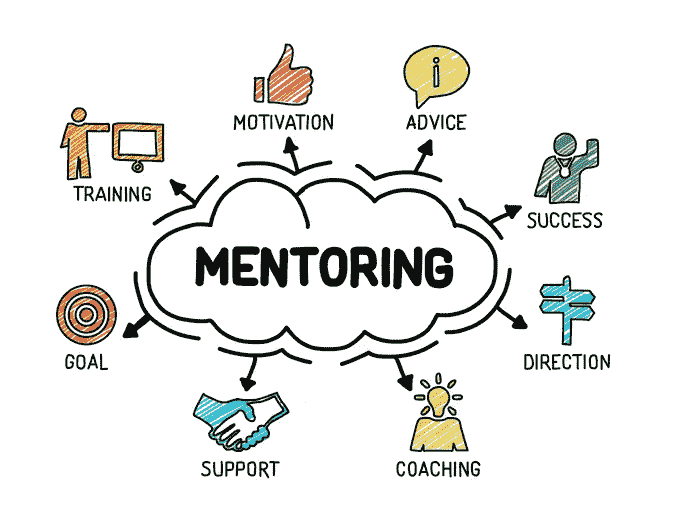

# 导师的世界

> 原文：<https://medium.datadriveninvestor.com/the-universe-of-mentorship-c3701921e27?source=collection_archive---------6----------------------->

大多数创业者在没有建立公司的正确知识的情况下，偶然进入了创业领域。一个人充满激情，渴望解决一个问题，但不知道真正需要什么，也不知道构建这个解决方案的人会得到怎样的支持。

我们中的一些人迷失在开发解决方案的世界中，忘记了建立家庭和可靠的备份系统，因为我们太天真，我们需要一个走在我们前面的人或拥有其他技能的人来指引我们成为杰出的创始人和首席执行官。

 [## 在创业之旅中，拥抱学习|数据驱动的投资者

### 好像建立一个数百万美元的公司还不够困难，企业家必须额外照顾他们的…

www.datadriveninvestor.com](https://www.datadriveninvestor.com/2018/10/16/on-the-entrepreneurial-trek-embrace-the-learning/) 

有很多人没有正式的导师，但是有他们尊敬的人。我的导师 VUSI Thembekwayo 有他所谓的镜子，那些走在游戏前面的人，给了他一个视角和光明，有些人给了第二个意见或见解。

所以这真的取决于个人，取决于他/她想要达到的目标。

但是导师要从经验、知识、见解等方面进行引导。

我们参加了培训项目，坐在一群企业家中间感到很兴奋。我们被鼓励/建议有一个良师益友是件好事。换句话说，要想走得更远，你需要一个像指南针一样守护和指引你的人。

所有 Yali(非洲青年领袖倡议)和 Tony Elumelu 代表都需要一个导师，但讽刺的是为什么？我想知道代表们是否真的知道/理解通过导师制可以实现的重要性和价值飞跃。

作为年轻人，我们是自己的主人，我们喜欢做我们喜欢做的事情。我们爱我们的空间，这就是为什么大多数戴帽子的纪律，尤其是在中学，很少有人爱他们的纪律主人/女主人。他们不太听父母的话，这给他们描绘了一幅青春成长的画面，他们相信自己无所不知。

导师是关键，不能以传统方式进行，但你是你自己。

**此外，我们需要注意不要把人们的经历当成现实。**

你的导师给你的是观点、领导、建议和支持，但最终的结论应该来自于对事实的审视。不要**将**你的决策过程交给你的导师。对自己的行为负全责。

Mentorship

根据维基百科的说法:导师是一种关系，在这种关系中，一个更有经验或更有知识的人帮助指导一个经验较少或知识较少的人。指导者可能比被指导者年长或年轻，但他或她必须有某个领域的专业知识。

这个定义谈到了一种关系。师友关系是从两个或两个以上的人相互联系的关系中诞生的，因此是人与人之间的相互联系。这种关系必须发展，不是表面的，而是根深蒂固的。

来自关系稳固的地方的指导比关系浅薄的地方结出更多的果实。

从定义中还可以看出，另一个要点是趋同点，必须有一个目的，即学员想要达到的目标，以及导师在满足该需求方面发挥的作用。不是每个人都可以在所有事情上给你建议，所以通过这种关系，你将了解你的导师，而不仅仅是 Linkedin 和研讨会，并知道他/她如何适应下一个成长阶段。

这是拥有丰富经验的人和想要学习的人之间的学习和发展伙伴关系。

导师被视为学员愿意向其学习的人，这将提供无价的见解。

为了精通文化工具，与专家交流也是必要的。导师经验和关系结构会影响“在被辅导者和导师参与的导师关系中出现的心理社会支持、职业指导、角色塑造和沟通的数量。”

**师徒过程中需要注意的事项:**

1)个人空间

2)尊重

3)时间

4)准备

5)有一个成长计划

6)愿意学习

7)通过承诺、成长、成果和主动性赢得你的导师

**部分导师:**

1)不要有格式

2)不知道该做什么

3)不知道如何联系

4)如何尽最大努力培养学员

5)永远愚蠢和拒绝成长的学员

6)如何结束一天的工作:作为一名导师，你需要知道你希望事情发展到什么程度，以及事情看起来是如何完成的。

我们需要更多的导师参与进来，让学员发挥出最佳水平。让它可持续发展意味着有专门的项目来提供一个交流的平台。

我们可以通过专门的指导和坦诚开放的对话来降低创业死亡率。

有些学员并不真诚，他们非常虚伪。给出不存在的数字只是为了创造一种印象或形象。因为我们有假学员，我们也有非常假的导师，他们夸大数字和成就来统治学员，并创造一个命令的形象。

有些导师力不从心，承担了更多的责任，几周后让学员陷入困境和沮丧。一些学员认为这个世界欠他们一些东西，他们觉得导师应该为他们而死，或者为他们牺牲一切。由于这一点，一些导师滥用他们的位置，让学员成为个人助理和支持，只要没有滥用或过度，这也可以是导师的一部分。

如果你知道你的导师会很忙，就非常具体的事情去见你的导师，有需要解决的情况，而不是面对的每一个基本问题。同样，让我们回应一下，因为一个人是导师，他/她不是生活所有领域的大师。所以应该承认缺点。

一些学员变得如此气馁，因为当他们与导师过于接近，开始看到真实的一面和坏习惯时，但如果一个人知道他/她的目标和对关系的使命，坚持目标就变得不可避免。

重要的是道路，要实现的既定目标，其他事情都可以考虑，有了这种态度，我们可以通过导师取得更多成就。

我要说的是，信任、开放和真诚对于一个富有成效的指导过程非常重要。

保罗·姆布阿

Zixtech 公司(zixtechcorporation.com)

ZixtechHUB(hub.zixtechorganization.org)

Zixtech 组织(zixtechorganization.org)

# zix tech # zix tech hub # zix tech 组织#领导#导师#导师