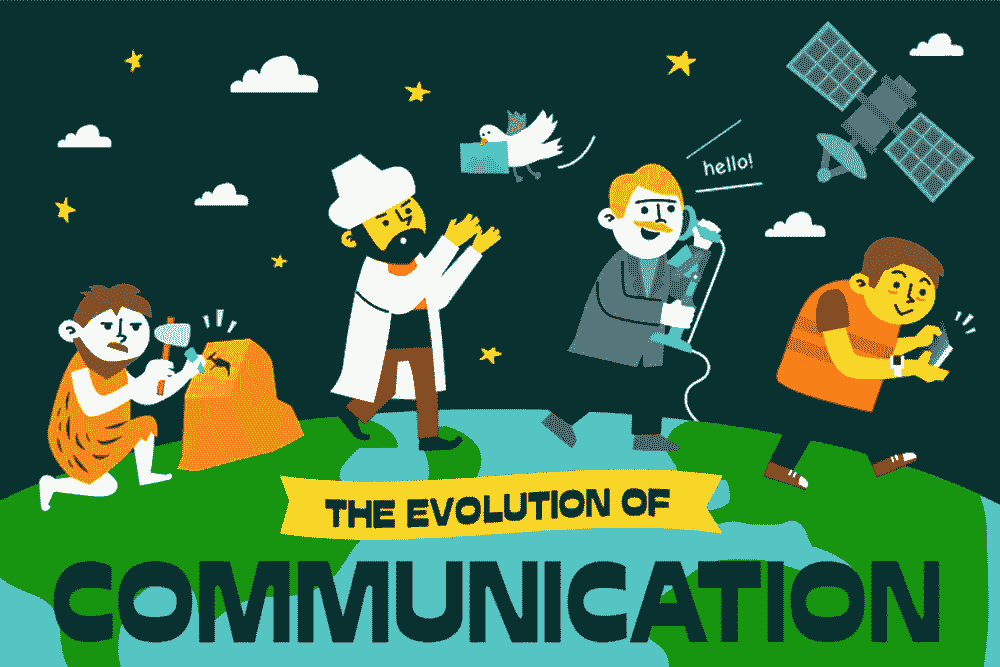
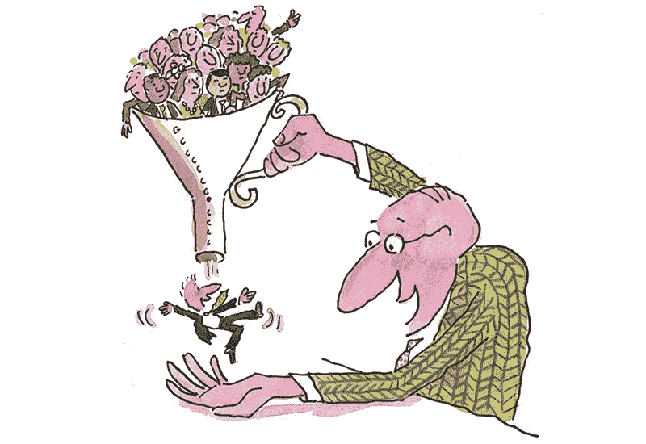
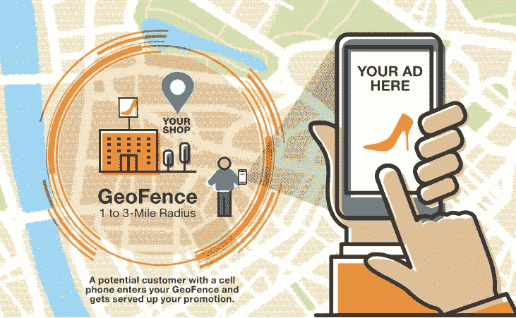

# 通过推送通知进行有效沟通的无比重要性

> 原文：<https://medium.datadriveninvestor.com/the-unrivalled-importance-of-effective-communication-via-your-push-notifications-690b90d96437?source=collection_archive---------7----------------------->

[Image Credits](https://www.offgridweb.com/preparation/infographic-the-history-of-communication/)

在我们祖先的各个方面中，“交通史”是很少被谈论的话题之一。

尽管印刷机直到 1448 年才由德国金匠约翰·古腾堡发明，但如果你试着想想，早期的方法实际上是相当创新的。从徒步和骑马的人类信使，到鸽子，到手绘插图，再到城镇公告员(大声向大群人宣读公告的官方公告员)，所有这些方法都是创新的，而且非常有效。

 [## 从语音到对话的飞跃:人机交流的挑战-数据…

### 机器人无处不在，几乎无所不在。我们甚至已经开始与他们交谈，在这种情况下…

www.datadriveninvestor.com](https://www.datadriveninvestor.com/2018/08/02/making-the-leap-from-speech-to-dialogue-the-challenge-for-human-to-machine-communication/) 

现在，你一定在想，镇上的叫卖者和鸽子与营销传播有什么关系。

如果你注意到上面所有的例子，有一个共同点很突出——正确的信息。这就是为什么总是只有一个人/媒介来传递信息，因为如果信息传到多个耳朵里，信息变得复杂的可能性会增加。

与此同时，由于频繁的战争和灾难，即使及时递送也是当时通信的重要方面之一。

现在，可以毫不夸张地说，即使在今天，情况也是大同小异。

> 及时、相关和有效的信息可以让你的企业脱颖而出，让更多的人采取你想要的行动。

但是你已经知道了，不是吗！

毕竟，如今各地的企业都在使用更具情境性和相关性的手段来接触他们的用户群，采用新的尖端技术来推动他们的购买行为。而你，作为一个见多识广的创始人，总是紧跟可能影响你的业务的最新趋势。

今天有一个这样的工具，我发现它非常有用，那就是推送通知。您会惊讶地了解到它在过去几年中所取得的进步，以及它在今天与您的用户互动方面的功效。

[Image Credits](https://softensy.com/how-to-use-push-notifications/)

> 根据 Accengage 的报告，iOS 和 Android 平台的推送通知选择率达到了惊人的 67.5%。如果这还不够的话，根据营销自动化平台 Localytics 的一项[研究](http://info.localytics.com/blog/push-messaging-drives-88-more-app-launches-for-users-who-opt-in)，推送消息不仅推动了 88%以上的应用启动，还推动了 2-3 倍的留存率。

现在，公平地说，如果你仍然没有使用推送通知来吸引你的客户，你会错过很多，导致收入损失，并增加你的应用流失率。但你是一个见多识广的创始人，你知道什么对你的企业最有利；因此，你不需要所有这些关于推送通知的指导，并且从你创业的第一天就开始使用它。

但是让我们假设一下，就一秒钟，你是商业平流层的新手，还没有使用[推送消息服务](https://webengage.com/mobile-push-notifications/)来与你的用户群互动。

让我们看看你都错过了什么。

## **1。将您的用户从一个漏斗阶段推向下一个阶段**

无论你用什么工具来捕捉你的用户数据，只要他们登陆到你的平台上，同样的工具也必须给你关于你的用户在你的漏斗的不同阶段的信息。

现在，如果你不能利用这些数据来吸引你的用户，并把他们从一个漏斗阶段推向下一个阶段，那么这些数据又有什么用呢？

[Image Credits](https://blog.marketo.com/2016/11/4-ways-to-optimize-the-middle-of-the-funnel.html/4-ways-to-optimize-the-middle-of-the-funnel-2)

推送通知是最简单的方式，通过它你可以多次点击你的用户，并与他们互动，使他们在漏斗中更深入。你不会想打赌这一点，尤其是当多达 50%的应用程序用户说他们发现[推送通知非常有帮助](http://info.localytics.com/blog/the-inside-view-how-consumers-really-feel-about-push-notifications)。

除此之外，你可以个性化你的推送消息，也可以添加富媒体，你刚刚发现了一个全新的非常有效的工具来吸引你的用户。您可以不断迭代以获得更好的结果。

## **2。** **A/B 测试**

A/B 测试是一项新技术的破解者，它可以改变你的营销传播的整个动态。

想想吧。如果你能够以用户喜欢的方式，在他们最有可能做出回应的最佳时机，与他们进行交流，那该有多好。

但是你怎么知道哪种信息在你的情况下最有效呢？你认为伟大的事情可能不会让其他人产生同样的情绪。

这就是 A/B 测试发挥作用的地方。

在你的推送通知平台中，你输入多种你想传达给你的用户群的信息，平台会根据打开率自动选择最好的一个。简而言之，该平台将从您创建的每个活动中挑选出获胜者，并相应地修改活动的信息，以确保更高的转化率。

这将使你始终保持在你的通信的顶端，对于你想向你的用户群传达什么，没有两种方式。

## **3。** **地理围栏**

地理围栏是推送通知领域的最新进展之一。虽然它有许多用例，但它主要用于接近营销。

它的工作方式是让你[在真实的地理位置周围创建虚拟周边](https://webengage.com/blog/what-is-geofencing/)，并向用户(任何进入这个虚拟周边的人)发送个性化内容，通过基于他们过去行为的定制激励，帮助他们获得信息或推动他们的购买行为。

[Image Credits](https://www.spotdigitalmarketing.com/geofencing/)

> 全食超市(Whole Foods)与基于位置的营销公司 Thinknear 合作完成了地理围栏的一个最伟大的例子，他们的转化率增加了两倍多。这里是它的[案例研究](https://www.thinknear.com/case-study-whole-foods)。

使用地理围栏技术可以帮助您建立基于位置的活动。

除了这 3 点，还有许多其他的[优势](https://webengage.com/mobile-push-notifications/)，例如免打扰时间、动态消息模板、不同类型的活动等，如果您还没有使用推送通知来吸引客户，那么您可能会错过这些优势。

我只是说如果你还没做的话。但是正如我已经提到的，你看起来是一个见多识广的创始人，知道今天推送通知的有效性和更大的使用案例。

因此，在我结束我的帖子之前，我想谈一谈我所提倡的一个平台，当谈到推送通知服务时。

在我的职业生涯中，我曾在许多营销自动化平台上工作过，但我最喜欢的一个是 [WebEngage](https://webengage.com/) 。对此我有三个小小的理由。

*   更容易设置活动
*   粒度化数据
*   成本效率

他们的最新产品真的提升了他们的游戏——一个带地理围栏的 **AI + ML 驱动的移动推送通知& A/B 测试**平台。

在我在当前公司游说之后，我的首席执行官同意订阅新工具(经过大量纠缠)，他不仅对该平台帮助捕捉的所有数据点印象深刻，而且对该工具为我们提供的与用户互动的各种选项印象深刻。

我有没有告诉你，自从我们开始在 WebEngage 上对我们的信息进行 A/B 测试以来，我们已经看到我们的应用打开率增加了两倍，应用流失率显著降低了？