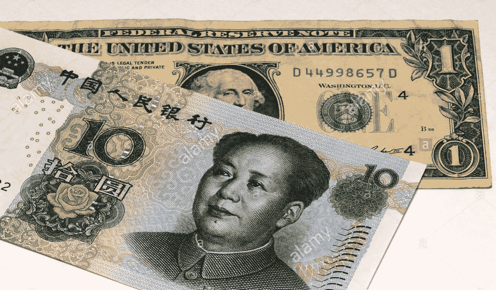
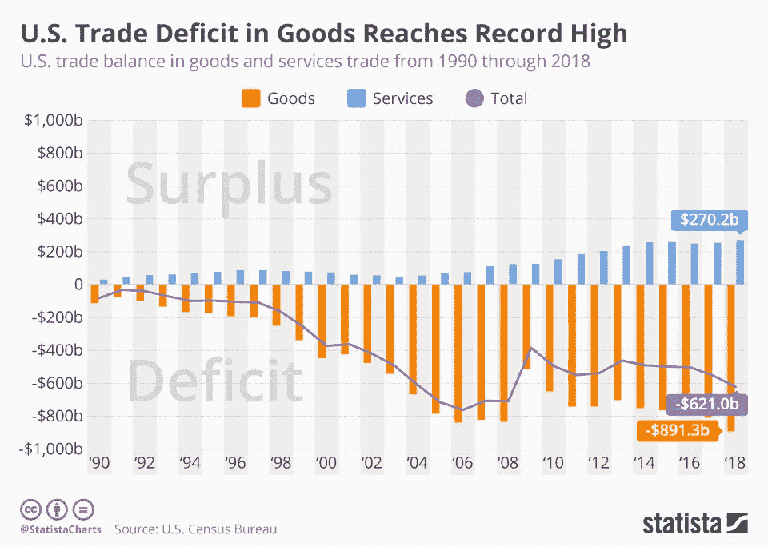
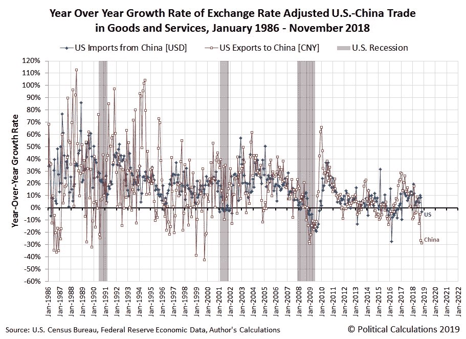
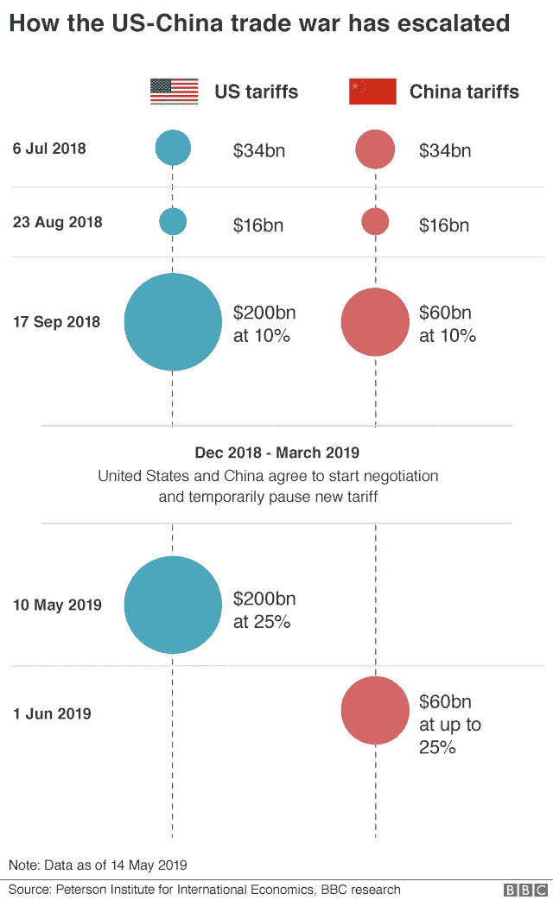
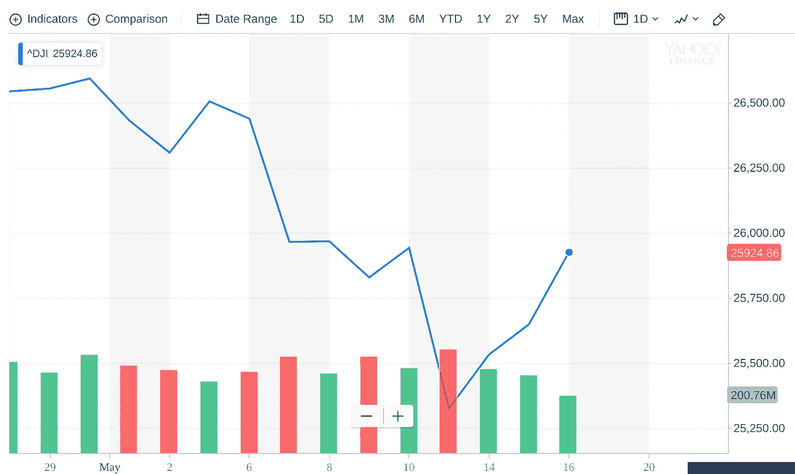

# 美中贸易战正在惊吓股市

> 原文：<https://medium.datadriveninvestor.com/the-us-china-trade-war-is-spooking-the-stock-markets-58aacba2434d?source=collection_archive---------6----------------------->

Nobody Knows Where This Trade War is Headed

*作者是人工智能驱动的基金管理公司*[*RAIN Technologies*](http://www.rainfund.ai)*的联合创始人。*

2016 年，唐纳德·特朗普(Donald J. Trump)震惊世界，成为美利坚合众国第 45 任总统。作为其竞选承诺的一部分，他承诺减少美国联邦贸易赤字，当时赤字高达 6210 亿美元。美国的贸易赤字多年来一直在膨胀，下图就是明证。

虽然经济学家在巨额贸易逆差对经济的负面影响有多大的问题上意见不一，但大多数人都完全同意让它不受控制地增长不是一个好主意。这是因为，在最基本的层面上，减少一个国家的贸易逆差是很有意义的，如下式所示:

> **GDP** = C + I + G + (X — M)或
> **GDP** =私人消费+总投资+政府投资+政府支出+(出口—进口)

最后一项(X-M)是一个国家的贸易赤字或净出口。较高的国内生产总值直接反映了一个正在增长的、健康的经济，它正在创造更多的就业机会。

> 如公式所示，贸易顺差有助于 GDP 增长，贸易逆差导致 GDP 下降。

特朗普到底有多渴望兑现这一承诺？非常渴望。他概述了他上任 100 天内将贯彻的 12 项高层次建议，其中 5 项与贸易和中国有关。

特朗普的经济政策强调“消除美国的长期贸易逆差”将是竞选的主要因素之一。特朗普到底会如何贯彻这一计划？

通过对中国征收高额关税和发动贸易战。

# 美国和中国之间的贸易史

美国最大的贸易伙伴是中国，美国对这个亚洲强国存在巨额贸易逆差(4190 亿美元)。去年，美国从中国进口了 5390 亿美元的商品，出口了 1200 亿美元的商品。如果美国只有一个贸易伙伴可以征收关税，并有义务降低贸易逆差，那么中国无疑是它的首选。

事情并不总是这样。事实上，直到 20 世纪 70 年代初，美国一直禁止与中国的贸易。此后，贸易迅速增长，美国最终成为中国的第二大进口国，并在 1986 年成为中国的第三大贸易伙伴。

下图很有意思。从 1986 年到 2019 年，红色数据点是美国对中国出口的年增长率，蓝色数据点是美国从中国对美国进口的年增长率。请注意，与低于 0%的数据点数量相比，有大量高于 0%的数据点，并且在两侧(红色和蓝色)也是如此。像这样的形象化展示非常有助于决定性地表明，这些年来，两国之间的贸易不仅强劲，而且稳步增长。

The huge number of data points above the fold (0%) shows that annual growth rate in trade volumes has clearly been a largely positive one, flowing aggressively into both directions

然而，这种情况正在改变。请注意，在 2018 年 1 月之后，蓝线和红线明显呈下降趋势。你真的认为这些新关税会减缓这一趋势吗？不会吧。

两国关系冷淡，因此美国有额外的动机征收关税和限制贸易。关系并没有达到最佳状态，很大程度上是因为美国觉得多年来许多属于美国公司的技术秘密都被中国人窃取了。美国声称，得到中国政府补贴的中国公司强迫竞争对手交出商业秘密和知识产权，并经常迫使其美国竞争对手停止运营。2001 年，中国获准加入世界贸易组织(WTO)后不久，这种裂痕就开始显现。当时，人们平静地希望中国会全面开放经济，允许人民币自由交易，不受限制。20 年后，中国利用其世贸组织成员身份成为出口驱动型经济强国，同时将人民币汇率保持在人为的弱势水平，并限制外国企业进入其经济。最终结果是，所有类型的制造业工作都以低得令人难以置信的价格外包给了中国，而美国的贸易逆差也不断攀升。

但现在，美国对这一事件的时机把握得恰到好处。当贸易逆差如此之大时，征收关税就容易多了。尽管美国在过去 20 年中不仅面临工作外包的问题，还面临窃取商业秘密和知识产权的问题，但特朗普政府正在利用这一时机通过特朗普关税获利。

从长远来看，美国当前贸易战的最佳副产品是减少贸易逆差，从关税中产生健康的收入流，增加国内生产总值，并创造新的就业机会。

所有这些听起来都很棒。只有一个问题——贸易战不起作用。

# 为什么贸易战不起作用

通常，生活呈现给我们的是零和的情况。当你赢了，有人就输了。针锋相对。偶尔，我们会遇到双赢的局面。例如，灵活的工作时间有益于雇员和雇主。

我们有多经常寻求双输的局面？从来没有怎么样？

遗憾的是，这是不正确的，因为这个世界有时是不理性的。然而，贸易战对所有主要相关方来说都是两败俱伤的局面。当考虑贸易战时，首先要记住的是:两国首先进行贸易是有原因的。A 国同意与 B 国达成交易，因为 B 国提供了 A 国所没有的东西，反之亦然。通过进行贸易，两国通常都会受益。事实上，你可以通过说两国的 GDP 都将增长来量化这一点。

当双方都征收关税时，就会出现相反的情况，导致贸易战。贸易战导致双方的国内生产总值下降。

几乎从所有角度来看，自由国际贸易都是一种双赢局面。首先，消费者有了更多的选择，这反过来助长了过度竞争。其次，成本最低的商品(在期望的质量下)总是胜出，这鼓励了新的价格发现。国际贸易允许消费者享受更多种类的消费品，而不必在国内生产同样的商品。

在现实世界中，关税是一个非常真实的事情，鉴于目前美国和中国的事态，很难看到结束的迹象。

# **垫圈案例研究**

2018 年 1 月，川普[对太阳能电池板和洗衣机](https://www.nytimes.com/2019/04/21/business/trump-tariffs-washing-machines.html)征收 30%至 50%的关税。不出所料，美国 80%的洗衣机从中国进口。支持贸易战的人认为，在这种情况下，非中国公司将介入并以略高的价格提供相同的产品，最终目标是美国公司将有动力以有竞争力的价格生产相同的产品。然而，在 Becker Friedman Institute 进行的一项有趣的案例研究[中，对洗衣机征收的关税导致所有洗衣机和烘干机的价格至少上涨了 12%。不仅如此，美国消费者承担了洗衣机关税成本的 125%至 225%。](https://bfi.uchicago.edu/working-paper/the-production-relocation-and-price-effects-of-us-trade-policy-the-case-of-washing-machines/)

That Sounds Like a Lose-Lose Situation To Us

# 底线是:市场受到了惊吓

我们喜欢在 MarketWatch 上阅读这篇观点文章。作者大胆提出，上周一股市对特朗普关税的反应“被夸大了”。那一天，特朗普总统将大约 2000 亿美元的中国进口商品的关税从 10%提高到 25%，道琼斯指数当天下跌了 700 多点，市值蒸发了 7000 亿美元。作者认为关税只是税收的另一种形式，政府从关税中获益更多。

The Dow Hasn’t Exactly Performed the Best Since The Latest Trump Tariffs Went Into Effect

但事实是，关税伤害了美国进口商——他们是支付关税的人，而不是出口商——以及最终不得不承担成本的最终消费者。[根据 EconoFact](https://econofact.org/the-costs-of-tariffs-in-the-u-s-china-trade-war) 的这篇论文，根据最近的经济研究，人们可以估计，对美国从中国进口的所有产品征收关税可能会使美国家庭每年损失 300 至 800 美元。这正是为什么 CBOE 波动率指数也升至 1 月 23 日以来的最高收盘点位，并注意到期权交易活动激增，这一切都是因为交易者对未来可能的关税及其影响感到担忧。该指数是一个广泛关注的基于期权的股市近期波动率晴雨表。因为贸易战最终会伤害所有的企业和消费者，所以问题不在于股票市场是否会因为关税而遭受损失，而是会遭受多大的损失。