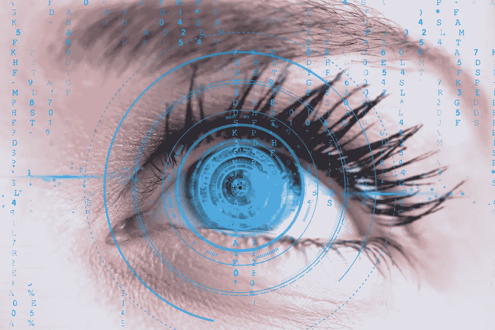
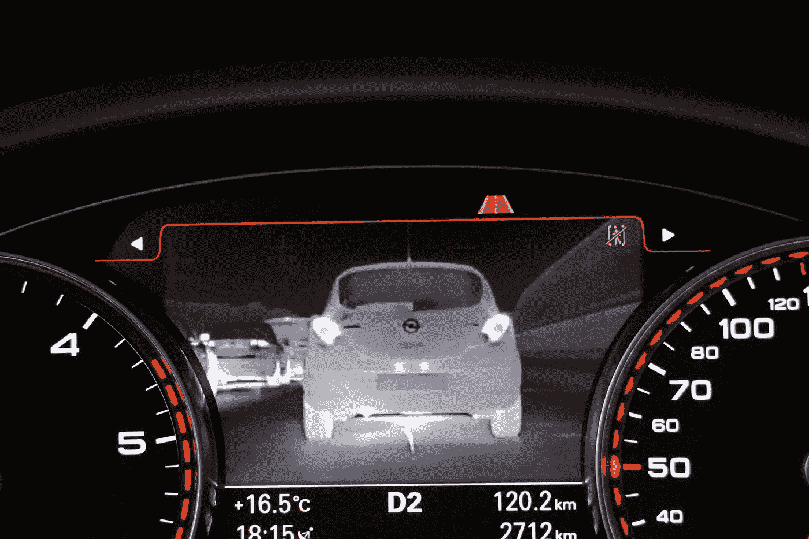

# 计算机视觉应用在不同行业中的使用

> 原文：<https://medium.datadriveninvestor.com/the-use-of-computer-vision-applications-in-different-industries-33208eca8aaa?source=collection_archive---------25----------------------->

这里有大量的计算机视觉例子，证明计算机现在可以识别和标记图像。一些最有趣的计算机视觉用例出现在以下行业:

*   零售和安全
*   汽车的
*   卫生保健
*   农业
*   银行业务
*   产业的

在本文中，我们将讨论计算机视觉的一些有趣用途，以便让您了解当今市场上的一些实际应用，并帮助您确定人工智能是否可以满足您的业务需求。

# 零售店的计算机视觉

不久前，亚马逊推出了一家商店，购物者可以绕过队伍，立即支付他们的商品。计算机视觉面部识别摄像头用于让员工知道什么时候从货架上拿走了什么东西，它是否被归还，如果被归还，则从购物车中删除一个项目。此外，摄像头会一直跟踪店内的每个人，以确保每个购物者为他们选择的商品付款，并验证所有的账单交易都是正确的。当购物者将所有东西都添加到他们的虚拟购物篮中后，他们可以简单地离开商店，稍后亚马逊会给他们开账单。

在零售时尚的计算机视觉方面，亚马逊开发了一种虚拟镜子，它使用混合现实显示器，将照片或顾客放入虚拟场景和虚拟服装中。这项技术使用面部检测来跟踪用户的眼球运动，因为它使用这些信息来确定用户正在看什么。

# 汽车计算机视觉

世界卫生组织最近的数据显示，每年有 100 多万人死于车祸，这种速度预计不会在任何时候放缓，预计将持续到下一个十年甚至更久。车祸的一个主要因素是简单的人为错误和缺乏关注。汽车行业的计算机视觉正被用来解决这个问题。最有趣的一个案例是一家名为 Waymo 的公司。如果你一直在关注最近成为头条新闻的自动驾驶汽车中的计算机视觉，你可能听说过 Waymo。基本上，它试图通过超越自动驾驶汽车来优化交通，并为它们配备可以发现行人的摄像头，确保它可以检测到 300 码外行人的移动。此外，它通过在公共道路上行驶 700 万英里来训练计算机视觉，以便它们可以在日常交通中安全导航。

例如，假设你正在开车，你前面的一个骑自行车的人伸出他/她的手，表示他们想换到你的车道上。该软件将检测手的动作，并确定这实际上是请求换到您的车道，还是仅仅是一个随机动作，如拉伸。如果它请求变道，它会指示汽车减速让骑自行车的人通过。它使用深度网络来预测计划、绘制地图和模拟各种情况，以便训练车辆在各种情况下应该如何行动。

# 医疗保健中的计算机视觉

计算机视觉用于识别和诊断状况和疾病，并进行救生医疗干预。医疗保健领域一直存在一些争论:计算机视觉与智能医疗传感器哪个更好。真的没有必要将两者对立起来，因为计算机视觉必须与传感器一起使用才能产生更好的结果。例如，Gauss Surgical 开发了一种实时监控失血量的解决方案。传感器检测手术海绵上的血液量，然后由机器学习算法进行处理，确定失血量。这项技术目前正被用于冲浪外科手术和剖腹产。

# 计算机视觉的工业应用

工业[计算机视觉软件开发](https://skywell.software/ar-vr-development/)用于监视工业场所的状态，如工厂、偏远的油井和任何其他战略场所。Osprey Informatics 实现了一个有趣的用例，它使用计算机视觉来监控远程油井，以消除对井场的不必要访问。计算机视觉系统每隔 15 分钟提供客户现场的图像，并增加了实时视频和实时图像的选项。结果，现场访问成本减少了一半，员工进行一次访问的平均成本现在降低了 20 倍。

# 农业中的计算机视觉

信不信由你，农业行业也在利用计算机视觉技术来提高运营效率，比如种植方法、产量和利润。一个有趣的用例是一家名为 SlantRange 的公司，该公司使用带有计算机视觉摄像头的无人机扫描作物，并确定它们是否受到威胁。无人机悬停在大约 400 英尺的高度，配有 4.8 厘米/像素分辨率的摄像头。一旦它在空气中传播，相机会拍摄作物的照片，这有助于识别可能的危险情况，如虫害，缺乏水营养。它还对收获季节的作物产量进行估计。所有这些数据都汇集到一个分析系统中，该系统提供数据洞察力，并允许农民采取行动以挽救他们的作物。

# 计算机视觉在银行业中的应用

银行已经使用图像识别软件通过机器学习认证文件来防止欺诈。例如，假设客户想存入一张支票，但不想去银行。他们所要做的就是用手机或平板电脑给支票拍照，银行的计算机视觉软件就会分析它的真实性。一旦系统验证了支票，它就被存入客户的账户。

虽然一些行业在计算机视觉实施方面走在了其他行业的前面，但我们看到了更广泛的采用。然而，今天可用的一切仍然依赖于人类来监督、分析、提供见解并做出决定和采取行动。尽管某些公司正在开发允许自动驾驶汽车的技术，但报道的死亡率表明，距离商业化还有一段时间。我们在计算机科学发挥重要作用的其他行业也看到了同样的情况，但人的因素仍然是必要的。随着这项技术的不断发展，研究人员学会对它进行微调，它迟早会在几乎所有方面取代人类。

*最初发表于*[*sky well . software*](https://skywell.software/blog/the-use-of-computer-vision-applications-in-different-industries/)*。*