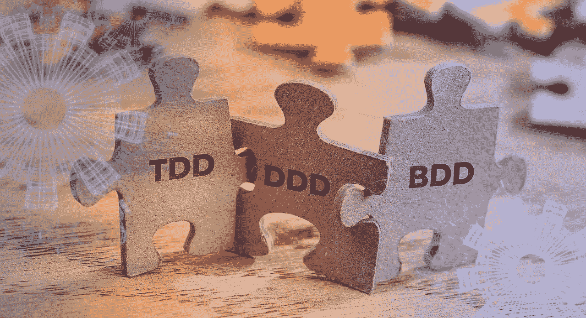
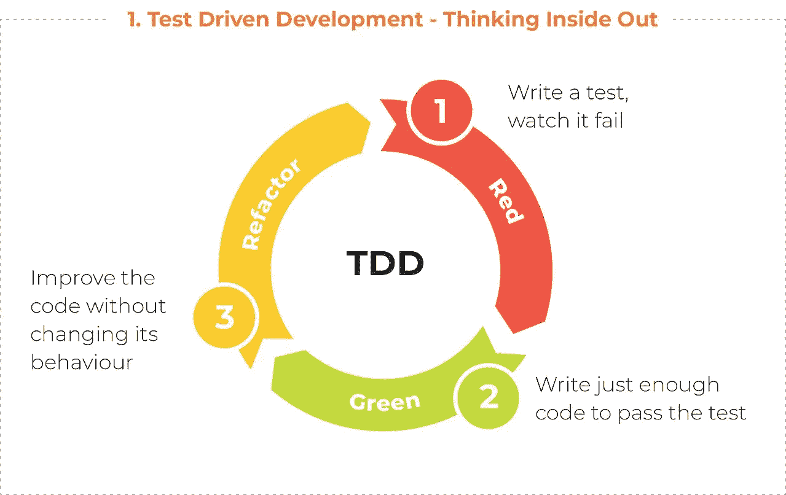
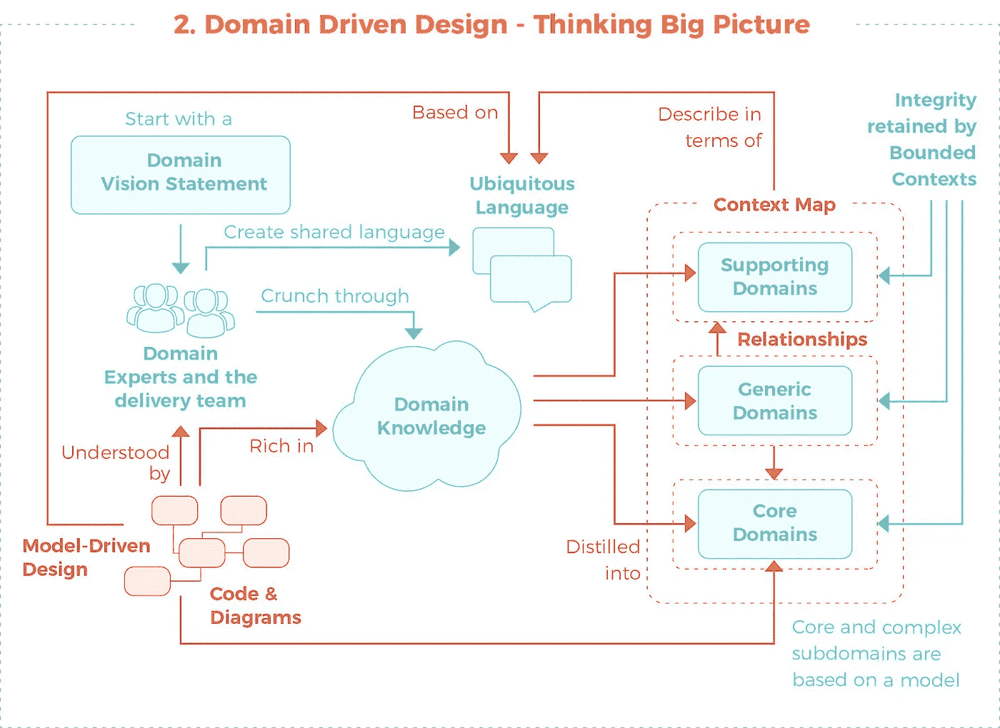
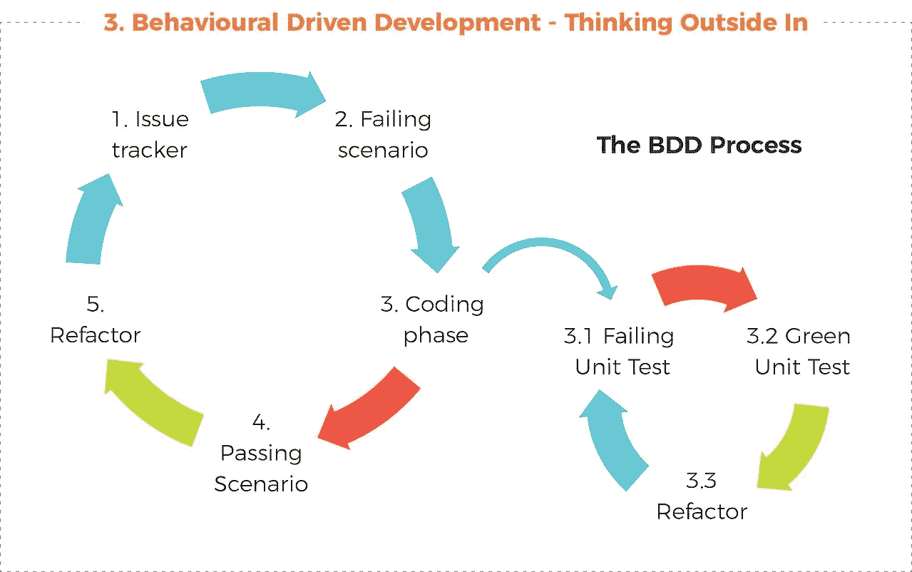
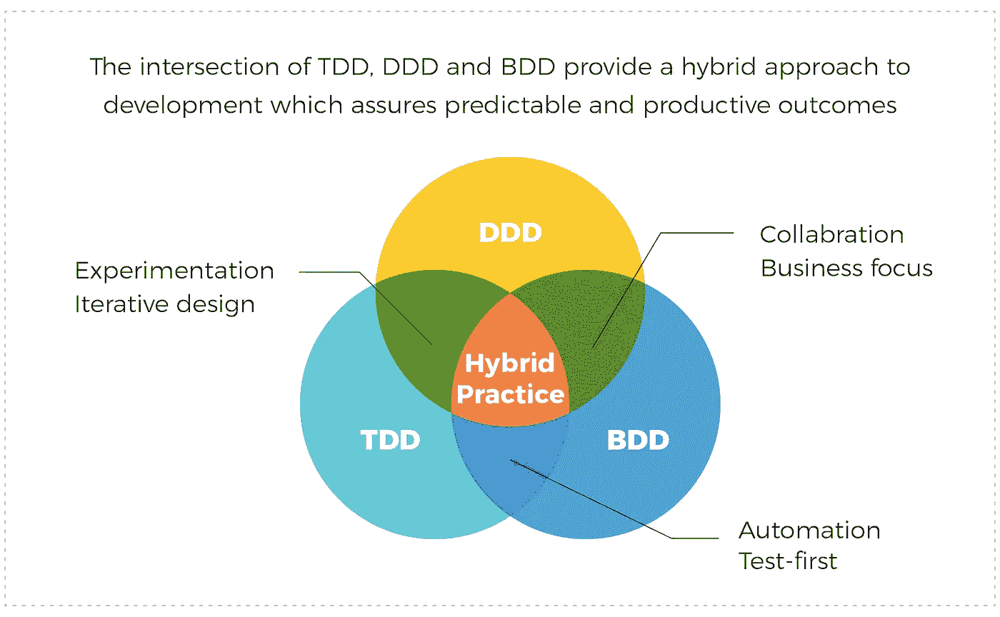

# TDD、DDD 和 BDD 交点处的值

> 原文：<https://medium.datadriveninvestor.com/the-value-at-the-intersection-of-tdd-ddd-and-bdd-da58ea1f3ac8?source=collection_archive---------0----------------------->

软件开发充斥着框架、方法和过程；其中大多数都带来了更好发展的希望。随便问一个开发人员，他们很可能会非常乐意分享他们的最爱，或者建议你应该使用哪种方法。您是否希望成功实施一个大型项目？他们可以建议一种方法。你是否试图避免设计文件和实际执行之间的差异？他们知道一个完美的框架。如果您想要确保您的项目具有最小的回归，并且随着时间的推移是可维护的，那么他们当然知道您应该遵循什么过程。但是当你的项目变得越来越复杂，并且只忠实于一种方法不能提供你的项目(和用户)应得的利益和价值时，会发生什么呢？正如我们从[混合云](https://perspectives.mobilelive.ca/blog/hybrid-cloud-strategy)中了解到的那样，解决一个复杂问题的最佳方案往往是几个方案的组合。

今天，我将和你分享如何在敏捷领域解决困难和复杂的开发，不是使用一种方法，而是三种特定方法的混合组合。

 [## 数据科学和软件工程哪个更有前途？-数据驱动型投资者

### 大约一个月前，当我坐在咖啡馆里为一个客户开发网站时，我发现了这个女人…

www.datadriveninvestor.com](https://www.datadriveninvestor.com/2019/01/23/which-is-more-promising-data-science-or-software-engineering/) 

# 三种方法

通过多种方法的混合解决方案进行更好的开发是可行的——但是你不能只利用其中的三种。他们需要互补，他们需要弥补他人的不足，他们都需要提供自己独特的价值，以确保可预测和富有成效的结果。简而言之，TDD、DDD 和 BDD 是完美的组合。

测试驱动开发，或 TDD，是一个开发软件的过程，其中在编写代码之前先编写测试。一旦完成，开发人员将努力编写足够通过测试的代码，然后开始重构。

领域驱动设计，或 DDD，是一种将实现与演进模型相联系的开发方法；将项目的焦点放在核心领域(知识领域)，它背后的逻辑，并迫使技术和非技术团体之间的协作来改进模型。

行为驱动开发(BDD)是对 TDD 和 DDD 的改进，旨在通过缩小沟通差距、更好地理解客户以及允许持续沟通来简化开发。简单地说，BDD 是一种将业务需求与代码结合起来的方式，它允许你从业务/最终用户的角度理解系统的行为。

正如我前面提到的，虽然上面提到的都是独立且有益的框架，但是对于任何一个框架来说，对更复杂的开发的需求已经证明是太多了——但不是所有三个。

# 混合实践

为了达到期望的结果而组合方法似乎是一个好主意——尤其是在理论上。然而，仅仅结合这些方法并期望最好的结果是不够的。除了在你的团队及其成员中有组织的认同和对这些概念的共同理解之外，最关键的一步是理解何时何地利用这些框架来确保最大的产出。

那么我们从哪里开始呢？

好吧，知道解决任何问题的第一步是真正理解你试图解决的问题，唯一合理的起点是从外到内。

# 由外向内思考(BDD)

在编写一行代码之前(或者甚至考虑到这一点)，您需要首先理解您试图解决的问题，问题最初是如何产生的，也许最重要的是，您预计解决方案会有什么价值。在此发现阶段，最好利用开放式问题来确定您试图缓解的具体难题、谁以及他们将如何从中受益，以及它将对组织产生什么影响。

在这一点上，如果做得正确，您应该很好地理解为什么这种开发是有益的，并对要构建什么有一个清晰的愿景。到目前为止，是 BDD 把我们带到了这一步，现在是 DDD 接手的时候了。

# 思考全局(DDD)

解决大型开发项目的最佳方式是什么？你把它分解成更小的、更容易管理的部分，或者在 DDD 的情况下——领域。当您将项目分割成更小的领域时，您可以让独立的团队端到端地处理该领域的功能。为了更好地理解这些领域，你需要领域专家的帮助；比任何人都更了解问题和知识领域的人。

通常，领域专家并不是负责开发解决方案的人，相反，DDD 通常被用来帮助弥合这些专家和试图实现的解决方案之间的知识差距。通过模型、上下文和无处不在的语言，所有参与方应该清楚地了解特定的问题是什么，以及接下来的构建将如何构造。

# 由内向外思考(TDD)

我知道你在想什么，“我们从什么时候开始写代码？”答案是现在，但在此之前，你需要写一份测试。

如前所述，TDD 是一种实践，在这种实践中，您首先编写定义函数的最初失败的测试，然后您返回并尝试编写通过测试的最少代码量；接着是重构，以确保可接受的标准。

但是为什么我们等了这么久才写代码呢？我们仍然在谈论发展，不是吗？是的，当然，我们仍然在谈论开发，但我们谈论的是质量开发，这意味着无 bug 开发。概括地说，有两种类型的错误:

1.  导致你的系统崩溃
2.  那些显示错误结果的

通过采用上面提到的混合开发方法，你会发现 TDD 帮助你减轻和避免第一种类型的 bugsBDD 和 DDD 帮助你避免后者——这也是最昂贵的修复。

# 走向

随着项目复杂性的增长，保持构建可行性并确保成功的唯一方法是让开发实践随之增长。虽然 TDD、DDD 和 BDD 各自的实践本身都是有价值的，但是它们的交叉点将提供走向未来的真正价值。

现在，如果您面临一个大型项目，要求设计文档和实现之间的差异为零，需要最小的回归，并且随着时间的推移是可维护的，您可以建议一种方法；更具体地说，是利用这三种方法的混合方法。

(首次发表于 [mobileLIVE perspectives](https://perspectives.mobilelive.ca/blog/value-of-tdd-bdd-ddd) )