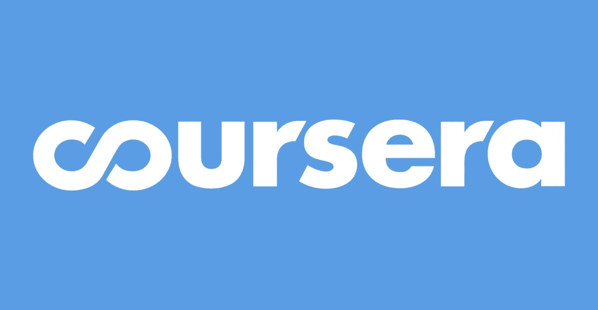

# Coursera 的价值

> 原文：<https://medium.datadriveninvestor.com/the-value-of-coursera-4ca116bc9c65?source=collection_archive---------46----------------------->

Image property of [Coursera](http://coursera.org)

Coursera 对于那些希望学习的人来说是一个有价值的资源。自从 5 月份我开始上第一门课以来，我就被 Coursera 使用的学术材料交付方式迷住了。视频讲座和一个既能寻求帮助又能提供帮助的讨论环节似乎是在线教学的完美组合。我特别喜欢提供的视频，因为我喜欢一次又一次地回去重新观看视频，以确保我对所涵盖的材料有牢固的理解。这成为教授计算机科学课程的理想方法。由于 Coursera 良好的教育环境，我对计算机科学产生了兴趣、热情。亲笔签名、测验、讨论和反馈为学生提供了学习和掌握材料所需的一切。可能没有一种正确的方法来编写代码，但是代码最终应该具有相同的功能。Coursera 课程提供了一个很好的方法，可以有效地对这些代码进行评分，而不需要老师在场。

可以收集到大量的信息，超出你通常的预期。你可以根据教授谈论某个话题的方式来判断他对这个话题的热情。当我试图学习材料时，这种热情有助于激励我。我经常对自己说，“为什么教授对此如此兴奋？这是什么让他们想要更深入地研究它？”。当我思考到底是什么让教授对这个话题感兴趣时，我通常也能找到一些激起我兴趣的东西。找到主题中让我感兴趣的东西不仅有助于我学习材料，还有助于我更深入地理解主题。既然 Coursera 的课程没有竞争力，我可以把宝贵的时间用来学习。

Coursera 课程没有竞争力，这是吸引我的部分原因。我不喜欢在一个应该致力于学习的环境中与其他学生竞争。虽然竞争不一定是坏事，但它并不提供一个适合学习的环境。在大学里，我经常不得不担心我的同学在作业上做得如何，因为这将影响我的成绩。这导致我更关注如何在考试中取得好成绩，而不是理解材料。我觉得这有损于大学的教育体验。然而，Coursera 营造了一种促进学习和与同学合作的环境。你不必担心他们做得有多好；事实上，鼓励你去帮助他们实现他们最大的潜力。虽然这种风格对 Coursera 来说是一个巨大的优势，但它不是唯一的优势。

如果你想要一个证书和价格合理的专业，Coursera 提供便宜的课程。最重要的是，他们提供慷慨的财政援助，让任何有需要的人都可以免费参加课程。这种慷慨让任何人都能获得高质量的教育，不管他们的经济地位如何。至少，对于 Coursera 有能力帮助的人来说，这是事实。他们显然无法帮助那些没有互联网或电脑的人。不管怎样，Coursera 的负担能力远远超过了任何一所大学。考虑到 Coursera 已经开始提供合作院校的学士和硕士学位，如果没钱上传统大学的学生转而选择通过 Coursera 获得学位，我不会感到惊讶。

总而言之，Coursera 为人们提供了一个很好的学习方法。鉴于其资源有限，它尽最大努力造福于社区的所有成员。它以可承受的价格提供高质量的教育。就我个人而言，对于计算机科学和数据科学这样的课程，我更喜欢它而不是传统大学。

我很想听听你的意见。你上过 Coursera 的课程吗？如果是的话，你觉得怎么样？

感谢您的阅读。

要阅读更多关于 Coursera 的经济资助，请查看下面！

 [## Coursera 财政援助

### 2018 年 6 月 12 日我在 Coursera 上申请了一个编程课程的经济资助。我曾希望我会收到它…

medium.com](https://medium.com/@masseybr/coursera-financial-aid-8d7464d6e1c4)