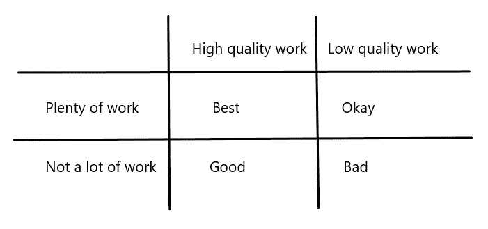

# 工作的价值

> 原文：<https://medium.datadriveninvestor.com/the-value-of-work-fa3edb3c46f5?source=collection_archive---------12----------------------->

Photo by Marco Mazzucotelli / Pixabay

让我们从一个特殊的意义上来考虑“工作”,作为维护(或者从数字的意义上来说)创建一个对象(比如一个软件)的输入。工作需要一个关键因素，时间。我们的投资理论基于这两个因素，它们对于理解为什么一些加密货币(如比特币)增值，而其他货币消失或停滞不前的原因非常重要。此外，这一概念支持了我们投资哲学的另一个租户，即一枚能够长期存活的硬币，如果时间足够长，将会在这段时间内升值。

我希望你将特定加密货币的生态系统视为一种长期关系，在这种关系中，你已经投入了大量的时间、情感和资源。考虑一下，对你来说，从一段忠诚的、长期的关系中解脱出来有多难，即使它已经走到了尽头；正如一位喜剧演员曾经说过的:“我不会离开我的女朋友，因为我们不能就谁拥有什么 DVD 达成一致！”

 [## 如何创建自己的加密货币，让您的企业为未来做好准备|数据驱动…

### 加密货币是如何工作的？如何制作加密货币？如何推出我的加密货币？所有这些问题必须…

www.datadriveninvestor.com](https://www.datadriveninvestor.com/2019/03/25/how-to-create-your-own-cryptocurrency-and-make-your-business-ready-for-the-future/) 

这适用于加密货币生态系统的关键参与者，开发人员投入了大量的时间和人才，矿工投入了设备和资金，甚至用户也投入了时间来了解硬币的具体功能，并投入资源来购买代币。从这个角度来看，很容易理解为什么投入大量工作的代币往往会产生网络效应，以及为什么比特币和以太坊等硬币往往会主宰其特定的市场。工作资本的投入创造了积极的、自我维持的反馈循环。

投入的质量相对来说比较复杂，取决于工作投入的标准和投入的频率。例如，一个新特性增加了为一大群人解决实际问题的新功能，会比复制另一个项目的现有功能更有效地增加工作资本。在这种情况下，创新提高了工作投入的质量。但是*数量*的工作也很重要，并且在技术(或推广、使用、购买等)方面是小而频繁的增量。)可以将项目维持很长一段时间。在考虑投资时，频繁、高质量的投入将是黄金标准，但这几乎不可能持续，因此在给定项目中结合这些是一个好迹象。

在经历了相当大的动荡但仍是市场领导者的比特币等案例中，大量的工作投入导致了一种被称为*承诺升级的现象。*几年前，当比特币社区因规模扩大而开始分裂时，主要参与者在比特币上投入了如此多的工作，以至于尽管其他项目具有技术和经济优势，但随着比特币的主要特征(交易成本和速度)退化，他们并没有远离比特币，而是成为了比特币的最大化者，并在比特币上加倍下注。

功在一定数量的时间单位内积累。因为价值的转移是不一致的，是由无数具有不同动机和利益的行为者产生的，所以最好是在长期、多年的时期内进行观察。获得持续工作投入的硬币会随着时间的推移而升值。工作投入不会导致生态系统的价值以 1:1 的方式增加，而是工作投入创造的大部分价值被“丢失”,因为将投入吸收到加密生态系统中是非常低效的。

正因为如此，接受大量加工的硬币在这些条件下可能不会大幅升值，相反，根据系统的效率，它们会在一定程度上升值。这是在我们的模式下盲目投资所固有的风险。理解进入资产的工作质量将决定系统的效率是相当重要的。低质量的投入将导致任何单位时间内的滞后回报，尽管一枚持续接受工作的硬币，即使是低于标准的投入，也可能至少会设法随着时间的推移保持其价值。

*Pablo 广受好评的* [*书*](https://drive.google.com/file/d/1MGIxxqxUpx2wLmu6uHZwyO7yu82zsdaR/view) *的免费副本，重点讲述加密投资的原理:*

[**现在免费阅读**](https://drive.google.com/file/d/1MGIxxqxUpx2wLmu6uHZwyO7yu82zsdaR/view) **或者** [**在亚马逊上购买**](https://www.amazon.com/dp/1790255600)