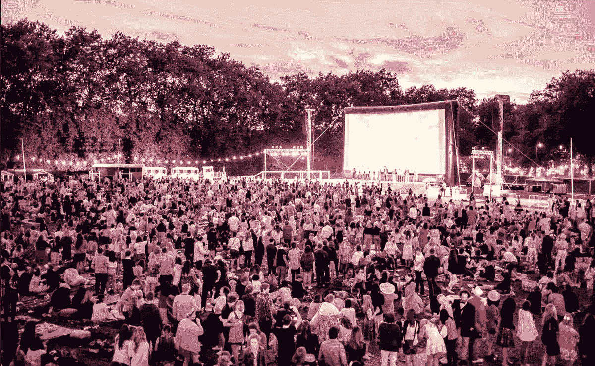

# 人工智能时代非常人性化的电视未来

> 原文：<https://medium.datadriveninvestor.com/the-very-human-future-of-tv-in-an-age-of-ai-431974fdbf38?source=collection_archive---------10----------------------->

Secret Cinema

## 媒体培养我们人性的能力和责任是什么？

几个月前，我受邀在[爱丁堡电视节](http://www.thetvfestival.com/)上发言，作为“如何赢得未来”环节的一部分，与未来学家[莫妮卡·比尔斯基](https://www.c2montreal.com/speaker/monika-bielskyte/)和区块链电视初创公司创始人[阿什利·图灵](https://www.ibc.org/tech-advances/interview-ashley-turing-livetree-adept/2575.article)一起，由爱尔兰喜剧演员兼电视节目主持人[达拉·奥布莱恩](http://www.daraobriain.com/)主持。

我谈到了商业中浪漫主义的必要性，与我参加的其他行业活动相比，这并不是一个陌生的概念。电视是一个浪漫的行业:本质上，它是关于想象其他世界和通过强有力的故事创造意义；它是关于冒险、戏剧、极端情绪和人际关系的。

## 被 FAANGs 和 AI 打乱

然而，这个行业很紧张:公共广播公司和越来越多的付费电视担心所谓的 FAANGs(脸书、亚马逊、苹果、网飞和谷歌)可能正在吃他们的午餐。在爱丁堡，就在我们的会议之前，工党领袖杰里米·科尔宾甚至提议对科技公司征收“新闻税”。

此外，人工智能(AI)已经对电视的核心——讲故事——构成了威胁。虽然人工智能在流程自动化和数据处理方面已经很出色，但它现在也在入侵人类固有的地盘:创造力和情感。我们已经看到了 [AI 作曲、](https://www.wired.com/story/music-written-by-artificial-intelligence/) [服装设计](http://www.dazeddigital.com/fashion/article/41476/1/what-the-future-holds-for-ai-in-fashion-design)、[新闻业](https://www.weforum.org/agenda/2018/01/can-you-tell-if-this-article-was-written-by-a-robot-7-challenges-for-ai-in-journalism/)，甚至[绘画](https://www.iflscience.com/technology/an-ai-painting-is-about-to-be-sold-for-the-first-time/)、[诗歌](http://www.dazeddigital.com/science-tech/article/40985/1/artificial-intelligence-ai-poetry-sonnet-shakespeare)、[电影](https://www.wired.com/story/ai-filmmaker-zone-out/)等等。虽然结果尚不令人信服，但用伊藤穰一的话来说，数据驱动的“强迫简化论”的推动力无疑也会影响电视。

> 有两种场景:我们可以用 AI 来增强人类的聪明才智和创造性表达；或者我们可以用它来结束一个反乌托邦，超级算法的内容农场，在那里我们基本上可以消费我们生产的数据。

故事讲述者一直都看到这种迫在眉睫的冲突，但他们的愿景大多倾向于反乌托邦:*世界之战，《黑客帝国》，《少数派报告》，《她》，1984 年，《龙虾》，《前玛奇纳》，《弗兰肯斯坦》，《楚门的世界》，《西部世界》，*和*黑镜，*仅举几例。正如 Monika Bielskyte 在她的演讲中指出的，当我们想象未来时，我们倾向于用反乌托邦的术语来描述它。她向我们展示了谷歌搜索“乌托邦城市”的结果，说明了她的观点:甚至这个词也产生了一系列看起来像哥谭市的图像。

悲观主义或彻底的愤世嫉俗永远不会缺乏。这就是为什么在今天这个时代，讲故事的人有权利也有责任去激励和煽动，而不是简单地压制他们的观众，让他们离开。事实上，应该给电视网带来希望的是他们能给我们带来希望和改变的动力。

这可以从为人工智能创造积极的叙事开始，将人工智能塑造成一个温暖、友好、可信甚至有趣的角色——这是小说家兼好莱坞顾问阿迪蒂·科兰纳最近在[美丽商业之家](https://houseofbeautifulbusiness.com/)会议的一个研讨会上促成的一个追求。

## 把我们和其他人联系起来

此外，电视制作者应该记住，电视充其量是一种共享的体验，可以培养亲密感和归属感，形成身份和意义，并加强公民意识和多样性。电视仍然是一种强有力的媒介，它向我们展示并把我们与“他人”联系起来，在我们支离破碎或分裂的社会中，这种能力比以往任何时候都更加重要。

难怪多样性和包容性是爱丁堡的重要话题。电视行业有强大的手段来加强它:首先，它可以制作出展示人性全方位的内容，从布莱顿的当地酒吧到内罗毕的微型企业，不同的文化、种族、世代和身份，特别是那些流动的、非二元的、矛盾的内容。第二，它可以拥有多样化的角色，并在镜头前和镜头外为这些身份创造更多的角色。在一次新的采访中，*疯狂富有的亚洲人*明星[奥卡菲娜](https://variety.com/2018/film/news/actress-awkwafina-crazy-rich-asians-1202904928/)告诉*综艺*“代表性始于镜头前和镜头后”。

此外，故事在未来将变得更加强大，因为我们将有更多无组织的时间，可能需要更多关于人类状况的教育和逃避它的方法。讲故事的人可以使用人工智能和人工情感智能来增加、庆祝和塑造他们的故事。

以下是给电视制造商的一些建议:

*   首先，**与 AI** 共同创作故事。AI 可以基于 AEI(扫描和分析人类情感)和/或人类的个人输入和跟踪记录、聚合数据和预测分析来编译绘图选项。因此，它可以帮助众包内容和叙事，并激发人类的参与。
*   第二，人工智能可以帮助**个性化 VR/AR 和其他沉浸式内容** : AEI、体积捕捉(正如获奖电影 [*【遗迹】*](https://www.vestigemovie.com/) 所使用的)、人工智能化身或跨媒体讲故事可以让我们感觉*更*并创造更强烈的情感，甚至可能[新的情感](https://www.psychologytoday.com/us/blog/the-romance-work/201807/the-new-emotions-the-new-machine-age)。
*   第三，我们人类喜欢聚集。电视的集体、社会经验能成为最终的区别和人性化因素吗？电视的[秘密影院](https://www.secretcinema.org/)是什么？“电视即体验”是什么样的？除了公众观看或游戏化，是否存在虚拟观看社区甚至类似于共同工作空间的共同观看空间等商业模式？有没有“WeView”的空间？
*   第四，**比真实更真实**。从 Twitch 到 life-streaming(例如 [Ice Poseidon](https://www.newyorker.com/magazine/2018/07/09/ice-poseidons-lucrative-stressful-life-as-a-live-streamer) )到最终的游戏化和现实生活电视，现实生活中的 AI 仍然领先。
*   第五，**拉伸和克服时间:**从时移(DVR)到 bingewatching(网飞)再到 [holotime](https://ideas.ted.com/machines-will-soon-dominate-the-work-force-heres-an-unexpected-way-to-prepare-now/) (人物和观众的过去、现在、未来交织在一起)。
*   第六，如果电视网**与观众**共同赚钱(基于他们真正的数据主权)会怎样？如果他们使用人工智能和区块链技术，让消费者能够保留他们的个人数据和媒体消费数据，并将其出售给广告商/网络，或者将其交给非营利组织，以增强社会影响讲故事，会怎么样？电视网、人才和拥有数据主权的观众之间可能会有一种基于象征的收入分成吗？电视的 [Mozilla](https://www.mozilla.org/en-US/) (“互联网为人民服务，而非盈利”)有市场吗(可以说是反 FAANG 看[脸书窃听电视消费的专利](https://www.theguardian.com/technology/2018/jun/28/facebook-patent-phone-mic-listening-tv-shows))结果长期来看更忠实的观众？

打败 AI 的唯一方法就是创造 AI 还不知道的故事。如果我们这样做了，那么电视可以提醒我们作为人类意味着什么。

只有到那时，我们看着屏幕，仍然看到…我们。