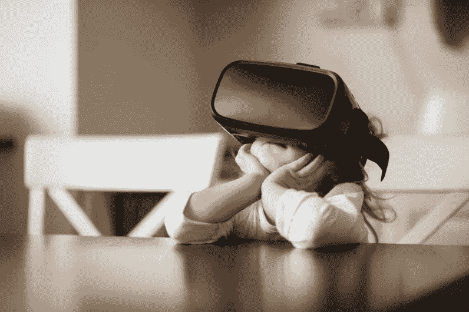

# 虚拟现实和逃避现实

> 原文：<https://medium.datadriveninvestor.com/the-virtual-experience-economy-and-escapism-11d76b7b57a2?source=collection_archive---------8----------------------->

By Martin Novak from Shutterstock

环境正在恶化。塑料污染威胁着我们的海洋生物和饮用水。民粹主义正在兴起，没有人知道英国退出欧盟和特朗普当选总统将在未来几年产生的连锁反应。然而，有一种方法可以对世界上日益增加的混乱视而不见，它以完全沉浸在虚拟世界中的形式出现。

有了虚拟现实，任何人都有机会创造自己的世界，完全可以根据自己的奇思妙想、快乐和最黑暗的想法进行定制。对于那些在生活中几乎没有控制力的人来说，虚拟现实为现实世界提供了一个有吸引力的替代品。如果你失业了，或者你的婚姻破裂了，你可能很快就会成为一个虚拟的 CEO，拥有一系列卡通虚拟伴侣供你选择。如果你对现在的政府不抱幻想，那么尽一切办法，建立自己的政府，成为它的皇帝。如果看到塑料吸管卡在海龟的鼻子里让你受不了，那就去另一个星球享受一次快速旅行吧，在那里大自然享受着远离人类的自由。

消费品公司已经开始注意到这一点。在 2016 年的 Pokémon Go 病毒式轰动之后，阿里巴巴、吉尼斯和奥迪等公司已经开始将 VR 和 AR 技术融入他们的产品。一个新的、沉浸式的世界的诱人提议是一个强大的营销工具，随着现实世界条件的恶化，它将变得越来越诱人。

从所谓的日常生活琐事中分心并不是什么新鲜事。几千年来，人们一直利用文学、音乐、杂志、电视来逃避——这可能是更好的方式。想想如果有 70 亿无聊且无刺激的人类，这个世界会是什么样子，真是令人担忧。虚拟现实提供了更强大的所有感官的实时沉浸感，让消费者真正将自己关在当前时刻之外。有史以来第一次，世界上可能会有 70 亿全神贯注和缺席的人类。

最近爆发的“正念”健康趋势直接反对逃避现实，鼓吹心理健康意味着拥抱和关注现在。尚不清楚虚拟现实对心理健康有什么影响，也不清楚这种极端的逃避是否健康。然而，也有虚拟现实得到很好利用的例子，特别是在医疗保健领域。来自 Cedars-Sinai 医疗中心的研究人员发现，使用虚拟现实的平静视频图像可以显著减少住院患者的疼痛。

不可否认，虚拟现实为消费者提供了在现实世界中无法获得的令人兴奋的能力和机会。谷歌曾经给了互联网用户一种令人兴奋的能力，让他们能够即时得到脑海中出现的任何问题的答案。虚拟现实将这一想法向前推进了一步，将允许我们创造任何世界，体验任何冒险，成为我们想成为的任何人——瞬间。然而，随着环境和政治景观的崩溃，一个问题仍然存在——谁会留下来收拾残局？