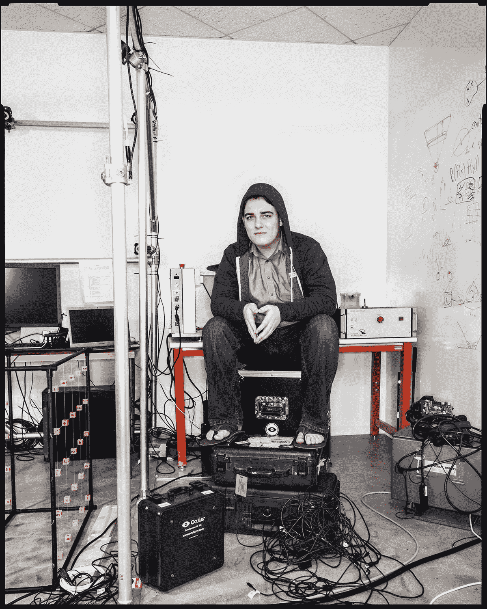
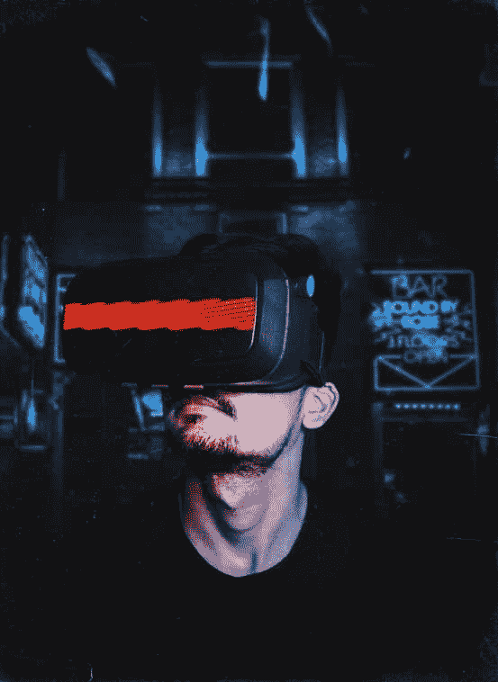
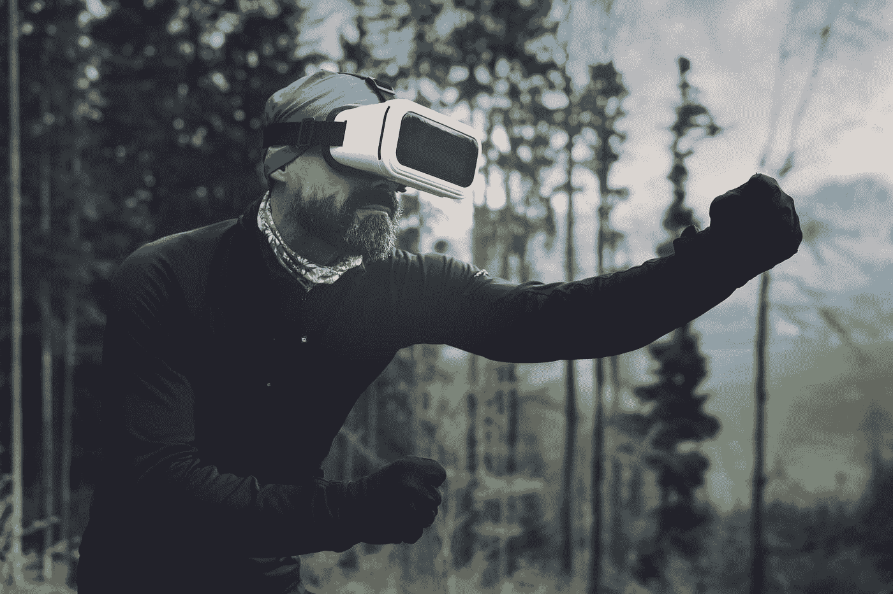
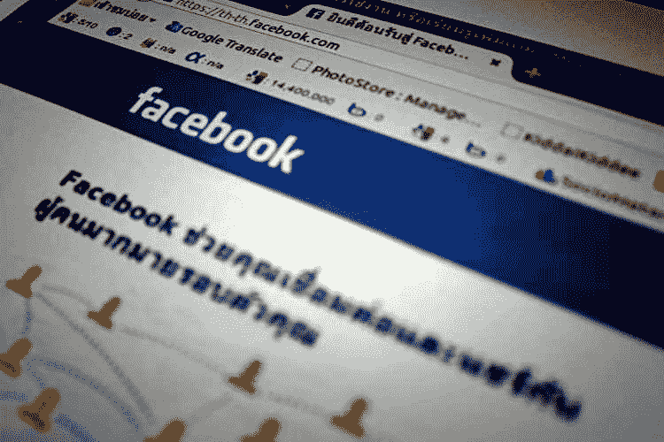

# 虚拟现实 Kayfabe:脸书的 Oculus、Magic Leap 和其他

> 原文：<https://medium.datadriveninvestor.com/the-vr-kayfabe-facebooks-oculus-magic-leap-and-others-4cd5c432cafd?source=collection_archive---------10----------------------->

2012 年，一群大学辍学生在加州尔湾成立了一家名为 Oculus 的公司:T2、帕尔默·拉基、T4、布伦丹·伊里贝、迈克尔·安东诺夫、杰克·麦考利和内特·米切尔。他们的目标是制造更好的头戴式显示器。这款显示器比 Luckey 多年来收集的 50 款头戴式显示器都要好。该公司利用众筹活动为他们产品的早期版本提供资金。这个想法是创造一个头戴式显示器(耳机),它可以跟踪人类的运动，并产生即时模拟人类运动时物体图像的图片——因此有了虚拟现实(VR)这个术语

Palmer Freeman Luckey, one of Oculus founders — Image: Wired

两年过去了，2014 年，脸书以惊人的 23 亿美元现金加股票收购了 Oculus。当时 21 岁的 Luckey 瞬间身价 7 亿美元。然后，脸书向 Oculus 投入了大量资金，以尽快将“虚拟现实”耳机产品推向市场。

在脸书的领导下，Oculus 成为了公司的甜心。Oculus 将于 2015 年从欧文搬到脸书位于 Melano Park 的总部。2016 年，脸书/Oculus 发布了一系列产品，从零售价为 599 美元(2017 年降至 399 美元)的 [Oculus rift](https://www.oculus.com/blog/oculus-rift-is-shipping/) 开始。裂缝需要额外的特殊硬件来运作。这个要求并没有让 VR 成为主流产品的道路变得容易。为了克服这个障碍，脸书随后在 2017 年推出了 [Oculus Go](https://developer.oculus.com/blog/introducing-oculus-go/) 。Go 不需要特殊的硬件，价格也更低，只有 249 美元，但这是以牺牲体验质量为代价的。似乎略有改善。乍一看，收购 Oculus 似乎是脸书和 Oculus 的一个战略胜利，因为理论上这将允许脸书人工智能团队和 Oculus 的虚拟现实工程师之间的伟大合作。然而，收购三年后，虚拟现实技术仍未能成为主流产品。最后，脸书在 2019 年宣布了 Oculus Quest，价格更高，为 399 美元，比 Oculus Go 高出 50 美元。

> 脸书收购 Oculus 乍一看似乎是脸书和 Oculus 的战略胜利，因为理论上这将允许脸书人工智能团队和 Oculus 的虚拟现实工程师之间的伟大合作。

我们看看 Oculus 的故事，分析完这个之后。对我们来说很明显，脸书/Oculus 和 VR 是一个典型的 Kayfabe 情况。类似于摔跤中 Kayfabe 的概念，每个人都理解游戏并假装一起玩。当脸书试图将虚拟现实带入主流文化时，虚拟现实世界中的每个人都在玩游戏。

 [## 人工智能和虚拟现实的融合-你能期待什么|数据驱动的投资者

### 在技术领域，融合是合乎逻辑的一步。就在几十年前，你可能需要一个专门的…

www.datadriveninvestor.com](https://www.datadriveninvestor.com/2018/08/30/the-convergence-of-ai-rv-what-you-can-expect/) 

然而，这是行不通的。原因如下:

让我们先回顾一下创新产品的基本原则。为了将产品带入主流文化，首先产品/服务必须吸引客户，其次产品/服务必须对客户有增值作用。

> 使用虚拟现实耳机，你不仅与现实世界隔离，还与你周围的人类隔离。

检查虚拟现实技术，似乎有一些来自某些客户的吸引力。主要是专注于游戏的客户，而其他对娱乐感兴趣的客户会发现 VR 很有趣。然而，这种吸引力还不足以让 VR 这样的技术成为主流。在我们的分析中，我们发现 Oculus 的 VR 技术缺乏打破 VR 头戴设备通过阻碍自然视觉而对人类感官施加的障碍的能力。VR 还努力克服人类在使用这项技术时体验到的孤立感。使用虚拟现实耳机时，你不仅与现实世界隔离，还与周围的人隔离。与人的身体联系是人类需求的基础。考虑到这一点，虚拟现实不仅要克服这个基本的设计缺陷，而且还要以某种方式加剧相反的情况。我们的意思是，虚拟现实必须增强用户与物理世界和人的联系，才能成为主流技术，为世界提供任何好处。

> 在我们的分析中，我们发现 Oculus 的 VR 技术缺乏通过完全阻挡自然视觉来打破 VR 头戴设备对人类感官施加的障碍的能力。

我们发现 VR 技术面临的第二个问题是对用户的增值。虽然 VR 乍一看似乎是一项对游戏和娱乐行业很有吸引力的技术，但不幸的是，从技术的角度来看，它对其他行业的用户没有什么价值。此外，对于游戏和娱乐行业，市场正慢慢转向低成本/免费软件产品和服务。简而言之，这一客户群希望获得免费的东西，这使得技术制造商很难为一种产品/服务建立一个合理的价格点，以成为主流。

Facebook’s VR experiment is closest to a wrestling kayfabe.

在这最后一部分，我们解决了其他球员，并提出了一些荣誉。

被谷歌收购的 Magic leap 被认为是科技独角兽。该公司被大量的秘密包围着，这在主流技术世界中是很奇怪的，如果该公司有任何东西要展示的话，就会引发危险信号。这家公司没有生产任何真正有价值的东西。

[微软](https://www.microsoft.com/en-us/hololens) holo lens 走上了一条不同的道路，专注于使用增强现实来增强用户对物理世界的体验。然而，赫萝的镜头未能成为主流，因为该产品非常昂贵，而且它专注于特定群体，如商业和工业用户。此外，它提供了平庸的技术和有限的经验。

[HTS vive](https://www.vive.com/eu/) 拥有技术和更好的体验元素，但没有足够的客户群可以形成 VR 成为主流的临界质量。

最后， [Playstation 使用 VR](https://en.wikipedia.org/wiki/PlayStation_VR) 来跟踪和取悦它的一些游戏客户，但在体验质量上有所妥协。

总结一下，脸书的虚拟现实实验最接近于 kayfabe。所有虚拟现实开发者使虚拟现实成为主流的努力都面临着巨大的障碍需要克服。在虚拟现实有机会成为主流之前，需要解决上述两个问题。

如有任何问题和意见，欢迎给我发信息或通过 https://mhassaballa.com/contact-me/[联系我](https://mhassaballa.com/contact-me/)