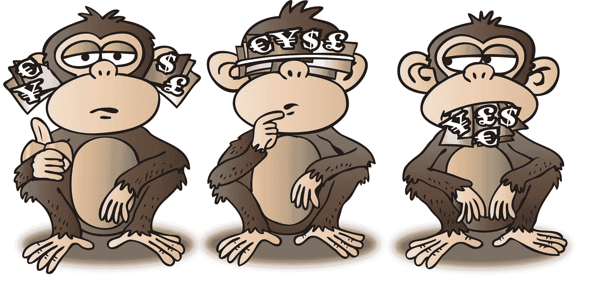
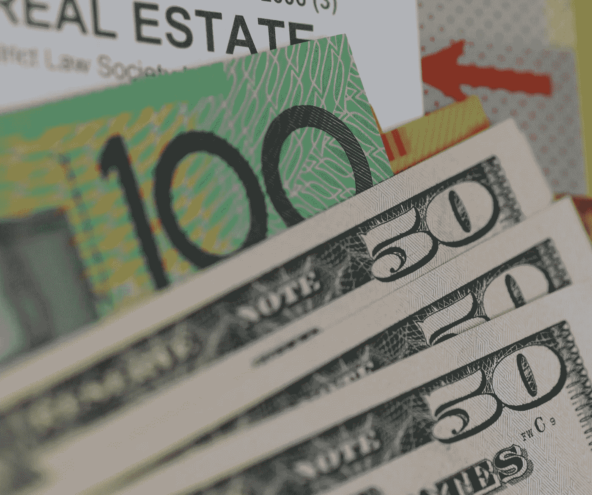
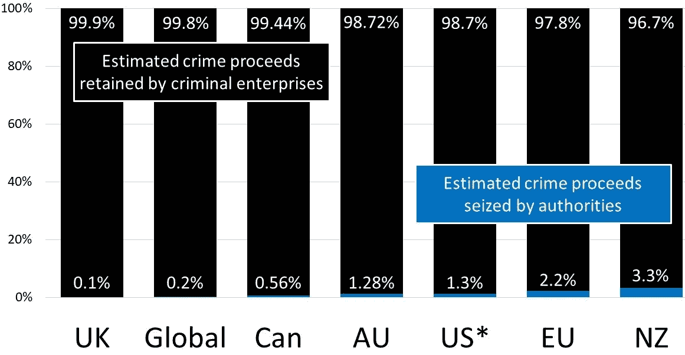
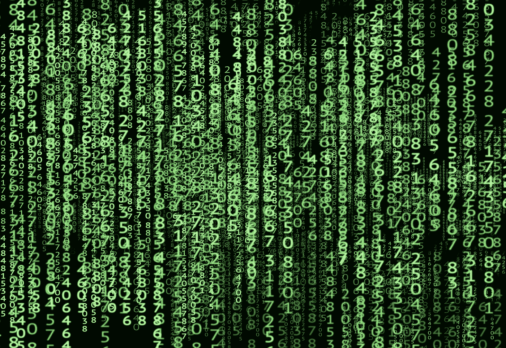

# 反洗钱战争失败了:我们能补救吗？

> 原文：<https://medium.datadriveninvestor.com/the-war-on-money-laundering-has-failed-2e8b3df7507b?source=collection_archive---------3----------------------->

## 一项旨在保护金融体系的计划并没有起到预期的作用，而是造成了经济和社会伤害

Something wrong? © [R F Pol](https://www.linkedin.com/in/ronpol/) / [AMLassurance.com](http://www.amlassurance.com/) (artist: Rick Menard)

现代反洗钱系统(让银行和其他公司检查身份证件，扫描数十亿笔金融交易)[并不能阻止犯罪](https://bit.ly/2oY4ZI4)。罪犯从痛苦中获得高达 99.9%的收入，一个旨在保护金融系统的计划造成了严重的社会和经济危害。

那么，这一切是从哪里开始出错的呢？

# **善意和‘自愿胁迫’**

今天的反洗钱运动始于 1989 年的 G7 峰会。七大工业化国家绕过了通常以条约为基础的共识，建立了一个特设机构，利用资金流动来帮助防止毒品贩运。总部设在巴黎的金融行动特别工作组( **FATF** )随后将目标对准了与其他以盈利为目的的犯罪和恐怖融资相关的洗钱活动。所有有价值的目标。

然而，多年来，很少有国家同意 FATF 倡导的“遵守基于标准的规则”模式。FATF 没有试图开发一种可能与各国打击犯罪的努力更好地结合的替代模式，而是对 40 项“建议”(当时声称反映了反洗钱制度的有效性)的遵守情况进行了评级，并开始了一场“点名羞辱”运动——公开谴责没有勾选足够多选项的国家。

FATF 不再需要说服各国相信它的药方是有效的。也没有证明它如何有助于减少犯罪和严重的以利润为动机的犯罪(如毒品、人口、野生动物和武器贩运、欺诈、腐败和逃税)所造成的社会和经济危害。显然，假设它“应该”这样做，或者断言它“会”这样做就足够了。

无论如何，各国都不能忽视 FATF，因为银行在与其他国家的交易中使用其评级作为风险的代理。主权国家实际上被迫接受评估，并执行 FATF 方面要求的法律，以维持进入国际金融市场的重要渠道。

不出所料，加入反洗钱“大家庭”的势头迅速升级。面对被排除在金融市场之外的风险，似乎更多的国家“自愿”加入了反洗钱运动。有了 205 名参与者，反洗钱运动的管辖范围甚至超过了联合国在 T2 的 193 个国家。(主要是因为 FATF 单独包括半自治的司法管辖区，如中国和香港，英国的属地和海外领土，以及以前称为荷属安的列斯群岛的岛屿)。

 [## 保护主义、政治和经济动荡|数据驱动的投资者

### 美国股市昨日出现 400 多点的大幅反转，为未来的事情发出了警告信号。市场…

www.datadriveninvestor.com](https://www.datadriveninvestor.com/2018/06/28/protectionism-politics-economic-turmoil/) 

尽管现在全球普遍存在洗钱控制措施， [FATF 承认，如果各国想要“保持其在全球经济中的地位”，它仍然“施压”各国](http://www.fatf-gafi.org/publications/fatfgeneral/documents/annual-report-2017-2018.html)满足其要求

但是，不管它是否有效(我将很快回到这个话题)，单边金融制裁和反洗钱体系——这两者都是少数国家可用的政策武器——都会造成重大伤害，并对较小和较弱的国家产生不成比例的影响。

# 旨在“保护”金融系统的措施也会损害经济

“Siphoned into real estate” © [R F Pol](https://www.linkedin.com/in/ronpol/) / [AMLassurance.com](http://www.amlassurance.com/)

巴基斯坦总理，前国际板球运动员和癌症活动家伊姆兰·汗，最近谴责了非法资金流动的“毁灭性”影响，导致“发展中国家的贫困、死亡和破坏”

他痛惜数十亿美元离开发展中国家，流入西方国家的离岸账户、避税天堂和房地产，并谴责这些国家缺乏帮助追回被掠夺资金的政治意愿，“因为他们从中获利”

除了 Khan 描述的经济损失(有些人可能会说是由于巴基斯坦未能达到 FATF 标准(最近的一项实证研究表明恐怖主义融资与恐怖袭击的发生率、规模和地点之间存在关联)，反洗钱系统也造成了伤害。

让巴基斯坦的困难雪上加霜的是，一份[评估报告](http://www.apgml.org/news/details.aspx?pcPage=1&n=2151)(自 8 月开始禁运)在可汗 9 月份的联合国演讲后几天发布，严厉批评了巴基斯坦反洗钱制度的“有效性”。据报道，在来自强国的[游说之后，FATF 早些时候已经将巴基斯坦加入了其声称存在“战略缺陷”的国家的“灰名单”(2018 年 6 月](https://www.voanews.com/a/pakistan-terrorist-financing-watch-list/4261862.html))，所以 Khan 大概不需要提醒反洗钱系统会造成社会和经济损失。(挥舞着金融排斥的大棒，人们可能感觉不到有什么微妙的需要。10 月，FATF 还是给了可汗一个提醒，直截了当地警告说可能会在 2020 年 2 月的下一次全体会议上把巴基斯坦列入黑名单。

无论如何，9 月底在纽约举行的一年一度的联合国大会(T10)上，许多其他国家的领导人表达了类似的主题——强国出于政治原因故意造成毁灭性的经济破坏。

例如，许多加勒比海国家对利用金融体系阻碍试图与强国竞争的小国的经济发展表示失望。

圣文森特和格林纳丁斯总理拉尔夫·冈萨维斯博士谴责“贸易和银行系统的武器化”，称之为“在减少非法资金流动的幌子下，对……发展中国家进行的一场几乎不加掩饰的战争(基于成见和家长式作风)”

圣基茨和尼维斯总理蒂莫西·哈里斯博士将“不公平”的黑名单和“去风险化”(全球银行使用黑名单和评级作为代理风险评估，并切断与当地银行的联系)描述为对小型经济体的“生存威胁”。圣卢西亚总理艾伦·查斯塔内特(Allen Chastanet)表示同意，并补充说，小国正在努力应对在没有“可信的不法行为证据”的情况下实施的限制，这些限制造成了“不可逆转的损害”。

巴巴多斯总理 Mia Mottley QC 和特立尼达和多巴哥总理 Keith Rowley 博士分别谈到了列入黑名单的"挑战"和对代理银行损失的"深切关注",这对小国造成了损害，安提瓜和巴布达总理 Gaston Browne 认为，这种损害延续了几个世纪奴隶制剥削造成的经济损害。

人们很容易(也很常见)不假思索地认为这些抗议与保护金融体系的明确目标背道而驰。然而，即使是占主导地位的反洗钱叙事的坚定支持者，也可能在一些投诉中至少承认一些优点。

比如，来自美国、英国和其他前殖民国家的专业顾问帮助设计了如今被贴上“有缺陷”标签的金融系统，而他们在这些更为突出的国家的客户仍然是这些服务的最重要用户。

此外，像美国和英国这样的国家提供许多类似的服务，而那些较小的国家却被轻视(特拉华州，有人知道吗？)美国也坦率地承认，它是一个“[主要洗钱管辖区](https://www.state.gov/j/inl/rls/nrcrpt/2019/)”，但却控制着默认的全球货币，并且大到足以避免负面标签的负面后果。更多的洗钱活动可能发生在像美国和英国这样的几个大国，它们没有受到低评级和黑名单的困扰，比大多数其他国家的总和还要多。

然而，现实情况是，很少有其他国家能够避免金融制裁或反洗钱评级不佳的影响。

例如，在几个月的大规模抗议之后，苏丹新上任的总理在 8 月份被任命，他寻求解除制裁[，因为前政权的所作所为而惩罚苏丹人民。伊拉克总统萨利赫呼吁采取行动打击腐败网络，并让 T4 收回被盗资产。瓦努阿图总理夏尔洛·萨尔瓦伊谴责持续的殖民霸权，古巴外交部长谴责阻碍其国家进步的“罪恶的”金融制裁的“经济战”。](https://news.un.org/en/story/2019/09/1048022)

委内瑞拉副总统德尔西·罗德里格斯(Delcy Rodríguez)是一名被多个国家列为金融限制目标的律师，他形容经济制裁是“[21 世纪首选的统治武器](https://www.un.org/press/en/2019/ga12196.doc.htm)”，能够“只需按下一个数字按钮”，就能抹去主权国家的收入，惩罚无辜人民，利用他们的痛苦“巩固……霸权”。

西方认为民主国家是全球舞台上民主制度最强有力的支持者，但令人不安的是，俄罗斯外交部长谢尔盖·拉夫罗夫(Sergey Lavrov)在国际关系中倡导平等。显然，出于对国际社会分裂的担忧，拉夫罗夫将“基于规则的秩序”的出现描述为试图用基于自私自利计划和政治权宜之计的新规则取代国际法的既定规则。他敦促应根据《联合国宪章》的包容性和所有国家的利益来应对全球挑战。

人们很容易对“通常的嫌疑人”的不满不予理会。关于俄罗斯的“专制政权”、苏丹的“野蛮独裁”、巴基斯坦的“支持恐怖分子”、古巴的“拒绝走向民主化”以及委内瑞拉的“非法政权”的叙述早已耳熟能详。谁有时间去检查现实是否比我们自己的政治家和业内人士的这些熟悉的比喻更加微妙？(特别是，如果我们诚实的话，关于我们可能认为是“其他”的国家)。

但是，无论“基于规则的秩序”是像许多西方国家主张的那样是一种正义的力量，还是像俄罗斯声称的那样有破坏国际法和国家间平等的风险，金融制裁和反洗钱系统的运作显然会造成伤害。故意的。

# **伤害意图**

Source: Pixabay (aitoff)

金融制裁(大部分是美国施加的)和 FATF [黑名单](http://www.fatf-gafi.org/publications/high-risk-and-other-monitored-jurisdictions/documents/public-statement-june-2019.html)、[灰名单](http://www.fatf-gafi.org/publications/high-risk-and-other-monitored-jurisdictions/documents/fatf-compliance-june-2019.html)和[评级](http://www.fatf-gafi.org/publications/mutualevaluations/documents/more-about-mutual-evaluations.html)都影响国家进入金融市场，对造成的任何损害没有道歉。毕竟，严格的限制是这种制裁的目的。正如 FATF 解释的那样，它“迫使”各国满足它的要求，“以维持它们在全球经济中的地位”

可以说，受到黑名单和反洗钱评级低影响的国家因不遵守基于规则的秩序而受到应有的惩罚。毕竟，从西方的角度来看，基于规则的秩序听起来很熟悉，没有争议，就像法治一样。

但近年来日益突出的“基于规则的秩序”定义不清，并受到不同假设的困扰。简单的问题揭示了复杂的问题。谁制定“规则”？所有国家都能平等参与其发展吗？与其他国家相比，新的“秩序”是否过分偏袒或伤害了一些国家？

令人不安的是，在反洗钱的背景下，这些问题的答案也传达了富人与穷人、大国与小国、前殖民者与前殖民地以及“我们”与“他们”的含义

例如，几年前，圣卢西亚总理 Allen Chastanet 描述了强大国家金融排斥的" T0 "痛苦例子，这些国家的专业阶层是经济发展战略的"设计师",而加勒比海国家却因此受到惩罚。此外,“自封”为集体国际经济合作论坛的 G20 将大多数国家排除在外。90%的国家都不是“非官方和非包容性集团”的成员，所以“没有参与问题的解决，”他补充说，“也没有就任命它为我们经济命运的仲裁者征求我们的意见。”

尽管如此，如果反洗钱体系有效，受影响国家的投诉仍可能被视为自私自利而不予理会。

换句话说，如果足够多的不安迫使各国引入或强化能够对严重的利润驱动型犯罪和恐怖主义产生实质性影响的规则，这或许是值得的，至少在集体意义上是如此。可以说，这就是洗钱黑名单和评级的基本原理。

唯一的问题是真理的暴政:反洗钱系统不起作用。

# **故障锁定**

Crime pays © [R F Pol](https://www.linkedin.com/in/ronpol/) / [AMLassurance.com](http://www.amlassurance.com/)

尽管花费了数万亿美元和 30 年的巨大努力，现代反洗钱实验[几乎没有对犯罪账户产生舍入误差的影响](https://medium.com/@ronald.pol/anti-money-laundering-almost-completely-ineffective-why-it-harms-us-all-827d54db7df5)。按照联合国的标准，当当局收回微不足道的 0.2%的非法资金时，洗钱控制的“成功率”是微不足道的，允许“罪犯公司”保持高达 99.8%(我自己的研究得出的数字是 99.9%，但谁在吹毛求疵呢？)

尽管如此，现实情况是，受害国家的合理批评不太可能遏制经济制裁的使用。相反，迫使其他国家服从更强大力量的意志是一项增长运动。

# **“点名羞辱”活得好好的**

Source: Pixabay (Julius Silver)

欧盟试图加入“[名辱](https://europa.eu/rapid/press-release_IP-19-781_en.htm)世界大赛，遭到了主导者的谴责和被贴上“坏”标签的国家的批评[单方面宣布“不足”的“外部”司法管辖区的新名单——最初应于本月](https://home.treasury.gov/news/press-releases/sm610)在[重新发布——仍在](https://euobserver.com/tickers/145669)议程上[，现在预计在](https://www.lexology.com/library/detail.aspx?g=50bd5aea-a68e-40c4-96e0-518f29b44d87) [2020 年](https://www.lexology.com/library/detail.aspx?g=2c2387c1-a621-408f-abad-7ba0b35d2bd9)。(延伸“我们与他们”的主题，欧盟只是轻蔑地给“外部”国家贴上标签，而不是其成员国)。

尽管欧盟的方法受到了严厉批评，但它试图依附的体系仍然效率惊人，原因一直没有得到解决。(具有讽刺意味的是，欧洲警察署(Europol)坦率地承认了政策失败的规模，但其关于严重犯罪有很好回报的发现似乎大部分都被置若罔闻，就像联合国早些时候的评估一样。

# **设计缺陷**

Source: Pixabay (designwebjae)

反洗钱失败的原因是多方面的。大多数追溯到一个三十年不变的合规模型的仓促发展，很少被质疑，而且似乎是不容置疑的。[不正当的激励也会伤害那些试图做系统原本打算实现的事情的人](https://www.bbc.com/news/business-50205956?ocid=wsnews.chat-apps.in-app-msg.whatsapp.trial.link1_.auin)。但主要问题是持续关注证明合规性的努力和活动，而不是实现更好(预防犯罪)结果所需的内容。

例如，[旨在解决问题的新评级](http://www.fatf-gafi.org/publications/mutualevaluations/documents/effectiveness.html)使用了“有效性”和“结果”的语言，[缺乏一个有效的框架](http://dx.doi.org/10.1108/JMLC-07-2017-0029)【研究论文，2020 年 1 月免费获取】，从而延续了 30 年来对努力而非结果的关注。尽管 FATF 给其旗舰评级贴上了“相互评估”的浮夸标签，但三位教授发现，在反洗钱评估方面，“[的努力很少”，“至少在(公共政策和社会科学)通常理解的评估意义上是如此，即一项干预在实现其目标方面做得有多好。”](https://doi.org/10.1007/s10611-017-9757-4)

此外，评级体系的滴答思维鼓励人们做出滴答反应，以减轻这一体系带来的伤害，而这一体系的特点更多的是善意和华丽辞藻，而不是任何令人信服的有效性衡量标准。

因此，如果“合规”是许多政府的心照不宣的目标(以“满足 FATF 的要求”并最大限度地减少系统本身的不利后果)，而不是任何有意义的犯罪预防结果，就不足为奇了。

反洗钱合规的忙乱本质也掩盖了效果不佳的现实。复杂的规则被设计成像一个巨大的漏勺来接水，通过不断将洗钱控制扩展到更多的交易、业务和行业，以及更多的“解决方案”(增加公共/私营部门的合作、执法整合、人工智能等)，每个“缺口”都被“修复”。随着源源不断的新“解决方案”不断添加更多的漏勺，人们很容易忽略整体情况，即整堆漏勺能收集多少“水”。大多数“解决方案”都有一些积极的效果，但当所有这些加在一起，超过 30 年，设法捕获不到 1%的犯罪资金时，对犯罪的影响充其量似乎是微不足道的。

# **结论，以及领导者的选择**

Source: Pixabay (3dman)

反洗钱产业综合体影响着每一个公民——每年要支付数千亿美元合规成本的更高费用和税收，加上严重犯罪带来的社会和经济影响，几乎没有得到遏制。这也让数百万普通人难以从事银行业，并对弱小国家造成不利影响，然而现代反洗钱实验几乎完全无效。

复杂的法律、众多的监管机构和昂贵的合规任务给了我们活动的舒适感和安全感，但并没有让我们远离严重犯罪和恐怖主义。

渴望减少严重的以利润为动机的犯罪和恐怖主义的社会和经济危害的真正的领导人有一个选择。他们可以盲目地听从一个不对任何国家的公民负责的未经选举的机构的命令，由几个强大的国家驱动，以获得 FATF 对实施其标准的批准，尽管 T2 对犯罪财政几乎没有任何影响。

或者，领导人可能会正视反洗钱失败的现实，并考虑重新构建系统，将对犯罪的影响从不到 1%转变为 99%的区域，就像 G7 在 1989 年打算的那样。

— —

**阅读更多** …

1.  [直言不讳:如何失去朋友并激怒他人](https://medium.com/swlh/saying-it-as-you-see-it-how-to-lose-friends-and-infuriate-people-295237d5b5b2)
2.  [反洗钱“几乎完全无效”为什么它会伤害我们所有人](https://medium.com/@ronald.pol/anti-money-laundering-almost-completely-ineffective-why-it-harms-us-all-827d54db7df5)

— —

## 你怎么想呢?遗漏了什么，或者说错了什么？

评论，分享，[连接](https://www.linkedin.com/in/ronpol/)，从事。加入 *Medium* (免费)关注并获得关于新文章的通知。

— —

## 后记 1—获得“FATF tick”

如果领导人选择第二个选项，实用主义建议他们在此期间仍应“抓住 FATF 的要害”。毕竟，保留对金融系统的访问权有助于政府扩大自身的犯罪预防能力，即使政府没有兴趣为了有意义的结果而重构全球反洗钱系统。

## Postscript 2 —使用系统获得更好的评级

尽管评级系统毫无疑问地未能衡量有效性，并且许多严格遵循官方指导方针的国家因低于预期的分数而受到损害，但一些国家已经开始利用该系统的设计缺陷悄悄“上调”更好的评级(在相互评估和后续报告中)，而不顾任何“真实”(经验)的风险——讽刺的是，当前的系统没有衡量这些风险。