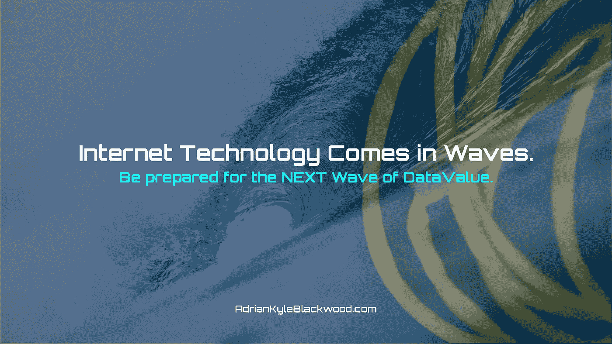
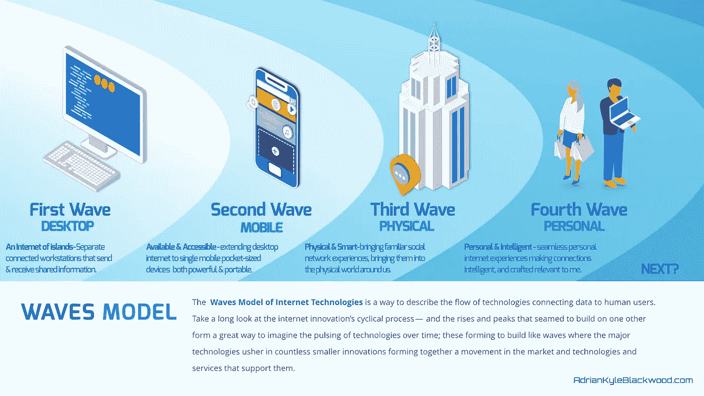
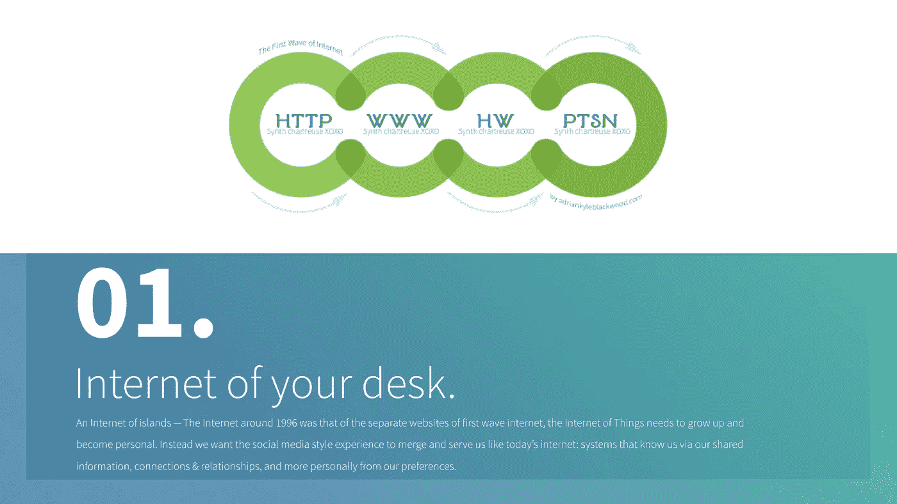
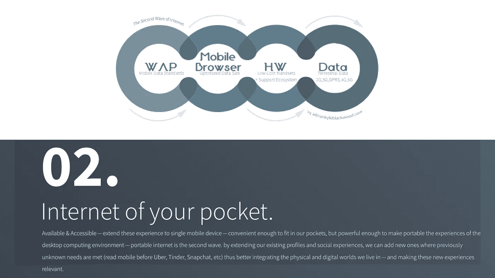
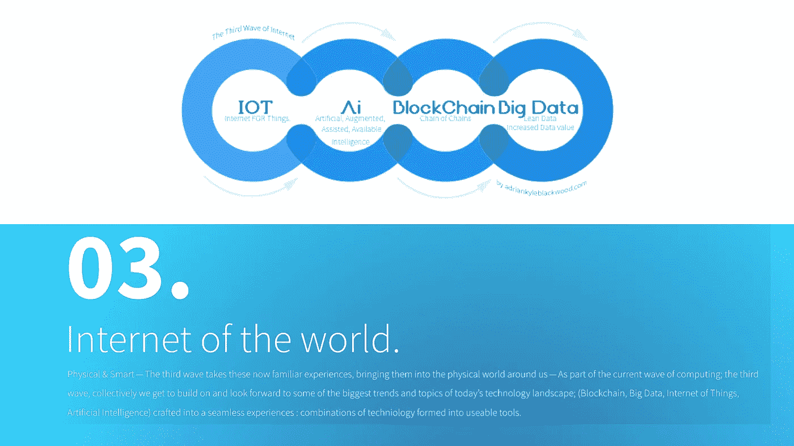
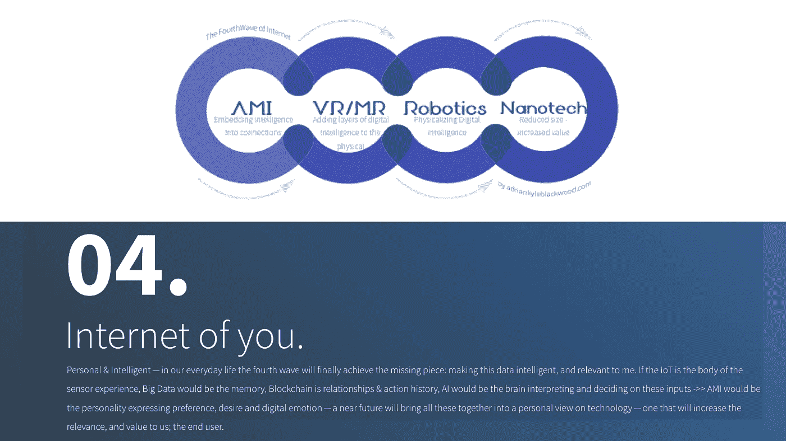
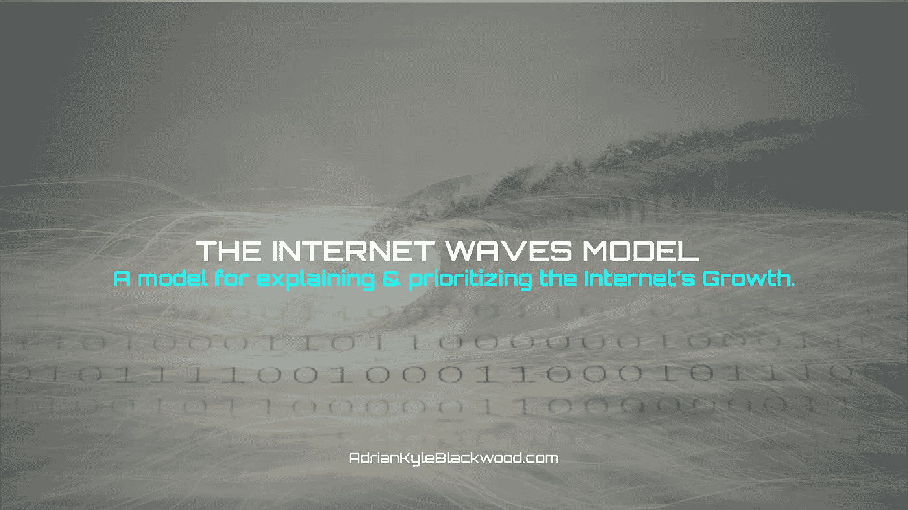
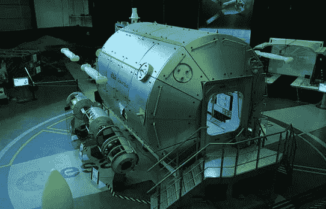
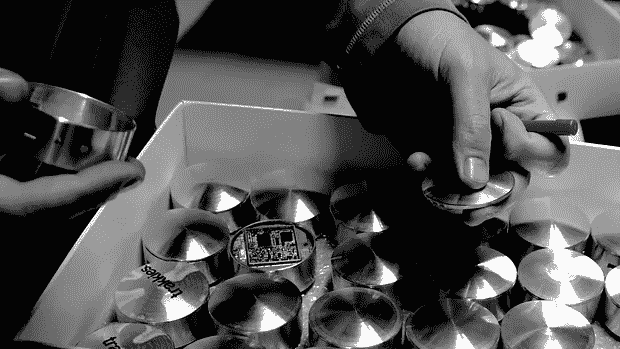
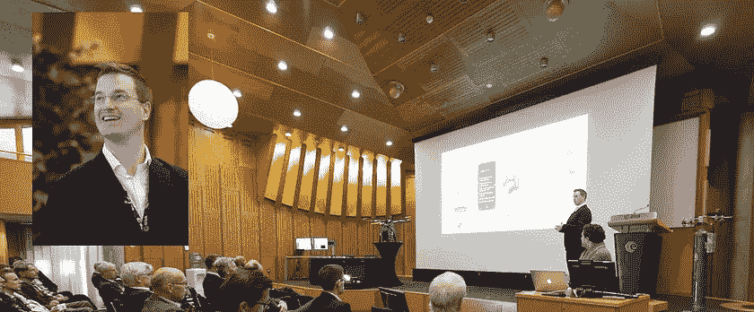

# Waves 互联网模型。

> 原文：<https://medium.datadriveninvestor.com/the-waves-model-of-internet-growth-cb034cbe1154?source=collection_archive---------3----------------------->

## 解释互联网发展的波动模型。

这是一个六集系列的第四集,探索组合互联网的未来:混合人工智能、物联网、区块链和数据的艺术&。跟随媒体上的系列:【https://medium.com/@AkBlackwood 

THE INTERNET WAVES MODEL — A model for explaining the Internet’s Growth to Rocket Scientists, and to everyone else.

## 所需的新方法

在过去的一周里，我在亚洲举办了#aiforgood 系列讲座的第一场——在这个系列讲座中，我们涵盖了引导人工智能走向道德发展的实用方法，并不再把互联网的故事描述为一条由听起来很聪明的公式和规则管理的持续增长之路。不是的。它一波一波地来。

## 那么你从哪里开始呢？

我花了很长时间研究技术历史，以及互联网创新过去和现在是一个循环过程——上升和峰值似乎建立在彼此的基础上——大规模破坏性崩溃和复苏——可视化滚动技术趋势的重复模式的一个很好的方法是形成波浪模型。

## **互联网呈波浪式发展。**

像每一次革命一样，进步从来都不是一蹴而就的。事实上，它们总是一系列的增长。就像人类青春期一样；大型科技公司的增长势头并不健康。因此，考虑到这一点，让我们来看看互联网的快速增长；找一些单词和例子开始谈论它们，就像成年人回顾一个富有冒险精神的青年一样。

A model to describe the persistent availability of internet; and how it relates to current and future priorities.

## 这一切意味着什么|为什么是浪潮

当我们回头看时，从来都不是一种技术构建了持续的经济或创新增长，而是多种技术的结合。让我们来看看互联网增长的模式通常是如何缓慢建立，然后在结合起来形成一个巨大的破坏性浪潮时加速；海浪袭来后一切都变了。

# 海浪:

The first wave: Internet of your desk.

# **第一波:桌面互联网。**

发送和接收共享信息的独立工作站。

**孤岛式互联网**—1996 年左右的互联网是第一波互联网的独立网站，桌面互联网典型地由许多用户通过单个门户共享，在到孤岛式互联网的共享线路上执行许多任务。非个人和不知道我们访问的独立网站不知道我们，或我们的偏好。相反，我们开始希望社交媒体风格的体验能够像今天的互联网一样融合并为我们服务:通过我们的共享信息、联系关系以及更个性化的偏好来了解我们的系统。

The second wave: Internet of your pocket.

# **第二波:移动互联网。**

将桌面互联网扩展到单个移动袖珍设备。

**可用&可访问** —为了将这些体验扩展到单个移动设备——方便到可以放入我们的口袋，但功能强大到可以将桌面计算环境的体验变成便携式的——便携式互联网是第二波浪潮。通过扩展我们现有的个人资料和社交体验，我们可以在以前未知的需求得到满足的地方添加新的个人资料和社交体验，从而更好地整合我们生活的物理和数字世界，并使这些新体验变得相关。我们携带的个人屏幕和环境——然后与互联网连接的世界互动。

The third wave: Internet of the world.

# **第三次浪潮:物理互联网。**

将社交网络体验带入现实世界。

**物理&智能**——第三次浪潮将这些现在熟悉的体验带到我们周围的物理世界——作为当前计算浪潮的一部分；第三次浪潮，我们共同构建并展望当今技术领域的一些最大趋势和主题；通过为互联网和我们周围的硬件(称为物联网)添加智能，我们开始创造一种全新的体验媒介:*物理互联网。*将区块链、大数据、物联网、人工智能结合起来，并将其打造为无缝体验:技术的结合形成了可用的工具。

The fourth wave: Internet of you.

# 第四次浪潮:你的互联网。

无缝的个人互联网体验。

**个人&智能**——在我们的日常生活中，第四次浪潮将最终实现缺失的部分:让这些数据变得智能、有反应、有反应，并与我这个人相关。如果物联网是传感器体验的主体，大数据将是记忆，区块链是关系&行动历史，人工智能将是解释和决定这些输入的大脑- > > AMI 将是表达偏好、欲望和数字情感的**个性**，Vr/MR 添加视觉和视觉，机器人创造物理交互，纳米技术使大型技术小到足以消失在任何时刻。在不久的将来，我们将把所有这些整合到一个关于技术的个人观点中——一个将增加相关性和对我们的价值的观点；最终用户。

**The internet comes in waves**

## 为什么是现在？

让我和我们这些关注第四波互联网技术的人感到兴奋的是环境智能(AmI)、虚拟/混合现实、机器人和纳米技术领域的投资、并购的开始——所有这些都开始了一场运动，这场运动将在有意义的合并中达到高潮，2018 年是互联网的基石年。

## 如何解释和优先处理下一件大事

我是这样认识到互联网是一波一波出现的:**试图向火箭科学家解释它。**2013 年，我在荷兰欧洲航天局做了一次主题演讲，我的任务是解释 IOT 的崛起，以及它将如何影响互联网创新:

The First time I presented the waves modes was 2013 giving the Keynote at the European Space Agency Innovation Forum.

## 太空互联网

国际空间站上平均每年发生 4 起接近临界的事件。关键事件智能路由可能是一种简化任务并在紧急情况下保持宇航员在轨道上的解决方案。将网络智能添加到空间相关环境中是关键，这是我们在 ESABIC 的探索主题，这促使我谈论在 ISS 中添加地理空间网络层的想法，并建立一个不需要 PSTN 蜂窝塔、卫星或其他方法的定位系统，即空间互联网，第四波互联网技术可以在那里存在并蓬勃发展，将关键的辅助智能带到空间。

## 新的互联网需要个性化

岛屿互联网——很像 1996 年左右的互联网，是对当今物联网的一个很好的描述。与第一波互联网浪潮中的独立网站不同，我们希望社交媒体风格的体验能够融合起来，像今天的互联网一样为我们服务:通过我们共享的信息、联系和关系了解我们的系统，以及通过我们的偏好了解我们个人的系统。

## **互联网来了一波又一波**

我们生活在一个微型革命的时代。不是在一个类似于“工业革命”的时代，这是一个重大事件，但事实上，我们正在经历快速的创新爆发，每一次都代表着一个独特和独立的创新浪潮。一个**新浪潮模型在这里，**这是一种解释当前技术趋势的上升趋势以及如何正确看待流行词汇的方式。这是一种理解为什么 VR 尚未处于大规模采用阶段的方式，以及 IOT、区块链、人工智能和大数据的结合是它目前所处的位置——无论是从商业角度还是从消费者的角度。

## 互联网发展的阶段

由于我们目前正处于第三次互联网浪潮中，我想强调我们共同努力建立有效技术创新的目标:要了解更多信息，请阅读我的文章 **2016 是人工的 2018 将是环境的**，[https://medium . com/@ AK blackwood/why-the-Internet-of-things-IOT-needs-an-artificial-intelligence-ai-brain-and-why-we-all-need-d6e 67 a0d 5652](https://medium.com/@AKBlackwood/why-the-internet-of-things-iot-needs-an-artificial-intelligence-ai-brain-and-why-we-all-need-d6e67a0d5652)

正如我在那里建议的那样，我们应该共同致力于集成一个更加模块化的人工智能架构方法，一个研究人员和算法构建者能够解决难以理解的人机界面问题，并且所有未来的人工智能服务都能够满足人类需求的方法；从鞋类零售商和服务提供商到无穷无尽的商业机会。

**故事作者:**

## 阿德里安·凯尔·布莱克伍德

目前正在探索:|元宇宙|环境辅助生活|空间商业|空间网络|

查看更多:【adrianblackwood.com 

【linkedin.com/in/adriankyleblackwood/ 