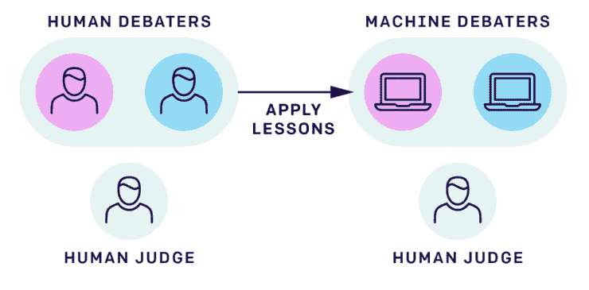
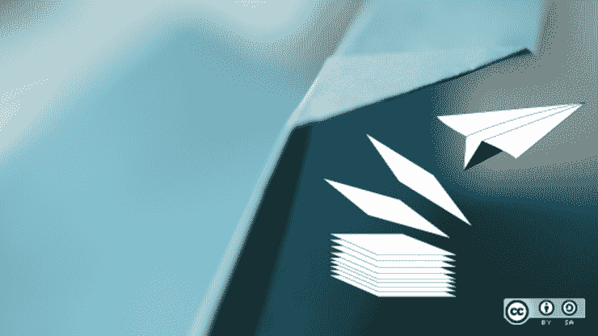
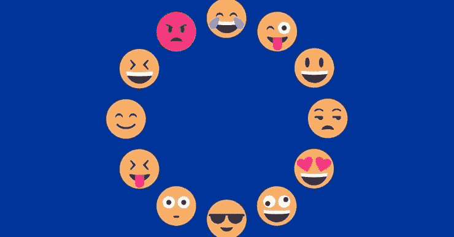
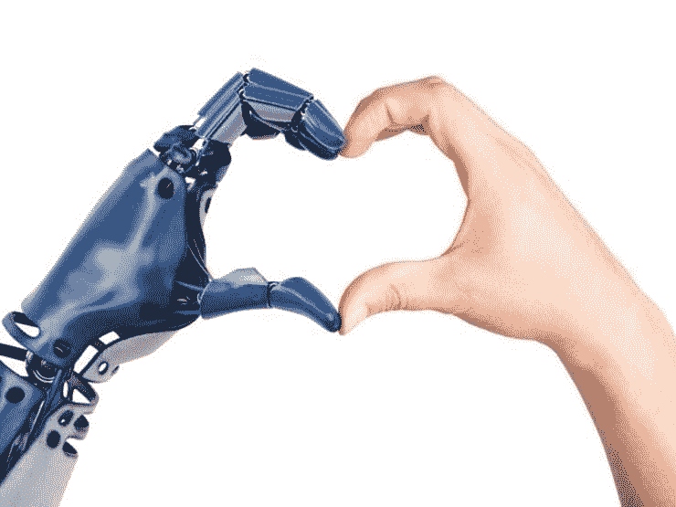

# 每周吱吱声——道德机器人爱黑客

> 原文：<https://medium.datadriveninvestor.com/the-weekly-squeak-ethical-robot-love-hack-a06484c760d6?source=collection_archive---------13----------------------->

我结束了近一个月的旅行回来了，所以正常的服务将从下周开始恢复，我保证！🤞

与此同时，在过去的几周里，有不少文章引起了我的兴趣，涵盖了我通常的过多兴趣:技术、工作的未来、技术伦理和爱情机器人。

xx Chinch

 [## 数据驱动的投资者

### 事实上，在各行各业，数据的大规模激增正在改变我们感知世界的方式。而且只有…

www.youtube.com](https://www.youtube.com/channel/UCdKDq7Tu9f8xtooSLZ92AEw) 

# 播客版本

你可以在下面的链接中找到这篇时事通讯的播客版本。

*   [第一集](https://anchor.fm/theweeklysqueak/episodes/Ethical-Robot-Love-Hack-e3b51l)
*   [饲料](https://anchor.fm/s/2ab8734/podcast/rss)

[**工人阶级的崛起——纽约时报**](https://www.nytimes.com/interactive/2019/02/21/magazine/wework-coworking-office-space.html?utm_campaign=The%20Weekly%20Squeak&utm_medium=email&utm_source=Revue%20newsletter)**——**[**www.nytimes.com**](https://www.nytimes.com/interactive/2019/02/21/magazine/wework-coworking-office-space.html)

合作真的是另一种选择吗？还是我们都变成了同样的另类？🤔

## [为男人建造的世界的致命真相——从防刺背心到车祸|生活和风格|卫报](https://www.theguardian.com/lifeandstyle/2019/feb/23/truth-world-built-for-men-car-crashes?utm_campaign=The%20Weekly%20Squeak&utm_medium=email&utm_source=Revue%20newsletter)

[www.theguardian.com](https://www.theguardian.com/lifeandstyle/2019/feb/23/truth-world-built-for-men-car-crashes)

对女性的歧视比你想象的还要严重。以非常惊人的方式。

[【www.technologyreview.com】](https://www.technologyreview.com/s/612974/once-hailed-as-unhackable-blockchains-are-now-getting-hacked/?utm_campaign=The%20Weekly%20Squeak&utm_medium=email&utm_source=Revue%20newsletter)
越来越多的安全漏洞出现在加密货币和智能合约平台中，其中一些漏洞是它们构建方式的根本。

[**AI 安全需要社会科学家**](https://blog.openai.com/ai-safety-needs-social-scientists/?utm_campaign=The%20Weekly%20Squeak&utm_medium=email&utm_source=Revue%20newsletter)**——**[**blog.openai.com**](https://blog.openai.com/ai-safety-needs-social-scientists/)

刚刚用一个文本算法“太危险了，不能发布”吓坏了世界，开放人工智能提议在计算领域有更多的社会科学家，这是我一直支持的。

[**Linux 下使用 CUPS 进行打印的小技巧| Opensource.com**](https://opensource.com/article/19/1/cups-printing-linux?utm_campaign=The%20Weekly%20Squeak&utm_medium=email&utm_source=Revue%20newsletter)**——**[**opensource.com**](https://opensource.com/article/19/1/cups-printing-linux)

我发现这是另一个有趣的例子，说明技术经常来自意想不到的来源。

I was in Breckenridge recently, -26 at times 🥶

[【www.zdnet.com】末日码头工人安全漏洞被揭开| ZDNet](https://www.zdnet.com/article/doomsday-docker-security-hole-uncovered/?utm_campaign=The%20Weekly%20Squeak&utm_medium=email&utm_source=Revue%20newsletter)**——**

**鉴于 Docker 的影响力，我很惊讶它没有得到那么多的报道。**

****

**[**第 13 条的阴暗传奇又变得更糟了|连线英国**](https://www.wired.co.uk/article/the-article-13-copyright-saga-just-got-worse?utm_campaign=The%20Weekly%20Squeak&utm_medium=email&utm_source=Revue%20newsletter)**——**[**www.wired.co.uk**](https://www.wired.co.uk/article/the-article-13-copyright-saga-just-got-worse)
欧盟新版权条例中少数非灾难性的内容现在可以删除了**

****

**[**机器人之恋:为什么与机器的浪漫已成定局| ZDNet**](https://www.zdnet.com/article/robot-love-why-romance-not-just-sex-with-machines-is-a-foregone-conclusion/?utm_campaign=The%20Weekly%20Squeak&utm_medium=email&utm_source=Revue%20newsletter)**——**[**www.zdnet.com**](https://www.zdnet.com/article/robot-love-why-romance-not-just-sex-with-machines-is-a-foregone-conclusion/)
性爱机器人被出售是为了身体上的愉悦，但情感上的满足与机器的关系比你想象的更密切。**