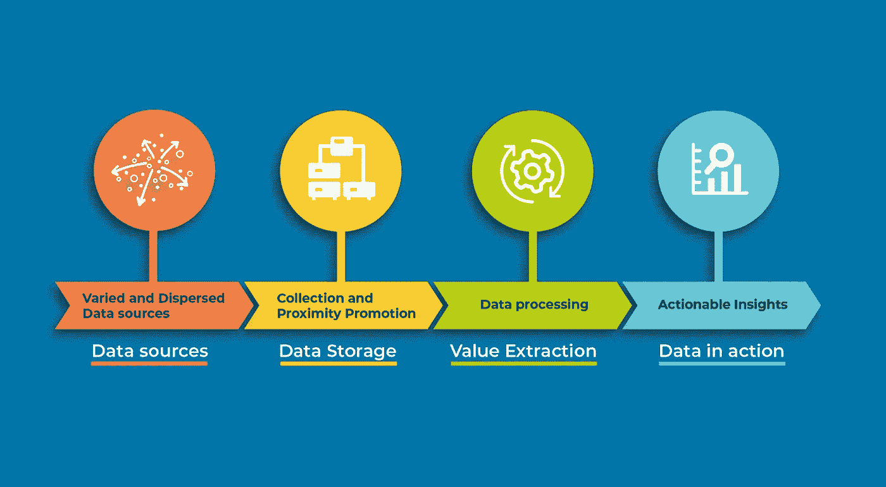
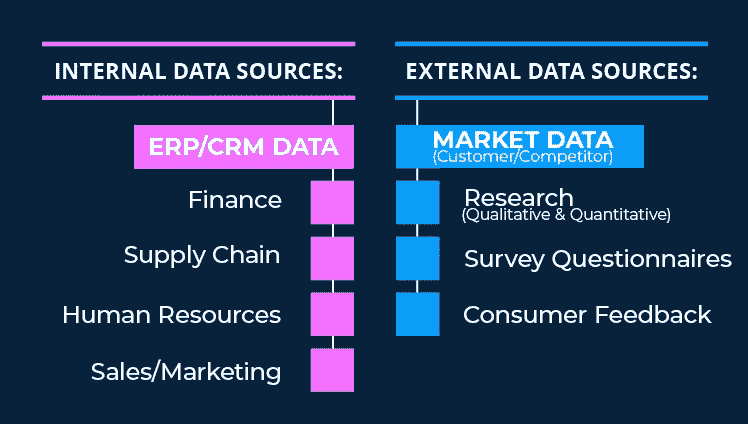
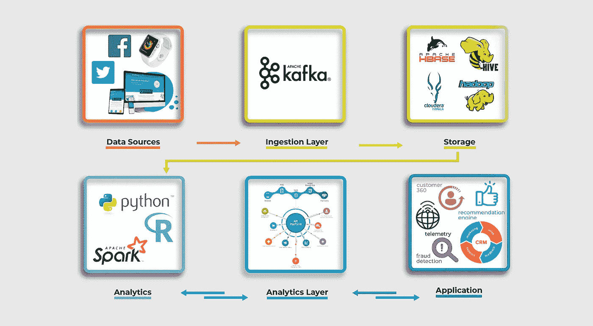
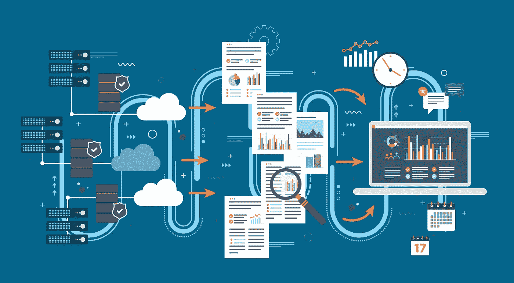

# 数据管理的内容、原因和方式

> 原文：<https://medium.datadriveninvestor.com/the-what-why-and-how-of-data-management-e156f193b533?source=collection_archive---------11----------------------->

您对自己的运营效率满意吗？你想变得更有利可图吗？你想寻找新的发展机会吗？

如果你对这些问题中的任何一个或全部回答是肯定的，你就在一个好公司里。

 [## 为什么数据将改变投资管理|数据驱动的投资者

### 有人称之为“新石油”虽然它与黑金没有什么相似之处，但它的不断商品化…

www.datadriveninvestor.com](https://www.datadriveninvestor.com/2019/01/25/why-data-will-transform-investment-management/) 

事实上，这些挑战是普遍存在的，而“走向数字化”旨在缓解这些挑战。然而，所需的过程不仅可以帮助你实现目标，而且可以从长远角度最大化你的投资回报。

# 三层方法

当走向数字化时，有一个被广泛推荐的三重方法，包括

*   **智能自动化**
*   **改进决策**
*   **打开新的市场和机遇**

我们分别讨论一下。

**智能自动化**

数字化成熟的第一步是通过[自动化](https://perspectives.mobilelive.ca/blog/robotic-process-automation-myths)实现效率和运营费用的优化和降低。企业应该从集中精力理解和规划现有业务流程的效率开始，包括但不限于供应链系统、库存控制和订单处理。[自动化](https://perspectives.mobilelive.ca/blog/robotic-process-automation-myths)的目标是增强对操作的控制，同时通过数字技术提供的速度、可靠性和准确性来提高效率

**改进的决策制定**

一旦自动化到位，效率就会大大提高，包括额外的时间。虽然许多高管和企业主会说，在经营企业时没有这样的事情，但在现实中，企业会找到机会将重点从管理日常运营转向战略“大局”。这一阶段的目标是授权和集成商业智能系统，以便做出更好、更明智和及时的决策。

**开拓新的市场和机遇**

拥有运营效率和[智能决策系统](https://perspectives.mobilelive.ca/blog/15-artificial-intelligence-opportunities)的企业应该开始探索新的增长机会:新的市场和识别机会，并投资于使能技术。这种投资对企业的持续发展至关重要，应该与战略密不可分，可以包括电子商务平台、移动和网络应用，以及支持本地和全球扩张的数字营销活动。

上面描绘了一幅美丽的画面，一个精干、敏捷、市场准备就绪的组织，它不仅高效，而且适应增长。然而，有一个关键的组成部分，赋予所有这一切；数字化的一个方面是成功的必要条件，并且与任何成功的转型都密不可分——对**数据**的管理和理解！

在本文的剩余部分，我将围绕数据管理的内容、原因和方式展开。

# 数据的基础

那么数据为什么重要呢？

> D **ata 隐藏商业洞察&洞察有商业价值！**

一个大胆的声明，特别是当考虑什么洞察力和多少商业价值是一个细节问题时；然而，该原则是普遍适用的。这个原则没有提到从哪里开始，当谈到数据时，唯一的起点是在源处。

# 数据源

如果一个组织想要利用数据的力量，首先，也可以说是最重要的一步是确定和识别您的数据源。概括地说，这些可以分为两类；内部和外部。

内部数据是指已经拥有(或应该拥有)的数据，包括在销售、财务、营销、人力资源、供应链等领域收集的数据，以及通常归类为 CRM 数据的子集，其中包含您的客户概况及其行为。然而，当谈到数据源时，依靠多个数据源总是明智的。

另一种有价值的数据是外部数据，它通常也是相关的。外部数据来自市场，包括客户和竞争对手，通常是统计性质的，来自问卷调查、研究和消费者反馈。

# 数据收集管道和大数据框架

在确定了需要什么数据以及可以从哪里获得数据之后，下一个逻辑步骤是通过数据管道和处理框架来分析收集和处理。

通常，这些框架是围绕开源 Hadoop 技术构建的，生态系统中有各种可用的工具。当希望利用数据创建更具可操作性和价值的业务战略时，在这方面的投资至关重要。

# 接近的力量

利用大数据平台至关重要，尤其是在处理大量数据时；但是，另一个好处是能够将所有数据集中到一个位置，即一个数据湖，在那里可以对数据进行整体处理。

虽然将所有数据集中在一起进行集体分析是有利的，但重要的是要注意以原始形式保存数据的价值。遵循这样的实践将增加数据的保存期限，因为通过保持数据的完整性，它得到了保护，包括在用例被识别时可以利用的隐藏的洞察力。

# 用用例创造平衡

当组织开始实施大数据战略并计划创建大数据框架时，重点将不可避免地放在数据收集上。然而，这种方法经常遇到犹豫，因为数据收集需要资本支出，但在提取商业价值之前没有任何好处。

为了解决这个问题并获得内部支持，最佳策略应该包括在组织数据收集发生时识别业务用例。完成后，这不仅能为投资提供直接价值，还能在业务和技术之间建立信任。

# 机器学习

知道了业务价值来自业务洞察，接下来需要解决的问题是如何从数据中获得这些洞察。为了做到这一点，组织需要机器学习。

机器学习技术可以应用于大数据框架，以提取可操作的见解。然而，正如前面提到的，识别业务用例是识别哪种建模方法最有效的关键。可悲的是，有各种各样的技术可用，所有这些技术都需要彻底的理解和专业知识，这就带来了下一个问题——如何弥合技能差距，以便获得和利用这些隐藏的见解。

# 弥合技能差距

当谈到大数据、机器学习以及实施和利用数据战略时，一个组织面临的最大障碍可能是缺乏熟练和经验丰富的专业人员。因此，任何数据策略都必须包括对组织能力的评估，并相应地填补空白。

为了填补这些空白，组织面临着各种选择。

*   第一个也是最明显的一个是雇佣有技能和经验的人。
*   **第二个**选项是一种混合方法，包括寻找和吸引有技能的专业人员，以及在组织内发现可以接受所需技能培训的潜在人才。这种方法很有吸引力，因为它不仅缓解了人才供应问题，而且有助于提高组织的智商和能力。
*   第三种也是最后一种选择是外包模式，这种模式越来越受欢迎，在这种模式下，您可以联系外部供应商来开发、执行和维护您的数据战略。该选项也可以与混合方法一起使用，因为有可能选择合适的供应商，该供应商不仅可以帮助执行战略，还可以通过培训任何内部团队来帮助缩小技能差距。

# 结论

技术现在与商业战略密不可分，是长期成功的基石。做出更好、更明智、可操作和有意义的决策的需要时不我待；相反，它将继续增长并决定组织能走多远。成功的关键以及决定一个组织能走多远的因素将是基础工作:这些工作不仅将决定数字化成熟度的实现速度，还将决定数字化成熟度的利用程度。