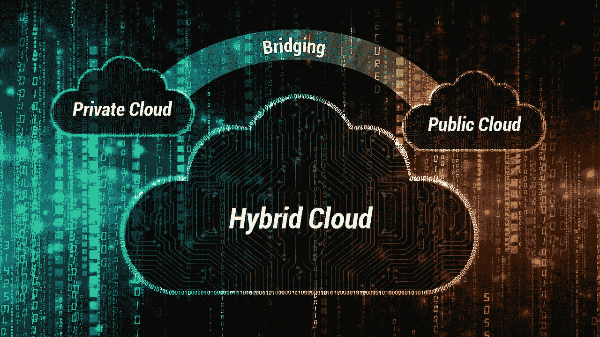
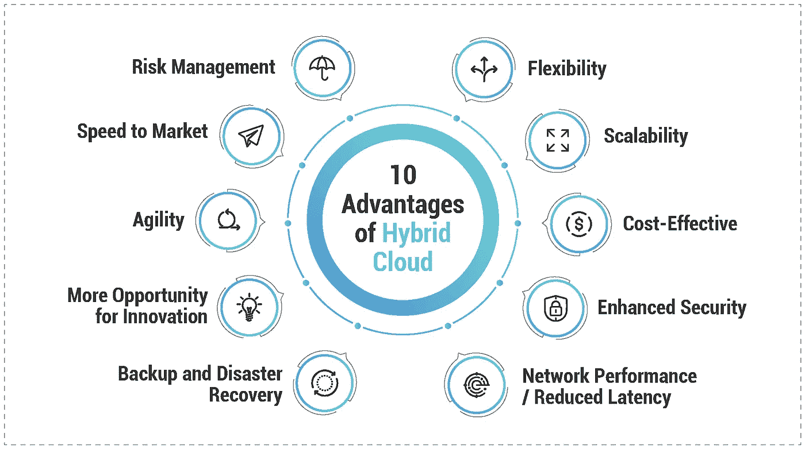

# 混合云的内容、原因和方式

> 原文：<https://medium.datadriveninvestor.com/the-what-why-and-how-of-hybrid-cloud-f4ce61b2eb82?source=collection_archive---------1----------------------->

大多数人都熟悉混合动力这个术语；虽然它通常与汽车有关。幸运的是，为了我的观点，它会做得很好。现在，根据定义，混合动力是由两种不同的元素结合而成的新东西，就混合动力汽车而言，它是电动和汽油发动机。这为用户提供了电动马达的燃料效率和汽油马达的动力和便利。然而，不仅仅是汽车享受着将两种不同元素结合起来创造新的更好的东西的好处，因为 it 界一直在不断地将概念、原则和方法融合在一起，以获得两个世界的最佳效果。今天，我们将深入探讨一种被恰当地称为混合云的组合。

 [## 信息图:云之旅——数据驱动的投资者

### 聪明的企业领导者了解利用云的价值。随着数据存储需求的增长，他们已经…

www.datadriveninvestor.com](https://www.datadriveninvestor.com/2018/09/22/infographic-journey-to-the-clouds/) 

# 什么是混合云战略？

根据[美国国家标准与技术研究院](https://www.nist.gov/sites/default/files/documents/itl/cloud/NIST_SP-500-291_Jul5A.pdf)的说法，混合云基础架构由两个或多个云(私有云、社区云或公共云)组成，这些云保持唯一的实体，但通过标准化或专有技术绑定在一起，从而实现数据和应用程序的可移植性。从这个定义推断，混合云战略就是使用这些多种基础架构(包括组织自己的内部 IT 和数据中心)来实现 IT 目标。当您允许工作负载随着需求和成本的变化在公共云和私有云之间转换时，混合云模型可以为组织提供更高的灵活性和更多的数据部署选项。因此，[云优先战略](https://www.mobilelive.ca/digital/cloud)优先考虑所有 IT 功能的云，而混合战略使用基础设施的组合来为组织提供每种基础设施的优势，而不会通过依赖一种基础设施来限制自己。

# 混合云战略的优势

Gartner 估计，到 2020 年，[90%的](https://www.gartner.com/newsroom/id/3666917)组织将采用混合战略，当你看到好处时，很容易明白为什么。公共部署和内部部署都有自己独特的优势；然而，它们也有自己的缺点。直到你把它们结合起来。

简而言之，混合云战略非常适合各种规模的组织，这些组织优先考虑安全性、定位于增长并具有高数据需求，这主要是因为它解决了所有这些因素以及更多因素。以下是混合云业务战略的一些优势:

对于处理动态或不断变化的工作负载的组织来说，混合云策略也非常有用。以一个订单输入系统为例，该系统在节假日期间会出现需求高峰。这种情况是混合方法的主要候选，因为他们可以在私有云中运行应用程序，但可以在高峰需求期间利用公共云中的云爆发。

# 如何构建混合云战略

采用混合云策略的最大好处之一是，您可以根据组织现在和未来的需求对其进行定制。换句话说，混合云并不只有一种类型；相反，有多种方法和组合。但是，为了建立混合云战略，必须满足以下要求:

*   公共基础设施即服务(IaaS)平台
*   在内部或通过托管私有云提供商创建私有云
*   环境之间足够的广域网(WAN)连接
*   私有云必须进行适当的架构设计，以实现与公共云的兼容性

现在我已经建立了混合实现的先决条件，它回避了这样一个问题，即它到底会是什么样子——并且没有一个答案。一种选择是，组织可以投资云管理软件，为他们提供一个单一平台来管理公共云应用程序和内部基础架构。另一种选择是供应商原生混合云策略，即您将自己的内部基础架构或数据中心连接到公共云，以利用其优势。

不管您采用哪种方法，混合策略的优点在于它允许组织定制其基础架构以满足其特定需求。然而，与生活中的大多数事情一样，您可以采取一些步骤来帮助确保您的混合云计划有一个良好的开端:

*   将新的云服务与现有的内部基础架构集成，以便您可以访问所有必要的应用程序
*   实施安全措施来控制和限制重要数据的流动
*   使用虚拟化层或虚拟机管理程序来部署现有应用程序，使其在内部和云平台上无缝工作。这将提供一种在云和本地基础架构之间提升和转换的更简单的方法
*   在可能的情况下，使用容器技术工具开发未来的应用程序，这可以减少对云平台供应商的依赖，并允许您统一使用内部和不同的云平台
*   尽可能随时随地自动完成任务，尤其是重复性的手动任务
*   开发和监控 KPI(部署频率和速度、故障率、恢复时间),以确保使用混合云模型的成功战略

构建成功的混合云的关键在于选择与您期望的公共云完全兼容的虚拟机管理程序和云软件层。这允许与所述公共云 API 的适当互操作性，并促进两者之间的无缝迁移。

# 混合云实施:挑战和解决方案

正如在实施任何新的策略或实践时一样，挑战经常会出现。但是，了解这些情况并做好充分准备是确保平稳过渡到使用混合模型的最佳方式。以下是一些常见的障碍和克服这些障碍的有用提示:

*   **安全风险** —私有云中的数据是安全的，但是混合云可能需要不同的安全平台来保护敏感数据。通过选择正确的平台，深入了解数据需求，并与正确的合作伙伴一起集成您的网络解决方案，可以最大限度地降低安全风险。
*   **集成和维护成本** —公共云与私有云、内部基础架构的集成，或者与各种云提供商的集成都极具挑战性。不仅从管理和实施的角度来看，它增加了更大的复杂性，而且它还会使跨多个环境跟踪资源和计算能力变得困难。
*   **技术和开发运维流程** —混合云战略需要更加谨慎地选择能够在各种[环境中工作的技术和解决方案](https://perspectives.mobilelive.ca/blog/6-reasons-why-you-should-be-adopting-a-devops-culture-in-2018)。如果不考虑这一点，我经常会看到生命周期管理和部署变慢。然而，在您的部署中求助于专家可以帮助提供最佳的解决方案和技术，例如使用 Docker/Kubernetes/Openshift 的容器化，并通过确保实施适当的 CI/CD 流程来自动化应用构建和部署。目前该领域最受欢迎的技术包括微软 Azure、谷歌云平台、HPE OneSphere 和亚马逊网络服务(通过它们最近与 VMware 软件的合作)。

对于寻求灵活性、经济性、增强的安全性、改进的访问和通信以及满足 IT 需求的可定制解决方案的任何组织来说，混合云战略都是未来的发展方向。然而，像任何新策略一样，当缺乏经验时，这可能会令人生畏。不要犹豫，请专家帮助开发和实施混合[云解决方案](https://www.mobilelive.ca/contact-us/development)，该解决方案不仅能满足您的特定需求，还能推动您的业务向前发展。

*最初发布于:*[*https://perspectives . mobile live . ca/blog/hybrid-cloud-strategy*](https://perspectives.mobilelive.ca/blog/hybrid-cloud-strategy)