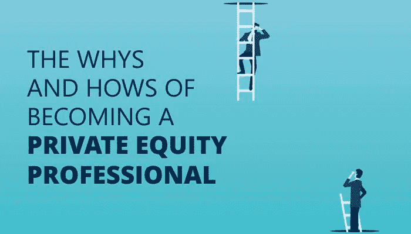

# 成为私募股权专业人士的原因和方法

> 原文：<https://medium.datadriveninvestor.com/the-whys-and-hows-of-becoming-a-private-equity-professional-4f630551ed4a?source=collection_archive---------4----------------------->

谈到金融，“私募股权”很可能是你听到的最流行的词汇之一。但是，你知道这是怎么回事吗？

根据 Investopedia 的说法，私募股权(PE)是“未公开上市或交易的股权，即代表一个实体的所有权或利益的股份”。私募股权投资是投资的资本来源，来源于高净值个人(hni)和公司:

 [## 风险投资家在给创业公司播种时会考虑什么标准？数据驱动的投资者

### 2017 年，风险投资资金攀升至十年来的最高水平。你的创业公司目前吸引风险投资的机会是…

www.datadriveninvestor.com](https://www.datadriveninvestor.com/2018/04/20/what-criteria-do-venture-capitalists-consider-when-seeding-a-startup/) 

购买私人公司的股票

收购上市公司的控股权，并计划让它们退市和私有化

> ***PE 似乎需要很多钱。***

没错！私募股权投资是基于直接投资一家公司。这意味着，如果你希望对一家公司的运营产生重大影响，你需要投入大量资金。毫不奇怪，这个行业被财力雄厚的大型私募股权公司所主导。谈到最低资本金额，并没有标准的规则——可能从很少(！idspninfopath)到很少(！idspninfopath)。)从 25 万美元到数百万美元不等，取决于公司和基金。

***那么什么是 PE 基金呢？***

私募股权基金的形成是因为私募股权公司的合伙人从一群投资者那里募集资金，然后把这些资金放在一起形成一个基金。投资者可以是:

o 大型机构:银行、保险公司、养老基金等

o HNI 投资者

那么，我为什么要投资私募股权基金呢？

当然是退货！吸引人们投资私募股权基金的是可观的回报。这些通常远远超过你在股票市场上的收益。

说到私募股权基金，有两种类型的合作伙伴:

有限合伙人:他们是公司的投资者，他们的责任仅限于他们的投资额

o 普通合伙人:他们是投资经理，他们的责任是无限的，也就是说，如果需要，他们有责任用他们的个人资产来履行公司的义务

***有趣。有不同类型的 PE 基金吗？***

当然——一个没有选择的(私募股权)市场会是什么样？常见的私募股权基金类型如下:

> 收购基金

o 通常会获得控股权

o 可能提供战略和运营支持

o 可能最终将公司出售给另一个投资者，或者将公司上市

o 通过解锁或增值赚钱，一旦估值高了就抛售。

> 风险资本基金

o 投资于具有高增长潜力的初创企业

o 可以帮助初创公司进行结构化运营

o 经常面临长时间的投资锁定期，有可能彻底失败

> 专用于购买迅速发展的企业股票的信托投资基金

o 投资于具有成熟商业模式和高增长潜力的公司

o 通过将业务发展到其全部市场潜力，然后以更高的估值出售其股份来赚钱

***是工作的好地方吗？***

当然，如果你工作时间长，压力大，并且和最聪明最优秀的人竞争一份工作。一旦你进去了，学习的机会几乎是无限的。

私募股权公司通常比投资银行小得多；相应的，层级就平了很多。作为一名初级助理或分析师，你的工作可能会让你经常与公司的副总裁和合伙人打交道。从头到尾看完一笔交易真的很令人满意！

***我将处理哪些日常任务？***

很多！这些将包括:

# 分析建模

o 为委托人和合作伙伴提供对交易做出明智决策所需的分析

o 任务包括准备初步的尽职调查报告和用增长预测建模

# 监控投资组合中的公司:

必须保持最新的财务状况。

# 回顾 CIMs:

机密信息备忘录(CIM)是一份投资银行用于收集新投资机会数据的文件。你将需要筛选 CIMs 的潜在机会，为高级团队提供简单的总结。

# 筹款:

当新基金成立时，合伙人需要协助初步筹款。

***我需要什么技能？***

要想找到一份体育专业人员的工作，你最好擅长:

商业分析:你应该能够从技术上和直觉上评估作为潜在投资的公司。你还必须了解市场和经济趋势

技术技能:你应该擅长金融、杠杆收购(LBO)和并购(M&A)建模，以及一般的财务分析

人际技能:PE 是一个团队的努力，所以你可以通过运用你在沟通、谈判和人际交往方面的技能，成功地与公司内外的专业人士互动

***是否应该获得认证？***

当然！认证是一个很好的方式来增加您的凭证。一个很好的选择是来自[美国私募股权理事会](https://www.uspec.org/private-equity-certifications/chartered-private-equity-professional?utm_source=medium&utm_medium=cc)或 **USPEC** 的[特许私募股权专业(CPEP)](https://www.uspec.org/private-equity-certifications/chartered-private-equity-professional?utm_source=medium&utm_medium=cc) 认证。《CPEP》适合于金融、会计和商业专业的应届毕业生，也适合体育领域的专业人士。它能让你达到顶级体育和风投公司想要的水平。

***总而言之……***

体育当然是一个很好的职业选择，如果你想从事金融业的高层，并且准备接受具有挑战性、压力大、回报高的工作，强烈建议你这样做。只要掌握了正确的技巧，你就万事俱备了！