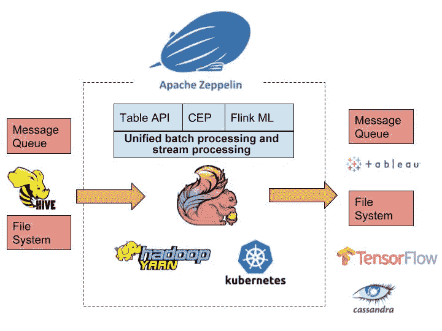

# 狂野的阿帕奇弗林克人:挑战与机遇

> 原文：<https://medium.datadriveninvestor.com/the-wild-wild-apache-flink-challenges-and-opportunities-4b85238f7857?source=collection_archive---------7----------------------->

在讨论 [Apache Flink](https://flink.apache.org/?spm=a2c41.13326786.0.0) 生态系统之前，让我们先来看看什么是生态系统。在其中，生态系统可以理解为一个组件的社区，这些组件都是从一个共同的核心组件派生出来的，这些组件直接或间接使用这个核心组件，并与这个核心组件一起使用，以完成一个更大或更特殊的任务。那么，顺着这一点，Flink 生态系统是指以 Flink 为核心组成部分围绕的生态系统。

在大数据的生态中，Flink 是一个计算组件，只处理事物的计算方面，不涉及自身的任何存储系统。也就是说，你可能会发现单单 Flink 无法满足很多实际场景的需求。例如，你可能需要考虑你的数据是从哪里读取的，Flink 处理的数据应该存储在哪里，数据要如何消费，以及你如何使用 Flink 来完成一个垂直业务领域的特殊任务。为了完成这些涉及下游和上游以及更高抽象层次的任务，您需要一个强大的生态系统。

# 弗林克生态系统现状

现在我们已经了解了什么是生态系统，让我们来谈谈你可以称之为 Flink 生态系统的现状。总的来说，Flink 生态系统还处于初级阶段。目前，Flink 生态系统主要支持上游和下游的各种连接器以及几种集群。

你可以列出 Flink 目前全天支持的连接器。但仅举几个例子就有[卡夫卡](https://ci.apache.org/projects/flink/flink-docs-stable/dev/connectors/kafka.html?spm=a2c41.13326786.0.0)、[卡珊德拉](https://ci.apache.org/projects/flink/flink-docs-stable/dev/connectors/cassandra.html?spm=a2c41.13326786.0.0)、[弹力搜索](https://ci.apache.org/projects/flink/flink-docs-stable/dev/connectors/elasticsearch.html?spm=a2c41.13326786.0.0)、 [Kinesis](https://ci.apache.org/projects/flink/flink-docs-stable/dev/connectors/kinesis.html?spm=a2c41.13326786.0.0) 、 [RabbitMQ](https://ci.apache.org/projects/flink/flink-docs-release-1.2/dev/connectors/rabbitmq.html?spm=a2c41.13326786.0.0) 、 [JDBC](https://ci.apache.org/projects/flink/flink-docs-stable/dev/table/connect.html?spm=a2c41.13326786.0.0) 和 [HDFS](https://ci.apache.org/projects/flink/flink-docs-stable/dev/connectors/filesystem_sink.html?spm=a2c41.13326786.0.0) 。接下来，Flink 支持几乎所有的主要数据源。至于集群，Flink 目前支持[单机](https://ci.apache.org/projects/flink/flink-docs-release-1.2/setup/cluster_setup.html?spm=a2c41.13326786.0.0)和[纱线](https://ci.apache.org/projects/flink/flink-docs-release-1.2/setup/yarn_setup.html?spm=a2c41.13326786.0.0)。基于这个生态系统的现状，Flink 主要用于计算流数据。在其他场景(如机器学习和交互分析)中使用 Flink 可能是相对复杂的工作，这些场景中的用户体验仍有许多不足之处。但话虽如此，在 Flink 生态系统面临的这些挑战中，肯定存在大量机遇。

# Flink 生态系统的挑战和机遇

尽管 Flink 主要是作为一个用于统一批处理和流处理的大数据计算平台，但 Flink 在其他用途上有更大的潜力。在我看来，对于 Flink 来说，有必要有一个更强大、更健壮的生态系统来最大限度地发挥其潜力。为了更好地理解 Flink，我们可以从两个不同的尺度来评估它的生态系统:

1.  水平缩放。就横向扩展而言，生态系统需要在现有基础上构建更完整的端到端解决方案。例如，该解决方案可能涉及连接不同上游和下游数据源的各种连接器，或者可能与下游机器学习框架集成，或者甚至可能与下游 [BI 工具](https://technologyadvice.com/business-intelligence/)，或者简化 Flink 作业提交和维护的工具，或者提供更好的交互分析体验的[笔记本](https://morphocode.com/interactive-notebooks-data-analysis-visualization/)集成。
2.  垂直缩放。就向外扩展到其他领域而言，一个更抽象的 Flink 生态系统需要满足超出最初计划的计算场景的需求。例如，垂直维度的生态系统可能包括批处理和流计算、[表 API](https://ci.apache.org/projects/flink/flink-docs-stable/dev/table/tableApi.html) (具有更高的计算抽象层)、 [CEP](https://flink.apache.org/news/2016/04/06/cep-monitoring.html) (复杂事件处理引擎)、 [Flink ML](https://ci.apache.org/projects/flink/flink-docs-stable/dev/libs/ml/) (具有更高级的机器学习计算框架)，以及对各种集群框架的适配。

下图显示了 Flink 生态系统考虑是否以我们上面描述的方式进行水平和垂直扩展。

接下来，我将逐一描述生态系统的主要组成部分。

# Flink 与 Hive 的集成

[Apache Hive](https://hive.apache.org/) 是近 10 年前开发的顶级 Apache 项目。这个项目最初在 [MapReduce](https://www.ibm.com/analytics/hadoop/mapreduce) 之上封装 SQL 语句。用户只需要编写熟悉而简单的 SQL 语句，而不必再编写复杂的 MapReduce 作业。来自用户的 SQL 语句被转换成一个或多个 MapReduce 作业。在持续的项目演进过程中，Hive 计算引擎变得可插拔。目前，Hive 支持三种计算引擎:MR、 [Tez](https://cwiki.apache.org/confluence/display/Hive/Hive+on+Tez) 和 [Spark](https://cwiki.apache.org/confluence/display/Hive/Hive+on+Spark%3A+Getting+Started) 。Apache Hive 已经成为 [Hadoop](https://hadoop.apache.org/) 生态系统中数据仓库的行业标准。许多公司多年来一直在 Hive 上运行他们的数据仓库系统。

因为 Flink 是统一批处理和流处理的计算框架，自然需要和 Hive 集成。例如，在我们可以使用 Flink 执行 ETL 和构建实时数据仓库的情况下，我们将需要使用 Hive SQL 进行实时数据查询。

在 Flink 社区中，已经创建了 [FLINK-10556](https://issues.apache.org/jira/browse/FLINK-10556) 来更好地集成和支持 Hive。以下是它的主要特点:

*   允许 Flink 访问配置单元元数据。
*   允许 Flink 访问配置单元表数据。
*   Flink 与 Hive 数据类型兼容。
*   在 Flink 中可以使用 Hive UDFs。
*   Hive SQL 可以在 Flink 中使用(包括 DML 和 DDL)。

Flink 社区正在逐步实现上述功能。如果你想提前试验这些功能，可以试试阿里云开发的开源项目 [Blink](https://medium.com/@alitech_2017/alibaba-blink-real-time-computing-for-big-time-gains-707fdd583c26) 。开源的 Blink 项目在元数据和数据层连接了 Flink 和 Hive。用户可以直接使用 Flink SQL 查询 Hive 中的数据，在 Hive 和 Flink 之间实现真正意义上的无缝切换。为了连接到元数据，Blink 重新构建了 Flink 目录的实现，并添加了另外两个目录:基于内存的 FlinkInMemoryCatalog 和连接到 Hive MetaStore 的 HiveCatalog。有了这个 HiveCatalog，Flink 作业就可以从 Hive 中读取元数据。为了连接数据，在 Blink 中实现了 HiveTableSource，允许 Flink 作业直接从 Hive 中的普通表和分区表中读取数据。因此，通过 Blink，用户可以使用 Flink SQL 读取现有的 hive 元数据和数据进行数据处理。未来，阿里巴巴将改善 Flink 与 Hive 的兼容性，包括对 Hive 特定查询、数据类型和 Hive UDFs 的支持。这些改进将逐渐贡献给 Flink 社区。

# 支持 Flink 中的交互式分析

批处理是 Flink 的另一个常见应用场景。交互分析是批处理的一大部分，对数据分析师和数据科学家尤为重要。

当涉及到交互式分析项目和工具时，Fink 本身需要进一步的增强来提高它的性能要求。以 [FLINK-11199](https://issues.apache.org/jira/browse/FLINK-11199) 为例。目前，同一 Flink 应用程序中跨多个作业的数据无法共享。每个作业的 [DAG](https://www.astronomer.io/blog/what-exactly-is-a-dag/) 保持隔离。 [FLINK-11199](https://issues.apache.org/jira/browse/FLINK-11199) 就是为了解决这个问题而设计的，为交互分析提供了更友好的支持。

此外，还需要一个交互式分析平台，让数据分析师和数据科学家以更高效的方式使用 Flink。[阿帕奇齐柏林](https://zeppelin.apache.org/)在这方面做了很多。Apache Zeppelin 也是一个顶级的 Apache 项目，它提供了一个交互式开发环境，并支持多种编程语言，如 [Scala](https://www.scala-lang.org/) 、 [Python](https://www.python.org/) 和 SQL。此外，Zeppelin 支持高水平的可扩展性，支持许多大数据引擎，包括 [Spark](https://spark.apache.org/) 、 [Hive](https://hive.apache.org/) 和 [Pig](https://pig.apache.org/) 。阿里巴巴已经做出了巨大的努力，在 Zeppelin 中实现对 Flink 的更好支持。用户可以直接在 Zeppelin 中编写 Flink 代码(用 Scala 或 SQL 语言)。此外，用户可以直接在 Zeppelin 中提交作业并查看作业结果，而不是在本地打包，然后通过运行 bin/flink 脚本手动提交作业。作业结果可以以文本或可视化方式显示。对于 SQL 结果，可视化尤为重要。Zeppelin 主要为 Flink 提供以下支持:

*   三种运行模式:本地、远程和纱线
*   Scala、批处理 SQL 和流 SQL
*   静态和动态表格的可视化
*   与职务 URL 的自动关联
*   工作取消
*   Flink 作业中的保存点
*   ZeppelinContext 中的高级功能，例如，创建控件
*   三个教程笔记:流式 ETL，Flink 批处理教程，Flink 流教程

这些改变有的在 Flink 上实现，有的在 Zeppelin 上实现。在所有这些变化被贡献给 Flink 社区和 Zeppelin 社区之前，您可以使用这个 Zeppelin Docker 映像来测试和使用这些功能。有关下载和安装 Zeppelin Docker 映像的更多详细信息，请参阅 Blink 文档中描述的示例。为了帮助用户更容易地尝试这些功能，我们在这个版本的 Zeppelin 中添加了三个内置的 Flink 教程:一个给出了流式 ETL 的示例，另外两个提供了 Flink Batch 和 Flink Stream 的示例。

# Flink 对机器学习的支持

作为大数据生态中最重要的计算引擎组件，Flink 现在主要用于数据计算和处理的传统细分领域，即传统商业智能(或 BI)(例如，实时数据仓库和实时统计报告)。然而，21 世纪是人工智能的时代。越来越多的不同行业的企业选择人工智能技术来从根本上改变他们做生意的方式。我认为你可以说大数据计算引擎 Flink 在商业世界的这些变化中是不可或缺的。即使 Flink 不是专门为机器学习开发的，但机器学习仍然在 Flink 生态系统中发挥着不可替代的作用。在未来，我们应该会看到 Flink 提供三个主要功能来支持机器学习:

*   为机器学习构建管道。
*   支持传统的机器学习算法
*   支持与其他深度学习框架的集成

当看到机器学习管道时，你可以很容易地假设机器学习可以简单地归结为两个主要阶段:训练和预测阶段。然而，训练和预测只是机器学习的一小部分。在训练之前，数据清理、数据转换和规范化等任务是为机器学习模型准备数据的过程中不可或缺的一部分。并且，在训练之后，模型评估也是至关重要的一步。预测阶段也是如此。在复杂的机器学习系统中，以适当的方式组合各个步骤是产生既健壮又易于扩展的机器学习模型的关键。在许多方面， [FLINK-11095](https://issues.apache.org/jira/browse/FLINK-11095) 是社区目前正在努力实现的目标，使 FLINK 在所有这些步骤中成为构建机器学习模型的关键角色。

目前，flink 中的 flink-ml 模块已经实现了一些传统的机器学习算法，但还需要进一步改进。

Flink 社区正在积极为深度学习提供支持。阿里巴巴在 Flink 项目上提供 TensorFlow，允许用户在 Flink 作业中运行 TensorFlow，使用 Flink 进行数据处理，然后将处理后的数据发送到 [TensorFlow](https://www.tensorflow.org/?spm=a2c41.13326786.0.0) 中的 Python 进程进行深度学习训练。对于编程语言，Flink 社区正在致力于支持 Python。目前，Flink 只支持 Java 和 Scala APIs。两种语言都是基于 JVM 的。因此，目前 Flink 适合系统中的大数据处理，但不太适合数据分析和机器学习。一般来说，数据分析和机器学习领域的人更喜欢使用更高级的语言，比如 [Python](https://www.python.org/?spm=a2c41.13326786.0.0) 和 [R](https://www.r-project.org/about.html?spm=a2c41.13326786.0.0) 。Flink 社区也计划在不久的将来支持这些语言。Flink 将首先支持 Python，因为 Python 近年来发展迅速，这在很大程度上归功于人工智能和深度学习的发展。目前流行的深度学习库都提供 Python APIs，包括 [TensorFlow](https://www.tensorflow.org/?spm=a2c41.13326786.0.0) 、 [Pytorch](https://pytorch.org/?spm=a2c41.13326786.0.0) 、 [Keras](https://keras.io/?spm=a2c41.13326786.0.0) 。当 Flink 支持 Python 时，用户将能够仅用一种语言连接机器学习的所有管道，这应该会使他们的开发得到突飞猛进的改善。

# Flink 作业提交和维护

在开发环境中，Flink 作业通常用 shell 命令 bin/flink run 提交。但是，如果在生产中使用，这种作业提交方法可能会导致许多问题。例如，可能很难跟踪和管理作业状态、重试失败的作业、启动多个 Flink 作业或轻松修改和提交作业参数。这些问题当然可以通过人工干预来解决，但是人工干预在生产中是极其危险的事情，更不用说耗费时间了！理想情况下，我们需要自动化所有可以自动化的操作。遗憾的是，截至目前在 Flink 生态系统中找不到合适的工具。阿里巴巴已经开发了一个适合内部使用的工具，该工具已经在生产中运行了很长时间，并被证明是一个稳定可靠的提交和维护 Flink 作业的工具。目前，阿里巴巴计划移除阿里巴巴内部依赖的一些组件，然后公布这个项目的源代码。这个项目预计在 2019 年上半年成为开源。

总结一下，现在的 Flink 生态系统有很多问题，但同时又有这么大的空间，有这么多的发展机会。Apache Flink 社区是一个充满活力的社区，他们不断做出巨大努力来建立一个更强大的 Flink 生态系统，希望 Flink 能够发挥其全部潜力。

有想法吗？觉得有启发？加入社区，让我们一起建立一个更好的 Flink 生态系统。

*作者:冯健*

# 原始资料

 [## 狂野的阿帕奇弗林克人:挑战与机遇

### 阿帕奇 Flink 社区中国 2019 年 8 月 2 日 122 By 冯健在讨论阿帕奇 Flink 生态系统之前，我们先…

www.alibabacloud.com](https://www.alibabacloud.com/blog/the-wild-wild-apache-flink-challenges-and-opportunities_595187?spm=a2c41.13326786.0.0)