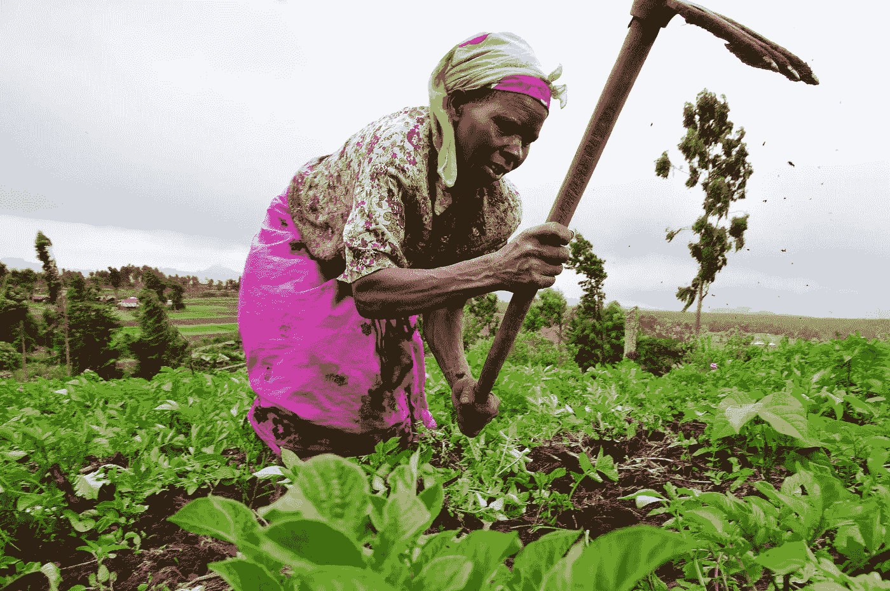

# 世界银行对农业的未来仍然摇摆不定

> 原文：<https://medium.datadriveninvestor.com/the-world-bank-is-still-wobbly-on-the-future-of-agriculture-77b5eee76991?source=collection_archive---------6----------------------->

Image: Wikimedia

今年 10 月 16 日，世界银行在其位于华盛顿特区的总部召开了一次名为“[农村空间的未来](https://live.worldbank.org/future-rural-space)”的会议，会议从全球视角探讨了当前农村世界面临的全景，并从跨国、国家和地方的经验探讨了一些问题的潜在解决方案，世行负责可持续发展的副行长 Laura Tuck 和一个多部门小组(印度农村发展部副秘书 Alka Upadhyaya 卢旺达儒林多区主管经济发展的副市长 Prosper MulindwaHenk Smith，农民，荷兰农民合作社集团 BoerenNatuur 董事会成员；Patricia Gichinga，肯尼亚农业教育内容生产商 Mediae Company 的产品负责人；Ignacio Martínez 是美国研究和投资公司 Indigo Ag 和旗舰先锋公司的董事会成员。

劳拉·塔克首先谈到了农村世界的现状和未来规划，以及由此带来的困难和机遇。她的介绍可以解释为世行的官方立场，因为她级别很高，被邀请主持会议开幕式。她提出，与经常提到的高水平全球城市人口相比，2050 年全球农村人口与今天相比只会减少 30 万人；这一点，加上城市部门对农村粮食生产和平衡的生态系统的依赖，意味着农村环境面临的问题值得研究。此外，世界银行的客户国家(即发展中国家)的农村人口比例超过了全球平均水平。

 [## 忘记石油吧，水是未来。数据驱动的投资者

### 我们不会耗尽燃料的替代品。能源行业曾经是投资者的荣耀，无论…

www.datadriveninvestor.com](https://www.datadriveninvestor.com/2018/11/14/forget-about-oil-water-is-the-future/) 

她指出，农村居民遭受森林砍伐和农村环境退化之苦，明显易受气候变化影响，缺乏获得基本服务的机会，所有这些都推动了移徙和人才外流；如下所示，在过去二十年中，全球农村地区的极端贫困人口比例增加了约 20%。尽管如此，塔克和世行认为农村世界有五个机会:提高农业生产率以减少贫困，利用新的科学技术解决问题，满足农业企业和旅游业不断增长的市场需求，赋予妇女权力；管理土地以获得收入和成果。

然而，世行的提议并没有解决问题的根源，甚至可能加剧这些问题。寄希望于私人资本——会议主持人相对于马丁内斯的评论公开支持的模式和经验——可以创造生产解决方案，但它不会解决基本服务的获取，也不一定会减缓环境退化或毁林。同样，强调提高生产率并将其与农业综合企业和旅游业联系起来并不能解决农村人口的现状。对新技术的信任没有考虑到农村世界现有的电力和生产集中度以及债务周期，所有这些都很可能在这种模式下变得更加根深蒂固，不会因生产更多这一简单事实而改变。虽然积极的一面是承认更加环保也有利于农业产量，并且促进农村女性的领导地位是至关重要的，但这些是否足以克服其他提议的缺陷还有待观察。

还值得一提的是，会议显示了一个很大的弱点，即没有来自拉丁美洲的代表，因为该地区在所讨论的主题方面具有强大的领导力和专业知识，此外，与荷兰或美国相比，贫困水平与世界银行更相关。

一项 1991 年由世界银行资助的对世界各地 68 个农村发展项目的研究发现，最成功的项目除了与当地文化兼容之外，还避免了两个错误:“过度创新”(要求过度变革)和“差异化不足”(假设不同情况比实际情况更相似)。2019 年，世界银行继续提出存在这种或那种问题的解决方案。相反，世行在本次会议上提出的建议确实带来了好处，但无助于世行的明确目标——即消除贫困——也不能保证气候变化的解决方案，而在整个会议期间，气候变化是优先于任何结构性或民主化变革的。来自一个有世界银行背景的机构，这种明显的缺乏远见似乎是不真诚的。