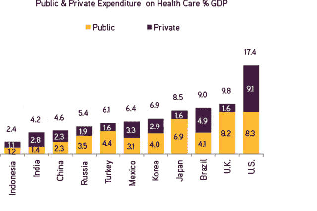

# 世界不是平的——为什么健康创业公司不应该建在后院的三个关键原则

> 原文：<https://medium.datadriveninvestor.com/the-world-is-not-flat-3-key-principles-why-health-startups-should-not-build-in-their-backyard-4ce60af6c7a3?source=collection_archive---------36----------------------->

您是否是一家数字医疗公司，关注漫长的监管流程和面向提供商和付款人的漫长销售周期？考虑到作为一家初创公司，你几乎没有时间和金钱，这是一个存在的问题。如果你在美国，你很有可能处于那种情况。但在全球的许多健康垂直行业中，这种情况越来越普遍。好消息是存在地理套利——这篇文章将试图阐明三个关键原则。

**1)这里没什么新东西，只是管理风险**

世界上最大的健康公司(其中大多数总部位于发达国家)长期以来一直利用小型和/或新兴市场进行市场推广。例如，美敦力在新西兰和澳大利亚进行了许多临床试验——这些国家的人口和经济状况与美国有些相似，但 cro 很强。印度和巴西等新兴市场在 cro 方面的增长甚至更快，特别是在药物开发成本不断增加的情况下，生物制药公司专注于提高生产率。总之，首先进入其他市场并不是什么新鲜事，这种情况越来越多，因为有更高的需求和更容易的管理方式。

远程管理任何业务都存在明显的风险，即你可能没有足够的市场知识或业务关系。很明显，你将不得不远距离管理人员，并因时区差异、潜在的语言和文化以及运输而产生开销。但关键是这些都是久经考验的挑战，有着悠久的解决方案历史，企业家可以最小化这些风险。

**2)在另一个市场起步和扩展更容易**

传统智慧是你想在你的后院开始并扩大你的生意。但是说到健康，这并不是最有效的途径，因为世界不是平的。例如，专注于糖尿病、高血压和共病的硅谷初创公司通常会考虑德克萨斯州和美国南部，因为那里的需求非常迫切。一个典型的例子是 Omada，它与 Costco 等大型雇主和 Blue Cross 等大型健康计划合作。或者 CareMessage，它使用短信来帮助患者获得和遵守治疗。这甚至适用于专注于走向市场的初创公司，例如 Livmor 正在夏威夷测试其房颤解决方案。

同样，与其他国家有联系的企业家通常会在那里建立他们最初的市场基础，这不仅仅是出于熟悉，而是因为这样做有一种商业韵律。Amicomed 已经在意大利试用其血压产品，与当地最大的保险公司密切合作。事实上，欧洲的国家付费者是一个明确的杠杆，举个例子，让你自己加入英国国民医疗服务体系，就意味着能接触到 6000 万人。遗传学初创公司通常会首先考虑冰岛或中国，制药公司通常会考虑印度，所有这些都是由数据和人员的访问驱动的。

**3)对于 B2C 考虑新兴**

在经济合作与发展组织(OECD)中，也就是大多数发达国家，公共卫生服务都有很强的税收支持。美国实际上是一个主要的例外，那里仍然有相当多的私人支出，尽管其中相当大一部分是自付的。因此，如果你正在建立一个 B2C 的医疗保健企业，那么在新兴市场建立会更容易，因为那里的人们更愿意直接为医疗保健付费。

*这些都是专注于实践见解的短文(我称之为 GL；dr —良好的长度；确实读过)。如果它们能让人们对某个话题产生足够的兴趣，从而进行更深入的探索，我会感到非常兴奋。我在三星的创新部门* [*NEXT*](http://samsungnext.com/) *工作，专注于深度科技领域软件和服务的早期风险投资，这里表达的所有观点都是我自己的。*