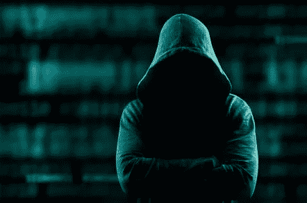
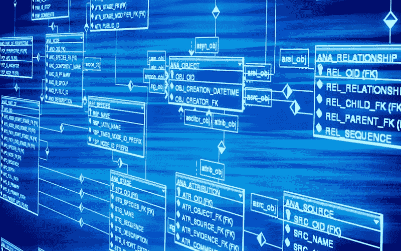
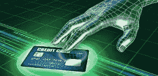
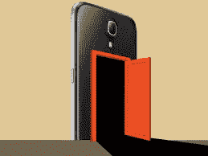
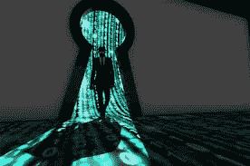

# 世界末日:一把直接通向你个人数据的万能钥匙

> 原文：<https://medium.datadriveninvestor.com/the-worlds-end-a-universal-key-straight-to-your-personal-data-443de6008060?source=collection_archive---------15----------------------->

S *停好车*从梦中，我脑海里浮现出一个*灾难性的和意想不到的*想法；**万能钥匙**。

The Universal Key

这把钥匙最终会造成无法理解的破坏。现在想象一下，一把钥匙被普遍地连接到世界上每一个可能的设备和系统上。

我做了一个梦，梦见有人试图进入我的 Surface 笔记本电脑。他们锁定了表面，试图猜测我的“pin”，它永远不会打开，由于被锁定。它来到我的问题；如果我的所有设备都锁定了相同的 pin，会怎么样？这种想法实际上是在人们因多次试图“闯入”而将你的手机或其他设备锁在外面后，对他们进行干扰。

接下来我想到的是:如果有一把万能钥匙，可以打开世界上所有的软件和设备，那会怎么样？

这对每一个人来说都是极其危险的，不管是活着的还是死去的。

每一份数据都在网上，在服务器上，在这些数据库里保存着每一份活文件，所有你能想象到的东西。

T 思考一秒钟，意识到这个*“云信息”*可以从**任何地方**访问，这是现代世界中信息技术的优点:但是有了钥匙，普遍能够阻碍和找到进入任何东西的方法，导致彻底的毁灭。

从你的工作文件和所有凭证，你有政府的计划，黑匣子，和所有私人数据:都到了这个万能钥匙的守护者手中。

你可能会问这会对你产生什么影响。

这怎么可能伤害到你，

也许你根本不用网络。

现在，这个定义的密钥可以访问任何凭证。花一分钟想一想每一件可能发生在 T21 的事情。

政府

人

个人数据

公司数据

未来建设计划

*   等等

即使你在网上什么都没有，每次你坐飞机或者在办公室输入求职信息，甚至你的出生记录和你的钱。

# 金钱

您的税收

你的账单

您的信用评分

您的储蓄

*   如；你的股票、债券、实物储蓄等

你的钱

*   意义；从银行账户信息到您的个人识别码和卡号，再到您的银行账户，无所不包

现在只有持有者有一个进入每个数据库的后门，尽管他们可以访问你所有的个人证件和存款。从银行业务到个人账户等等。

这将如何影响全球经济？

作为这把万能钥匙最重要的主题之一，大多数人会把它用于金钱目的，给自己钱。

# 然而，这能在全球范围内造成什么真正的破坏呢？

把每一个*市场*都考虑进去。所有这些都存储在数据中心，成百上千万亿字节的数据无限期地存储在数百万台服务器中。随之而来的是许多不同的可能性，最终可能导致许多*灾难*。

The Transfer of Money

网上的一切是我们现代世界的一个惊人特征，与之形成对比的是，它仍然是一个毁灭性的事实。

# 我们的全球经济会一落千丈，媒体会在恐惧中疯狂爆发，这把钥匙会进入每一个市场。

All Stock Would Crash

想象一下，如果有人搅动这些市场，我们已经每天看到媒体如何影响股票市场，现在想象一下，如果这样的媒体爆发为任何数据库的全球关键。即使这个持有者没有触及股市，它也会疯狂爆发。

如果我们想一想，

我们还会意识到，这个后门不仅会让持有者进来，还会允许他们更改任何他们想要的数据。他们可以改变股东的价值，让自己成为百万富翁，让其他公司倒闭，制造混乱。

# 政府

政府将被迫关闭他们的所有程序，以防止所有可能的攻击，或者举行私人会议，以确保自身安全。

他们必须呆在不可能被录音的房间里，并且不做任何记录，只能用纸来记录。

什么都不能再被记录了，政府将被迫停止使用科技。

他们不可能保持完全的控制，因为骚乱可能爆发，新的大萧条可能开始。*不再备份数值，可以被钥匙持有者擦除和移动，甚至记录数值***的数据也可能消失。*只有*现金*会维持它的理论价值*(如果它真的维持的话)。**

*我们所拥有的一切生活将会变成另一种生活方式，仅仅是因为一个后门。*

# *后门*

*进入设备的后门允许攻击者简单地通过另一个通道进入，例如设备的另一个管理员。*

**

*这些后门已经争论了很多年。最初，美国政府与苹果公司争论他们设备的后门，就像他们与谷歌和其他程序一样。*

*这些后门被**拒绝**给 *FBI* ，因为*苹果*拒绝以任何其他方式进入他们的安全设备。*

*后门会导致问题，比如其他黑客能够进入设备。*

*现在，我们的万能钥匙是一个实用的凭证，是每一个可能的设备的后门。*理论上，**

**这将允许任何人使用相同的凭证作为任何设备的后门，从路由器到台式机*。*

***总结***

*总之，我们可以*得出*结论，对每一个设备的后门都是灾难性的**。说起来很容易，如果你能导致世界注意力分散，导致所有经济和个人记录的可怕结局。世界上每一个设备的后门都是非常可怕的，如果给了坏人。***

*请记住，我不是在告诉你*如何接管这个世界*，而是在强调这样一个事实:我们应该阻止任何可能伤害我们的黑门的产生。有许多例子表明这些恢复工作是多么危险，许多黑客在他们最初控制设备后利用它们重新进入设备。总的来说，我相信这个通用后门的整个想法，虽然是灾难性的，但却非常有趣，是一个“惊人的想法”。*

# *所以，你看到了，世界末日。*

*我们现在可以得出一个*决议*破解一把**万能钥匙**是完全和几乎不可能的，尽管如果它*发生*在错误的人手中，我们的生命很可能**就像我们所知道的那样结束。***

**

*一把*万能钥匙*的断裂是，而且会是*可怕的*。尽管这是一个有趣的话题，但不可否认的是，这种爆发将会彻底摧毁现代化的大部分。*

*希望你对这篇文章感兴趣，本周好好休息。*

*别忘了继续学习…*

*直到下一次，*

*…尽量不要被黑…*

*作者:*

*欧文·桑顿*