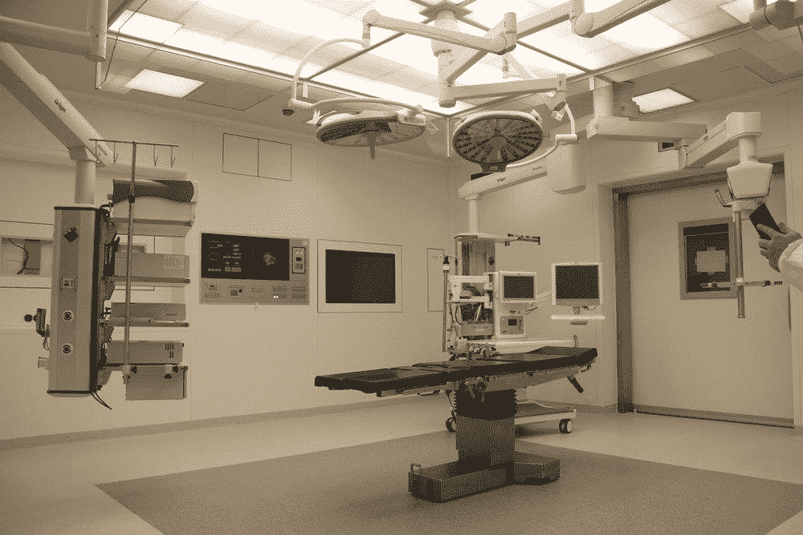
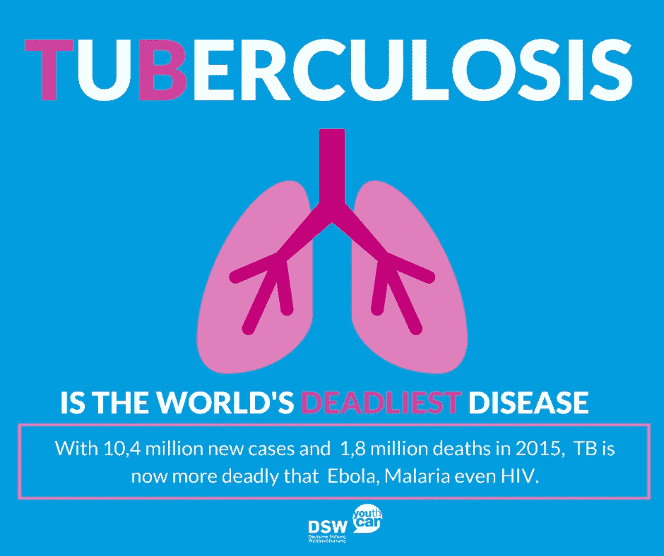
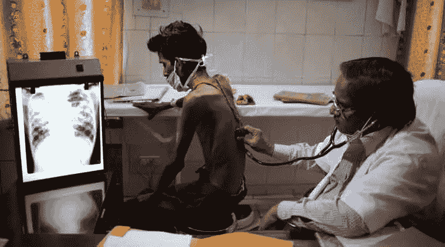
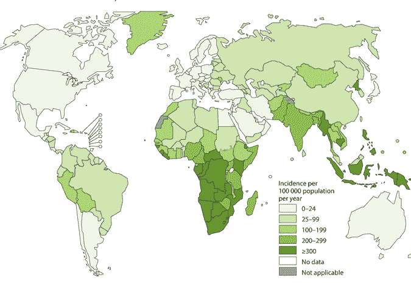
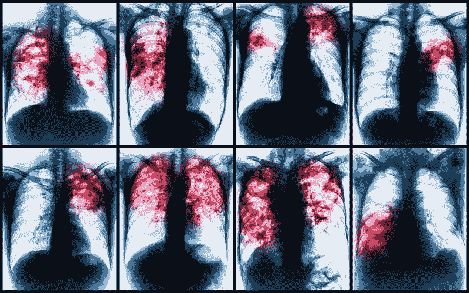
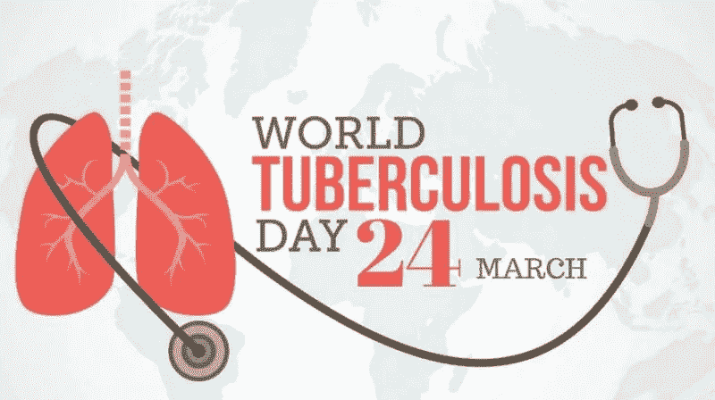

# 世界上最致命的传染病对抗艾

> 原文：<https://medium.datadriveninvestor.com/the-worlds-most-deadly-infectious-disease-vs-ai-44ac72922ff2?source=collection_archive---------4----------------------->

## 使用卷积神经网络检测结核病

如果告诉你同样的凶器被用来杀害图坦卡蒙国王、弗雷德里克·肖邦、夏洛特·勃朗特和纳尔逊·曼德拉，你会相信吗？

嗯，是真的。*算是吧。*

这些人不是被谋杀的，但是他们*确实*都死于**肺结核**(肺结核)。

 [## 挑战你对人工智能和社会的看法的 4 本书——数据驱动的投资者

### 深度学习、像人类一样思考的机器人、人工智能、神经网络——这些技术引发了…

go.datadriveninvestor.com](http://go.datadriveninvestor.com/4AI1) 

尽管结核病已经存在了几千年，但时至今日，它仍是全球最致命的传染病。

虽然在你肺部生长的感染对你来说不算太大，但对你周围的任何人来说都很糟糕，因为它通过呼吸在空气中传播。当感染者咳嗽或大笑时，他或她会释放更多的细菌。

所以没关系。任何患有结核病的人都不能咳嗽或大笑...还是呼吸？

嗯，那对感染了导致结核病的细菌的 20 亿人不起作用。

现在我有好消息和坏消息。好消息是结核病可以被诊断和治疗。坏消息是不到 60%的结核病患者接受了结核病筛查，这限制了治疗并导致了可预防的死亡。大约有 360 万人被误诊，没有得到治疗。

> 结核病是全球头号传染性杀手，也是艾滋病毒携带者的头号杀手，占艾滋病相关死亡的三分之一。2017 年，约有 160 万人死于结核病，其中包括 30 万艾滋病毒感染者。

你会认为，有了数千年的经验和大量最新的生物技术进步，至少诊断不会成为问题。但是结核病的基本诊断方法已经有一个多世纪没有改变了。

新的结核病基因测试使快速识别需要结核病治疗的人成为可能。然而，像艾滋病和疟疾这样的疾病的简单快速检测是急需的。

Countries most affected by TB

另一个主要问题是，在许多发展中国家，即使设备(如 x 光机)可用，也没有医疗专业知识水平来成功诊断它。仅六个发展中国家就占了全球新增结核病病例的 60%——印度、印度尼西亚、中国、尼日利亚、巴基斯坦和南非。

> “(对于结核病)迫切需要快速、廉价和准确的预测和诊断工具”。

# 一个人工智能来拯救

**这就是 AI 可以进来** *的地方。*具体来说，卷积神经网络(CNN)是一种用于图像分析的神经网络，可以以更低的成本更快、更准确地完成这项工作。对于 CNN 的评论，你可以看看这个[精彩的介绍](https://medium.com/@ageitgey/machine-learning-is-fun-part-3-deep-learning-and-convolutional-neural-networks-f40359318721)。

Chest Xray

*所以我想，为什么不自己试试呢？*使用一个组合数据集(来自美国国家医学图书馆，与中国深圳第三人民医院合作)**我建立了一个模型，可以查看胸部 x 光片并预测一个人是否患有结核病。它有超过 80%的准确率！！**

该模型在 800 幅图像上进行训练，并使用 Tensorflow.js 作为 web 应用程序进行部署，因此可以轻松扩展。

# 这是怎么做到的

代码可以分为两部分——数据预处理和建立模型。要查看我的完整代码，你可以点击这里。

## 数据预处理

在导入基本库(Tensorflow、Keras、NumPy 和 Pandas)和数据集之后，我们添加所需的增强图像的数量(这样我们就可以有一个增加的数据集)。然后，我们创建一个包含所有图像的数据框。

然后我们给图像加上标签，0 表示没有肺结核，1 表示有肺结核。训练集和测试集是分开的。

为了完成数据预处理，我们创建一个包含所有图像的基本目录，并通过分隔类型的文件夹向其中添加一些结构。

## 构建模型

首先，我们设置生成器，然后创建模型架构。辍学率设置为 0.3，意味着在每次迭代中将忽略 30%的数据，以防止过度拟合。

一旦训练结束，我们就可以使用验证集进行评估，并绘制混淆矩阵。

要部署 web 应用程序，我们还必须转换到 tensforflow.js。请单击此处查看 web 应用程序！

# 那么，结果如何？

总的来说，这个模型运行得相当好，80%的准确率当然是一个好的开始。然而，眼下就是这样，*一个开始。*这无疑是一项正在进行的工作，可以改进，主要是从数据集中改进。由于 800 的数据集远远不够，这可以被添加和改进得更多。

不要忘记在今年 3 月 24 日纪念世界防治结核病日时提高认识和传播信息，这样我们就可以迈向一个没有结核病的世界！

*感谢您的阅读！如果你喜欢这篇文章，请留下一些掌声，关注我的媒体和 LinkedIn，或者查看我的个人网站，了解我在人工智能方面的进展。*