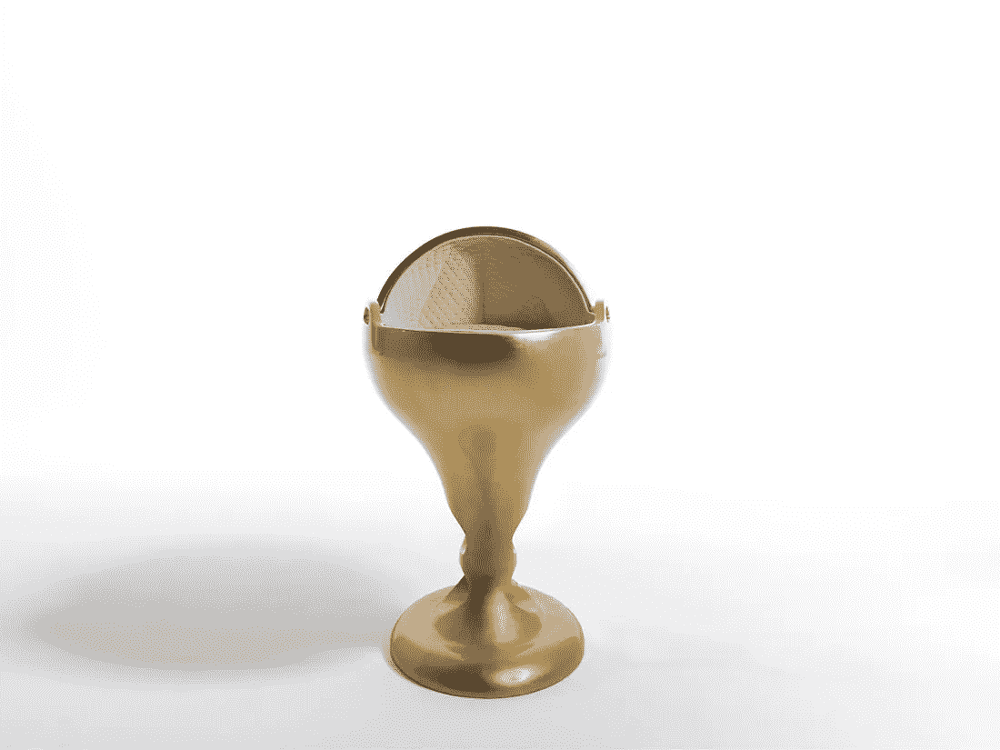

# 世界上最贵的婴儿床

> 原文：<https://medium.datadriveninvestor.com/the-worlds-most-expensive-crib-5dbe7cc7ad40?source=collection_archive---------3----------------------->

含着银汤匙出生的婴儿现在可以用多种方式变成金子。西班牙奢侈婴儿用品制造商 Suommo 制作了一款手工钻石和玫瑰金奶嘴，售价近 14 万美元。

虽然这听起来有些夸张，但与终极婴儿配件相比，这根本不算什么:一个重达 188 公斤、价值约 1670 万美元的纯金摇篮。

这款限量版婴儿床被称为世界上“最昂贵的婴儿床”，由 24k 黄金制成，配有 Suommo 黄金系列床上用品中的床垫、枕头、被子和床单。忘掉甜蜜的梦吧。试试金色幻想。

*2014 年首次发表于《金融家》*

【jenserikgould.com】