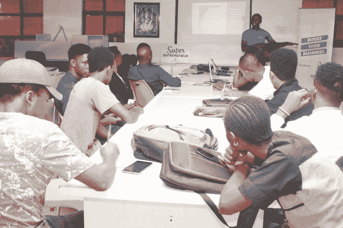

# 他们的故事值得一看

> 原文：<https://medium.datadriveninvestor.com/theirs-are-stories-to-behold-3cb18a55cc72?source=collection_archive---------9----------------------->

## 讲故事创造联系和关系

成功的企业建立在有效的故事之上。人们喜欢看、读或听故事。这些故事创造了一种基于同理心的人际关系。

当你通过一个故事来推广你的品牌时，你不是在试图说服观众购买你的产品。你们分享一个经历，把决定权留给他们。

 [## 社交媒体收听让您随时了解|数据驱动型投资者

### 虽然社交媒体倾听是一种顶级趋势，但它应该是每个现代营销策略的一部分。保持和谐…

www.datadriveninvestor.com](https://www.datadriveninvestor.com/2019/02/26/social-media-listening-keeps-you-plugged-in/) 

对 T2 来说，这就是说服的艺术。他以此为生。

Yateghtegh 是一名数字营销策略师，也是尼日利亚[sky hub](https://twitter.com/SKYHubNigeria)的创始人兼首席执行官，这是一家创意数字营销机构，致力于在社交媒体营销、搜索引擎营销、搜索引擎优化、分析、内容营销和培训方面提供卓越服务。

在一次[非洲推特聊天](https://twitter.com/AfricaTweetChat)中，Yateghtegh 解释了讲故事如何作为一种学习、分享信息和建立联系和关系的方式服务于社交媒体。这就是为什么他认为这是营销人员的首要任务:

*   讲故事能让营销人员与观众建立更深层次的联系。
*   这是一种强有力的学习方法。
*   它可以是一个重要的战术工具，让营销人员在一个碎片化的媒体世界中吸引消费者。

Yateghtegh 说:“讲故事使营销人员能够了解市场上正在发生的事情，以及这对顾客、消费者、社会、品牌和公司意味着什么。”

故事为品牌建立了一个社区。Yateghtegh 认为，这就是为什么讲故事的质量比数量更重要的原因，其中包含以下要素:

*   品牌角色可以用故事来创造。
*   个性凸显。
*   情调。
*   讲故事可以建立互动的结构。

“你的故事为伟大的约定铺平了道路，”他说。“在伟大的故事上建立一个社区不仅会给你一个线索，还会增加你的社区参与度。”

无论是大企业还是小企业，视频对于讲故事都至关重要。

Yateghtegh 说:“视频不仅仅是一种短暂的时尚或一种新颖的展示方式。“这是通过情感联系与观众建立关系的一种强有力的方式。视频是我们本能反应的媒介。

“除了视觉刺激，视频还能引发观众的情绪反应，这要归功于情绪传染的科学现象，”他说。“当你的观众观看视频或故事时，他们的情绪开始反映屏幕上的内容。”

# 扣人心弦的悬念

Yateghtegh 将此与观众观看恐怖电影时焦虑的身体感觉相比较。

“相对于书面文字，视频已经给了你优势，”他说。“人们保留视觉图像信息的时间要比文字长得多。如果你想让你的视频交流在你的观众心目中经久不衰，讲故事是一个理想的工具。”

Yateghtegh 认为视频具有创造力:

*   难忘的回忆。
*   帮助你建立一个部落。
*   有助于获得有利可图的和人性化的访问。

企业家应该利用 Instagram、脸书和 WhatsApp 的故事来营销他们的品牌。Yateghtegh 引用了这个关键统计数据:Instagram 和 WhatsApp 的全球每日故事用户数量超过 4 亿，而脸书的使用量较低。

Yateghtegh 说:“故事是一个创造性的游乐场，是吸引精通手机的年轻人的一种诱人方式，也是影响者营销的最新趋势。”

“Instagram、脸书和 WhatsApp 是用来营销你的品牌的最灵活的工具，”他说。“他们以低成本和高参与率与观众沟通。人们看故事的时间比聊天的时间多。”

简明扼要会带来好处。

“通过这样做，你必须保持视频的简短和精确，”Yateghtegh 说。“你的故事将推动更多的探索。”

在他看来，所有的品牌都应该用讲故事的方式。

“以使命和愿景为例，”他说:

*   使命:你的品牌为什么存在的故事。
*   愿景:为你的公司、品牌和产品描绘一幅令人信服的未来图景。这是对你的品牌讲故事的行为。

“一个没有故事的品牌就像没有引擎的火车或者没有黄油的面包，”Yateghtegh 说。"强烈建议所有品牌都参与到讲故事的活动中."

这就是为什么他说讲故事是内容营销的未来:它是古老的。

Yateghtegh 说:“自从人类第一次说话，或者远在那之后，我们就在讲故事了。”“除此之外，它还是构建内容的平台。

他说:“[可口可乐](https://twitter.com/CocaCola)在他们的视频中配有标题‘品尝这种感觉’，这是一个典型的以情感和感觉为支撑的视频故事。”“没有人愿意错过它。”

# 谈话要点

Yateghtegh 说，营销人员应该将这些讲故事的原则纳入他们的策略:

*   选择一个相关的主要人物。
*   把最好的元素放在你故事的开头。
*   了解关系。
*   保持你的故事的真实性。

“大多数有影响力的人追求金钱和时刻，忘记了讲故事中的精酿啤酒可以让他们保持收益，”Yateghtegh 说。"遵循这些原则会大有帮助。"

他发现使用 twitter 线索提及品牌和 tweeps“非常有效”

“明智地使用提及可以增加你的品牌曝光率，”Yateghtegh 说。“你想吸引某个特定账户的所有者和关注者的注意，但必须在合适的背景下。

“例如，提及品牌的一种有效方式是分享你的博客帖子，讨论社交媒体管理工具的使用，”他说。

Yateghtegh 指出，品牌网站、企业形象、视频制作和摄影的每个方面都是由品牌定义的。

“讲故事是内容营销的未来的主要原因是:它有助于与观众建立更深更强的联系。它给你的内容增加了人性化的元素，因此也增加了品牌，”他说。

“讲故事超越了广告，”Yateghtegh 说。“这让人们更容易信任你的品牌。它让企业在一个碎片化的媒体世界中与客户互动。故事有助于将你的内容结合在一起，而不是分散开来。”

好的故事讲述是外柔内刚的。

“故事有助于以最愉快的方式分享你的品牌愿景，”Yateghtegh 说。“一个故事精彩的企业能够轻松击败竞争对手。

“故事是创造品牌忠诚度的最成功的武器，”他说。“这意味着人们更愿意通过口碑营销来推广你的产品或品牌。这是推广一项业务的最佳方式。”

**关于作者**

吉姆·卡扎曼是[拉戈金融服务公司](http://largofinancialservices.com/)的经理，曾在空军和联邦政府的公共事务部门工作。你可以在[推特](https://twitter.com/JKatzaman)、[脸书](https://www.facebook.com/jim.katzaman)和 [LinkedIn](https://www.linkedin.com/in/jim-katzaman-33641b21/) 上和他联系。

*原载于 2019 年 11 月 14 日*[*https://www.datadriveninvestor.com*](https://www.datadriveninvestor.com/2019/11/14/theirs-are-stories-to-behold/)*。*