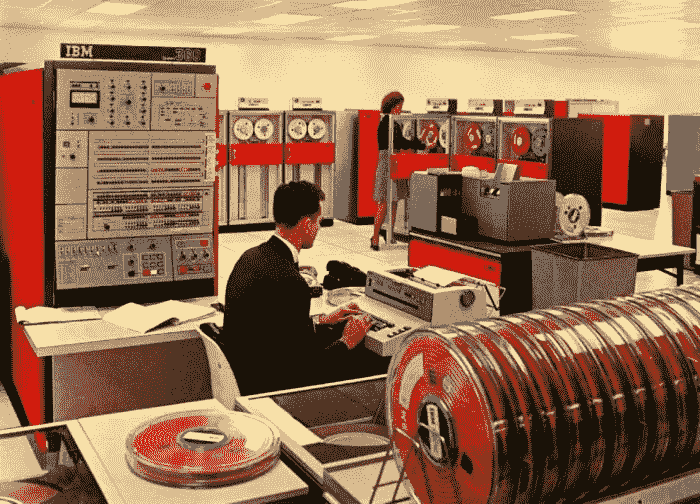

# 整合区块链和人工智能-1

> 原文：<https://medium.datadriveninvestor.com/theoretical-background-of-ecoverse-1-to-integrate-blockchain-and-artificial-intelligence-44844f61530a?source=collection_archive---------34----------------------->

# —# EcoVerse 的理论背景

在 20 世纪 80 年代，个人电脑的最大内存容量是 640KB。当时韩国科学技术院(#KIST)的计算机中心的数百名程序员使用的是内存只有 4MB 的大型计算机。所以相比之下，640KB 的容量对于一台个人电脑来说是巨大的。现在，一台个人电脑的容量远远超过 1 兆字节，比过去大了 100 万倍。在 20 世纪 80 年代，如果有人说“640KB 对每个人来说都足够了”，那么这听起来很合理。然而，按照今天的标准，这听起来完全是愚蠢的。(有人声称比尔·盖茨说过这句话，但他坚决否认。)[1]

IBM 360/3032 with 4MB shared by hundreds of programmers

最近，我参加了一个论坛，在那里我们讨论了区块链和人工智能(AI)。一些小组认为，将人工智能技术应用于区块链是不可能的，因为两者的技术性质非常不同。他们的逻辑是，作为数据库技术的区块链旨在实现不可逆的稳定性，而人工智能则读取动态数据并从中获得洞察力。然而，他们假设世界上的每个开发人员都会在自己的知识框架内进行研究。他们看不到区块链和艾之间的联系，因为他们被自己的思维局限住了。我不同意，并不是世界上每个研究人员都会这样工作。

这些天我听到了类似的观点。例如，有人认为主干网的发展必须停止，因为它们是不必要的，或者已经有太多了。这个论点类似于“640MB 对每个人来说都足够了”的说法对于 MS-DOS 来说已经足够了，所以没有必要再去研发更大的内存。

EcoVerse 主网的开发始于解决当前主网的问题。迄今为止，主网类似于个人电脑的 MS-DOS。他们有许多严重的问题和错误设计的组件。从根本上说，我同意#加密货币评论家，纽约大学经济学教授鲁比尼，也被称为末日博士，他说“加密是所有骗局和泡沫的母亲和父亲”[2]。从计算机科学的角度来看，我非常同意“加密货币的程序化自我毁灭”的说法，这是伦敦大学学院库尔图瓦教授写的一篇论文的一部分[3]。

我最近在 Medium 上发表了 7 篇系列文章(在 Steemit 上用韩语发表),讲述了为什么自我可持续性对于区块链平台和加密货币是必要的，以及在 main-net 中自我可持续性有哪些好的属性。[4][5][6][7][8][9][10]

在这些帖子中，我解释了区块链的问题，以及为什么 EcoVerse 团队决定使用经济学、哲学和社会心理学的具体理论。此外，我从技术上解释了计算机科学和人工智能是如何结合的。

在下一篇文章中，我将介绍 EcoVerse 使用的区块链和人工智能技术，包括人工智能如何解决 Roubini 教授批评的区块链基尼系数问题。

参考

[1]计算机世界。“64 万”这句话不会消失——但盖茨真的说过吗？[https://bit.ly/2DWY5J4](https://bit.ly/2DWY5J4)T2【2】福布斯。经济学家努里埃尔·鲁比尼说‘区块链没用，所有的 ico 都是骗局’[https://bit.ly/2DYNRYK](https://bit.ly/2DYNRYK)
【3】尼古拉斯·t·库尔图瓦。“论最长链规则和加密货币的程序化自毁”，[https://arxiv.org/abs/1405.0534](https://arxiv.org/abs/1405.0534)
【4】李永文“尼克”。自我可持续区块链的要求，第 1 部分。[https://bit.ly/2KDiV0D](https://bit.ly/2KDiV0D)
【5】李英焕“尼克”。自我可持续区块链的要求，第 2 部分。[https://bit.ly/2RrkXne](https://bit.ly/2RrkXne)
【6】李英焕“尼克”。自我可持续区块链的要求，第 3 部分。https://bit.ly/2PPgZUy。
[7]李英焕“尼克”。自我可持续区块链的要求，第 4 部分。[https://bit.ly/2PI6tlL](https://bit.ly/2PI6tlL)。[8]李英焕“尼克”。自我可持续区块链的要求，第 5 部分。【https://bit.ly/2A75zVs
[李英焕“尼克”。自我可持续区块链的要求，第 6 部分。](https://bit.ly/2A75zVs)[https://bit.ly/2TwxFlV](https://bit.ly/2TwxFlV)
【10】李英焕“尼克”。自我可持续区块链的要求，第 7 部分。(英文翻译版即将推出。)