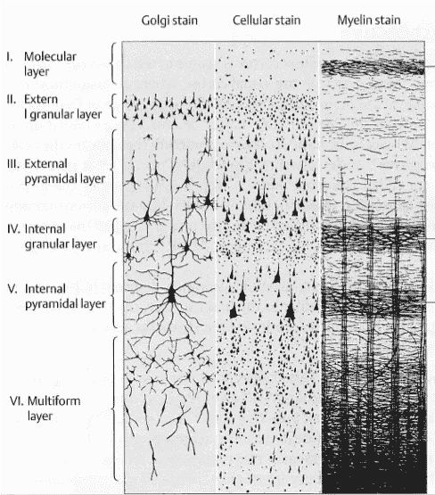

# 理论和心智模型

> 原文：<https://medium.datadriveninvestor.com/theories-and-mental-models-691aa9b73a13?source=collection_archive---------18----------------------->

概括是如何形成的？事物之间的共享元素是如何抽象出来的，这些抽象是用来形成理论还是建立心智模型？

我首先提出的一个问题是:是什么让事物具有相似性？

检测相似性的一种方法可能是检测共同元素(不变量)

猫和它的爪子类似于狗和它的爪子，这是显而易见的，因为爪子和爪子都具有猫和狗脚上的属性。

这甚至适用于更远的关系，例如“猫对狗就像女孩对男孩”——猫和雌性之间以及狗和雄性之间存在松散的联系。事实并非如此，但大多数人会认为这是与其他事物的类比，比如“猫之于狗，就像乌龟之于亚瑟·C·克拉克。”

我认为识别和形成类比的过程与识别组成抽象概念的元素有关:狗和猫都有腿的事实(因为“猫是爪子，就像人是脚趾甲”在某种程度上也适用)是动物的一些共同属性，也有更抽象的含义:“用于运动的东西”——它有一条腿的具体表现， 虽然这也是一个抽象的概念，因为人们可以将人的腿视为类似于汽车的车轮(或车轮+支柱组件)……我认为在认知科学中，狗的腿或猫的腿或人的腿将被视为腿的概念的范例，或上文提到的“用于运动的东西”。

长话短说，我知道这里有一些跳跃，我会提出抽象思维建模方法中的一个组成部分是跨模态识别组成属性的过程(我不太确定该怎么称呼这个过程，因为我们在谈论所有可能使一个事物与另一个事物相似的事物，在不同的抽象层次上——我这么说是因为就像生物学中的分类学一样，你走得足够远，任何两个动物都将处于同一王国)。所以当人们问“具身认知是产生一般智力的必要条件吗？”在我看来，答案是肯定的；对我来说，这些抽象和一般的元素中的许多似乎最终与本质上是感觉运动的东西联系在一起(其中组成概念的“意义”来自于，甚至可能**与它相关联的感受性——无论它的物理/神经关联是什么**)【0】。例如，“红色”的概念是在对应于红色的波长范围内的东西，重或轻的概念对应于移动一个物体所需的功的数量的记录，爪与爪的概念与该物体的机械属性有关，具有感觉运动能力的实体通过观察直觉(人们看到爪可以抓，爪和爪都有助于在光滑的表面上产生牵引力，尽管只有爪可以用来爬树，等等[1])。

世界的心智模型和理论是建立在这些抽象的属性上吗？由于上面描述的所有属性和关系，一个人有一个狗或猫的心理模型:狗有爪子，可以爬山(通常对人很好)，猫有爪子，可以抓挠和爬树(通常对人的行为不同于狗)，等等。这个关于狗或猫是什么(以及一般的动物是什么)的理论，被一个晨跑的人用来计划如何与他们在慢跑时看到的狗或猫互动。

一种基于共同属性的抽象机制能否解释一些“本土理论”，或者可能是基因引导的概念性知识(如各种先验知识)如何能够被开发出来？[2]例如，数感，理解数字概念的能力。**数量感一定是遗传自举的吗，或者提取和抽象的能力使人类大脑/思维能够观察到“一”、“二”、“三”作为一、二和三个事物集合的共同属性，然后通过一些单独的模式理解能力(可能是归纳)理解这种“X”延伸到任何有多个相同事物的事物**(以及数字的抽象概念——这在整个人类历史中并不存在)？

神经元数量少的动物怎么会有复杂的行为？我想知道神经元在某种意义上是否类似于基因，它们有点像红鲱鱼……许多植物比人类有更多的基因。如果重要的是神经活动的模式(时空的)，那么在神经元的数量之上还有一个额外的层。

此外，如果我们假设所有的概念都是神经活动的模式，那么对于概念之间的不变量，或者是什么使得事物相似，可能有一个简单的解释:它们是模式的重叠部分。

> 如果是这样的话，如果对心理表征的操作可以被证明可以归结为一些基本机制，那将构成大脑确实有一个“主算法”的理论证据，不是吗？

什么构成了在工业规模上产生事物如何工作的理论(可以这么说)？基于规则的系统可以用于进行某些类型的研究，其中可以通过迭代输入变量的组合来设计实验，并通过这种方式获得知识。一个事物如何运作或一个事物是什么的理论模型是如何构建的？

什么构成了抽象表现？比方说，当一个孩子了解他们家的狗时，他们通过直接互动和视觉输入形成了一个心理模型*(这是狗的样子，当狗叫时，它在说 X，当我早上开门时，它拿着报纸)*。后来，孩子学习不同类型的狗，与狗的具体实例互动。再后来，当孩子发现邻居的猫时，他们可能开始形成一种抽象的四条腿的毛茸茸的宠物形象。更晚些时候，这些都成为他们关于四足动物是什么的“理论”(可以这么说)的一部分，允许人们对这些实体的预期具有预测能力。从猫和狗身上，一个人明白了四条腿的动物，一般来说，很敏捷，可以高速奔跑，而且爪子会造成伤害。当遇到更大的猫科动物比如山狮，或者有蹄子的动物比如马，之前形成的理论应该会做出一些预测。

然而，这些抽象的表象在大脑的某个部分是实际的离散的东西，这也许是一种错觉。将我们的知识建模为居住在某个特定的位置*(“这里是我所知道的位于位置 A、B 和 C 的所有餐馆”**)*，这是很有诱惑力的，但是可以证明，有一些“特定的”类别必须在运行中生成*(我在过去几个月里去过的旧金山的墨西哥餐馆)[3]* 。换句话说，如果一个人可以构建任意的事物类别，那么这个事物列表看起来就不会“存储”在一个特定的位置[4]。

虽然我不是专家，但我可以根据以下几点进行推测:

1.  这些元素中的大部分在本质上都是多模态的*(狗的长相、气味、皮毛的感觉、叫声等等)。)*
2.  大脑皮层的横截面看起来像这样:

第 2 层和第 3 层是胼胝体(连接大脑两个半球的纤维束)的轴突所在的地方。我们知道大脑皮层的不同区域负责不同类型的处理(brodmann 区域)[5]，因此任何类型的多模态心理模型都必须——根据我们对大脑物理结构的了解——存在于不止一个特定的位置。抽象的表现似乎更类似于一种神经激活的模式。

也许这些神经模式的形成，这些表征，是人类存在一次性学习或没有大数据集的学习的原因:*当最初遇到时，抽象表征/心智模型/理论/先验的立即形成……不管那实际上意味着什么[6]。*

此外，学习一个事物可能会从一个相关事物的抽象表象中得到帮助(就这两个事物的哪些部分是相似的而言)。例如，一个知道如何驾驶乘用车的人会发现与驾驶商用卡车有一些共同之处，并且可能比从未驾驶过四轮车的人更容易学会成为卡车司机。这是如何工作的？

在我看来，隐喻是上下文中的类似事物。沃尔特·J·弗里曼说:“几个世纪以来，大脑一直被描述为动态系统，从笛卡尔开始，他认为松果体是灵魂用来调节精神液体泵入肌肉的一种阀门……随后是时钟、电报和电话系统、热力学、数字计算机和全息照相的隐喻。然而，大脑并不“像”任何人造机器。如果有的话，它们就像恒星和飓风等自然的自组织过程。”

如果这类东西让你感兴趣(就像我一样)，去大学的生物科学图书馆看看。

[0]我听说过“语言基础”这个术语用来描述类似的东西——大多数名词和动词最终都与世界/客观现实中的外部事物联系在一起。

[1]抓挠、牵引、攀爬本身就是抽象的概念，可以分解。例如，刮擦是轻划或切割动作与表面之间的一种*关系*。牵引也许是三者中最抽象的，尽管注意到一个人可以“挠痒痒”，这不是身体上的，一个社会运动可以获得牵引，等等。

[2]例如，面部识别是由基因引导的

[3]我不能不假思索地引用这一点，但这是从 80 年代的工作中得出的结论，与知识储存在大脑中某个特定部位的观点相反，现在人们认为信息在大脑中有许多不同的编码和表达方式

[4]或者也许大脑有一个内置的 SQL 查询处理引擎……尽管如果有人试图在大脑中自上而下地存储模型，就像存储数据库一样，会有一个阈值，在这个阈值上，模型必须映射到物理关联。在数据库的情况下，表的内存树表示映射到文件系统中的某种线性表示，而操作系统缓存的任何文件最终都以相当直接的方式映射到存储介质，因此任何提议的存储机制都必须有神经关联。

[5]某些类型的处理总是发生在相同的地方(Brodmann 区域)这一事实对我来说似乎暗示了人类大脑发展表征的方式的某种结构；如果我们可以看到顶级过程的发展，如视觉/听觉/触觉感知，运动的规划/控制/执行(运动皮层)，在所有人类中都是确定的，这种确定性可能随后存在于神经回路的其他水平*【编辑:这似乎是事实，至少部分如此。在《如何创造心灵》一书中，雷·库兹韦尔引用了凡·j·韦丁的话，他发现“大脑的路径遵循一个由……早期胚胎形成所建立的基本规划”]*

[6]我有一个个人信念，来自于我第一次在[智能涌现](【https://mitpress.mit.edu/books/intelligence-emerging】)中读到的，它描绘了生物智能、人工智能、进化和系统/涌现之间的一些概念。生物界这么多东西本质上都是搜索(胚胎发育时连接到脊髓的神经元，有丝分裂时的细胞内过程，进化本身等等。)随着不同类型的涌现，局部约束和行为产生了全局结构。此外，很多自然过程都是 SDIC(对初始条件的敏感依赖— *即混沌*)。因此，如果我们所知的生物世界中的“普遍性”适用于大脑本身如何发展，如果这些也适用于大脑随后如何运作，那么心理表征可能是局部搜索过程(大脑局部区域的神经激活)的某种集合，这也(这涉及到 SDIC 部分)可能无法通过计算精确建模。

## 来自 DDI 的相关故事:

 [## 用 7 个步骤解释深度学习——数据驱动投资者

### 在深度学习的帮助下，自动驾驶汽车、Alexa、医学成像-小工具正在我们周围变得超级智能…

www.datadriveninvestor.com](https://www.datadriveninvestor.com/2019/01/23/deep-learning-explained-in-7-steps/)  [## 数据科学和软件工程哪个更有前途？-数据驱动型投资者

### 大约一个月前，当我坐在咖啡馆里为一个客户开发网站时，我发现了这个女人…

www.datadriveninvestor.com](https://www.datadriveninvestor.com/2019/01/23/which-is-more-promising-data-science-or-software-engineering/)