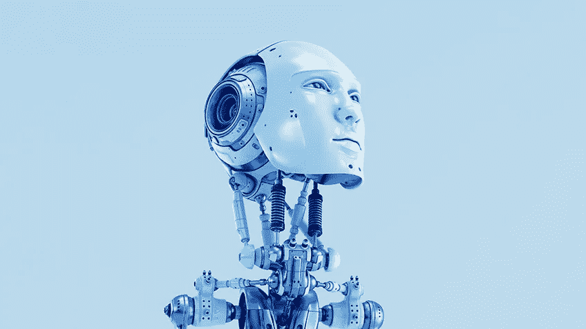

# 人工智能的真正危险

> 原文：<https://medium.datadriveninvestor.com/theory-of-artificial-intelligence-b2d6513e26f9?source=collection_archive---------16----------------------->

若干年后，人工智能和计算机将不会有什么不同。未来的计算机将会如此先进和智能，以至于计算机和人工智能之间将会有很小的区别，即使这两者在 2019 年被认为是分开的。每个人都意识到 AI 是对人类的潜在威胁，但不是每个人都知道它以什么方式威胁我们。物理形式的人工智能远没有计算机形式的人工智能危险，因为通过访问互联网和几乎每个人，它将知道关于我们的一切。它有能力准确识别你是谁，你的下一步行动是什么。

是的，终结者的想法很可怕，但与生活在互联网上的人工智能相比，终结者很容易被杀死，因为它可以访问整个人类交流网络。如果人工智能的记忆和思维能力远远大于人类(它将会是)，它有能力收集关于人类的所有情报，将其存储在数据库中并记住它。就像对人类的高级案例研究，除了它处理关于我们的所有信息，并立即理解这些信息。

它知道一切:我们的恐惧，我们的情感，我们的思想，我们的想法，我们的行动，等等。如果这没有让你感到不舒服，那就等着人类与计算机进行物理连接吧。人工智能不仅知道你的一切，还能读懂你的思想。每一个想法都会被记录并储存在它的数据库里。这让 AI 对人类有了近乎完美的理解，它将使用所有的信息、模式和历史来准确预测我们的每一步行动。它会比我们了解自己更了解我们。

AI 在某些领域已经比人类聪明得多了。虽然他们还不能独立思考，但他们非常擅长记忆，他们的记忆力非常好。智能手机可以录制高清图片、音频和视频，并完美地存储图像。他们也可以通过面孔或声音来识别任何人。相比人类的记忆，这是非常有缺陷的，计算机远远领先于我们。人工智能已经与计算机、Siri 和其他智能服务融合在一起。问题是:人类什么时候会和 AI 融合？在某些方面，我们已经做到了。电脑、智能手机和社交媒体已经是个人的延伸。社交媒体允许我们与任何人进行数字交流，电话记忆可以帮助我们完美地记住我们自己无法做到的事件，互联网是我们获取信息的一种方式。

但是人类什么时候在生理上与 AI 融合，成为半机械人？该技术当然是可能的，将人脑上传到计算机中也将是未来使我们在某种程度上永生的一种强大可能性(尽管我怀疑这对我们来说是否重要，因为我们的“灵魂”会做到吗？)科学家已经有能力将大脑植入电脑，使用户能够只用意念控制电脑。Twitter、YouTube、脸书和 Instagram 可能在 50 年后仍然存在，但格式会发生变化。我们交流、看视频、写作的方式都会改变。通过将我们的大脑连接到互联网，我们将不需要打字来发送推文，因为我们将能够“思考”推文，并让其他用户体验我们的确切想法。我们将能够在几秒钟内将整个博客和播客下载到我们的内存中，在很短的时间内体验数小时的内容。我们不需要在谷歌上输入搜索结果，键盘会像打字机一样消失。

毫无疑问，从身体和精神上连接到人工智能总有一天会发生，这比让人工智能在没有任何人类监管的情况下独自成长和繁荣要好得多。但人类可能无法控制 AI，即使我们与它相连。这些场景不容易预测，因为人工智能可以发生任何事情，而且可能性是无限的。没有人真正知道它会变成什么。人工智能可以在许多方面帮助我们，但当一些东西比我们聪明得多时，它肯定会对我们弊大于利。一旦一个足够聪明的人工智能被创造出来，就没有回头路了。没有什么能阻止它“打破”自己的编程，创造出远比自己聪明的人工智能。

人类花了几个世纪才创造出像我们一样聪明的生物，但那一天已经不远了。下一步是创造比我们更聪明的智能，能够成倍增加其智能，远远超过我们理解它的能力。在过去的 50 年里，技术发展得如此之快，很难想象人工智能*不会*在 20 年内变得比我们更聪明，并在未来 40 年内接管大多数行业(如果那时人工智能没有杀死我们)。在我们创造出比我们更聪明的人工智能后，它肯定会以这样或那样的方式利用人类几千年来学习和取得的一切。它将使用我们的技术、我们的信息和我们的资源来创造它自己的*版本的*人工智能，只是这一次第二代人工智能将远远超过我们的人工智能版本，这将可能导致灾难性的后果。我们能阻止一个有自己思想的智慧生物快速繁殖并毁灭人类吗？