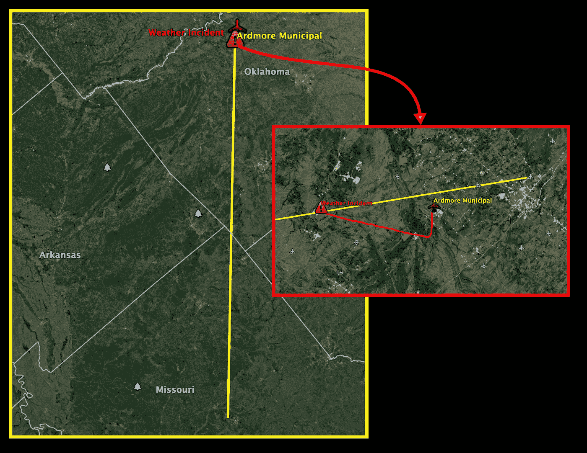
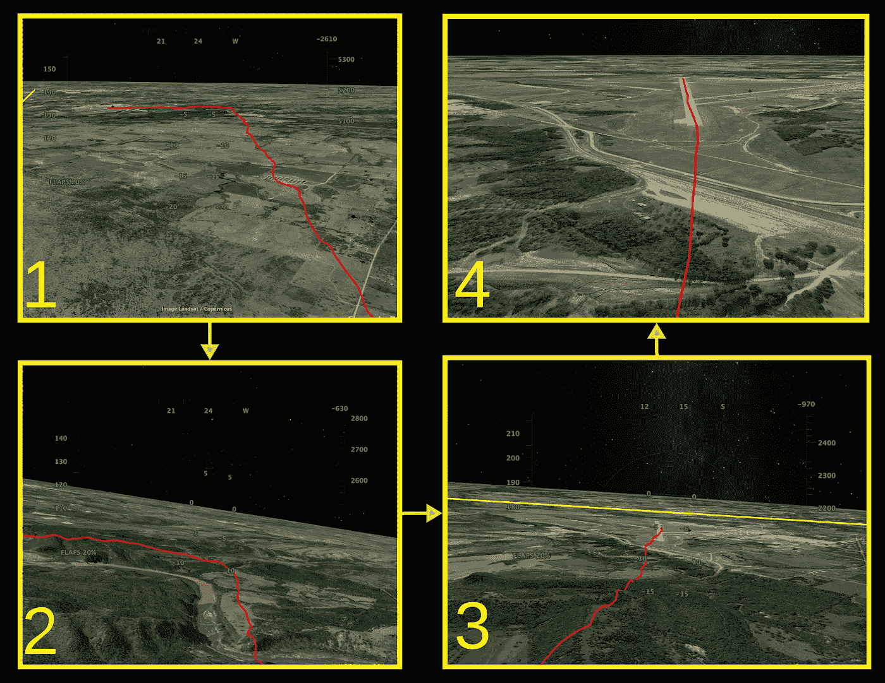
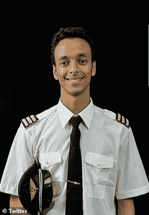

# “没有勇敢的老飞行员”

> 原文：<https://medium.datadriveninvestor.com/there-are-no-old-bold-pilots-3237b2246e65?source=collection_archive---------2----------------------->

The wreckage on a clear day following the crash of Ethiopian 302, March 2019\. Source: NY Times.

## 是人类的自我，而不是波音公司，夺走了 346 条生命

在我 14 岁上第一堂飞行课之前，我父亲[引用 e .汉密尔顿.李](https://postalmuseum.si.edu/airmail/pilot/pilot_old/pilot_old.html)的话说，“儿子，记住，有老的*飞行员，也有勇敢的*飞行员，但也有老的**不勇敢的 T10 飞行员！**

三年后的 2001 年，我是一名 17 岁的有执照的飞行员，驾驶塞斯纳 172 完成了一次相当长的独自旅行，从密苏里州布恩县南部的哥伦比亚地区机场飞往俄克拉荷马市中心的行政机场阿德莫尔。我选择在大约 11，000 英尺的高度飞行，以避免在中心地带夏季热浪中出现的标准低气压中的中等湍流。

在俄克拉何马州南部阿巴克尔山脉的最初下降过程中，我打了一个哈欠，很自然地短暂闭上了眼睛。我的肺部渴望得到海拔*无法提供的氧气，在鼻子突然下降并向右急转的同时，我的面部肌肉暂时无法工作。我的胃像坐过山车一样往下沉，在我感觉到撞击之前，我听到飞机发出一声巨响——就像飞机刚刚平稳地降落在地面上。*

The route /cutout of the deviated route. Source: Google Earth.

在比打哈欠还短的时间内，升力消失了，并从我的高度计下降了 1800 英尺。一旦颠簸把我降落在更容易穿越的空气中:我就全力以赴，保持水平，观察我的周围。就在那时，我观察到了罪魁祸首:一种四分五裂、横向风和闪电交织的天气模式——悄悄地出现在我的尾巴后面。

我立刻知道是时候“让她降落”了，所以我把我的两个收音机调到了自动气象和最近机场的塔台频率:阿德莫尔市机场。

我加大推力以增加空速，战胜风暴，降落在近 2 英里长的 13 号跑道上。在 130°的航向上，13 号跑道是最近的着陆点——即使有轻微的顺风，其长度也足以着陆。

The Emergency Landing Pattern. Source: Google Earth Flight Simulator.

直到今天，我也不确定我遇到了什么。据推测，这是严重的风切变，或者潜在的微下击暴流(1985 年，同样的天气现象导致德尔塔 191 号航班失事，137 人遇难)。然而，这种猜测是不相干的。相关性是，我的下意识反应是打开电源，使用明智的选择找到一个简易机场，这已经成为熟练训练的第二天性。

2019 年 3 月 10 日，在埃塞俄比亚，我们都记得最著名和最近的航空事故的日期和地点:天气*非常适合飞行*。然而，最初的报告显示，飞行员在驾驶舱的行为一点也不完美。

[Captain Yared Getachew](https://www.dailymail.co.uk/news/article-6795731/Tearful-colleagues-pay-tribute-Ethiopian-Airlines-pilot-killed-plane-disaster.html) of Ethiopian 302\. Source: The Daily Mail.

302 航班的机组人员是绿色的*和年轻的*。机长是埃塞俄比亚最年轻的飞行员，29 岁就当上了机长。第一个军官，只有 26 岁。在放弃了成为一名建筑师的主要愿望[后，副驾驶只有不到 400 小时的飞行时间。](https://www.reuters.com/article/us-ethiopia-airplane-pilots/youngest-captain-loving-son-ethiopian-pilots-honored-in-death-idUSKCN1R11LV)

在另一架 Max 坠毁的狮航 610 飞机上，机长 Bhavye Suneja 只有 31 岁。

没有人能理解混乱的驾驶舱在整个失败过程中的心理。无论是单一故障、三重故障还是七重故障，当面临紧急情况时，不太熟练的飞行员经常会犯错误，而经验丰富的飞行员则不会。*大多数*飞行员在职业生涯中绝不会遇到这样的危机；不过，*最好*在空中和模拟器中反复模拟它们。

许多机构将此归因于飞行员短缺和航空旅行需求的增加——这一现实只会导致差距越来越大。

此外，工程师们已经建造了一些非常好的商用飞机，以至于他们几乎可以自己着陆。因此，可以认为，在选定的外国住所，接受 D 的飞行学校，住在快捷假日酒店，或者只是呼吸，可能会使你有资格控制这些(理论上)“用户友好”的飞机之一。

遗憾的是，缺点在于未能认识到人类货运需要人类飞行员——机械故障的唯一自动防故障装置。创造这些机器的人类创新天才是唯一能够评估它们的能力，并在它们在高空失败时即兴制定替代计划的人。埃塞 302 坠毁四天后， [*《纽约时报》*](https://www.nytimes.com/2019/03/14/business/automated-planes.html) 称，“飞行员现在花在学习这些自动化系统上的时间比练习动手飞行的时间还多。”

 [## 模式和机器人:复杂的现实|数据驱动的投资者

### 哈耶克的名著《复杂现象理论》(哈耶克，1964)深入探讨了复杂性的话题，并断言…

www.datadriveninvestor.com](https://www.datadriveninvestor.com/2019/03/04/patterns-and-robotics-a-complex-reality/) 

简单地说，波音软件系统(“MCAS”)发生故障的概率非常低——根据西南航空公司副驾驶的消息来源，概率超过一百万分之一。它甚至可能在美国失败。然而，区别在于两名*非常年轻的*埃塞俄比亚飞行员[没有做出恰当的反应](https://www.nytimes.com/2019/09/18/magazine/boeing-737-max-crashes.html)。

根据《西雅图时报》的报道，在导致 346 人死亡的两起致命的 MAX 坠机事件中，飞行员努力理解驾驶舱内的警告信号。同一份记录还提到，联邦航空局放宽了对商用驾驶舱内警告显示器的规定。然而，对大量警告的普遍存在几乎没有什么解释。毕竟，当权派将此记为单一系统故障。

“一连串的警告”表明 MAX 8 上的 MCAS 并不是导致这两起事故的唯一问题。 [*今日美国*报道](https://www.usatoday.com/story/news/2019/10/07/ethiopian-airlines-whistleblower-alleges-corruption-after-737-crash/3898991002/)一名告密者从埃塞俄比亚航空公司的帐篷中出现，声称“埃塞俄比亚看到其一架 MAX 飞机坠毁，而许多其他航空公司没有遭遇这样的悲剧，这不是巧合。”

如果这些机组人员选择[关闭自动系统，让飞机](https://www.youtube.com/watch?v=l-tmcQebeN8)从‘A 点’飞到‘B 点’，*如果没有，*直接飞回‘A 点’，这些事故很可能就不会发生。然而，回到“A 点”可能会导致受伤的自我和几个飞行员的曝光，这些飞行员在很长一段时间内没有做什么事情。

大胆地争取“B 点”意味着四名飞行员(包括狮航 610 航班上的飞行员)，而不是波音公司，选择成为*勇敢的* *飞行员*，并在成为*老飞行员之前死去——为人类自我的巨大受害者池增加了*342 条生命。

— — —

## 作者的披露

我/我们在提及的任何股票中没有头寸，也没有在未来 72 小时内建立任何头寸的计划。我自己写了这篇文章，虽然它可能是由 Medium 的编辑策划的，但它 ***表达了我自己的观点和可证实的事实*** *。我没有收到任何报酬(除了来自 Medium)。我和这篇文章中提到的股票的任何公司都没有业务关系。*

## DDI 的披露:

*本文及其分析仅代表作者观点，与《数据驱动投资者》( DDI)编委会的立场无关。我们鼓励读者对这一主题和相关主题进行自己的尽职调查和研究。DDI 也没有以任何方式与此话题相关的交易头寸或财务利益。*