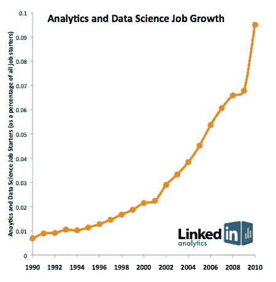

# 世界上只有 10K 人才拥有这些技能

> 原文：<https://medium.datadriveninvestor.com/there-are-only-10k-people-in-the-world-with-these-skill-sets-b3a45f3b41c7?source=collection_archive---------1----------------------->

这个星球上只有 0.00000142%的人口拥有被认为对当今商业和技术至关重要的技能，这是非常不寻常的。

> 解决棘手的人工智能问题不像开发本月流行的智能手机应用程序。蒙特利尔的独立实验室 Element AI 表示，在整个世界上，拥有处理严肃的人工智能研究所需技能的人不到 1 万人。— [纽约时报](https://www.nytimes.com/2017/10/22/technology/artificial-intelligence-experts-salaries.html)

如果世界上只有 10，000 人拥有实施严肃的人工智能研究所需的技能，那么企业、大大小小的创业公司和政府机构保持竞争力的希望有多大？

我可以向你保证，这些家伙很贵，所以如果你想发明一些疯狂的人工智能来煮沸海洋，请准备好支付大量的比特币(或在阅读本文时最令人兴奋和相关的任何货币)。

然而，我要说的是，雇佣一个这样的工资流失者是完全没有必要的。

前沿人工智能确实是一个非常有趣的领域。每天你都会看到关于人工智能如何治愈癌症、阻止小偷和预测股市的头条新闻。[但是这些用例是极端的，对大多数企业来说是不必要的。](https://hackernoon.com/what-machine-learning-isnt-d70f8a48d1ce)

AI 和机器学习有一个更成熟的应用，那就是*重复过程替代*。

如果您的用例属于以下类别之一，那么您很幸运:

*   如果您目前花钱请人手动标记图像或视频以便搜索、访问或检索
*   你的电子商务网站需要向人们展示更多相关的产品
*   你希望你的客户用图片而不是文本来搜索
*   从非结构化文本中提取关键词和实体将有助于您的客户更好地进行搜索
*   您需要根据客户的电子邮件内容来路由它们
*   你想从你的网站上清除假新闻或讽刺

这些都是当前艺术水平的完美用例，因为它涉及到机器学习和人工智能。真正的好消息是，你不需要非常了解机器学习或数据科学，就可以立即实现这些功能。有很多工具可供开发人员使用，可以确定这些用例。

## 培养

这 10，000 人的部分价值在于他们能够定制培训数据，以满足公司的特定需求。机器学习模型对用例越具体，准确性就越好。机器学习和数据科学的魔力不在于你选择哪种算法来执行哪项任务，而在于你的训练集是什么样的。

掌握什么是好的训练集将是今年和明年成功实施 AI 的关键。

## 做实验

秘密在于实验。第一次就做对的可能性极小，相反，你可能会在第三次或第四次尝试训练模型时达到 90%的黄金准确率。因此，请确保您考虑了用大量数据构建模型的时间和成本。(这就是我的公司 [Machine Box](https://goo.gl/2Fbuf6) 这样的工具派上用场的地方，因为你不必为每个 API 调用付费。)

## 您的数据

你的训练集应该是你自己的数据中与你的用例相关的例子。例如，如果您试图识别所有媒体内容中的演员，不要在头像上训练人脸识别模型，而是在您将要处理的内容的屏幕截图上训练它。如果你要将电子邮件分为积极情绪和消极情绪，以你自己的电子邮件为例，不要试图从互联网上下载通用数据集。

总之，成功之路是首先从一个很适合机器学习的问题开始，然后准备好用由你自己的数据组成的训练集进行实验。

幸运的是， [Machine Box](https://goo.gl/2Fbuf6) 可以在这方面提供帮助，因为它被设计为既经过预先训练，又可以根据您的用例进行高度调整，而无需了解任何数据科学或机器学习知识。