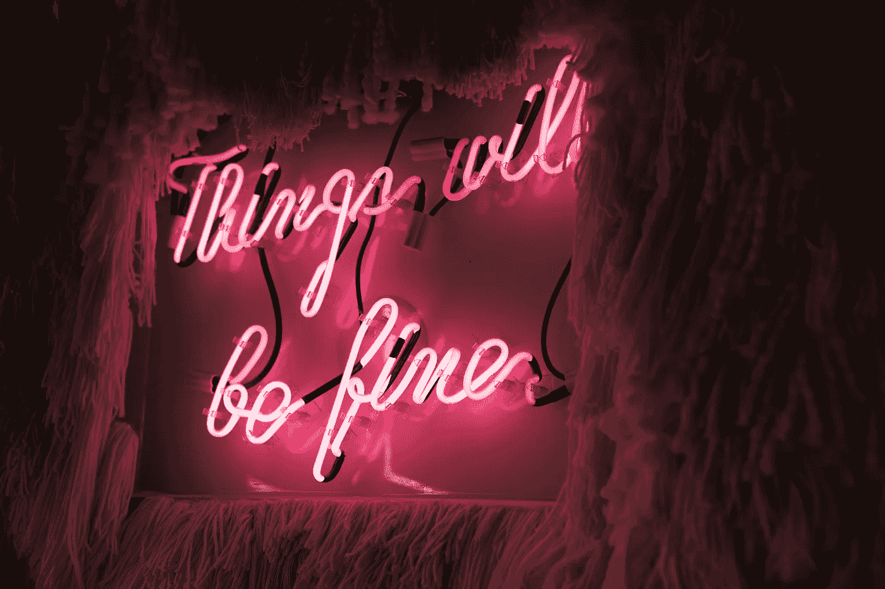

# 生气的理由太多了

> 原文：<https://medium.datadriveninvestor.com/there-are-so-many-reasons-to-be-pissed-off-5995858563e0?source=collection_archive---------4----------------------->

与佛一起放下生活的火炭(二手灵感项目)

Photo by [Aarón Blanco Tejedor](https://unsplash.com/@healing_photographer?utm_source=unsplash&utm_medium=referral&utm_content=creditCopyText) on [Unsplash](https://unsplash.com/s/photos/anger?utm_source=unsplash&utm_medium=referral&utm_content=creditCopyText)

二手灵感项目从一句激励性的引语开始，在创造性道路蜿蜒的任何地方冒险。

“抓住愤怒不放就像抓着一块热煤想要扔向别人；你才是那个被烧伤的人。”―佛陀

 [## 幸福的算法？数据驱动的投资者

### 从一开始，我们就认为技术正在使我们的生活变得更好、更快、更容易和更实用。社交媒体…

www.datadriveninvestor.com](https://www.datadriveninvestor.com/2019/03/08/an-algorithm-for-happiness/) 

我不喜欢消极。

我的 1.0 版本经常沉湎于反对者的话语中，徘徊在怀疑之中。我同情那些挑战老师的同学，听队友说我没有足够的游戏，向同事抱怨阻碍我职业发展的玻璃天花板，抱怨阻止我成为出版作家的*系统*。

现在我抵制这种抱怨的心态。在允许负面想法锁住我的潜力后，很明显我需要解决负面问题，而不是接受它。

我照做了。

像大多数人一样，我的成功和统计数据往往会时好时坏。有时候，客户喜欢我的作品，读者喜欢我的短篇小说，观众欣赏我的演讲。有时候，他们不会。

正因为如此，我不能自称一直乐观。我确实被激怒了。我有我的委屈。某些事情让我烦恼，比如…

成年后结交新朋友可能是一场斗争。对于成年人来说，超越表面的联系是很尴尬的，然而想要成为一个部落的一部分是人的天性。

技术可能会出故障。我无法让笔记本电脑或平板电脑在我的房子里工作，无法阻止我的 wi-fi 信号渐强渐弱，也无法负担我渴望的升级产品。

尽管取得了进步，但无论是在网上还是在现实生活中，我们都要忍受大量的种族主义、性别歧视、钓鱼和欺凌。

学生贷款和个人债务蚕食我的收入，威胁我的财务自由，限制我追逐梦想的努力程度。

作为专业人士长时间工作会让 T4 感到不公平。

我并不总是得到我认为应得的荣誉，而其他人似乎只花了很少的努力和资源就得到更多的重视。

老实说。可能还有数不清的事情需要被激怒，但我很难马上想到它们。那是因为我努力不去纠结于失望或关注缺点。

Photo by [Matt Flores](https://unsplash.com/@matdflo?utm_source=unsplash&utm_medium=referral&utm_content=creditCopyText) on [Unsplash](https://unsplash.com/s/photos/positive?utm_source=unsplash&utm_medium=referral&utm_content=creditCopyText)

有无数的例子表明，当星星排成一行时，我的生活发生了积极的变化。然而，一旦一切都结束了，许多这样的好机会都破灭了。我没有被提升。我发现自己在必胜牌桌上输了。我曾有机会偶然得到一篇发表的文章。

我沮丧吗？

当然了。

我很沮丧吗？

也许有那么一会儿。但事实是这种负面影响一直都在发生。变得疯狂或暴跳如雷不会让我更接近我的目标。

有时候生气没关系。但是我们可以选择如何处理这种愤怒。

源于不满的愤怒可能有点棘手。这种挫折很少帮助我们。相反，它让我们沉浸在不冷不热的抱怨中。

我们可以选择无限期地抓住那团火，让它燃烧我们。或者我们可以让它过去，让那些火焰照亮我们通往我们渴望的成功的道路。

我对自己的积极乐观毫不在意。人们可能认为我相信生活充满彩虹和蝴蝶。他们可能认为我不切实际，我应该认识到所有潜伏在角落里的可怕的事情。

但是如果现在有一个发财的机会摆在我面前，我会很傻，仅仅因为我过去发生了一些可怕的事情或者将来可能会发生更糟糕的事情而不充分利用它。

我能做的最好的举动就是应付生活给我的所有变化。我必须保持足够的信心，如果一个大的突破失败了，我可以从头开始，创造一个新的机会。当然，这并不容易。但是努力是值得的，我会尽力而为，享受旅程。

你看，当我们消极的时候，我们很少看到更大的图景。它使我们对机会视而不见。它腐蚀了我们的信心，削弱了我们的动力。它玷污了我们的梦想，留给我们的只有抱怨和愤怒。

Photo by [alexander bracken](https://unsplash.com/@alexbracken?utm_source=unsplash&utm_medium=referral&utm_content=creditCopyText) on [Unsplash](https://unsplash.com/s/photos/positivity?utm_source=unsplash&utm_medium=referral&utm_content=creditCopyText)

所以是的，我有很多理由抱怨。然而，我并不特别有兴趣把精力投入到那个失败的事业中。老实说，我相信从长远来看，积极的结果总会多于消极的结果。

我接受失败。到处都有不足之处。不公平地夺走了我的前景。仅仅因为糟糕的事情发生并不意味着美好的事情不会发生。我不能让愤怒吞噬我，否则它会造成我拼命避免的厄运。

生气的理由太多了。但是很少值得为此付出痛苦和精力。带着愤怒，从中吸取教训，然后让它为你实现梦想提供动力。

阿德里安·s·波特是一名作家、工程师、顾问和演说家。他写诗歌、短篇小说和各种主题的文章，包括创造力和个人成长。他是诗集[和散文集](https://www.amazon.com/Everything-Wrong-Feels-Adrian-Potter/dp/109519061X/ref=sr_1_4?qid=1560264651&refinements=p_27%3AAdrian+S.+Potter&s=books&sr=1-4&text=Adrian+S.+Potter)[的作者。在](https://e2857002-6118-41be-9746-64261e36cacb.filesusr.com/ugd/21d2c2_03522f10c7c84340a05a8d03a97e1642.pdf)[http://adrianspotter.com/](http://adrianspotter.com/)在线拜访他。