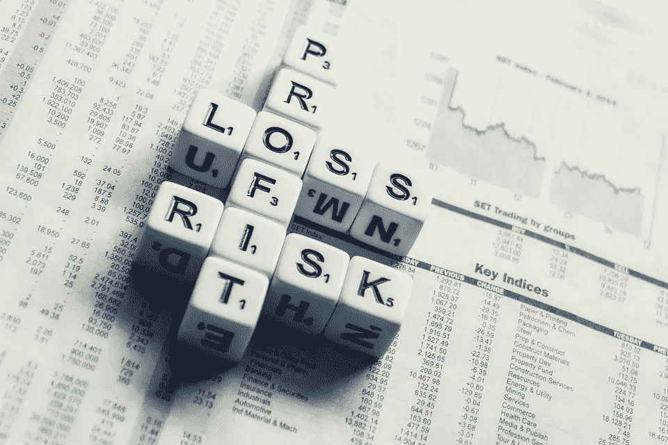

# 有两种类型的投资者——你是哪一种？

> 原文：<https://medium.datadriveninvestor.com/there-are-two-types-of-investors-which-one-are-you-8e478f0a0678?source=collection_archive---------13----------------------->

我住在美国房地产最贵的地方之一。南加州，尤其是洛杉矶地区，房价大幅上涨。就在我的街对面，一栋公寓楼几个月前以 85 万美元一扇门的价格售出。是的，85 万美元。它不是圣莫尼卡最好的也不是最中心的建筑。你可能会说“好吧，但是房产的收入可能很高，因为加州的房租比大多数州都高”。虽然这种说法是正确的，但加州多户房产的收入并不总是能覆盖房产的支出和债务。我在佛罗里达和德克萨斯买房，那里的多户房产交易价格在 8 万美元到 12 万美元之间。南加州的房地产价格比德克萨斯州和佛罗里达州高 10 倍，但我可以向你保证，这里的租金不会高 10 倍。然而，许多投资者选择在加州投资，我个人知道有几个人每个月都在赔钱，或者几乎不赔不赚。

那么，为什么这些投资者仍然投资南加州呢？因为他们属于某一类投资者:**升值型投资者。**这种类型的投资者不希望在短期内赚钱，而是希望房产的价值随着时间的推移大幅上升。这些都是投机性投资者，因为让我们面对它——没有人有水晶球。然而，如果投资者非常了解这个市场，了解它在上次衰退中的表现，并坚信它将显著改善，他们就会投资这个市场。他们不寻求立即的回报。在这些投资者中，你会发现外国投资者，他们需要把他们的钱存放在某个地方，任何替代方案都比他们现在在自己家乡拥有的要好。另一类是房地产投资信托基金和大型国有企业。

第二类投资者是**现金流投资者**。这种投资者比增值型投资者更保守，寻求短期回报。这种投资者不太重视房产的未来升值，也不会投资于不产生正现金流(支付所有费用和债务后剩下的钱)的房产。如果投资增值交易，一些现金流投资者愿意在康复期接受零现金流或少量现金流——因为他们希望在康复期结束后获得更高的现金流。

至于我？我是一个典型的现金流投资者。当我看一笔交易时，我总是假设当我计划退出时(从购买之日起 5-7 年内)，市场并不强劲，房地产价格正在下跌。如果房产从第一天起就没有现金流，我会放弃这个机会。

这里没有对错。这是个人偏好、风险偏好和投资理念的问题。你是哪种类型的投资者？

**要获得免费的*被动投资者*终极指南，请访问 www.ellieperlman.com**

[**下载**](https://www.ellieyogev.com/podcast) **那 REllie 发生了什么？！难以置信的房地产播客**

**关于作者**

埃莉是蓝湖资本的创始人，这是一家专门在美国进行多户投资的房地产公司。她还是名为“[REllie happen？！Ellie](https://www.ellieyogev.com/podcast) 的难以置信的房地产故事”，这是一个播客，它带来了交易背后的真实故事，来自全球最成功的房地产投资者。Ellie 的职业生涯始于一名商业房地产律师，为以色列一家领先的开发公司领导房地产交易。后来，作为以色列最大的能源公司的物业经理，她监管着价值超过 1 亿美元的物业。此外，Ellie 是一位经验丰富的企业家，她通过改善业务运营来帮助建立和扩大公司。她拥有以色列 Bar-Ilan 大学的法律硕士学位和麻省理工学院斯隆管理学院的 MBA 学位。

你可以在 www.bluelake-capital.com[了解更多关于蓝湖资本的信息，在 www.ellieperlman.com](http://www.bluelake-capital.com/)了解更多关于艾莉的信息