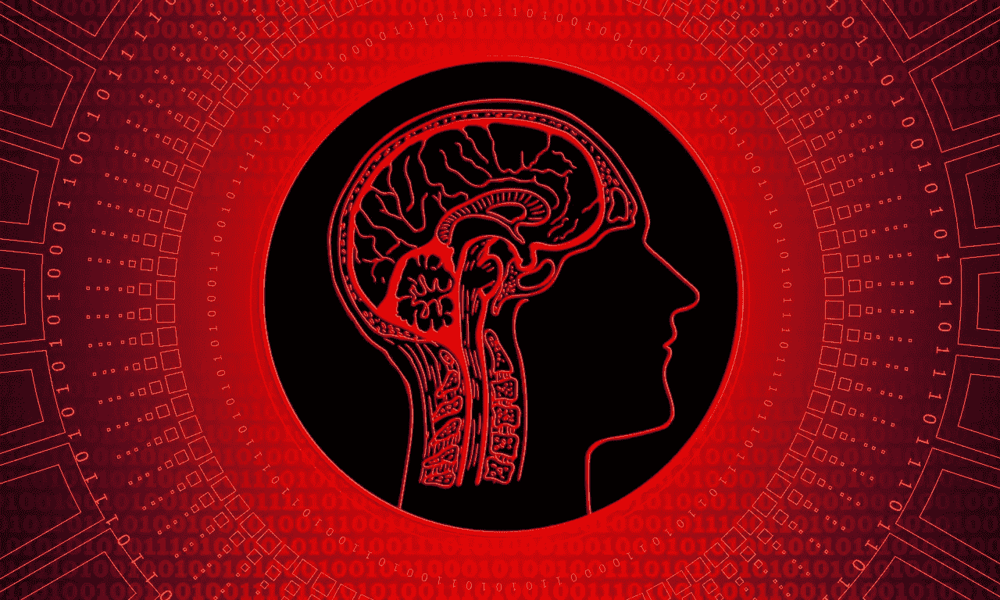

# 人工智能的短暂旅程

> 原文：<https://medium.datadriveninvestor.com/there-is-hardly-a-day-that-newspapers-are-not-coming-up-about-articles-on-ai-46eeb9345d7e?source=collection_archive---------14----------------------->

Artificial Intelligence — Pixabay

几乎没有哪一天报纸不报道关于人工智能的文章。令我惊讶的是，我在一个卡通系列中的 AI 和 ML 上发现了一个清晰的讨论。“够了”，我对自己说，开始了对人工智能的好奇之旅。如果在 10 年以上的经验值后提升我的技能是必须的，那么为什么 AI 不是呢？

正如预期的那样，由于它的大肆宣传，通往这一旅程的道路已经被业界铺设好了。对我来说，这种炒作是积极的一面，因为人工智能实际上已经开始显示出成果，特别是在卫生领域。第一个问题以“为什么 Python 和 R 成为 AI 事实上的语言”开头？

当我参加了一个演示，认为大数据和数据科学是一回事时，我对自己笑了。然后，我开始了解变量和人工智能生命周期阶段，如预测和说明性分析。变量越多，项目就越复杂。预测一个国家的经济通常包含几千个变量。

在这之后，我试图理解 b/w 机器学习和深度学习的区别。这就是我认为 ML 是关于数据的，而 DL 是关于图像、声音等的。在这个流程中，我接触了 NLP 和神经网络，由于大量人工智能术语，这往往会加速我的神经活动。在这个阶段，我至少在一件事上很清楚，一个人应该学好 Python 才能成为一名优秀的 AI 分析师。

如果我知道人工智能有一天会统治世界，我会在我的学术中更加关注数据结构和算法。我几乎通过了这些科目，并且在统计和图形等科目上比这高出一点。顺便说一下，我被告知 DL 需要基于像素的分析。十年前，当我还在大学的时候，我就读过关于像素的书。

毫无疑问，这些用例实际上让人工智能在这个行业变得更加迷人和热门。当我开始阅读它们的时候，我意识到人工智能的范围太大了，无法用一种尺寸来容纳。这是因为你会发现他们来自各个行业和领域。我对人工智能的兴趣最初是在我从事零售业的一些复杂用例之后引发的。

全球报告和定期工作预测提到人工智能将是未来几天最性感的工作。现在，告诉我谁不想做一份性感的工作？预测总是挑战人类的思维，如果它是关于选举的，它会在全球范围内吸引更多的注意力和能见度。

当我意识到人工智能与我现有的技能有一些重叠的领域时，我感到很高兴。如果我想在人工智能领域有所作为，RestAPI 和 Cloud 将是给我带来希望的领域。此时，我很想知道“它的运行时环境是什么样的”？

当你看到世界上第一个人类机器人和基于人工智能的新闻主播时，对人工智能的了解不会很快消失。不仅了解人工智能很重要，而且“什么不是人工智能”也有助于在这个问题上更加清晰。

最初，利用你当前的人工智能经验不会是一个很大的挑战。任何技术都会出现这种情况。在 IT 圈内有一个笑话，人们实际上在不知道 SOA 确切定义的情况下，已经在其中执行了很多项目。

从不知道大数据和数据科学的区别开始，我对人工智能有了一点了解，这仅仅是六周的旅程。还有很长的路要走，但是要把科学家添加到你的个人资料中，需要这么多的努力来熟悉人工智能。

我从这个练习中得到了两个重要的收获。1.就工作而言，人工智能绝不是对人类的威胁，因为还有很多事情要做，它首先需要人类的贡献。2.在个人方面，我发现我对数据分析充满热情，但对图像或语音检测模式不感兴趣。