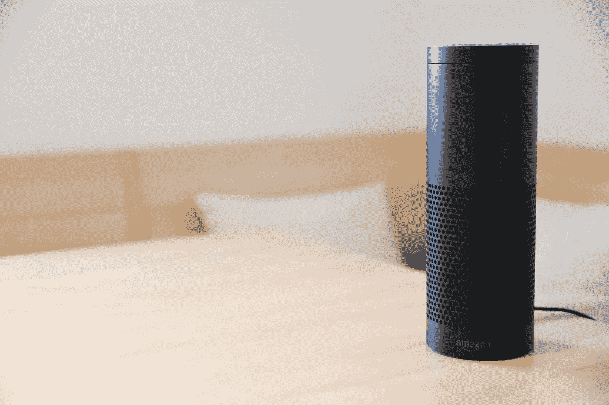

# “会有(好)雨的。”

> 原文：<https://medium.datadriveninvestor.com/there-will-come-smart-rains-faeb60602c54?source=collection_archive---------7----------------------->

“Hey Alexa…play ‘It’s the End of the World as We Know It (And I Feel Fine) by R.E.M.”

# **故事到此为止**

> “摧毁一种文化，不一定要烧书。只是让人们停止阅读它们。”—雷·布雷德伯里，作者。

【1950 年，多产的推理小说作家雷·布雷德伯里写了一篇名为*的短篇小说，名为《会有小雨的日子*。尽管他因《华氏 451 度》而被各地的高中生和科幻迷广为人知，但在主流讨论中，他之前的短篇故事似乎总是被忽视。即使你和出生在使用摄氏温度而不是华氏温度的国家的人说话，他们也很有可能会说“哦，对了，焚书的事情……我听说过。这是关于政府试图在未来控制知识的事情，对吗？”

如果你提到另一个故事，你可能只会得到一个困惑的眼神。*“小雨？雨怎么软了？”*

即使他们的假设缺乏小说主题的细节，这个猜测也不会完全错误。在一个包含从社会信用评分到另类事实的地缘政治环境中，关于政府试图摧毁促进自由思想作品的反乌托邦小说比关于智能住宅着火的短篇小说更受欢迎。

但是他们应该这样吗？

*华氏 451* 在今天的白话中还是有一席之地的。虽然视觉和互动媒体的兴起远远超过了布拉德伯里小说中描述的粗糙的“墙屏”，但整体信息仍然是及时和相关的:如果人类的生活方式走到了尽头，剩下的少数拥有过去知识的人将负责拯救它。拒绝阅读和学习——无论是通过文化制约还是政府劝说——最终会导致文明的崩溃。

然而，这种相同的“死亡和重生”也出现在*将有小雨*中，尽管它几乎采取了与华氏相反的观点。*软雨*问的是人类被消灭后会发生什么的问题；当我们离开人世时，我们的创造物还能存活多久？

正是这个问题——也是必然的结论——使得*软雨*在今天比 *451* 更有意义。

尤其是因为它发生在 2026 年。

—

# **闻到烟味**

> “最好的客户服务就是客户不需要给你打电话，不需要和你说话。就是管用。”—亚马逊首席执行官杰夫·贝索斯。

如果你还没有读过《天降甘霖》，布鲁姆-提奥格县教育服务合作委员会已经为好奇的读者提供了《T2》全文的 pdf 版本。阅读它只需要几分钟。

本文将耐心等待——不像故事中描述的智能家居仪器。

对于那些已经完成或者已经知道这个故事的人来说，你可以看到这个故事的走向。过去十年左右，我们看到了与书中描述非常相似的设备的爆炸——无论是亚马逊的 Alexa、苹果的 Siri、微软的 Cortana 还是谷歌的“助手”，所有这些设备都为原本打算独立运行的对象添加了共享网络连接。如果你家里有无线互联网，其中一个设备充当你的*【智能中枢】*，你可以设置它自动调暗灯光、改变温度、录制节目、回答问题、充当闹钟、播放音乐，等等。如果你能想象出*不需要手动做某件事*，设备会*很乐意为你做*。

甚至在标准的灯光调暗和音乐播放之外，其他品牌和公司也推出了类似故事中描述的产品。智能门铃和安全系统，比如那些来自 *Ring* 的系统，可以在手机上访问，它们的视频通过数字存储记录下来。通过代理，这些系统足够智能，可以识别运动并通过你的手机发送警报——甚至向潜在的劫匪发出警告。即使故事中的安全系统不够智能，无法区分小偷和狗，但至少我们有办法通过看一眼手机、平板电脑或电脑来检测出潜伏在门外的东西。

随着亚马逊和其他公司推出更多依靠互联互通的“智能”产品，曾经是科幻小说的主要内容已经成为现实。现代家庭已经可以对许多设备进行设置和编程，以便在不同时间执行某些命令。咖啡可以准备好，早餐可以用微波炉加热，晚餐铃声可以响起，音乐可以播放，窗帘可以拉上，门可以打开，童谣可以为即将入睡的孩子朗读，灯光可以调暗…一切。

唯一缺少的是可以帮助清理从灰尘到腐烂尸体等一切东西的机器人老鼠大军。Roomba 可能是最接近的消费级材料，对于使用过它们的人来说，他们知道鼠标大军会带来更高的速度和效率。然而，随着清洁地板上的污垢、灰尘和碎屑的能力很快带来了智能清洁技术的下一次进化…

…清除墙壁上核爆引起的人体焦痕的能力。

—

# **一连串的呜咽声。**

> *“这就是世界结束的方式……不是砰的一声，而是呜咽。”——t·s·艾略特《空心人》(1925)。*

尽管经受住了一场已经杀死拥有它的家庭的核爆炸，这是如何处理一所房子继续每天的智能时间表的恰当方式。这个家庭仅存的痕迹是墙上烧焦的轮廓；(房子一定是我们还没解锁的消费级建材。如果我们想在 2026 年前实现这些目标，我们需要走上快车道)。即使当房子最终屈服于室内起火时，故事中使用的描述——涉及各种设备在火焰吞噬它们时发出恐惧的尖叫——引发了通常不会保留给无脑机器的情感反应。

即使智能设备没有感知能力——它们仍然在那里。在核爆让他们做最后的告别后，他们已经履行了家庭要求的职责很久了。在最后几段中，当房子几乎被摧毁时，故事中的指挥中心仍在用一种破碎的自动化声音重复着新的一天的到来，重复着，永无止境。*“今天是 2026 年 8 月 5 日，今天是 2026 年 8 月 5 日，今天是……”*[***【1】***](#_ftn1)

有一段时间，机器已经不再需要我们了。

只是因为我们设计了它们。

在这句重复的自动化句子中，这本书和布拉德伯里的警告变得令人震惊地清晰:

我们赋予机器越多的能力去完成那些留给人类参与的任务…

…人性需要*变得*越少。

就像书名一样——取自莎拉·蒂斯黛尔在布拉德伯里出版自己的作品之前很久写的一首诗——描述了人类消失后自然继续幸福的历程，机器也走上了同样的道路——按照它们的偏好继续前进，没有思考或关心人类去了哪里。

如果需要的话，我们最好能关掉机器。

[【1】](#_ftnref1)布雷伯里，雷。将会有小雨。*科利尔的*。1950 年 5 月 6 日。2013 年 1 月 25 日，www.dennissylvesterhurd.com/blog/softrain.html.[。](http://www.dennissylvesterhurd.com/blog/softrain.html.)[https://www . btboces . org/Downloads/7 _ There _ Will _ Come _ Soft _ Rains _ by _ Ray _ bradbury . pdf](https://www.btboces.org/Downloads/7_There_Will_Come_Soft_Rains_by_Ray_Bradbury.pdf)