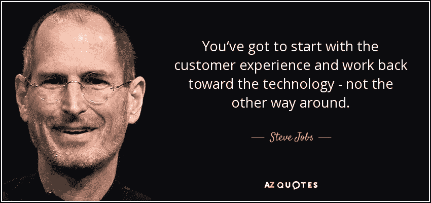

# 这 6 件事让新产品开发变得困难！

> 原文：<https://medium.datadriveninvestor.com/these-6-things-make-the-new-product-development-difficult-1823c2ecaba0?source=collection_archive---------8----------------------->

## #1 —产品愿景不够清晰

在没有建立愿景的情况下开始产品开发会导致产品开发过程中的挑战。参与新产品的人必须理解 ***【为什么这个产品必须存在】***

> “在愿景上要固执，但在细节上要灵活。”——杰夫·贝索斯

## #2 —没有经过用户验证的业务需求

定义你新产品的用户并了解他们。花时间了解用户的需求、关注点和挑战是很重要的。您的业务需求必须解决这些问题，以便能够使用 [***设计思维***](https://medium.com/@sourabhpandey05/why-startups-need-to-identify-the-real-problem-and-how-can-design-thinking-help-achieve-this-3e884f07550b) 为他们提供最佳用户体验

> 伟大的设计不会卖出低劣的产品，但它会让伟大的产品发挥出最大的潜力。托马斯·沃森

## #3 —没有明确的产品交付机制

那些你只在某一天想要产品的日子已经一去不复返了。在当今世界，借助于技术，我们可以使用 ***持续集成和持续交付*** 来定义产品交付，这将使组织能够在他们想要的任何时候 ***向他们的客户、用户*** 交付产品。*这也会在所有参与产品开发的人当中树立起***的紧迫感。**

## *#4 —没有已定义的系统架构*

*产品开发的一个关键方面是定义系统设计和架构。通常，当产品正在扩展而体系结构不受支持时，更大的问题就出现了。组织需要为其新产品建立一个定义良好的结构，无论它应该是基于 ***整体还是基于*** 微服务。在产品开发过程的早期这样做也能使产品顺利交付。*

## *#5 —没有自主团队！*

*组织可能将一些人称为团队，并期望他们交付成果。但这不是团队， [*在我之前打造团队的故事里，我已经解释过到底什么叫做团队。*](https://medium.com/datadriveninvestor/10-practical-ideas-to-build-a-better-global-team-which-is-colocated-or-remote-d33c961d6588) 组织需要授权他们的团队去挑战和创新发展。组织应该关注质量和团队的反馈，而不是过多关注数量。*

## *#6 —没有定义走向市场战略*

*对于新产品，组织从一开始就开始规划 [**走向市场战略**](https://medium.com/datadriveninvestor/top-three-faq-questions-on-go-to-market-gtm-explained-with-example-3d6f4e29c25f) 并不断完善它将是一个好主意。这样做可以让组织知道你是否朝着正确的方向前进。*

## *结论*

*新产品开发是一个从想法到现实的旅程，需要从正确的计划和目标开始。在产品开发中，你必须知道什么能让你成功，什么不能。同意这些想法将带你走向创建一个成功的组织。*

> *伟大的公司建立在伟大的产品之上——埃隆·马斯克*