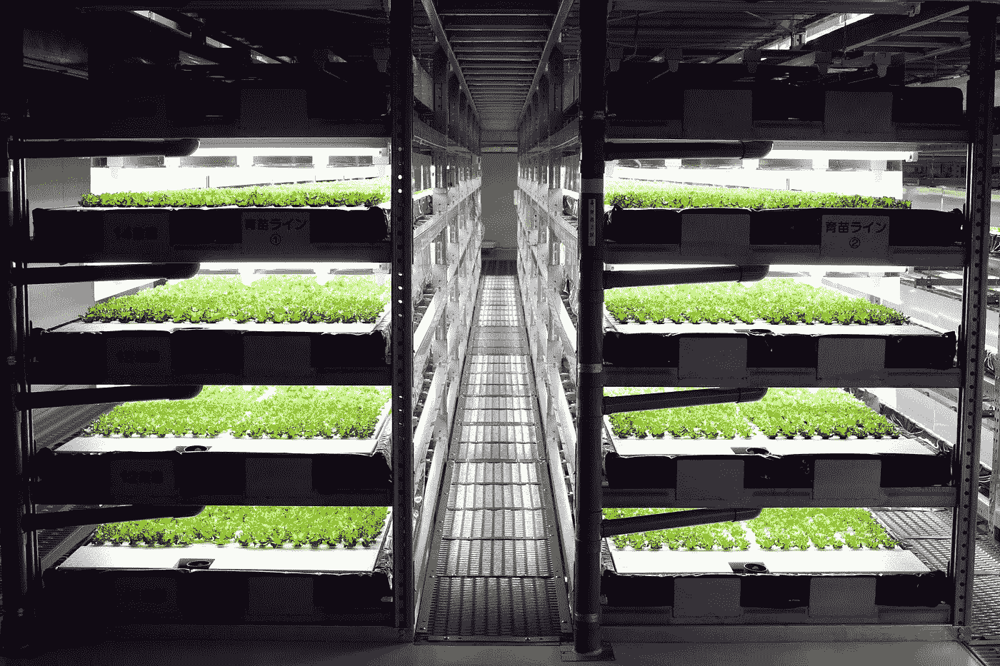

# 这些发展加速了我们走向全面工作自动化

> 原文：<https://medium.datadriveninvestor.com/these-are-the-developments-accelerating-us-towards-total-job-automation-7515bdfa891c?source=collection_archive---------3----------------------->

## 我们该为失业的未来做准备了

谁真正喜欢工作？如果钱不是问题，你还会选择明天去上班吗？

作为[超人类协会(Transhumanism AU](https://www.transhumanism.com.au/) 的联合创始人，我经常给企业和创意人士做关于工作未来的演讲。我最近的演讲，也就是这篇文章所涉及的，集中在加速我们走向完全工作自动化的发展上。

米 eet 邹睿。他独自一人在一个只有机器人陪伴的中国仓库里。邹在一个全自动化的仓库里工作。

他工作的仓库有 7 个足球场那么大，每天有数百个机器人包装和运送 20 万个箱子。四个人看孩子，邹是其中之一。

这个仓库属于中国电子商务巨头 JD.com，该公司计划将机器人自动化推广到他们的其他仓库。

> 这说明，一旦您拥有了技术、流程和知识，您就可以轻松地将自动化推广到其他位置和其他功能，从而最终实现整个业务的自动化。

中国是采用自动化发展最快的国家之一。这是因为向中国公司提供了购买更多机器人的激励措施。仅在 2016 年，中国就安装了创纪录的 8.7 万台机器人，比美国和德国的总和还要多。

这是一个水培的垂直生菜农场。但这不是普通的水培农场，他们通过创建一个完全由机器人管理的农场，将水培技术提升到了一个新的水平。这些机器人播种、浇水和修剪生菜。Spread 位于日本京都，室内农场每天收获 30，000 棵生菜。

> 前十年的机器人通常只擅长单一任务和单一用途。现在，机器人正变得越来越多用途，可以在一个端到端的过程中执行所有的任务。

Spread 是机器人技术的一个例子，它几乎接近于执行端到端的农业过程，最终可能会完全消除农业中的人类。

克恩西声称，到 2030 年，全世界将失去多达 8 亿个工作岗位。

在银行业，许多人已经在裁员。在澳大利亚，ANZ 已经裁员 5000 人，而 NAB 已经宣布他们将在未来 3 年内裁员 6000 人。花旗集团也宣布将裁员 13，000 人，大部分在美国。

即使是科技行业的人也不安全，惠普正在裁员 5000 人，微软宣布裁员 10，000 人，IBM 在过去几年里已经裁员近 20，000 人。

公司正在裁员数千人，主要是行政、后勤和中层管理人员。这些角色正在被数字化，无论是通过雇用技术人员来取代他们的位置，还是通过自动化整个角色。

> 不仅仅是个别公司在裁员，整个行业都在大规模裁员。正因为如此，可能没有足够的工作来吸收失业者。

> 面对迫在眉睫的大规模失业，人们提出了一些解决方案。

这些解决方案之一是资产的令牌化。代币化是将现实世界资产的权利转换成区块链上的代币。

如果你要以 100，000 美元的价格出售你的汽车，也许你不会吸引很多买家，因为没有多少人能负担得起。然而，如果你将你的车分成 10 个代币，并以 10，000 美元的价格出售每个代币，也许你会吸引更多的买家，并增加你得到你想要的价格的可能性。这些交易都可以通过区块链完成，没有中间人参与。

在中世纪的欧洲，许多农民是手工艺人，为自己工作，在未来，我们可能会回到一个非常相似的模式。你创作的任何作品都可以被分割成碎片，作为代币出售。

下图是凯西·珀尔，一位居住在纽约的独立区块链艺术家。凯西提供了自己作为艺术家的碎片化所有权，因此现实世界资产的令牌化已经在发生。稳定的内容正在推动一些令牌化的采用。

另一个提议的解决方案是普遍基本收入(UBI ),即所有公民，无论其收入或资产如何，都能获得基本支付，仅够支付基本需求，如食物和住所。

许多国家已经或正在试行普及基础教育。芬兰刚刚完成了为期两年的 UBI 试验，但还没有公布结果。包括格拉斯哥和爱丁堡在内的苏格兰城市现在正计划开办自己的学校。Y Combinator 是世界上最著名的创业加速器之一，它正在美国奥克兰资助一项为期 5 年的 UBI 实验。印度首席经济顾问建议，该国可以在未来两年内在一两个邦试行 UBI。

以上两个提议的解决方案可能有助于解决基本生活必需品的获取，但我们也需要关注人们的精神健康。失去工作，人们也会感到失去目标。

为了解决这个问题，畅销书作家尤瓦尔·诺亚·哈拉里(Yuval Noah Harari)甚至马克·扎克伯格(Mark Zuckerberg)等知名人士提出，我们需要对工作进行重新分类，并围绕这些工作创建社区。这可能包括指导年轻人，照顾我们的老人，或清理环境。创建以某项活动为中心的社区可能会给人们带来他们渴望的目标感。

我很想听听你对未来工作的看法。

**我只写指数科技和** [**超人类**](https://www.transhumanism.com.au/) **。如果你也想知道如何理解一个受到人工智能、区块链和其他指数级技术影响的世界，请跟随我。**