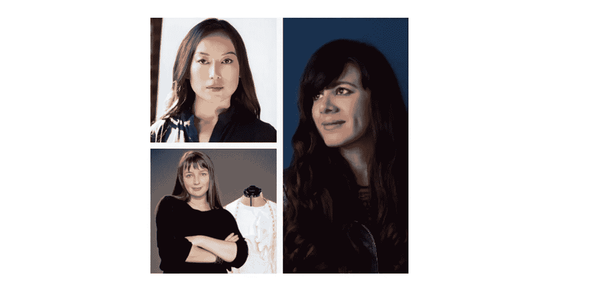
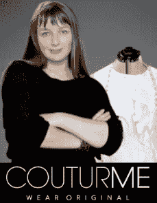
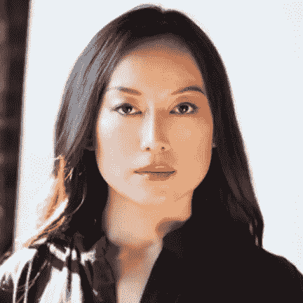

# 这些女企业家掌握了人工智能来创新针对女性的解决方案

> 原文：<https://medium.datadriveninvestor.com/these-women-entrepreneurs-mastered-ai-to-innovate-women-targeted-solutions-429f18824662?source=collection_archive---------6----------------------->

Women Entrepreneurs in AI, addressing Women

人工智能是行业中最新兴的技术之一。虽然它的应用跨越不同的领域，但它是一个男性占主导地位的领域。根据最近 EY 的一项研究，全球人工智能行业的女性比例为 22%。

由于女孩在很小的时候就变得“T2 化”，科学和数学相关的学位没有得到足够的重视。这使得女性以后很难涉足科技行业，因为她们有时会觉得自己的男性同行比她们多。全球范围内，接受 STEM 教育的女性比例仅为 35%(T4)。此外，绝大多数人工智能算法和代码都是由男性编写的。由于该领域男性占主导地位，这项技术面临着持续的性别偏见和权力失衡的风险。

 [## 人工智能与创造力:作为创意引擎的比根——数据驱动的投资者

### 的确，2018 年可以被视为人工智能创造的创造力全盛时期的开始。当然可以…

www.datadriveninvestor.com](https://www.datadriveninvestor.com/2019/02/13/ai-creativity-biggan-as-a-creative-engine/) 

随着人工智能产生如此巨大的影响，多样化的视角对于创造令人难以置信的突破至关重要。NYU 的一个研究小组 [AI Now](https://ainowinstitute.org/) 发布了一项关于该领域多样性危机的[研究](https://ainowinstitute.org/discriminatingsystems.html),其中谈到创造人工智能的人和他们用来训练人工智能的数据缺乏多样性是如何在技术中产生巨大缺陷的。重要的是，人工智能解决方案应该由尽可能多样化的群体创造，并从中受益。

尽管不平衡，许多妇女正脱颖而出，打破历史趋势。在这篇文章中，我列出了三位女性企业家和榜样，她们利用人工智能，利用她们创新和多样化的视角为她们的女性同胞服务——这是最新兴的市场之一。

**尤利娅·拉克尔，联合创始人，**[**COUTURME**](http://couturme.com)**:**

Yuliya Raquel, CEO at COUTURME (Image Credit: COUTURME)

Raquel 正在利用自动化技术、3D、AI、机器学习和 XR，将女性时尚产业从大规模生产转变为可持续的按需模式。在 COUTURME 之前，拉克尔共同创立了 [Tailornova](https://tailornova.com/) 和[BootstrapFashion](https://bootstrapfashion.com/)，这是一个时装设计自动化技术家族，总销售额达 4300 万美元。这位令人惊叹的时装设计师已经在时尚界工作了 20 年，她的客户包括加布蕾·丝迪贝等奥斯卡获奖名人。就在那时，**尤利娅·拉克尔**意识到，时装业即将迎来一些重大的技术变革。

Raquel 继续说道:“*7500 万美国人不适合大规模生产的标准尺寸，这揭示了巨大的机会。8000 万美国女性每年参加两次活动，每次花费 200 美元，这就形成了一个 320 亿美元的市场。*”

经过初步咨询后，COUTURME 的 Tailornova 软件会根据个人喜好生成定制设计。一旦客户最终确定了设计，他们将在 30 天内生产并发货。COUTURME 能够非常快速地生产数千种定制服装。

COUTURME 最近筹集了种子资金，价值 15 万美元，并以每周 50%的速度增长。

除了 COUTURME，Raquel 的设计和技术还出现在许多出版物和时尚杂志上，如 SF Chronicle、Glamour、InStyle、Lucky、Marie Clair、Oprah Magazine、People Style Watch 等。

**劳拉·戈麦斯，创始人，** [**阿蒂皮卡**](https://www.atipicainc.com/)

Laura Gomez, CEO at Atipica (Image Credit: Atipica)

戈麦斯正在重新思考招聘过程中的包容性。这位引人注目的年轻女性从 17 岁开始就在科技行业工作，以前的雇主包括 YouTube、惠普和 Twitter。在惠普实习期间，戈麦斯讨厌呆在一个没有人长得像她的工作场所。她决心不成为同质化、非包容性行业的受害者，决定继续在科技行业工作，“不管这个行业是否接受她。”

除了是 Code.org 多样性委员会和安妮塔·博格妇女与技术研究所(T21)的成员，劳拉·戈麦斯还创办了她的最新企业 ATI pica——一个帮助科技公司寻找和雇佣多样化候选人的平台。

与人力资源部门密切合作后，Gomez 总是想出一种包容性的方法来理解漏斗顶端的多样性。戈麦斯说，这不是火箭科学，“ [*多样化的团队只是表现得更好。*](https://www.catalyst.org/knowledge/diversity-matters) *尤其是在 HR tech。*“她认为传统的科技兄弟文化对某些群体不利，比如女性。

*戈麦斯解释道，“* [*当亚马逊给他们的人工智能喂了 10 年的男性候选人时，人工智能学会了将女性排名靠后。*](https://twitter.com/intent/tweet?url=http%3A%2F%2Fwww.forbes.com%2Fsites%2Fcognitiveworld%2F2019%2F02%2F03%2Femerging-technologies-need-diversity-innovative-women-in-ai-blockchain-to-follow-in-2019%2F&text=When%20Amazon%20fed%20their%20%23AI%20ten%20years%20worth%20of%20majority-male%20candidates%2C%20the%20AI%20learned%20to%20rank%20women%20lower.%20%40laura)

*Atipica 是一个面向人才生命周期的包容性 AI 平台。它利用其专利的人工智能技术，帮助组织建立现代化和包容性的劳动力。公司可以使用这项技术来可视化预测技能和性别的申请人。通过监控组织在实现多元化和包容性目标方面的进展，Atipica 提供了一个整体解决方案。这个人工智能平台还允许公司重新联系来自代表性不足的背景的候选人。*

*通过 Atipica，戈麦斯希望利用人工智能来指导人们，而不是取代他们的技能组合。Atipica 的客户包括网飞、Eventbrite、比特币基地和许多其他公司。到目前为止，这家初创公司已经筹集了超过两轮的资金，总计 [$2M](https://www.crunchbase.com/search/funding_rounds/field/organization/funding_total/atipica) 。*

*除了 Atipica，Gomez 还是包括在内的[项目的创始成员和顾问，该项目是一个为科技公司建立有意义的、持久的多样性和包容性的社区。](https://projectinclude.org/)*

***赵明，联合创始人，** [**久经考验的护肤**](https://www.provenskincare.com/)*

**

*Ming Zhao, CEO at Proven Skincare (Image Credit: Proven Skincare)*

*赵明旨在通过结合人工智能、大数据和学术研究来重新设计护肤体验，为每位客户提供个性化的护肤产品。这位努力工作的年轻女士作为一名投资银行家每天工作 16 个小时。赵说:“我不仅失去了我的灵魂，我也失去了我的青春。”尽管她花了很长时间寻找恢复年轻容颜的产品，但她没有任何运气。最终，一位皮肤专家的个性化治疗对她起了作用，让她损失了很多钱。*

*赵通过她的丈夫认识了她的联合创始人 Amy Yuan，并立即意识到他们有一个共同的目标，即利用技术改善人们的生活。由于他们两个人都患有皮肤病，他们对改善美容和护肤空间的想法感到高兴。后来，他们扩展到使用人工智能在一个地方解决所有的皮肤问题。*

*赵和袁在所有数据分析的基础上建立了机器学习和人工智能算法，以了解人的皮肤与每个人的成分之间的相关性和相互联系。经过激烈的研究和学习，赵和袁创立了 Proven，世界上最完善的研究和个性化的护肤系统。*

*“*在购买任何美容产品之前，普通人会花 45 分钟到 1.5 小时来研究产品，即使在他们根据自己的研究结果购买之后，55%的人在购买后仍然不满意。这是因为外面的信息激增。没有一个人能够阅读如此多的信息来做出正确的决定。这就是为什么我们建立了最大的美容数据库。**

*经过 3 分钟的深入评估以确定客户皮肤问题的根源后，Proven 发现并匹配了他们需要的独特成分—消除了反复试验。Proven 由自己的科学数据库[皮肤基因组项目](https://www.provenskincare.com/why-proven)(麻省理工学院 2018 年人工智能奖获得者——包括 20238 种成分，4000 篇同行评审的科学文章，800 万条评论和超过 10 万种被谈论过的美容产品)提供支持。该公司为顾客提供 60 天的定制皮肤护理，免费送货。*

*随着客户接受评估、使用产品并与数据库分享他们的体验，准确性必然会提高。*

*自 2018 年以来，Proven Skincare 已经从 Y Combinator 等顶级投资者那里获得了 [4 轮坚实的种子轮](https://www.crunchbase.com/organization/proven-2932)。有了 Proven 这样的公司，护肤品行业预计明年将超过 1310 亿美元。*