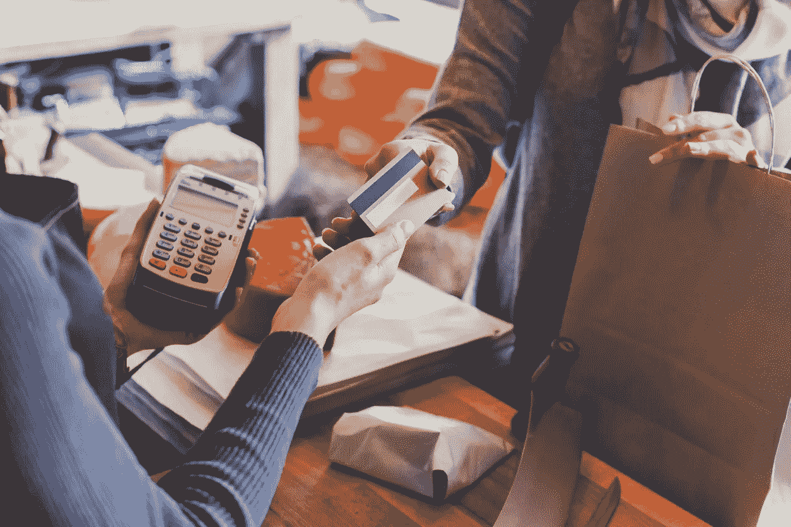

# “他们必须收下我的信用卡”——直到他们收不到为止

> 原文：<https://medium.datadriveninvestor.com/they-must-take-my-charge-card-until-they-cannot-df4f79786b70?source=collection_archive---------6----------------------->

A temporary glitch in a grocery store’s credit card machines gives us some insight as to how a major cyber disruption would affect the typical shopper.

像许多美国人一样，我经常在星期五下午去购物。

一年前的这个周末，当飓风哈维不再是气象频道工作人员想象力过于丰富的产物时，在德克萨斯州奥斯汀购买食品杂货有一种超现实的感觉。哈维瞄准了德克萨斯州海岸，促使海岸 200 英里范围内的每个人开始认真对待他们的飓风准备工作。(当你可以和其他人同时做这件事，就在暴风雨来临之前，为什么要早点做呢？)

我经常在我们当地的 H-E-B 购物，这是一家德克萨斯州的私营连锁杂货店。我是 H-E-B 的忠实粉丝。我喜欢他们的员工，以及他们对灾难准备和响应的承诺。在哈维登陆的前一个星期二，我在晚上去商店时加满了我的补给品。这次购物之旅不仅让我有机会买到我们需要的任何最后一分钟的物品，还让我了解到我的澳大利亚同胞是如何为可能发生的飓风做准备的，当时距离海岸数百英里。

“我在休斯顿长大，所以我不会等着为这些事情做准备，”为我服务的年轻女士告诉我，她在她的扫描仪上刷我购买的东西。“我见识过他们的能耐，我很认真。”我感谢她的坦诚，感谢她回答了我关于她从购物者那里看到/听到的关于这场风暴的问题——在那个周二的晚上，这场风暴并不算多。“一些人是通过购买大量瓶装水来的，但迄今为止，没有人真正提到过它。”

大多数人并没有意识到这一点，但是杂货店的员工可以成为你能找到的关于你的社区发生了什么的一些最好的情报来源。他们没有被我们经常从社区第一反应领导者那里收到的通常的“建议此时保持冷静”的信息所抑制。他们看到和听到很多，当一个社区的情况开始变坏时，他们通常会有很多轶事数据可以分享。

在风暴来临之前的每一天，以及之后的几天，我都特意去了那家 H-E-B，看看人们的购物习惯是如何改变的，因为哈维显然会对奥斯汀产生一些影响。白天购物时间通常的足球妈妈和退休人员流很快变成了拥挤的郊区爸爸和工作妈妈，他们从工作日抽出时间来购买通常的风暴美食——罐装汤和面食、薯片、运动饮料、饼干、麦片、面包和花生酱。瓶装水不再供应。结帐队伍增长到三十分钟的等待时间。每个人都很热情，但每个人都有点不高兴，因为“所有这些人”都在同一时间购买他们最后一分钟的物品。

快进到上周五——当时没有大风暴威胁德克萨斯州中部。据我所知，德州中部没有大规模的威胁。除了外面季节性的闷热，星期五和奥斯汀的其他日子没什么两样。

我和妻子周六为几个朋友举办了一个晚宴，最后我买了几样东西。当我把购物车推到收银台时，我发现有些不对劲。收银员通常通过扫描产品和偶尔在键盘上敲击东西来打发顾客通过结账通道，他们基本上是一动不动的。我转过身，正好看到一名经理告诉一名员工打开她的收银机，因为通道很快就满了。就在那时，我听到了是什么支撑着我们:

“我车道上的信用卡读卡器坏了……他们都坏了。”

当地杂货店的生意嘎然而止，因为不管什么原因，所有的读卡器都坏了。一向表现出灵活性的 H-E-B 员工开始宣布，可以用现金支付的客户应该移到现在只允许现金交易的两条通道中的一条。

我迅速把我的购物车从现在只能用信用卡购物的通道移到了一个只能用现金购物的通道。当其他人开始在我身后推车时，我想确保他们知道发生了什么。

我身后的两位女士——我们称她们为女士 1 和女士 2——没有很好地接受这个消息。女士 1 变得非常愤怒。“嗯，他们必须收下我的签帐卡，”她坚持道，尽管我刚刚告诉了她商店员工告诉其他人的事情——整个商店的信用卡读卡器都坏了，他们只能用现金完成交易。她兴致勃勃地指着收银台上方的牌子——“牌子上没写着‘只收现金’！”好像我在试图误导她。

她不相信我，跳到我前面去问收银员本人，收银员立即证实了我刚才告诉她的话。女士 1 无法相信商店不接受她的“签帐卡”(这个术语现在还在使用吗？没那么经常听到)。她的沮丧显而易见。

第二位女士的回答不太有表情——事实上，几乎没有表情。她似乎很难理解我在说什么，好像我在说外语。“他们不收信用卡吗？”就在我告诉她和女士 1 商店的信用卡系统瘫痪了，现金是继续交易的唯一途径之后，她问道，看起来很困惑。

我会在钱包里单独放一部分现金，以备不时之需。两年前的这个星期，一位去世的朋友建议我开始这样做——谢谢杰夫。我为我的食品杂货付了款，看着我的购物伙伴继续挤在收银台的队伍里，同时表达他们的沮丧。我很快离开了，不想和一大群心烦意乱的购物者待在一起。

作为一个经常提倡为各种各样的危险做好准备的人，当谈到美国缺乏弹性时，我感到非常惊讶。然而，星期五的经历连我都感到惊讶。在 [S & P 500 创下历史新高的一周](https://www.theguardian.com/business/2018/aug/22/wall-street-record-longest-rally-history-bull-market)，当他们的杂货店不接受他们的信用卡付款时，奥斯汀人变得明显不安。

从更大的角度来看，这显然是第一世界的不便。读卡器最终恢复了正常工作(自从事件发生后，我在两天内去了那家商店两次，读卡器工作正常。)这没什么可让人难过的。

但人们的反应不是这样。我估计 5%的购物者身上有足够的现金来购买他们的商品。其余 95%的人表达了各种各样的反应，从*这就是生活*到不相信到彻底的愤怒。

这是我们社区没有危机时发生的事情。没有飓风，也没有食物短缺。没有 1933 年那种事件的银行假日。如果在我们的社区出现问题的时候，信用卡读卡器停止工作，会发生什么？

[9 月是全国准备月](https://www.ready.gov/september)，我向任何愿意倾听的人强调的一件事(除了让自己和家人为可能发生的灾难做好准备)**是开始携带现金**以防电子交易出现更大规模的问题。随身携带足够的现金去购买食品杂货，带一箱汽油回家。

这不是一个极端的想法，也不是末日心态的证据。有些日子，信用卡读卡器不知什么原因就是不工作。如果它发生在你当地的杂货店或加油站，准备好照顾你自己和你的家人。

*最初发表于*[*【www.prepperdepot.org】*](http://www.prepperdepot.org/blog/archives/08-2018)*。*