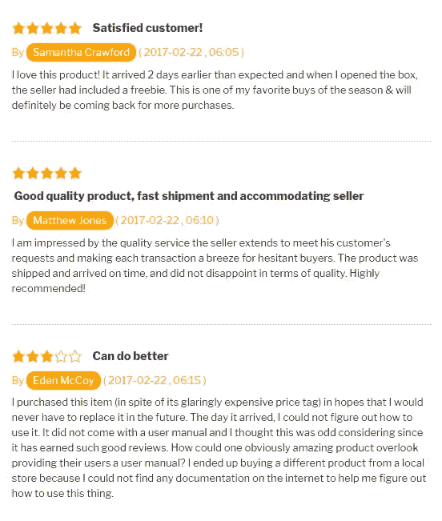

# 建立点对点在线租赁市场需要考虑的事情

> 原文：<https://medium.datadriveninvestor.com/things-to-consider-building-a-peer-to-peer-online-rental-marketplace-ac98e03ab99f?source=collection_archive---------4----------------------->

在线市场基本上是一个在线商店，多个商家可以在这里向客户销售商品或服务。由于只有在他们需要的时候需求才会增加，我们看到了租赁超过购买的趋势，这给这些天的在线租赁市场带来了很多商机。

如果你想建立一个租赁市场，基本上有两种选择:

1.  从零开始发展租赁市场。

或者

2.*从一个准备发射的平台开始。*

 [## 睁大眼睛冲破多样性壁垒|数据驱动的投资者

### “科技女性”是蒂芙尼·霍兰的激情之一，最初她在 Twitter 上主持“科技女性”聊天。她也是一个…

www.datadriveninvestor.com](https://www.datadriveninvestor.com/2019/03/20/hurtle-diversity-barriers-with-eyes-wide-open/) 

如果你只是想测试一个概念，使用现有的现成系统，如 [Sharetribe](https://www.sharetribe.com/) 可能会在短期内奏效。

但如果你打算长期建立自己的定制平台，你必须用自己的想法和自己的定位从零开始开发一个市场。在这里，我谈论的是你在从头开始建立一个点对点租赁市场时需要考虑的事情。

*   首先，想出一个你想专注的领域。

在建立 p2p 租赁平台的同时，有一个机会是，你试图为所有人建立一个平台，但最终却做了一些不会带来好结果的常见营销策略。

从与一些创业公司合作建立市场的经验来看，我发现有趣的是，那些从专注的利基市场开始的公司会更快获得成功，特别是如果你是一家初创公司，不能在最初的启动上花费太多。

*   **让支付方式变得简单&完美无缺。**

完美的支付流程会给在线平台带来更多可重复的销售。有一些选项，让用户添加卡，保存他们的信息，并在购买后轻松结账。这将使用户坚持你的平台，从而带来更多的销售。

*   **考虑不同的收入模式，选择最适合您租赁的产品类型的模式。**

对于在线租赁市场，你可以有不同的收入模式。你可以向租赁者收取佣金，限制租赁者的数量&向他们收取固定的月费，向租赁者收取使他们的产品在搜索上得到“验证”的费用，包括广告系统等等。如果你打算只通过平台租赁机械/车辆，按小时/天收费的模式可能会很好。根据产品的类型和重复租赁的机会，你可以定义你的收入策略。

*   **包括星级&点评。**

我还发现，在你的产品中包含评级和评论可以提高可信度，让人们有更多的机会尝试这些产品。它还带来了大量来自现有客户的反馈，您可以利用这些反馈来提高产品质量。

添加这个肯定有帮助！

*   **确保用户能够更容易&更快地找到他们需要的东西。**

应该有搜索，类别过滤器和建议，让用户很容易找到他们想要的更容易和更快。不是每个人都喜欢浏览整个产品，找到自己想要的。让客户接触点越简单越好，减少客户的工作量。

*   **推荐系统促进销售。**

你是否浏览过你在电子商务平台上看到的建议，只是为了看看它们是什么，并最终购买了它们。嗯，我有。大多数人并不完全了解市场上所有最好的产品。如果它能引起他们的兴趣，并且有机会让他们购买，他们肯定会去买。

*   **拥有移动优先的设计。**

现在，手机不仅仅是网络的延伸，每个人都在移动中查看产品，而不是在笔记本电脑上。因此，从一开始就建立一个移动优先的响应式设计对于吸引各种类型的用户是非常重要的。你可以比较大屏幕上需要什么，移动屏幕上需要什么，并在此基础上设计平台。

*   UX 非常重要。

用户体验是一个人在与系统交互时的感受。这包括使用网站、web 应用程序或软件时的不同客户接触点。建立良好的用户体验有助于提高品牌忠诚度，增加转化率，并帮助你获得更多的客户。此外，定义一个合适的 UX 将有助于你获得更多的用户调查，并找到什么有用，什么没用。不仅仅是在这样的系统中，UX 在你做的每一项业务中都非常重要。

这些是我认为可以改善在线租赁市场系统的几点。

原文：<https://www.stunntech.com/blog/21/things-to-consider-while-building-a-peer-to-peer-o>