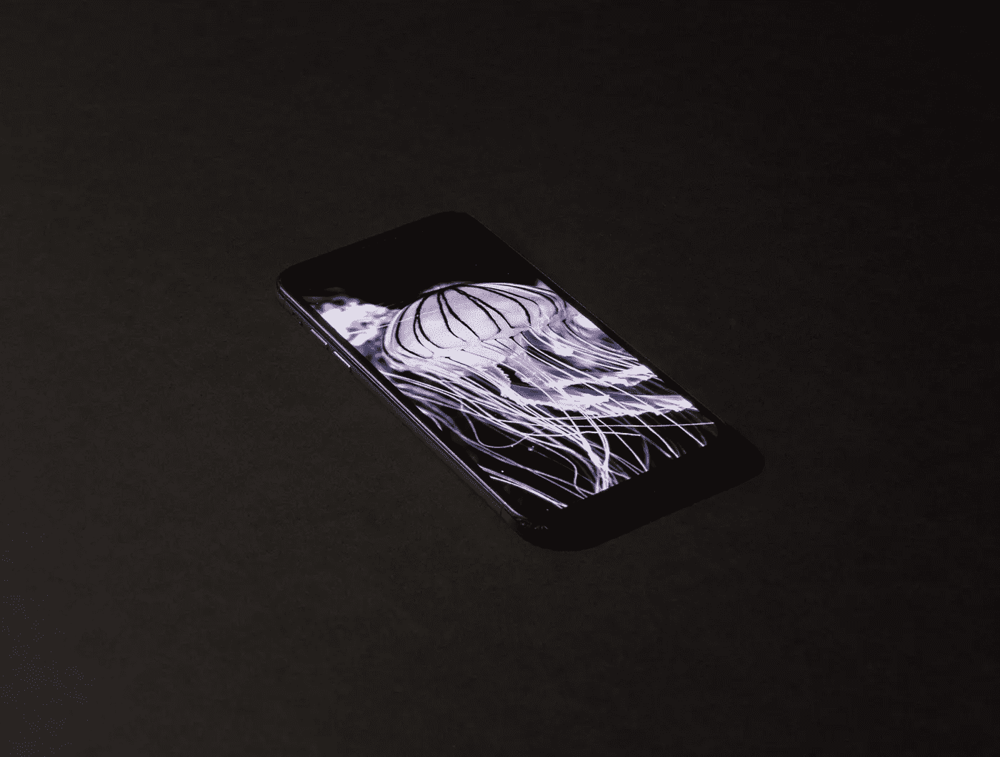

# 设计师应该知道的关于移动应用交互的 10 件事

> 原文：<https://medium.datadriveninvestor.com/things-you-should-know-about-mobile-app-interaction-af437da4c79d?source=collection_archive---------21----------------------->

全球[智能手机用户数量](https://www.statista.com/statistics/330695/number-of-smartphone-users-worldwide/)预计将在五年内增长 10 亿，这意味着全球智能手机用户数量预计将在 2019 年达到 27 亿。

很疯狂，不是吗？

那么，当你看到移动交互设计时，你怎么知道它有多好呢？问题是，你不能。

不过， ***差的*** 设计就引人注目多了。即使使用智能手机和平板电脑的经验相对较短，大多数用户也会很快厌倦繁重的内容，如按钮位置错误、不合逻辑的动画或过多的文本，这些都会影响注意力。

一个好的交互设计是受欢迎的，有启发性的，帮助用户理解如何操作一个移动应用程序，并且应该是自然的。这些品质来之不易——在设计开发过程中需要艰苦的工作、大量的练习和足够的耐心。

我根据[我们的](http://zesium.com/)经验和阅读材料列出了一些有用的技巧，可以帮助你做出一个实用又时尚的应用。

## **1。简单明了的流程**

一个应用程序最大的错误之一就是过于复杂，无法让用户顺利地从一个步骤进入另一个步骤。如果用户在打开应用程序后很快就失去了，你的工作不会得到太多的关注。如果你的 app 不能足够快地满足用户的需求，别人的意愿。

数字软件必须是直观的，这意味着它必须在应用体验的每个阶段仔细提醒用户。你应该用对比色来表示重要的按钮，必要时用醒目的地形来强调事物，用视觉提示来给用户指出想要的方向。

此外，该系统应该是逻辑的，以便用户可以识别迭代模式，并直观地使用移动应用程序。

## 2.**将您的互动与平台相匹配**

有时候，应用程序设计师在一个平台上创建一个界面，并试图模仿另一个平台上的确切交互设计和视觉策略。

现在，如果你计划在多个平台上使用你的应用——安卓、苹果、Windows 或任何其他移动操作系统(OS)——请记住，用户选择他们的操作系统是有原因的——他们可能更喜欢视觉风格，或者他们喜欢安卓设备上可用的定制，或者可能是 iPhone 的简单性等。

每个操作系统(OS)都有一套特定的人机界面和交互设计准则，其设计师在为特定平台开发应用程序时会严格遵循这些准则。

花点时间学习和研究你的目标操作系统中的特定界面实践，然后修改你的应用程序的设计，以充分利用相同的优势，你会看到——用户会感激的。

## 3.**做一个干净的 UI**

*一张图片胜过千言万语，一个可视化界面图标胜过一万行代码*。

设计者需要弄清楚如何在小空间中包含所有内容，而不使用户界面混乱，因为设备上的小屏幕是 UI 设计的一个大缺点。干净的用户界面有助于用户有效地与应用程序交互，因为所有核心元素都可以轻松访问。

要创建一个整洁的移动用户界面，你应该创建强大而简单的图标作为交互元素——它们可以用简单的形状直观地解释一个功能，并节省屏幕空间。例如，您可以使用勾号来表示某件事情已经完成，或者使用心形来表示某件事情是您最喜欢的。但是，一定要检查图标是否合适，它们是否传递了正确的信息。

此外，照片和数字图像几乎在任何语言中都可以被普遍理解(例如，“*加“*”符号表示“*加“*”或“*创建*”)，所以只要你可以，就从你的设计中删除文本，把重点放在不需要文字的元素上。通过这样做，你可以确保你的应用程序对任何语言的人都是可用的，因此你可以成倍地增加你的应用程序的覆盖范围。

## **4。应用熟悉的模式**

当应用程序可以直观地使用时，设计师可以说他/她做得很好，这意味着 UI 设计必须包含识别模式。这些是用户已经熟悉的元素，并对应用程序的工作方式给出了轻微的提示(*如 CTA 按钮，如“添加到购物车”等。*)。用户很快适应事物，如果没有相同的事物，他们会感到不舒服。

所以，如果你计划使用定制的交互元素，不要忘记添加一些标准组件，这样你的新应用就不会让用户在一个完全陌生的环境中不知所措。

## 5.**清除杂波，再次清除杂波**

移动应用已经迅速成为使用最频繁的技术，但它们的小屏幕无法一次显示太多信息。

作为一名设计师，你应该在工作中牢记这一点。减轻这种缺陷的最好方法是尽可能多地删除一些专横的特性。

为了避免弄乱应用程序，尽量只应用核心功能元素，这将使用户正确地到达他们需要的点。如果某个功能不是必需的，那就删除它。简单性将有助于用户专注于你的应用程序的目的，使它对所有技能水平的用户都有用。

不要担心最少的动作会让你的应用程序看起来很原始——这只会让你的应用程序更有效，使用起来更愉快。请记住，人们通常根据应用程序的有用程度来评价它的质量。

## **6。添加类似游戏的机制**

一个有效的移动交互系统应该简洁明了，这样它才能完美地运行。

标准应用吸引用户注意力的机会更少。这就是为什么你应该把一些情感方面的东西带进这个乍一看似乎很普通的应用程序。

为了让整个过程更加迷人，使用[游戏化](https://en.wikipedia.org/wiki/Gamification)可能是个好主意——各种挑战、公告板和贴纸将激励用户更多地与产品互动，并定期返回。

这是创建清晰的布局和过渡的有效方法，并且增加了乐趣。用户喜欢娱乐、挑战和竞争精神，所以他们被鼓励回来。通过在休闲应用中加入有趣的元素，你可以帮助用户在使用你的应用时减轻压力和放松。

## 7.**简短而甜蜜的形式**

手机相对于网络的优势在于它们有很多很棒的硬件，比如加速度计、GPS、蓝牙、手势识别等等。所以设计师应该有效地利用这些特性。

手机上的主要活动是滑动、点击和长按，因此应该使用滑动、滑动、点击或使用指纹等选项来代替打字。利用所有这些硬件，你可以减少许多表单域，所以尝试不同的表单填写交互方式，让它简单明了。

此外，使一个完美的搜索工作，因为这是衡量成功的 UI/UX 流在一定程度上。用户通常喜欢向下滑动进行搜索的传统模式。此外，显示最近搜索的选项和最喜欢的搜索时间。

更重要的是，始终包括过滤和排序选项——你应该提供一个有效的过滤和排序选项，它将基于上下文给出一个关键选择。

## 8.**方向**

如果用户有 30%的时间在横向模式下使用你的应用，你必须为横向模式设计它。但是大多数设计师只在肖像模式下测试他们的应用程序。

你应该在横向和纵向模式下测试你的应用。

风景模式通常是与驾驶、金融、书籍和游戏相关的应用程序的主要模式。

## 9.**始终请求上下文权限**

与应用程序的第一次交互在创建对它的整体印象(好或坏)中起着关键作用。当用户打开新应用程序时，他们最不想看到的是多个询问权限的弹出窗口(*应用程序想要访问你的相机/联系人/位置等*)。).此操作对用户体验(UX)有负面影响，通常会导致应用程序被卸载。该应用程序需要能够在请求许可之前与用户保持联系，以保持参与。

许可同意的策略应该依赖于你所请求的许可类型的明确性和重要性。您应该区分[关键(预先)和次要(在上下文中)权限](https://uxplanet.org/mobile-ux-design-the-right-ways-to-ask-users-for-permissions-6cdd9ab25c27)。

用户对他们的数据非常认真，并不倾向于只挖掘并给应用程序所有的权限。在合适的时间请求合适的权限会让用户信任你的应用。

## 10.**别忘了测试**

当你开始设计时，把你的手机和笔记本电脑连接起来，看看设计的质量。可用性测试是创建移动应用的一个重要阶段，它有助于通过对潜在受众的测试来评估它。

不同的可用性测试方法允许识别问题和错误，并快速删除它们。

这就是设计师如何改善 UX 的各个方面，确保用户满意。