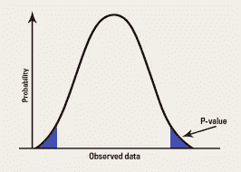

# 在资助这些项目之前要三思

> 原文：<https://medium.datadriveninvestor.com/think-before-funding-these-projects-c482bc70e1fb?source=collection_archive---------11----------------------->

科学家们每年都要做成千上万项有趣的研究。有竞争力的商业公司经常收到各种机构和研究团体的请求，要求为他们正在进行的研究提供资金，这些研究似乎与他们的商业领域相关并具有创新性。有时，政府会主动为这些项目提供资金，希望它们有助于良好治理。但是评估这些项目和研究以衡量它们是否适合被资助的过程有点棘手。

很明显，首先，我们必须考虑研究与我们商业兴趣领域的相关性。然后研究成果对不同文化、不同人群以及现在和未来社会的有效性。其次，您必须检查当前阶段的准确性以及在项目结束时提供预期结果的能力。此后，必须考虑和验证各个领域和公司的特殊因素。

 [## 数据驱动投资的兴起——数据驱动投资者

### 当 JCPenney 报告其 2015 年 2Q 的财务结果时，市场感到非常震惊。美国零售巨头…

www.datadriveninvestor.com](https://www.datadriveninvestor.com/2019/02/28/the-rise-of-data-driven-investing/) 

如果研究的结果通过了这些“测试”，你更有可能考虑资助这些项目。但是还有另一个重要的方面应该被评估，但是我们很多人都没有意识到。产生这些结果的方法。这就是 p-hacking 发挥作用的地方。

## p 值

简而言之，P 值是针对样本提供的零假设的证据强度的度量。(零假设——即没有影响的想法)。换句话说，p 值是获得检验统计的观察值的概率，或者是如果零假设实际上为真，则更有证据反对零假设的值。

在许多研究领域，如物理学、经济学、金融学、政治学、心理学、生物学、刑事司法、犯罪学和社会学，在统计假设检验中使用 *p* 值是很常见的。

**P-hacking** 是操纵数据或分析，以人为地获得重要的 P 值，或者换句话说，当分析是基于什么使 P 值重要，而不是什么是最佳分析计划来选择时。通过这种方式，科学家们绕过统计学意义，得到最终结果来证明他们的假设。p 值只对单个测量有效。
一旦你在比较一整套变量，其中至少有一个
给你一个假阳性的概率会更高，从而产生可公布的重要结果，或者换句话说“p-hack”。研究人员可以对他们的分析做出各种决定，从而降低 p 值。考虑这样一种情况，您分析您的数据，发现它几乎达到了统计显著性，因此您决定再收集几个数据点以确保万无一失，然后如果 p 值下降到 0.05 以下，您就停止收集数据，因为您错误地相信这些额外的数据点只会使结果更加显著，并且您忽略了结果变得不那么显著的可能性。但是数值模拟显示，通过添加更多的数据点，关系可以越过显著性阈值，即使大得多的样本会显示实际上没有关系。此外，有很多方法可以增加重要结果的可能性，比如有两个因变量，增加更多的观察值，控制性别，或者去掉三个条件中的一个。将所有这三种策略结合在一起会将假阳性的可能性增加到 60%以上，也就是说使用小于 0.05 的 p 值。

(资料来源——约翰·p·a·约安尼迪斯 2005 年发表的题为“为什么大多数发表的研究是错误的”的论文)

美国统计协会发表声明澄清了 P 值，因为正如美国统计协会执行董事罗纳德·l·瓦瑟斯坦所说，“P 值从来就不是科学推理的替代品。”在诸如效应大小的研究中，对 P 值的过分强调经常导致对其他信息的忽视
。在一些地方，它是通过对数据进行许多统计测试来完成的，并且只关注那些返回显著结果的数据，而不是在分析之前陈述关于潜在影响的单一假设，然后对其进行单一测试。虽然*p*-值有助于评估数据与特定统计模型的不相容性，但其他因素，如研究设计、测量质量、研究现象的外部证据以及假设的有效性等，都应该加以管理。*p*-值容易被误解。例如，它通常等同于关系的强度，但是在足够大的样本量下，微小的影响大小可以具有非常低的 *p* 值。

但是为什么他们中的一些人倾向于以我上面提到的方式伪造和操纵结果呢？在科学领域，能够发表你的成果是你获得工作稳定性、更高薪水和声望的门票。两名研究人员最近发现，从 1990 年到 2014 年，在其摘要中包含 P 值的研究数量翻了一番，在这些包含 P 值的研究中，96%低于 0.05。发表论文可以在职业发展中发挥巨大作用。旨在发表成果、获得资助或总体上推进职业发展的科学家和组织可能是主要原因。科学家们在持续的压力下，在任期和资金紧张的情况下发表论文，发表论文有助于获得新的和引人注目的结果。

> “把事情做错是没有代价的，代价是没有把它们发表出来！…作为一名科学家，我的成功依赖于我发表我的发现，我需要尽可能频繁地在最负盛名的媒体上发表文章”——Brian Nosek 博士
> 
> “复制研究得到了大量的资金支持，却得不到充分的重视，以至于从来没有
> 发表过论文。没有人愿意去做这些研究。没有任何奖励制度可以让这些研究得以进行，所以你只能把所有这些探索性的研究
> 当作事实，这是一个从来没有被证实过的科学事实。”——Elizabeth Iorns 博士

P-hacking 并不总是恶意的。这可能来自于研究人员的**缺乏统计知识，对特定科学理论**的**极端信仰以及**想要证明其正确**的意图，或者仅仅是**一个诚实的错误。有时他们可能并没有打算做坏事。但是我们不能简单地忽视这个问题。其中一些假设没有被证实，而且在不幸的情况下，它们永远不会被证实。这些统计结果只表明有机会。对你在新闻和网络上看到的东西要三思，因为很多骗子就在那里。他们的所作所为不仅对社会有害，而且对那些努力证明自己理论的科学家和整个科学界也有害。****

在这之前，你必须对研究欺诈有很好的理解。我建议你咨询一个合适的你各自领域的专家组来重新评估这些项目。那么只有你能确定你没有资助剽窃、p-hacked、不当行为的研究。

重新检查研究获得的结果以最大程度地确定研究对我们的安全是有好处的。这被称为重复研究。这是强烈推荐的，因为你把钱投资在这些新的研究上，期望能为你的企业或公司带来一些好的回报。但是，如果结果证明它的价值更少或为零呢？那么你永远不会从资助这些研究中得到任何结果。所以，明智地思考，为了你自己的利益，为了科学界的进步，重新评估这项研究。