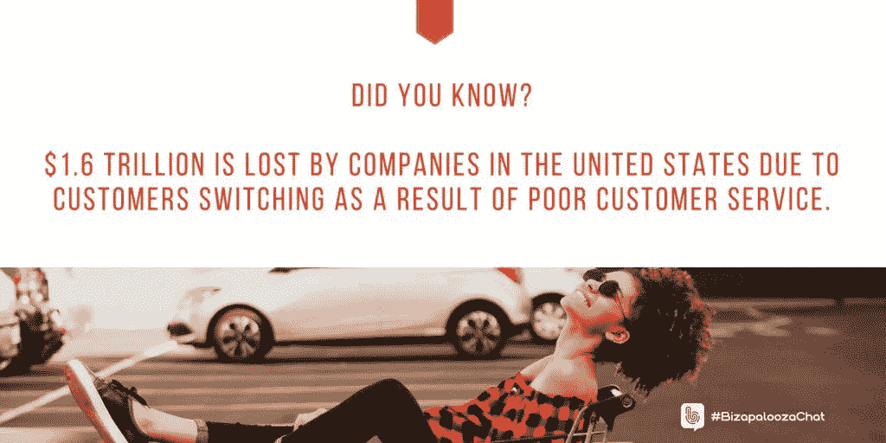
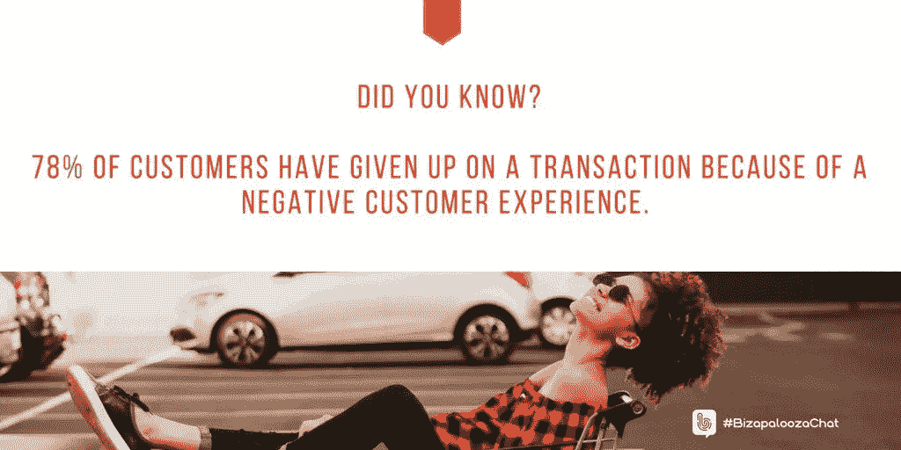
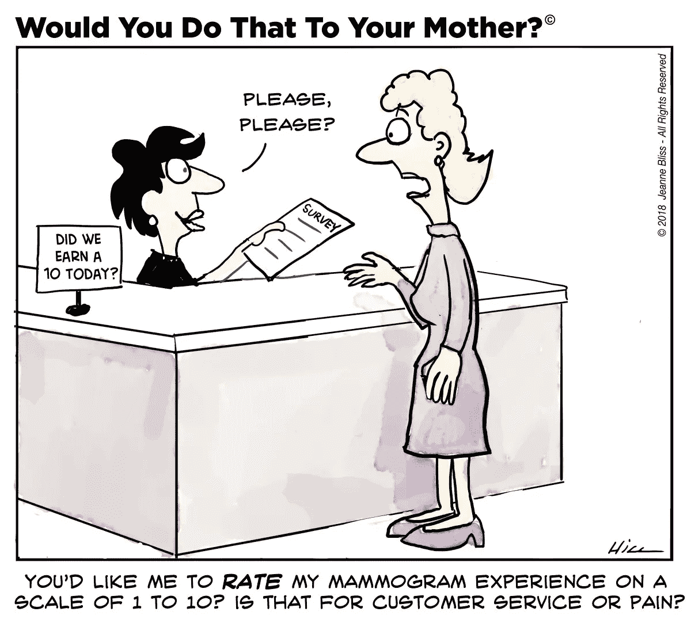

# 把客户服务当成家庭事务

> 原文：<https://medium.datadriveninvestor.com/think-of-customer-service-as-family-affair-83532e293343?source=collection_archive---------2----------------------->

## 用心创业，让你的妈妈感到骄傲

Would you do that to your mother? Bet you never thought of customer service that way.

在 *变得更加系统化的热潮中，许多企业在他们的业务中设计了人类体验*。

这是客户体验实践者和先驱[珍妮布利斯](https://twitter.com/JeanneBliss)对商业现状的描述。她与伊万娜·泰勒和伊瓦·伊格贾托维奇谈论“用心创业，创造和做让妈妈骄傲的事情。”

泰勒拥有 DIYMarketers 公司，这是一家“致力于帮助小企业主摆脱困境”的公司 Ignjatovic 是一名营销、战略、领导力和商业顾问。

 [## 提高你的眼界，让你的顾客兴奋

### 使用社交媒体增强客户体验

blog.markgrowth.com](https://blog.markgrowth.com/raise-your-sights-excite-your-customers-5869f0d3b9f6) 

客户服务有不同的视角。首先是你希望如何被当作顾客对待。

“我想让我的问题得到解答，”泰勒说。“我希望能够做决定。我希望我的交易快速、无缝。”

Ignjatovic 希望被当作一个人来对待,“尊重我和我的时间。我不抱怨，因为我没有更好的事情可做。”

布利斯努力追求人情味。

“我希望得到诚实、正直、真实以及政策和黄金法则相结合的对待，”她说。“我们需要知道，人们在做出决定的另一端——我们的生活和需求——会想到我们。”

还有一种观点认为，公司认为顾客希望得到怎样的待遇。

“我真的相信公司说他们想要一样东西，但是他们开发系统是为了完成另一样东西，”泰勒说。"公司希望顾客得到快速且有利可图的治疗."

# 目标要高得多

一些企业家变得自满，设立了一个低门槛。

“任何一家还算不错的公司都希望善待自己的客户，”Ignjatovic 说。“然而，‘好’是不够的，这是相对的。他们应该在设定流程之前与客户沟通。”

布利斯根据企业主的视角来看待问题。

她说:“自相矛盾的是，公司往往只考虑内部，而不考虑客户的生活。当许多人努力在流程中建立效率时，他们不经意地将人从流程中抽离出来。

“我们的工作是引导组织从生活开始——通过改善生活来赢得发展的权利，”布利斯说。”*那个*是换挡。这是推动变革的动力。我们最大的机会是通过帮助客户[实现他们的目标](https://medium.com/@JKatzaman/theres-method-behind-goal-setting-madness-9a8ba0a96ee1)来实现增长

 [## 在混乱的时代保持业务的相关性

### 大多数高管不知道他们不了解的是什么

medium.datadriveninvestor.com](/keep-your-business-relevant-in-an-era-of-disruption-bde2fa2aa091) 

颠覆也发挥了作用，但它必须有正确的理由。

布利斯说:“[颠覆是通往繁荣的道路](https://medium.com/@JKatzaman/for-better-or-worse-brace-for-digital-disruption-34cd82b4fc20)—*—*如果它是以改善生活为基础的话。”。"通常，我们为了破坏而破坏."

所有各方都对客户体验负责。给其中一个人更多的责任，给另一个人一个通行证。

Ignjatovic 说:“任何以某种方式——无论是过程中还是实际接触——与客户有关系的人都是负责任的。”"当然，没有合适的公司文化，这是不可能的."

# 公司的面孔

Taylor 指出，领导者主要负责建立系统和政策，但前端员工负责提供服务。

布利斯说:“我们必须‘粉碎’那种认为某人拥有客户体验的观念。”。“这是关于领导人如何决定他们将增长和不会增长。客户体验是精心制作的时刻，使客户能够实现他们的目标。

“客户体验需要领导者和组织在如何表现、回应和交付给客户和员工方面团结一致，”她说。

很多时候，企业认为客户服务是理所当然的。他们认为仅仅因为他们还在做生意，他们就必须做好客户服务。

泰勒说:“企业过于关注系统、政策、程序和对被起诉的恐惧。”“他们忘记了*人*。”

 [## 倾听人们的声音，引导你的品牌走向成功

### 保持对社交媒体的关注会产生线索

medium.datadriveninvestor.com](/steer-your-brand-toward-success-by-listening-to-the-people-8532d9684ab3) 

布利斯回答说:“团结是向客户和员工提供一个公司体验的关键。我们需要在门口检查我们的筒仓。”

科技也是一个干扰因素。

“企业太专注于客户服务背后的技术——节省时间的自动化——而忘记了人不是机器，”Ignjatovic 说。

# 知道真正的成本

客户体验始于正确的心态。

“企业仍然认为服务是一个成本中心，而不是认为他们是‘客户拯救艺术家’，”布利斯说。“你想让你妈妈体验你的电话树吗？*这是*公司正在遗忘的东西——所有这一切结束时的人。

“你会给你妈妈四个小时的时间，让你有可能——也有可能不会——去看望她吗？”她说。

客服占满了一个正方形。从客户的角度来看，客户体验是决定成功的氛围和互动。

泰勒认为“客户服务和客户体验是交织在一起的。卓越的服务带来卓越的体验。”

“客户服务是对客户问题的被动解决，”布利斯说。“客户体验是一种积极主动、深思熟虑的体验，它定义了你是什么样的人，以及你将如何帮助客户实现他们的目标。

“客户服务通常被认为是一个部门，”她说。“客户体验是一个统一于行动和行为的公司。社交媒体让我们所有人欢欣鼓舞。客户现在有了扩音器来讲述他们作为客户的生活故事。”

 [## 挖掘客户的力量

### 小型企业通过个性化客户服务获得优势

medium.datadriveninvestor.com](/tap-into-the-power-of-customers-876388cc8f8f) 

在过去的 20 年里，客户体验和客户服务发生了变化。

布利斯说:“领导者现在明白，客户的有机增长对于业务增长、社交媒体和实现孤岛不会有机连接至关重要。”“这推动了客户体验以及最终行动的提升。

她表示:“我们正看到一个重要的客户动向，他们将被那些在运营和业绩方面展示出与自己价值同步的公司所吸引。”。“他们会离开那些没有的人。”

Ignjatovic 注重访问和数字体验。

“科技含量要高得多，”她说。"如果在一个过程中使用得当，它可以改善双方."

特别是在客户服务中，耐心是一种美德。

“作为顾客，我们变得越来越没有耐心，”泰勒说。“我们需要更多的自助服务。这在某些领域可能是好的，但当你需要时，往往更难获得个性化服务。”

这种特质会影响身份。

“公司不知道自己是谁，”布利斯说。“他们过于依赖政策来保护利润，而不是专注于真正的服务。

她表示:“我们正看到一个重要的客户动向，他们将被那些在运营和业绩方面展示出与自己价值同步的公司所吸引。”。“他们会离开那些没有的人。”

# 技术经验

另一方面，技术可以改善客户体验。

布利斯说:“我们需要用高科技实现高接触，而不是反过来。”。“在我的书里， [*你会那样对你妈妈吗？*](http://www.customerbliss.com/books/would-you-do-that-to-your-mother/)*’，* [丹尼·梅尔](https://twitter.com/danny/)讲述了为什么他的人民会戴苹果手表。”

*   侍酒师会知道什么时候给某人斟酒。
*   男仆想知道什么时候把车开过来。

"你会让你妈妈不断向你重新介绍自己吗？"布利斯说。“技术也可以是一个伟大的统一者。客户需要一种*你知道我*的体验。

“在一个自助服务的世界里，让人们在选择退出时，通过正确的信息、统一的工具和信任来关心客户，这从未像现在这样重要，”她说。“然后在那个时候为那个客户打正确的电话。”

泰勒说:“[人工智能](https://medium.com/@JKatzaman/artificial-intelligence-know-what-youre-getting-into-bddd50c0f62d)的一大优点是它能够发现数据中的模式。”。“这真的很有用。”

还有灵魂出窍的体验。

Ignjatovic 说:“[虚拟现实](https://medium.com/@JKatzaman/get-real-and-be-sure-you-know-what-youre-doing-a1a5356edc44)正被家具和设计商店用来让顾客在购买前看到他们想要布置的空间的 3d 效果图。”。

 [## 倾听好的振动

### 在你的听众提问之前，知道他们想要什么

blog.markgrowth.com](https://blog.markgrowth.com/listen-for-good-vibrations-6cfa76efe031) 

利用社交倾听来了解顾客之间正在酝酿什么。当然，还有老式的提问。直接与客户交谈或通过民意调查等方式。

泰勒说:“*观察*，与你的客户接触并交谈。“调查没有触及真正重要的东西。客户不可能知道他们不知道的事情。”

# 顾客真正想要什么

Bliss 详细介绍了几种发现客户关注点的方法:

*   把顾客带进来，和他们谈论他们的目标和他们想要完成的事情。
*   你需要了解生活来服务生活。跟着顾客回家——不要用令人毛骨悚然的方式——了解他们的生活，了解在他们与你互动的过程中，什么对他们来说是重要的。
*   给与顾客打交道的人一个座位。相信他们的反馈。他们每天都过着和你的顾客一样的生活。
*   公司里的每个人都需要至少每年一次走出办公桌，为客户服务——我认为应该更多。
*   讲述顾客的生活故事。将客户从电子表格中拿出来，从经验上展示他们作为您的客户所经历的事情。

“在整个销售周期中分析客户沟通，”Ignjatovic 说。“了解他们得到的和他们期望的。”

 [## 快乐的顾客让你的生意成功

### 卓越的服务超越期望

medium.datadriveninvestor.com](/happy-customers-make-your-business-a-success-3d58e34e9827) 

客户服务调查是一种策略，是你整体客户服务策略的一部分。不要把调查作为一切的全部。

“这个想法是好的，但是太多时候你被告知要给 5 分或者优秀，这并不能达到任何目的，”泰勒说。“当这实际上是一个系统问题时，员工的工资会受到你的回答的影响。"

Ignjatovic 认为调查在某种程度上是有帮助的。

“如果公司只问与我的经历不相关的事情，他们有什么用？”她说。

将调查视为数据点。

“调查只是故事的一部分，”布利斯说。“我们需要一个来自多个来源的平衡的客户生活故事。这既包括我们对客户的要求，也包括我们对他们行为的观察。"

虽然泰勒认为人工智能正变得越来越受欢迎，但她不认为这是未来的好兆头。

Ignjatovic 展望未来，设想“人加上技术，让顾客的生活更轻松。一切都将围绕这一点展开。毕竟，体验和服务越来越重要。"

布利斯认为成功取决于负责人，而不是技术。

“客户体验的未来取决于领导力，”她说。“对于那些领导者选择通过获得有机增长并努力工作来实现增长的公司来说，它们将会茁壮成长。对其他人来说，它可能会保持递增。或者只是嘴上说说。

“客户体验需要每个领导者和筒仓同意放弃他们的一些方法，以使客户的生活更好，”布利斯说。"它要求公司拥抱和团结所有闪亮的物体，以提供一个统一的公司体验."

**关于作者**

吉姆·卡扎曼是[拉戈金融服务公司](http://largofinancialservices.com)的经理，曾在空军和联邦政府的公共事务部门工作。你可以在[推特](https://twitter.com/JKatzaman)、[脸书](https://www.facebook.com/jim.katzaman)和 [LinkedIn](https://www.linkedin.com/in/jim-katzaman-33641b21/) 上和他联系。