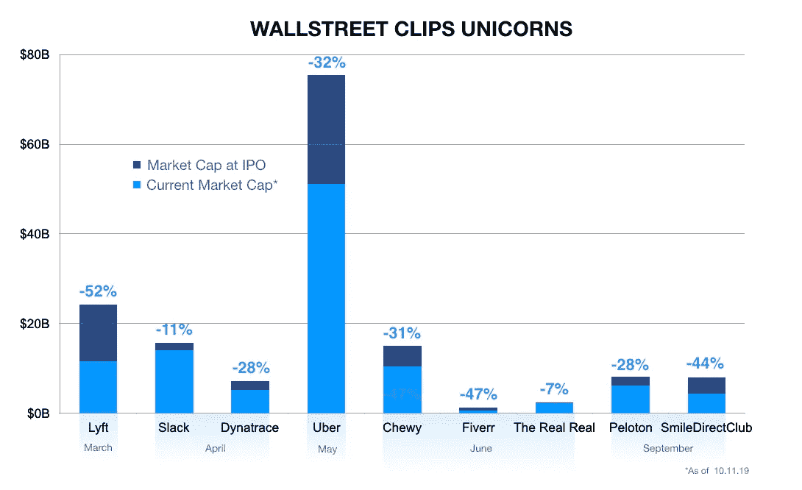

# 私下思考，公开行动

> 原文：<https://medium.datadriveninvestor.com/think-private-act-public-fbf78a71a092?source=collection_archive---------10----------------------->

Photo by [Rick Tap](https://unsplash.com/@ricktap?utm_source=medium&utm_medium=referral)

《纽约时报》本周发表了一篇文章，标题是“硅谷正在尝试一种新方法:获取利润。”如果你没明白，我来总结一下:风险投资家、创始人和创业世界的其他利益相关者终于明白，事实上，常识性的商业实践并没有被高估。

由风投资金补贴的超高速增长可以无限期地维持初创企业，或许有一天会奇迹般地产生利润，这种集体错觉已经开始消退。WeWork 宣布将撤回 IPO——这是一系列引人注目的曲折故事的高潮——或许是所谓的咒语发生变化的最大原因。但不仅仅是我们工作。

 [## 风险投资家在给创业公司播种时会考虑什么标准？数据驱动的投资者

### 2017 年，风险投资资金攀升至十年来的最高水平。你的创业公司目前吸引风险投资的机会是…

www.datadriveninvestor.com](https://www.datadriveninvestor.com/2018/04/20/what-criteria-do-venture-capitalists-consider-when-seeding-a-startup/) 

今年，我们看到许多高调的独角兽上市，但一旦华尔街的细齿梳子穿过金融市场，它们的股价就会受到公开市场的重创。他们虎头蛇尾的亮相派对凸显了一个明显但似乎被遗忘的事实:私人市场和公共市场完全不同。

公开市场投资者根据季度收益报告买卖股票。另一方面，私人市场投资者根据动量进行买卖。在对下一个独角兽的不懈追求中，为了顶线增长，有时会牺牲良好的商业实践。

风险资本的世界是孤立的，由相对较小的投资者群体驱动，这些投资者都在互相激烈竞争，以在热门初创企业的名单上获得一席之地，并保住自己的位置。在过去的 5 到 10 年里，这种动态达到了白热化。美国创业公司在 2018 年筹集了创纪录的 1310 亿美元资金，这是自 20 世纪 90 年代以来我们从未见过的风险资本资助过剩时期的顶峰。随着大量资金的投入，权力格局发生了变化。热门机票公司的创始人获得了前所未有的影响力。在这种“新常态”下，对私营公司商业模式的审查减弱了。任务是:快速大规模融资，发展壮大，消灭竞争对手，担心*以后赚*的钱。不言而喻，公开市场投资者并不喜欢这种增长方式。

这让我们走到了今天。据说，迷雾正在消散，过度正被谨慎所取代。

在最近与燃料风险投资有限合伙人甚至潜在有限合伙人的交谈中，我发现自己在解释这种转变。我描述它的方式给人的感觉很奇怪，因为我把它解释得像个局外人。“但是等等，”他们说。“你身处其中，管理着一只基金，基本上是在与同样的公司竞争推动这个周期的同样的交易。什么给了？”我很自豪地解释说，虽然我们在玩同样的游戏，但我们用的是不同的战术。

燃料风险投资拥有风险投资公司的底盘，但却是由公开市场制造的引擎。

我们的团队是由在华尔街历练出来的专业人士组成的，我们每天都非常清楚如何在公开市场取得成功。这是我们的竞争优势，无论是在我们如何引导我们的投资组合公司度过它们的生命周期，还是我们如何作为受托人为我们的投资者服务。

从通过时事通讯和电话会议的季度投资者更新到我们的审计实践，我们的流程从上到下都是基于公开市场的经验。从第一天起，我们就训练我们的创始人以负责任的态度经营。我们拒绝接受无关紧要的东西，拒绝资助增长，也不原谅短期思维。

这对我们的有限合伙人来说是个好消息，但对我们的投资组合公司来说也是个好消息，他们可以将与燃料风险投资的合作视为 IPO 训练营。毕竟，作为一名创始人，如果你处理得当，所有的路都通向两个目的地之一:M&A 或 IPO。如果退出机会以后一种形式出现，你必须准备好按照新规则行事。对我们来说，这意味着不断改进工具，使我们的投资组合公司在公开市场取得成功。

对于已经从早期投资中套现的私募市场投资者来说，华尔街对他们多年前投资建立的公司的冷淡态度不是问题。但对于所有仍在游戏中的人来说，财政责任的趋势是一个应该认真对待的趋势。任何值得投资的创始人都不会根据你的支票金额来评价你，而是根据你用资本促进可持续发展的承诺来评价你。

在我看来，这种趋势有利于燃料风险投资。那些被新上市科技公司的失误吓到、寻求风险投资的投资者，将依赖一家进入有前途的初创公司并引导其发展的公司。创始人可以期待向前迈进，达到比以往任何时候都更高的标准，他们将为发展初创企业的艰巨任务做好更充分的准备，提升我们的潜在投资池。

《T2 时报》对席卷我们行业的浪潮的报道称，本周对一些公司来说是混乱的一周，因为他们不得不面对现实。对于燃料风险投资来说，一切如常。我们的口号不变——

*创始人专注，投资者驱动*。

*本文由燃料风险投资创始合伙人兼董事总经理杰夫·兰斯德尔撰写。杰夫在担任美银美林(Bank of America Merrill Lynch)高管二十年后，于 2017 年联合创立了 Fuel Venture Capital。作为金融巨头东南财富管理部门的董事总经理和市场主管，他管理着超过 1300 亿美元的全球私人客户投资资产，20 亿美元的损益和 2000 多名员工。他转向风险投资的动机是，他认为越来越多的证据表明，塑造经济和利用创新的机会正从公共市场稳步转移到私人市场。在社交媒体上关注 Fuel 风投，via*[*insta gram*](https://www.instagram.com/fuelventurecapital/?hl=en)*，*[*Twitter*](https://twitter.com/FuelVC)*和*[*LinkedIn*](https://www.linkedin.com/company/fuelventurecapital/)*。*