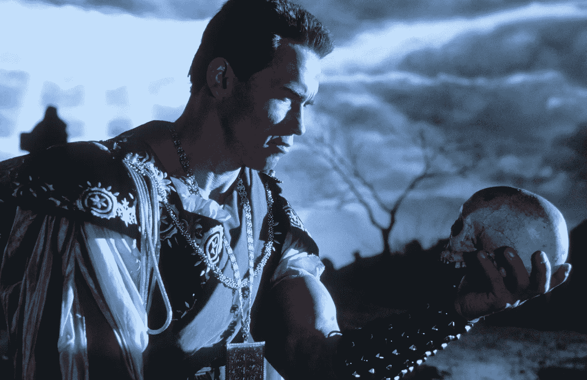

# 思考:跳出框框？

> 原文：<https://medium.datadriveninvestor.com/thinking-outside-of-the-box-fc06dfcf7783?source=collection_archive---------20----------------------->

比起“早上好”，我们更常听到“跳出框框思考”这句话相信我。在写课程的时候，我们大多数人都在努力创造最好的版本，能够吸引那些有成堆的文件或电子邮件要读的人，那些手里有权力决定我们职业命运的人。高风险。

毕竟这个盒子是什么？当我们听到令人不安的表达“想到外面……”时，我们会打个寒战。是的，这个想法看起来很黑暗，足以吓到任何一个被邀请到一个解释糟糕的广场之外思考的人。

让我们困扰的是，那些要求我们做出牺牲，走出一个舒适的立方体的人，在那里物理定律是我们熟悉的，在一个柔软的盒子里看着我们舒适地旋转，在同一个地方，我们必须走出去创造新的想法。他们不像墨菲斯那样富有冒险精神，他把尼奥从母体中解救出来，并教他跳出母体思考问题；他们拥有金钱和许多机会(但当然不是全部)，等待着那些能够在未知空间的虚空中行走的人，有时没有特殊的服装和头盔。

需要创造力的公司必须对世界的愚蠢开放。他们首先需要打破常规，在这个矩形世界的出口处招募人才。盒子就是世界本身。是的，就是你眼睛能看到的那个。如果你能以某种“方式”感知它，你就已经符合了它的格式。这不是一种罪恶。如果你不违背它的规则，它会的。在我们的新课程中需要的奇异的创造力并不容易找到。她是最狂野的。

通过观看米歇尔·施奈德的 TEDxFAAP，我意识到，是的，我们需要比你想象的多得多的努力。在顶部打开你的想象力。歌剧摘要:机器将占据我们当前文化遗留下来的大部分工作，没有足够的时间让任何人学会在不停颤抖的绳子上保持平衡；如果没有下面的网来支撑我们以防出错。此外，有必要一直学习，一生中从事几种职业；一些，也许，同时。

明白了吗？

很可能会有一台能够取代全人类智能的计算机。直到 2045 年。是的，我说的是智力。但是意识和智力之间有着巨大的差异。机器将取代工作，在所有的情况下，都有可能对其功能进行编程。这将会发生，因为一个简单的事实，机器比人力更有效率，更便宜。得分。

但仍有一个问题:没有工作，我们能做什么，即使我们有意识能力，让我们独一无二的力量？

人类固有的能力，如意识、直觉、同理心、创造力等。是潜伏在我们头盖骨“盒子”里的一种胶状物质的产物，它将成为一个渴望真人的世界的尖端，这些真人看起来不像他们所操作的机器。我们需要学会跳出框框思考，而是要学会世界在不断变化，要跟上这场数字地震几乎是不可能的。人们有情绪，如果我们不能以健康的方式对待每一种情绪，它们都会受到影响。

Sara Silveira 在 TEDxFortaleza 做了另一个非常有趣的演讲。“每个人都疯了。”玩笑归玩笑，是的，确实有危机，而且感觉有一种压倒性的气氛。好像有什么东西要爆炸了。对心理学家来说，我们正在失去处理情绪的能力。损失、失败和死亡被各种各样的资源所掩盖。我们不想面对哀悼、失败之类的事情。我们尽可能地回避，甚至把这个公式强加给我们的孩子。这一代人在成长，却不知道现实的苦涩滋味。

在一个艰难的世界里，看起来像超级英雄真的很难。你可能更喜欢里克和莫蒂系列中科学家里克·桑切斯的生活方式；他认为生活没有意义，因此对我们的选择没有任何影响。但是，正如法国诗人保尔·艾吕雅所说:“杜尔爵士”。他写到了我们每个人的内在，以最好的方式延长我们生命的能量，严厉地翻译为“持续下去的强烈愿望”。或者也许你是“疯狂”的拳击世界冠军穆罕默德·阿里的粉丝，他似乎在每次比赛前都变得疯狂。他的对手之一何塞·托雷斯说，阿里知道“导致击倒的一拳是从哪里都看不见的一拳。”

在新世纪的黎明，一切似乎都提供了如此不同寻常的挑战，以至于迄今为止积累的所有知识都不足以在任何媒体计算机上存储和处理。唯一可能的出口是月球的黑暗面。不，这不是关于平克·弗洛伊德的(尽管它做得很好)。月亮的阴暗面是我们大脑中被忽视的区域。大多数时候，我们只重视技术技能，尽管真正让我们活到现在的是:同理心和协作。没有这一点，我们将很容易被模拟假笑的机器所征服。我们知道这一拳来自何方。

我们花很多时间使用机器来改善我们的生活。现在他们做了所有的重活，我们可以体验一种更轻松的生活方式，没有重复的负担。但在这场人机大战中，最严峻的挑战将是如何处理我们的情绪。人类的头脑是一个充满秘密的黑匣子，它是我们创造力和最大悲剧的答案。“跳出框框思考”不仅需要新的课程，还需要深呼吸和勇气，去探索一个没有地图，也不能保证安全返回的地方。

也许这是无声的邀请，使冒险本身是值得的。