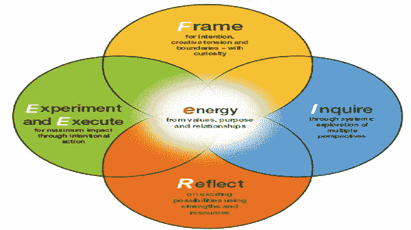

# 第三代领导教练:玩 eFIRE 模型和心态

> 原文：<https://medium.datadriveninvestor.com/third-generation-leadership-coaching-playing-with-the-efire-model-and-mindset-668ad48403c5?source=collection_archive---------3----------------------->

Gerard O'Donovan 经营的教练博客，我们的目标是不断为那些寻求改善生活的人带来价值。因此，我们有一个政策，出版我们重视和欣赏的客座作者的文章和材料。今天的特邀作者是马尔科姆·尼科尔森——iCN 记者(英国)。

*以下内容基于昆士兰科技大学商学院高管培训项目主任杰弗里·艾伯特博士与作者的对话。*

在一个越来越 VUCA 化的世界里，对于一个组织的生存和发展来说，需要有一个切合目的的领导力，能够在现状和需要之间找到一个适应的空间。挑战的核心是在组织之间产生富有成效的对话，帮助领导者感知并应对内部和外部的变化，这些变化的速度和幅度都在不断增加。信任关系对于培养和支持这种对话至关重要，也是第三代教练方法的组成部分。

[eFIRE](https://www.futurelearn.com/courses/leadership-coaching) 是一种全新的方法，以意义、目的和关系为核心，以锚定实践的心态为基础，能够为领导力培训的未来发展做出贡献。

Abbott 博士继续说,“eFIRE 是为复杂——也就是说，为混乱——而建立的。如果你想减肥或者学法语，那就没什么用了。它是用来解决那些没有人真正知道该走哪条路的棘手问题的。它旨在获得复杂性的清晰性，并允许混乱中的参与者影响系统以获得积极的利益。当然，在混乱中，甚至什么是‘积极利益’也是有争议的！”

提供其功能的模型的关键特征包括:

*   假设变化是组织生活中的常态
*   拥抱突发事件和意想不到的事情
*   非线性——在五个要素中来回移动，注意 VUCA 世界是非线性的，因此教练模型需要适应这一点
*   鼓励系统和文化观点
*   让对话更深入
*   适用于单个和多个对话
*   能量位于中间——产生于意义和目的、价值和关系
*   需要好奇和尝试的心态

“我们在组织中使用的大多数领导力培训模式来自生活培训或高管培训，在这些培训中，一个有着全新视角的局外人会帮助某人实施某种改变。eFIRE 从这些模型中获取信息，但从领导者-教练的角度出发。在使用 eFIRE 时，领导者的观点在某些情况下会胜过被辅导者的观点。这就是组织生活的现实。正如彼得·德鲁克所说，“有权的人做决定。”然而自相矛盾的是，eFIRE 将权力交给了被指导者——为了获得权力而给予控制权。eFIRE 的能源中心点燃了组织的绩效，并在这种背景下为个人的成长定位。”艾博特说。

“它也背离了一个问题只有一个解决方案的想法。面对复杂的挑战，办法是采取各种不同的方法，并寻求它们之间的联系，本着实验的精神和实践，走到有吸引力的地方去。然而，还需要有一个有意识的行动来确保重点和进展。”

实践中的 [eFIRE 模型](https://www.futurelearn.com/courses/leadership-coaching):模型中描述的五个阶段是由头脑中的上下文产生的问题和探索的容器。

图 eFIRE 模型

**来自价值观、目的和关系的能量**

这为模型提供了燃料，并提供了情感真实性的注入。领导力培训的艺术是以在整个过程中保持活力的方式参与对话。人类的繁荣依赖于人们有更高层次的目标。通过他们如何出现，他们提出的问题，以及他们追求的目标，领导者拥有巨大的能力来改变点燃组织的能量——无论是好是坏。实际上，如果领导教练注意到谈话中(包括他们自己)能量的变化，这是好奇心和探索的触发点。

**意图、创作张力和界限的框架——带着好奇心**

框架为挑战的范围设定意图——“意图”比“目标”更可取，以鼓励对所涉及的问题进行更深入、更令人兴奋的思考。教练总是讨论与当前现实不同的理想状态。对于领导者来说，这是一个激励学员思考如果他们朝着“理想”(在个人、团队或其他层面)前进，事情会怎样的机会。考虑个人、团队、组织、行业/社会的背景，并使之相关。考虑组织和团队战略、目标和目的。商定一个向前推进的过程，该过程包括限制和允许的边界，以鼓励系统观点。领导者将使用与情境相适应的能量问题。

**通过多角度的系统探索进行询问**

一旦通过框架理解了一个过程和方向，各方就进入了一个系统探究的紧急过程。一个系统的和文化的调查引发了思考，在这个问题上还有什么其他的观点在起作用。这通常始于领导者探索被辅导者看待挑战的方式。

这里可能会使用系统思考方法，或者其他工具来扩展对话中的视角。这就是领导者和学员的专业知识至关重要的地方——引入工具、工具、方法等。适合特定用途的。丰富的图片通常是开始此阶段探索的好方法。谈话之后，被辅导者可能会决定与其他人交谈，并在回到新的讨论之前进行单独的询问。领导可能有一个在谈话中尽可能晚提出的观点(注意组织规则、政策和程序可能决定调查的要素)。

**思考令人兴奋的可能性:利用优势和资源**

这一阶段关注的是退后一步思考调查的结果，并全力以赴地产生关于什么是可能的想法——产生一个基于实力的变革过程。领导将讨论拉回调查的系统和文化本质。受辅导者在参与设计可能的进步方式的细节时，面临着整体思考的挑战。这里没有限制。领导者帮助被辅导者找到高能量和低能量的区域，这可能有助于以后决定将重点放在哪里。重点是利用优势和资源来解决问题、难题和差距等。这一阶段的能量通常会更高。如果不是，在一些能源调查后，可能会回到早期阶段。

**通过有意识的行动试验并执行以获得最大的影响**

这个阶段是做出一些与意图相符的行动选择的时候。假设是因为系统的调查和思考而采取的行动可能会产生某种积极的影响。受辅导者设计了一个行动计划，最大限度地提高朝着理想状态发生积极变化的可能性。请注意，在复杂的组织情况下，很少有任何方法可以提供 100%的成功，因此多种“安全-失败”方法通常是最佳策略。这个模式是关于实验和执行的。计划中包含了一个监控系统。这里的方法是创造一个向前发展的故事，而不仅仅是一个行动计划。故事将有相互关系和细微差别，提供一些阴谋和不确定性——尽管有一个强大的叙事。

eFIRE 方法还要求领导者从一种心态进行指导，这种心态将产生富有成效的对话，而不是导致公式化的方法，使对话停留在表面上。所需要素有: ***成长心态、反思实践、开放、务实与悖论、伦理、关系:(摸索)***

总之，第三代领导力培训需要认同这样一种理念，即组织内部和周围的每个人都是组织和社会可持续发展的相关参与者。我已经提出，成功利用第三代领导力培训作为应对 VUCA 挑战的策略，需要组织行为者(1)根据公认的行业标准具备良好的培训能力，(2)熟悉一系列相互关联的知识体系，这些知识体系告知超复杂性影响组织生活的方式，以及(3)拥有适当的模式和心态来操作他们所拥有的知识和技能。eFIRE 方法封装了这些元素。

**关于马尔科姆·尼科尔森**

马尔科姆·尼科尔森(Malcolm Nicholson)是 [Aspecture](http://www.aspecture.com/) 的所有者和教练总监，17 年来，他成功地与众多高级业务人员合作，帮助他们通过转型变革提高业务成果。要了解他如何帮助您的组织，请致电 malcolmnicholson@aspecture.com 或+44 1932 267597 与他联系。

在这里阅读更多内容，不要忘了订阅我的教练博客网站获得免费教练报告:[https://www . coaching-blog . com/third-generation-leadership-coaching-playing-with-the-efire-model-and-mind/](https://www.coaching-blog.com/third-generation-leadership-coaching-playing-with-the-efire-model-and-mindset/)

请访问我们的网站，订阅免费的教练杂志:[http://www.international-coaching-news.net/](https://vk.com/away.php?to=http://www.international-coaching-news.net/&cc_key=)