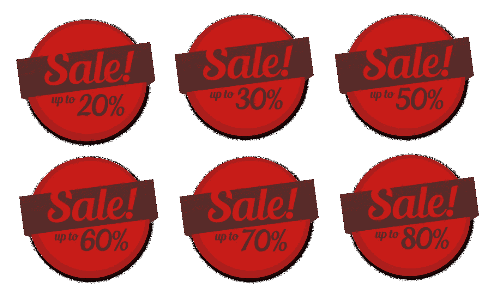

# 这个 18 万亿美元的市场将有许多赢家

> 原文：<https://medium.datadriveninvestor.com/this-18-trillion-market-will-have-many-winners-a5a62d00c5e4?source=collection_archive---------32----------------------->

There will be many winners in this market & individuals have advantages large players don’t

很容易想象亚马逊和实体店之间的“赢家通吃”之战。这家在线巨头似乎正在走向统治地位，而商店和零售连锁店似乎注定要经历漫长而缓慢的衰落。没有什么比这更偏离事实了。当人们知道自己想要什么时，他们会去亚马逊寻求方便和低价。在很多情况下，我们需要的东西最好是由我们可以交谈的人定制，并且是我们可以信任的邻居中的专家。随着收入和消费能力的提高，对独特而非批量生产的产品和服务的需求也在增加。这一点在女性购买力方面表现得最为明显，增长也最为迅猛。

咨询公司 EY 估计，到 2018 年，全球女性收入将上升至 18 万亿美元。其中很大一部分将用于或投资于可自由支配的项目。女性个体企业家的机会在于在这个市场上拥有内在优势。这是因为他们同时是买家和卖家，同时身兼两职。一个独自在家经营生意并试图将这种优势转化为可持续发展的生意的企业家需要从小处着手。即使最终目标是统治世界。

**从狭窄的市场开始**

Focus is even more essential at the start

一开始尝试向一大群人推销可能很诱人，但是在游戏的早期尝试做太多事情会让你非常忙碌而没有取得太大的进展。建立一个非常具体的档案可以让你建立一个准确的客户画像，并更好地了解他们。刚开始的时候，对一小部分潜在客户了解很多比对很多人知之甚少要好。狭窄的市场也更容易获得全面的反馈，而不仅仅是粗略的问答会议，这将给你带来更多的信息来建立你的客户档案。

**‘合适的价格’和‘低价格’不一定是一回事**

The wrong price can leave loyal customers feeling cheated

虽然每个人都喜欢物美价廉，但把价格和质量联系起来也是很自然的。设定合适的价格可以让你为顾客提供更好的服务。这也将奖励你为你的事业付出的努力，并激励你继续努力。激励和折扣可能有用，但需要在正确的时间使用。太频繁地使用它们，你的老顾客会推迟他们的订单，因为他们会等待价格下降。不分青红皂白地提供折扣，你会得罪那些付了全价的顾客。没有人喜欢支付过高的感觉，即使是昂贵的产品。价格是成本、质量、售后服务和期望利润的衍生物。第一个和最后一个很容易计算，但它是在中间的那些将使你的生意成功或失败。服装公司 Patagonia 并不羞于收取高价，但这样做可以让他们对出售的所有商品提供终身维修保证。

**你将不得不出去销售**

You will need to do things that are new to you

很少有人是天生的销售人员。我们其余的人必须克服自我怀疑和恐惧，才能在陌生人面前展示自己。说服别人为你卖的东西花钱需要练习，在这个过程中会有拒绝。我希望我能告诉你，这将是顺利的，可以从你的舒适区的安全港完成，但这根本不是真的。你将不得不克服对尴尬对话的恐惧，并努力避免不好意思开口要钱。好的一面是它很快变得容易，并且你会在每次谈话中变得更好。你会结交新朋友，并成为你销售的建议来源。赢得客户的信任将使你能够将业务扩展到新产品和新市场。这一切都是从克服最初的恐惧开始的，这种恐惧看起来很可怕。

**每天都更了解你的产品**

All that learning is an investment in yourself & your business

一些从你这里购买的人会确切地知道他们想要什么，但大多数人会根据他们的想法进行搜索。他们会想和你谈谈，了解你的意见和他们的选择。如果你不了解你的产品或邻近地区，这些对话不会很长。如果你是一名私人教练，你将被期望进行关于营养的对话，如果你是一名为游客提供旅游的城市导游，如果你能够分享他们可能会去的国家的其他城市的知识和故事，他们会很高兴。每天留出 30 分钟阅读你所选择的行业和相关领域。除非你也投资于你自己的知识，否则投资于你的事业是不完整的。我们向在某件事情上比我们懂得多的人寻求建议。为了你选择要做的事情，成为那些人中的一员。

**让顾客成为你的向导**

Your customers will guide you

你的顾客比你更清楚他们想要什么，喜欢什么。赢得他们的信任和知识渊博会让他们向你敞开心扉，告诉你他们还想要什么。人们想要很多东西，但他们并不总是想去很多地方去得到它们。顾客会浏览很多地方，四处看看，但更愿意从他们认识、喜欢和信任的人那里购买。我的一个同事在她的工作室制作香味蜡烛，并尝试混合不同的香味。她天生的好奇心和不同寻常的气味组合，以及知道哪种气味与其他气味搭配得很好，这让她的顾客开始谈论香水。她现在从一些不太知名的香水店采购和销售香水，这些香水店大多数人从未听说过，这使得她的顾客可以拥有他们自己的气味。这也让她能够销售价格更高的产品，这种产品不是人们与蜡烛的直接联系，而是与蜡烛分享感官感受。

当你是一个个体企业家时，建立一个成功的企业显然需要更多的东西。没有人知道你独特的环境和能力。使用对每个人都通用的知识，并将它们与你独有的知识相结合。知道你想要什么，做一些小事情，一天一次，然后你就上路了。