# “设计师不朽”——TEDXMelbourne

> 原文：<https://medium.datadriveninvestor.com/this-article-is-the-script-from-my-talk-at-tedxmelbourne-in-2018-heres-the-video-below-650204b2a2b5?source=collection_archive---------9----------------------->

这篇文章基于我去年年底为我的 TEDxMelbourne 演讲写的脚本:

如果我告诉你每年有超过 12 万澳大利亚人死于某种疾病，你会怎么想？

这就像澳洲航空公司从墨尔本飞往悉尼的航班每天都会坠毁。与此同时，全世界每天还有 10 万人遭受同样的命运。

你会害怕的，对吗？为我们没有努力找到治疗方法而感到愤怒？

疾病本身就是衰老的过程。老龄化导致阿尔茨海默氏症、心脏病和癌症，这些疾病占全球死亡人数的三分之二以上。但是在可预见的将来，我们也许能够像今天治疗普通疾病一样治疗衰老过程。

我的名字是彼得·兴。我在技术和创新部门工作，我是健康寿命延长研究的倡导者。我认同并帮助推动一项名为“超人类主义”的全球运动。

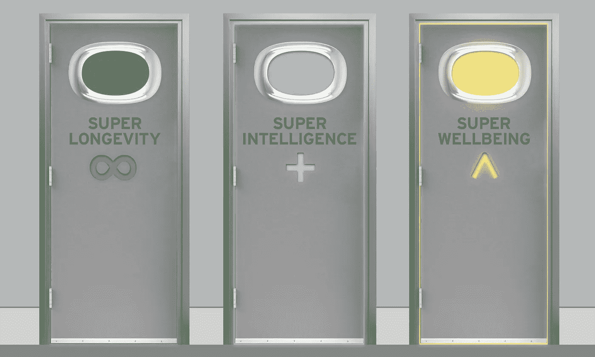

超人类主义是关于用技术超越我们人类生物学的限制。我们希望应用科学和技术，以便我们能够获得更高的智力，活得更健康、更长寿，并通过福祉获得更大的幸福。今天，我将谈论一些在延长人类健康寿命方面的最新科技突破

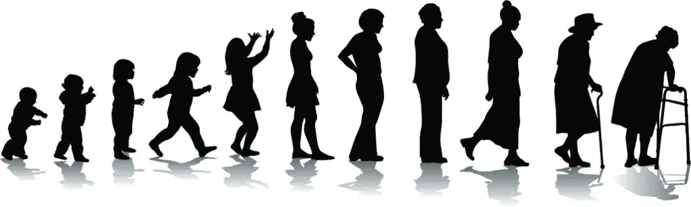

当人们通常想到变老时，我们认为这是必然发生的事情——你出生，你长大，你可能会有一些孩子，你变老，像其他人一样死去。但是，当我们从科学的角度看待衰老时，它是一个生物过程，像其他事物一样遵循物理定律。

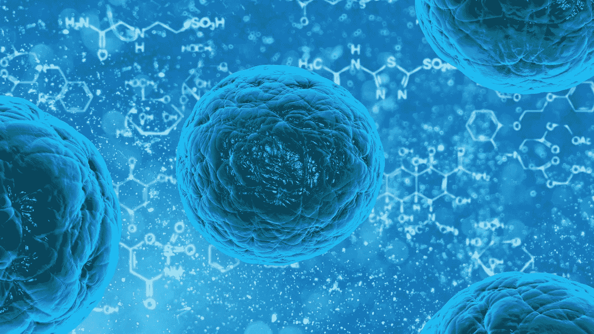

我们的原子构成分子，而分子构成细胞。干细胞是生命的基石，包含了我们体内一切的遗传和机械蓝图。

我们身体中大约有 3 亿个细胞死亡，每分钟都有新的细胞被取代——这些是你的头发、皮肤、大脑和心脏的新细胞。

这些细胞是通过复制产生的。我们体内的细胞一遍又一遍地复制自己，有点像复印机。这很好。直到它不是。

想象一下，复印一份文件，然后使用该副本制作另一份副本。另一个。另一个。随着时间的推移，经过数以百万计的复制，事物就失去了保真度——我们的细胞也是如此。

最终，复制的质量变得如此之差，以至于细胞停止工作。我们的身体停止再生。我们会变老。我们会死。

为了阻止这一过程，我们需要从一开始就防止制作劣质拷贝。或者，如果我们做不到这一点，我们需要在创建坏副本后将其删除，以防止它们大量繁殖，造成一切混乱。

在过去的几年里，我们在如何解决这个问题上有了一些令人难以置信的进展，所以我将带你们看一些最近在健康寿命延长研究中有希望的例子。

第一个是去除衰老细胞。衰老细胞是那些自我复制如此之多的细胞，从生物学的角度来看，它们差不多已经“完蛋”了。即使它们对身体不再有用，它们仍然漂浮在那里，随着年龄的增长，它们的数量和比例都在增长。

这变得很成问题，因为最终，细胞开始伤害它们周围的组织。衰老细胞的堆积与许多老年疾病有关，包括糖尿病和肾衰竭。似乎我们体内漂浮的衰老细胞越多，我们就越容易受到这些疾病的影响。

所以杀了他们听起来是个不错的主意，对吧？

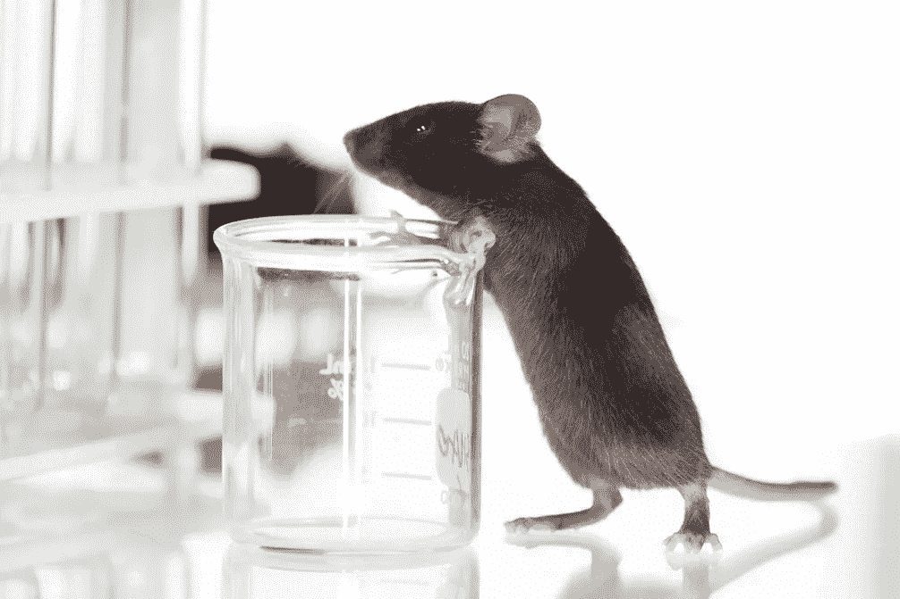

2017 年，荷兰科学家对小鼠进行了基因工程改造，以便研究人员可以随意摧毁它们的衰老细胞。

他们发现，没有衰老细胞的老老鼠更活跃。他们的心脏和肾脏工作得更好，也更不容易患癌症。

总的来说，它们比普通老鼠多活了 30%，而且健康状况更好。

随后的研究显示了类似的结果，衰老细胞的减少与更好的整体健康甚至头发的再生相关。

毫不奇怪，现在有许多公司正在研究直接针对衰老细胞的衰老治疗方法，首批人体试验即将开始。

第二个领域是研究一种叫做 NAD+的辅酶。

NAD+存在于我们的体内，专门用于与细胞复制相关的清理任务。

你看，细胞复制是肮脏的工作。每次发生这种情况，细胞部分都需要被破坏、清理和重建，这变得相当混乱。这种情况每秒钟发生数百万次。

随着年龄的增长，复制过程变得更加混乱和低效，因为细胞部分变得皱巴巴的，聚在一起，或者不再按我们需要的数量生产。

其中一个“生产不足”的部分是 NAD+，这是一种帮助我们的细胞照顾自己的物质。

50 岁时，我们体内的 NAD+只有 20 岁时的一半。

它的含量低会导致一系列疾病，从皮肤癌到老年痴呆症、心血管疾病和多发性硬化症。

2016 年，澳大利亚和美国的试验再次在小鼠身上进行，表明通过提高 NAD+水平，他们能够促进皮肤、大脑和肌肉干细胞的增殖。

接受 NAD+补充的小鼠恢复了活力，并具有更高的修复 DNA 的能力。

这甚至引起了美国宇航局的兴趣，他们现在正在寻找 NAD+作为一种将宇航员在火星任务中暴露于宇宙辐射的 DNA 损伤降至最低的方法。

除了衰老细胞和 NAD+之外，目前正在对糖尿病患者服用的二甲双胍和雷帕霉素等药物进行其他有前途的研究。这两种药物都显示小鼠的健康寿命增加了 30-40 %,但目前正在进行人体临床试验。

照这样下去，老鼠会永远活下去。

我们还看到了干细胞用于再生受损组织的应用——科学家现在能够从你的脂肪细胞中创造个性化的干细胞，以再生任何因衰老过程而受损的人体组织。所以换句话说，在不久的将来，我们也许可以用我们的腰围换更多的生命线。

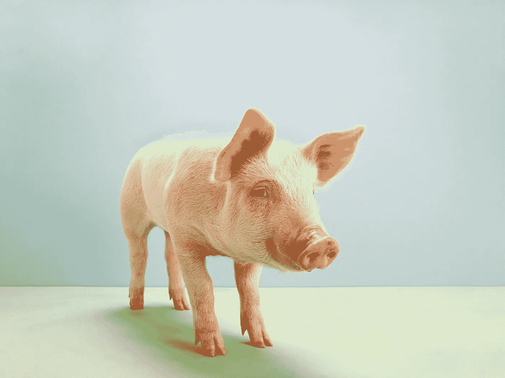

我们在实验室培养器官的能力也有所发展——科学家最近能够在实验室培养猪的肺，并将其移植到真正的猪体内。这对所有吸烟者来说是个好消息，但目前仅限于猪。

还有 CRISPR——基因编辑的最新突破——它现在就像是我们 DNA 的剪切和粘贴工具。这就像我们复印了一份文件的数字副本，并且能够在打印之前对其进行编辑。中国已经是第一个在人类身上进行试验的国家，最近生产的双胞胎可能对艾滋病毒具有免疫力，并且还拥有一种经过修改的基因，在过去的实验中证明这种基因可以使小鼠变得更聪明。

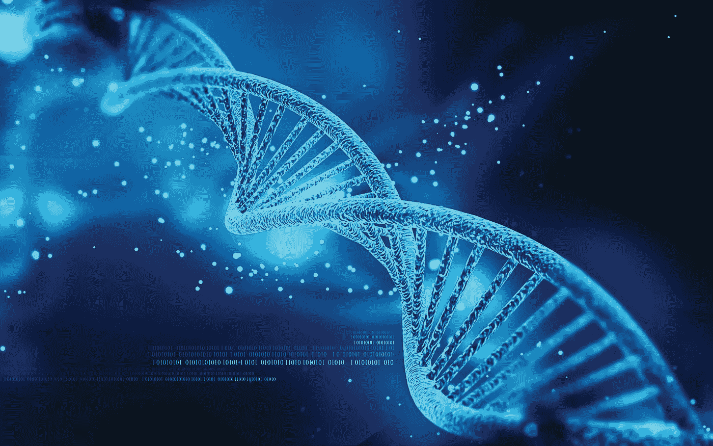

就像电影《GATTACA》中一样，我们可能很快就会订购中国制造的设计师婴儿，没有任何遗传疾病，经过改造，寿命更长，更健康，并有可选的升级，如更好的外表，更强的智力和令人满意的社交技能。我们可能最终会拥有路易威登的产品，为高端市场设计专利。

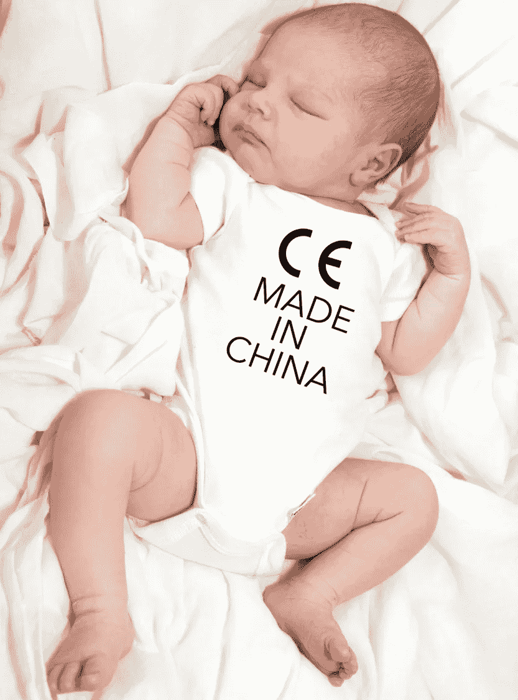

还有许多其他技术，都显示出延长人类健康寿命的前景。我们的目标是达到许多人所说的“长寿逃逸速度”——在这个时间点上，你每衰老一年，科学技术就会让你倒退一年或更久。

所以与此同时，信息是不要死于任何愚蠢的事情。

我们看到正在开发技术来降低愚蠢死亡方式的风险，例如自动驾驶汽车来降低我们道路上的死亡率。

还有代表下一代设备的技术，这些设备与我们的身体集成，监控我们以确保我们处于健康状态。它可以像 FitBit 一样简单，也可以像起搏器一样成为你身体的一部分。

我们目前认为假肢和人工耳蜗可以帮助残疾人——现在你可以在残奥会上看到，使用假肢的运动员实际上比传统的奥运会运动员更有优势。

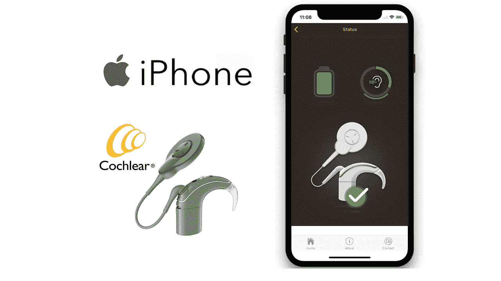

人工耳蜗曾经能够帮助听力残疾的人听到 60%的对话，然后是 70%。现在它能够帮助残疾人像普通人一样听力正常。但是，下一代人工耳蜗将使我们能够接电话，听到房间另一边的对话，在外国进行实时翻译，并用智能增强我们的现实，例如识别一个人的声音和名字，或者听到狗和海豚可以听到的频谱。我们甚至还没有深入了解智能设备可以做些什么来增强和扩大我们的视野。

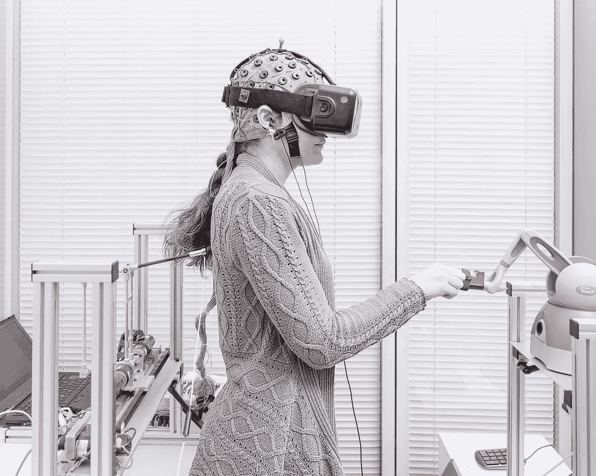

更遥不可及的想法是，我们有一天可以绘制并连接到我们大脑中的信号，并在云中创建一个实时扩展，有效地上传我们的思想，实现数字不朽。

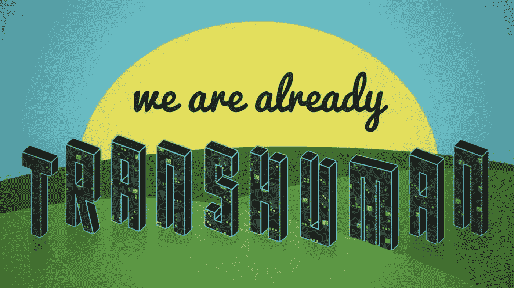

从我们今天拥有的技术来看，我们已经是超人了。但是回到我们的死亡。

五万年前，大多数人都英年早逝。

随着我们学会如何利用身边的资源来治疗自己，预期寿命变得越来越长。

今天，人类比以往任何时候都更长寿、更健康。但这有一个无法预料的后果。我们生命中生病和需要护理的时间越来越多。但是我们也必须见证同样的事情发生在我们所爱的人身上，当他们变老的时候。

治疗疾病最有效的方法是预防疾病。

如果你阻止 100 万人吸烟，这将比找到更好的化疗方法拯救更多的生命。但问题是，为什么不停止所有疾病的原因:衰老的过程。

然而，一个没有老龄化的世界会是什么样子呢？我们会只是网飞&冷到一个不确定的未来吗？

如果你想象一个没有疾病的世界，你和你爱的人可以健康地再活 100 年或 200 年，这将如何改变我们？

在这部小说和网飞改编的电影《被改变的碳》中，我们看到了当关系无限期持续并变得单方面时发生的黑暗面，恋人永远追求不再爱他们的爱人。

改变碳的另一个主题是，只有富人能够负担得起有效的永生，通过卫星在云中进行定期备份，让社会其他人满足于次优的存在形式。

那我们的职业生涯呢？如果我们可以工作 150 年，我们会花多少时间来找出我们擅长什么？我们还会花多少时间来学习？

我们许多人现在感受到的强烈的压力感会消失吗？还是变本加厉？

如果我们知道自己会活得更久，我们会更好地保护我们的星球吗？或者我们会考虑到达星星和探索未知，在我们的数字永生中把我们的思想从一个太阳系转移到另一个太阳系？

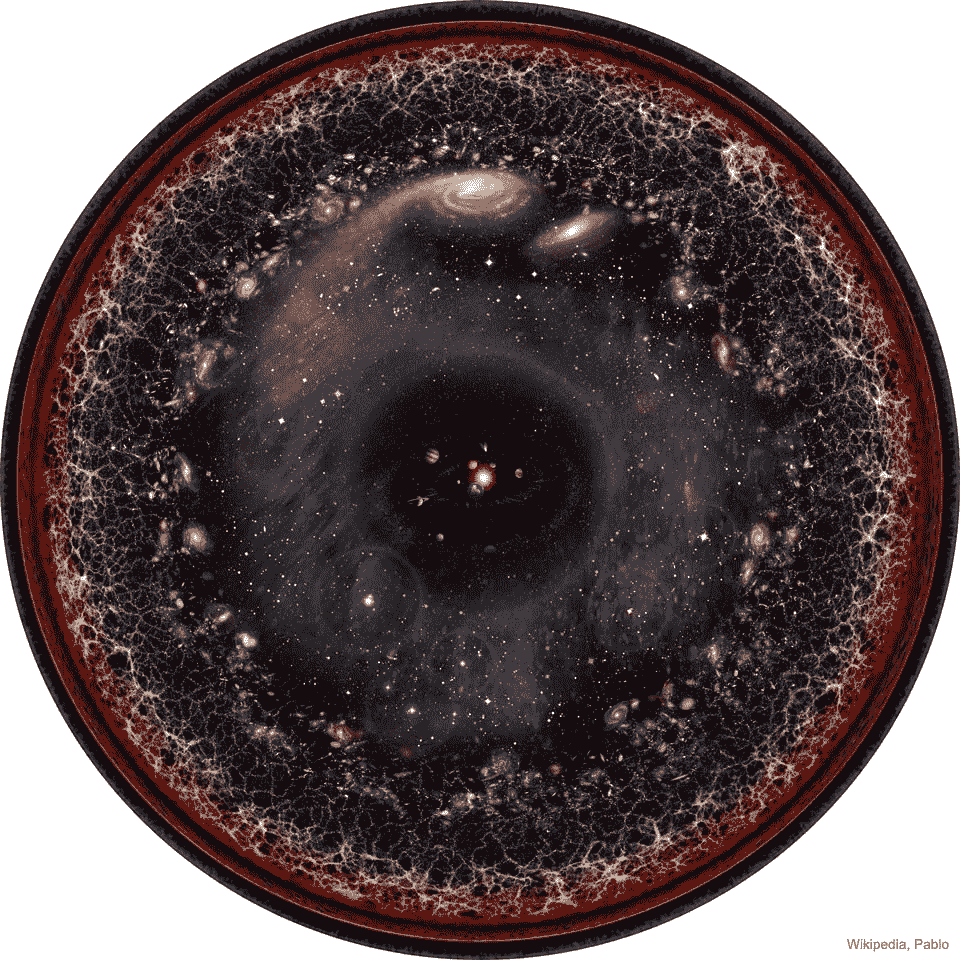

看待它的方式是，作为一个社会，就像生命从单细胞生物体发展到多细胞生物体一样，我们现在正通过使用技术将我们联系起来，成为一个超智能体。这可能是我们所知的未来生活。

但是今天，如果没有科学技术的进步，每天有 10 万人死于与年龄相关的疾病。大概是每秒一个人。

如果没有科技的进步，我们通常只能活 30，000 天。领先的研究人员说，我们有 50%的机会成为最后一代非自愿死亡的人。我想不出有什么比改善未来的机会更大的目的了。

谢谢您们。